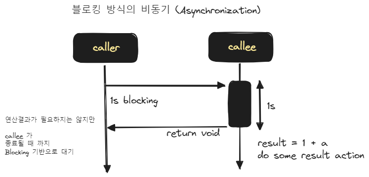

## 블로킹 vs 논블로킹

## 블로킹 
블로킹 연산은 이전 문서에서 살펴봤던 동기화 예제에서 모두 살펴봤었습니다. 동기화를 논블로킹 방식으로도 수행할 수 있는데 논블로킹 방식으로 동기화를 수행하는 것은 아래에 별도의 섹션에서 정리하도록 하겠습니다.<br/>

블로킹이라는 것은 어떤 작업이 끝날 때까지 이 작업을 호출한 곳에서 기다리는 것을 의미합니다. 쉽게 이야기해서 caller 가 callee 의 작업이 끝날 때 까지 기다리는 것을 의미합니다.<br/>

블로킹 기반으로 동기(Synchronization) 연산을 수행하는 예제는 아래와 같습니다.
### 블로킹 기반의 동기(Synchronization) 예제
```java filename="SimpleSyncExample.java" {0} copy
package io.chagchagchag.example.foobar.concurrent.sync_async.simple;

import java.time.LocalTime;
import lombok.extern.slf4j.Slf4j;

@Slf4j
public class SimpleSyncExample {
  public static void main(String [] args){
    log.info("(start) main function " + LocalTime.now());
    var result = getLongDelayJob();
    var increased = result + 1;
    assert increased == 501;
    log.info("(end) main function " + LocalTime.now());
  }

  public static int getLongDelayJob(){
    long current = System.currentTimeMillis();
    while(true){
      long timeSpent = System.currentTimeMillis() - current;
      if(timeSpent > 1000) break;
    }
    return 500;
  }
}
```
<br/>

출력결과
```plain
15:20:13.250 [main] INFO ...sync_async.simple.SimpleAsyncExample -- (start) main function 15:20:13.248764
15:20:14.253 [main] INFO ...sync_async.simple.SimpleAsyncExample -- (end) main function 15:20:14.253948300
```
<br/>


<br/>

### 블로킹 방식의 비동기(Asynchronization) 예제
```java filename="SimpleAsyncExample.java" {0} copy
package io.chagchagchag.example.foobar.concurrent.sync_async.simple;

import java.time.LocalTime;
import java.util.function.Consumer;
import lombok.extern.slf4j.Slf4j;

@Slf4j
public class SimpleAsyncExample {
  public static void main(String [] args){
    log.info("(start) main function " + LocalTime.now());
    execLongDelayJob(i -> {
      var result = i + i;
      log.info("result == {}", result);
    });
    log.info("(end) main function " + LocalTime.now());
  }

  public static void execLongDelayJob(Consumer<Integer> consumer){
    final long current = System.currentTimeMillis();
    while(true){
      final long spent = System.currentTimeMillis() - current;
      if(spent > 1000) break;
    }

    consumer.accept(500);
  }
}

```
<br/>

출력결과
```plain
16:38:48.054 [main] INFO ...sync_async.simple.SimpleAsyncExample -- (start) main function 16:38:48.050013500
16:38:49.062 [main] INFO ...sync_async.simple.SimpleAsyncExample -- result == 1000
16:38:49.064 [main] INFO ...sync_async.simple.SimpleAsyncExample -- (end) main function 16:38:49.063973
```
<br/>


<br/>


## 논블로킹

### 논블로킹 방식의 동기 (Synchronization) 예제

논블로킹 방식으로 동기연산을 수행하려면 어떻게 해야할까요? callee 측의 작업이 오래 걸리는 작업입니다. 그런데 caller 측에서는 블로킹이 일어나지 않아야 합니다. 맞습니다. 이런 경우 callee 측의 작업을 별도의 스레드에서 수행하고 이 별도의 스레드가 끝났는지를 주기적으로 체크합니다. 그리고 작업이 끝난 것을 확인했을 때 연산 결과값을 이용해서 다음 작업을 수행합니다. <br/>

별도의 스레드가 끝났는지 주기적으로 체크하는 동안에는 다른 작업을 수행하게 될 수 있기에 논블로킹이라고 부릅니다.<br/>

예제는 아래와 같습니다.

```java
package io.chagchagchag.example.foobar.concurrent.sync_async;

import java.time.LocalTime;
import java.util.concurrent.ExecutionException;
import java.util.concurrent.Executors;
import java.util.concurrent.Future;
import lombok.extern.slf4j.Slf4j;

@Slf4j
public class SyncNonBlockingExample {
  public static void main(String [] args) throws InterruptedException, ExecutionException {
    log.info("(start) main function " + LocalTime.now());

    var count = 1;
    Future<Integer> job = doLongDelayJob();
    while(!job.isDone()){
      log.info(String.format("대기 중... %s", count++)); // 대기 중에 counting 연산을 수행
      Thread.sleep(100);
    }

    var total = job.get() + 1;
    assert total == 1112;

    log.info("(end) main function " + LocalTime.now());
  }

  public static Future<Integer> doLongDelayJob(){
    var executor = Executors.newSingleThreadExecutor();
    try{
      return executor.submit(() -> {
        long start = System.currentTimeMillis();
        while(true){
          long delay = System.currentTimeMillis() - start;
          if(delay > 1000) break;
        }
        return 1111;
      });
    }
    catch (Exception e){
      e.printStackTrace();
      throw new RuntimeException("ERROR");
    }
    finally {
      executor.shutdown();
    }
  }
}
```
<br/>

출력결과
```plain
18:07:59.983 [main] INFO ...sync_async.SyncNonBlockingExample -- (start) main function 18:07:59.979258800
18:07:59.997 [main] INFO ...sync_async.SyncNonBlockingExample -- 대기 중... 1
18:08:00.111 [main] INFO ...sync_async.SyncNonBlockingExample -- 대기 중... 2
18:08:00.222 [main] INFO ...sync_async.SyncNonBlockingExample -- 대기 중... 3
18:08:00.332 [main] INFO ...sync_async.SyncNonBlockingExample -- 대기 중... 4
18:08:00.441 [main] INFO ...sync_async.SyncNonBlockingExample -- 대기 중... 5
18:08:00.551 [main] INFO ...sync_async.SyncNonBlockingExample -- 대기 중... 6
18:08:00.662 [main] INFO ...sync_async.SyncNonBlockingExample -- 대기 중... 7
18:08:00.771 [main] INFO ...sync_async.SyncNonBlockingExample -- 대기 중... 8
18:08:00.880 [main] INFO ...sync_async.SyncNonBlockingExample -- 대기 중... 9
18:08:00.990 [main] INFO ...sync_async.SyncNonBlockingExample -- 대기 중... 10
18:08:01.099 [main] INFO ...sync_async.SyncNonBlockingExample -- (end) main function 18:08:01.098719700
```
<br/>

출력결과에서 보이듯 caller 측에서는 100ms 마다 한번씩 자기자신의 일을 수행하면서 doLongDelayJob() 함수의 결과값을 리턴받기를 기다립니다. doLongDelayJob() 함수가 실행중일 동안 caller 가 블로킹된 것이 아니기에 `논블로킹`방식이라고 부릅니다.<br/>
<br/>

위의 논블로킹 방식의 동기연산을 그림으로 표현하면 아래와 같습니다.

<br/>


### 논블로킹 방식의 비동기 (Synchronization) 예제

`블로킹 방식의 비동기(Asynchronization) 예제`에서는 caller 가 callee 측의 연산의 결과값을 알아야 할 필요가 없음에도 caller 가 블로킹되고 있었습니다.<br/>

그렇다면 caller 가 블로킹되지 않도록 논블로킹 방식으로 callee 를 호출하려면 어떻게 해야할까요? 그렇습니다. 별도의 스레드에서 callee 를 호출하고 caller 는 자신의 작업을 계속하면 됩니다.<br/>

예제는 아래와 같습니다.<br/>

```java
package io.chagchagchag.example.foobar.concurrent.sync_async;

import java.time.LocalTime;
import java.util.concurrent.Executors;
import java.util.function.Consumer;
import lombok.extern.slf4j.Slf4j;

@Slf4j
public class AsyncNonBlockingExample {
  public static void main(String [] args){
    log.info("(start) main function " + LocalTime.now());
    execLongDelayJob(i -> {
      var result = 1 + i;
      assert result == 1112;
      log.info("result = {}", result);
    });
    log.info("(end) main function " + LocalTime.now());
  }

  public static void execLongDelayJob(Consumer<Integer> callback){
    var executor = Executors.newSingleThreadExecutor();
    try{
      executor.submit(()->{
        long start = System.currentTimeMillis();
        while(true){
          long delay = System.currentTimeMillis() - start;
          if(delay > 1000) break;
        }
        callback.accept(1111);
        log.info("작업이 끝났어요~!!! --- " + LocalTime.now());
        return 1111;
      });
    }
    catch (Exception e){
      e.printStackTrace();
      throw new RuntimeException("ERROR");
    }
    finally {
      executor.shutdown();
    }
  }
}
```

<br/>


출력결과

```plain
18:21:05.366 [main] INFO ...sync_async.AsyncNonBlockingExample -- (start) main function 18:21:05.361457
18:21:05.382 [main] INFO ...sync_async.AsyncNonBlockingExample -- (end) main function 18:21:05.381471500
18:21:06.383 [pool-1-thread-1] INFO ...sync_async.AsyncNonBlockingExample -- result = 1112
18:21:06.387 [pool-1-thread-1] INFO ...sync_async.AsyncNonBlockingExample -- 작업이 끝났어요~!!! --- 18:21:06.387829200
```

<br/>


출력결과에서 보이듯 caller 측인 메인 스레드의 호출작업이 모두 끝나고 메인스레드는 자기 자신을 종료합니다. 하지만, 별도의 스레드에서 수행되고 있는 callee 는 1초 뒤에 자기 자신이 작업을 완료했음을 로그에서 표현하고 있습니다.<br/>

<br/>

위의 논블로킹 방식의 비동기 연산을 그림으로 표현하면 아래와 같습니다.

<br/>


