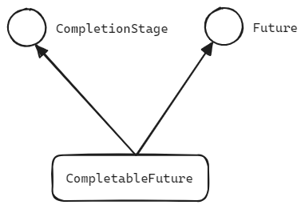
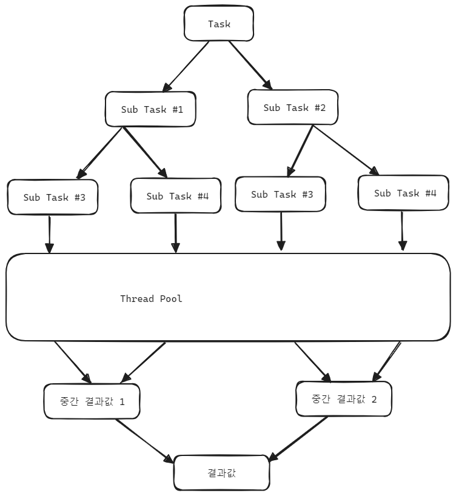
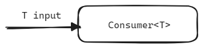
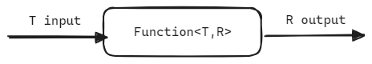
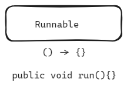
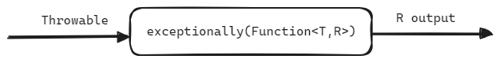

## CompletableFuture, CompletionStage


## Overview

[CompletableFuture](https://docs.oracle.com/javase/8/docs/api/java/util/concurrent/CompletableFuture.html) 는 [CompletionStage](https://docs.oracle.com/javase/8/docs/api/java/util/concurrent/CompletionStage.html) interface, [Future](https://docs.oracle.com/javase/8/docs/api/java/util/concurrent/Future.html) interface 를 implements 한 구체타입 클래스입니다.<br/>



<br/>


즉, **CompletableFuture** 는 이름에서 알 수 있듯 **CompletionStage** 와 **Future** 의 기능을 모두 가지고 있는 클래스입니다.<br/>

이번 문서에서는 CompletableFuture 와 CompletionStage 에 대해 알아보기 전에 제일 먼저 Future 의 기본동작과 isDone(), isCancelled() 와 같은 기본적은 메서드 들에 대해 확인해보고, CompletionStage 의 대표적인 기능들을 알아봅니다. 그리고 CompletableFuture 의 기능을 알아보면서 결국 CompletableFuture 를 사용하는 것이 좋기는 하지만 결과적으로는 어떤 한계에 부딪히는지 역시 정리합니다.<br/>

<br/>

- Future
- CompletionStage
- CompletableFuture

<br/>


## CompletableFuture 의 Thread Pool

별도로 ExecutorService 를 지정해서 CompletableFuture 를 실행하지 않으면, CompletableFuture 는 기본설정값 으로 Fork Join Pool 을 이용해서 비동기 함수들을 실행합니다.<br/>

Fork Join Pool 의 기본 Pool size 는 JVM 이 구동되는 머신의 CPU 코어수 -1 개입니다. Fork Join Pool 내에서 동작하는 스레드 들은 데몬 스레드로 동작하며, main 스레드가 종료될 경우 함께 즉시 종료됩니다.<br/>

Fork Jon Pool 은 아래와 같이 work steal 알고리즘이 적용된 방식으로 동작하며, 태스크를 sub 태스크로 fork 해서 이것들을 work, steal 하는 방식으로 동작합니다. 그리고 최종 결과는 join 을 통해서 결과가 생성됩니다.<br/>

그림 상으로는 아래와 같은 모습입니다.<br/>



<br/>


만약 Fork Join Pool 이 아닌 일반적인 스레드 풀을 사용하고 싶다면 [Executors](https://docs.oracle.com/javase/8/docs/api/java/util/concurrent/Executors.html) 에서 제공하는 팩토리 메서드 들을 통해 직접 생성한 ExecutorService 를 CompletableFuture 의 supplyAsync(Runnable, ExecutorService) 등과 같은 메서드 들에 직접 인자값으로 넘겨주면, 다른 종류의 스레드 풀 기반의 ExecutorService 를 사용할 수 있습니다.<br/>

<br/>


## Future

> 참고 : [Future](https://docs.oracle.com/javase/8/docs/api/java/util/concurrent/Future.html)

<br/>

[Future](https://docs.oracle.com/javase/8/docs/api/java/util/concurrent/Future.html) interface 에서 살펴볼 메서드는 isDone(), isCancelled(), get(), cancel() 메서드 입니다.<br/>

- **[isDone](https://docs.oracle.com/javase/8/docs/api/java/util/concurrent/Future.html#isDone--)**()
  - isDone() 메서드는 태스크가 취소되든, 완료되었든 끝난 상태라면 true 를 반환하고 진행중이라면 false 를 리턴합니다.
- **[isCancelled](https://docs.oracle.com/javase/8/docs/api/java/util/concurrent/Future.html#isCancelled--)**()
  - isCancelled() 메서드는 태스크가 취소된 경우에만 true 를 리턴하고 취소되지 않은 상태인 경우 false 를 리턴합니다.
- get()
  - **[get](https://docs.oracle.com/javase/8/docs/api/java/util/concurrent/Future.html#get--)**() 
    - 작업이 끝날 때 까지 thread 가 block 됩니다.  future 에서 무한 루프나 오랜 시간이 걸릴 경우 thread 가 blocking 상태로 유지됩니다.
  - **[get](https://docs.oracle.com/javase/8/docs/api/java/util/concurrent/Future.html#get-long-java.util.concurrent.TimeUnit-)**(long timeout, [TimeUnit](https://docs.oracle.com/javase/8/docs/api/java/util/concurrent/TimeUnit.html) unit)
    - timeout 동안 thread 가 block 됩니다. timeout 이 넘어가면 TimeoutException 이 throw 됩니다.
- cancel()
  - **[cancel](https://docs.oracle.com/javase/8/docs/api/java/util/concurrent/Future.html#cancel-boolean-)**(boolean mayInterruptIfRunning)
    - future 의 작업을 취소합니다.
    - mayInterruptIfRunning 을 false 로 지정하면, 시작하지 않은 작업에 대해서만 취소를 합니다.
    - 취소할 수 없는 상황일 경우(e.g. myInterruptIfRunning 이 false 인데 이미 시작한 작업일 경우)에는 false 를 return 합니다.

<br/>


### Future interface 의 단점

cancel() 과 같은 메서드가 아니라면, 외부에서 future 를 제어할 방법이 없습니다. 또한 get() 메서드의 블로킹 기반의 연산으로 값을 얻어온 후 연산을 처리하며, 비동기적으로 데이터를 처리하려면 프로그래머가 직접 그 코드를 하드코딩해서 만들어야합니다.<br/>

또한 isDone(), isCancelled() 의 경계가 모호함으로 인해 완료되었는지, 에러가 발생했는지를 명확하게 확인하기 쉽지 않다는 단점이 있습니다.

```java
import java.util.concurrent.ExecutorService;
import java.util.concurrent.Executors;
import java.util.concurrent.Future;
import lombok.SneakyThrows;

public class Future_Disadvantage_Example1 {
  @SneakyThrows
  public static void main(String[] args) {
    Future<String> future1 = getFuture();
    future1.cancel(true); // 이미 실행 중이라면 Interrupt 한다.
    assert future1.isDone(); // cancel 했지만, isDone() == true

    Future<String> future2 = getFutureWithException();
    Exception exception = null;
    try{
      future2.get();
    }
    catch (Exception e){
      exception = e;
    }

    assert future2.isDone();
    assert exception != null;
  }

  @SneakyThrows
  public static Future<String> getFuture(){
    ExecutorService executor = Executors.newSingleThreadExecutor();
    try{
      return executor.submit(() -> {
        return "안녕하세요";
      });
    }
    catch (Exception e){
      e.printStackTrace();
      throw new RuntimeException(e);
    }
    finally {
      executor.shutdown();
    }
  }

  @SneakyThrows
  public static Future<String> getFutureWithException(){
    ExecutorService executor = Executors.newSingleThreadExecutor();
    try{
      return executor.submit(() -> {
        throw new RuntimeException("배고파요");
      });
    }
    catch (Exception e){
      e.printStackTrace();
      throw new RuntimeException(e);
    }
    finally {
      executor.shutdown();
    }
  }
}
```

<br/>


반면 CompletableStage 는 thenAsync(), thenCompose(), supplyAsync() 와 같은 메서드를 통해 체이닝을 통해 비동기적인 프로그래밍을 제공합니다. 여기에 대해서는 다음 섹션에서 정리합니다.<br/>

<br/>


### 예제

#### get()

- **[get](https://docs.oracle.com/javase/8/docs/api/java/util/concurrent/Future.html#get--)**() 
  - 작업이 끝날 때 까지 thread 가 block 됩니다.  future 에서 무한 루프나 오랜 시간이 걸릴 경우 thread 가 blocking 상태로 유지됩니다.
- **[get](https://docs.oracle.com/javase/8/docs/api/java/util/concurrent/Future.html#get-long-java.util.concurrent.TimeUnit-)**(long timeout, [TimeUnit](https://docs.oracle.com/javase/8/docs/api/java/util/concurrent/TimeUnit.html) unit)
  - timeout 동안 thread 가 block 됩니다. timeout 이 넘어가면 TimeoutException 이 throw 됩니다.


> 예제의 설명은 주석으로 추가해두었습니다.

```java
import java.util.concurrent.ExecutorService;
import java.util.concurrent.Executors;
import java.util.concurrent.Future;
import java.util.concurrent.TimeUnit;
import lombok.SneakyThrows;
import lombok.extern.slf4j.Slf4j;

@Slf4j
public class FutureGet_Methods_Example1 {
  @SneakyThrows
  public static void main(String[] args) {
    // get()
    Future<String> future1 = getFutureWithDelay1s();
    assert !future1.isDone();
    assert !future1.isCancelled();

    // 블로킹 방식의 동기연산. 값을 얻어옵니다.
    String result1 = future1.get(); // 1초 소요
    assert result1.equals("안녕하세요");
    assert future1.isDone(); // 작업은 완료되었기에 true 를 return
    assert !future1.isCancelled(); // 취소된 적 없으므로 false 를 return

    // get(timeout, TimeUnit)
    Future<String> future2 = getFutureWithDelay1s(); // 1초 소요
    String result2 = future2.get(2000, TimeUnit.MILLISECONDS); // 2초 안에 마무리 되므로 정상수행
    assert result2.equals("안녕하세요"); // 값을 제대로 받아왔습니다.

    // 이번에는 long running 작업의 timeout 적용 코드
    Future<String> future3 = getFutureWithDelay1s(); // 1초 소요
    Exception exception = null; // exception 객체
    String result3 = null;

    try{
      result3 = future3.get(10, TimeUnit.MILLISECONDS); // 10ms 안에 마무리 되지 않으므로 TimeoutException throw
    } catch (Exception e){
      exception = e;
    }
    assert exception != null;
    assert result3 == null;
    log.info("exception = " + exception);
  }

  @SneakyThrows
  public static Future<String> getFutureWithDelay1s(){
    ExecutorService executor = Executors.newSingleThreadExecutor();
    try{
      return executor.submit(() -> {
        Thread.sleep(1000);
        return "안녕하세요";
      });
    }
    catch (Exception e){
      e.printStackTrace();
      throw new RuntimeException(e);
    }
    finally {
      executor.shutdown();
    }
  }
}
```

<br/>


출력결과

```plain
15:05:27.647 [main] INFO io...concurrent.sync_async.future.FutureMethods_Example1 -- exception = java.util.concurrent.TimeoutException

Process finished with exit code 0
```

<br/>


#### cancel(), isDone(), isCancelled()

**[cancel](https://docs.oracle.com/javase/8/docs/api/java/util/concurrent/Future.html#cancel-boolean-)**(boolean mayInterruptIfRunning)

- future 의 작업을 취소합니다.
- mayInterruptIfRunning 을 false 로 지정하면, 시작하지 않은 작업에 대해서만 취소를 합니다.
- 취소할 수 없는 상황일 경우(e.g. myInterruptIfRunning 이 false 인데 이미 시작한 작업일 경우)에는 false 를 return 합니다.

**[isDone](https://docs.oracle.com/javase/8/docs/api/java/util/concurrent/Future.html#isDone--)**()

- isDone() 메서드는 태스크가 취소되든, 완료되었든 끝난 상태라면 true 를 반환하고 진행중이라면 false 를 리턴합니다.

**[isCancelled](https://docs.oracle.com/javase/8/docs/api/java/util/concurrent/Future.html#isCancelled--)**()

- isCancelled() 메서드는 태스크가 취소된 경우에만 true 를 리턴하고 취소되지 않은 상태인 경우 false 를 리턴합니다.


> 예제의 설명은 주석으로 추가해두었습니다.

```java
import java.util.concurrent.ExecutorService;
import java.util.concurrent.Executors;
import java.util.concurrent.Future;
import lombok.SneakyThrows;
import lombok.extern.slf4j.Slf4j;

@Slf4j
public class FutureCancel_Methods_Example1 {
  @SneakyThrows
  public static void main(String[] args) {
    Future<String> future1 = getFuture();
    Boolean isCancelled1 = future1.cancel(true);
    // mayInterruptIfRunning = true 의 의미 :: 작업이 진행 중이면 Interrupt 하겠다.

    assert future1.isCancelled();
    assert future1.isDone();
    assert isCancelled1 == true;

    // 이미 존재하는 Future 를 Cancel
    Boolean isCancelled2 = future1.cancel(true);
    assert future1.isCancelled();
    assert future1.isDone(); // cancel() 된 작업도 isDone() == true 로 간주
    assert isCancelled2 == false;
  }

  @SneakyThrows
  public static Future<String> getFuture(){
    ExecutorService executor = Executors.newSingleThreadExecutor();
    try{
      return executor.submit(() -> {
        return "안녕하세요";
      });
    }
    catch (Exception e){
      e.printStackTrace();
      throw new RuntimeException(e);
    }
    finally {
      executor.shutdown();
    }
  }
}
```

<br/>


## CompletionStage

> 참고 : [CompletionStage](https://docs.oracle.com/javase/8/docs/api/java/util/concurrent/CompletionStage.html) 

CompletableStage interface 에서 살펴볼 주요 메서드 들은 아래와 같습니다.<br/>

(출처 : [github.com/JetBrains/jdk8u_jdk](https://github.com/JetBrains/jdk8u_jdk/blob/master/src/share/classes/java/util/concurrent/CompletionStage.java))

```java
package java.util.concurrent;
// ...
public interface CompletionStage<T> {
    public <U> CompletionStage<U> thenApply(Function<? super T,? extends U> fn);
    public <U> CompletionStage<U> thenApplyAsync
        (Function<? super T,? extends U> fn);
    public <U> CompletionStage<U> thenApplyAsync
        (Function<? super T,? extends U> fn,
         Executor executor);
    
    public CompletionStage<Void> thenAccept(Consumer<? super T> action);
    public CompletionStage<Void> thenAcceptAsync(Consumer<? super T> action);
    public CompletionStage<Void> thenAcceptAsync(Consumer<? super T> action,
                                                 Executor executor);
    
    
    public CompletionStage<Void> thenRun(Runnable action);
    public CompletionStage<Void> thenRunAsync(Runnable action);
    public CompletionStage<Void> thenRunAsync(Runnable action,
                                              Executor executor);
    
    // ...
    
    public <U> CompletionStage<U> thenCompose
        (Function<? super T, ? extends CompletionStage<U>> fn);
    public <U> CompletionStage<U> thenComposeAsync
        (Function<? super T, ? extends CompletionStage<U>> fn);
    public <U> CompletionStage<U> thenComposeAsync
        (Function<? super T, ? extends CompletionStage<U>> fn,
         Executor executor);
    
    // ...
    
    public CompletionStage<T> exceptionally
        (Function<Throwable, ? extends T> fn);
    
}
```

<br/>


CompletionStage 는 위의 메서드 들 외에도 굉장히 다양하고 많은 메서드 들을 제공하고 있습니다. 이 메서드 들을 활용하면 태스크 들을 비동기적으로 실행하고 값을 조작하거나 체이닝이 가능해집니다. <br/>

또한 람다를 인자로 받아서 콜백처럼 동작하는 것 역시 가능합니다.<br/>

CompletionStage 내에서 제공하는 주요 메서드 들은 Java8 부터 제공하기 시작한 기본 함수형 인터페이스를 인자로 취하며 네이밍 컨벤션 역시 thenAccept(), thenApply() 드역시 어느 정도 비슷하기에 이 함수가 어떤 역할을 하는지 인자값은 어떻게 되는지 유추하기 명확합니다.

- CompletableFuture::thenAccept(Consumer)
- CompletableFuture::thenApply(Function)
- CompletableFuture::thenCompose(Function)
- CompletableFuture::thenRun(Runnable)

<br/>


### then`---`(), then`---`Async() 의 차이점

`then---()` 를 실행할 때에는 `then---()` 를 호출한 caller 의 실행 스레드가 `then---()` 메서드를 실행하게 됩니다.<br/>

`then---Async()` 를 실행할 때에는 `then---Async()` 를 호출한 caller 의 실행 스레드에서 실행되지 않고 별도의 스레드에서 `then---Async()`를 실행합니다.<br/>

<br/>


### thenAccept(Consumer), thenAcceptAsync(Consumer)

thenAccept(Consumer), thenAcceptAsync(Consumer) 는 함수형 인터페이스 Consumer 를 인자값으로 받습니다. Consumer 는 그 이름에서 알 수 있듯 값을 받은 후 소비를 합니다. 리턴값은 없습니다.



<br/>

thenAccept(Consumer) 를 실행할 때에는 thenAccept(Consumer) 를 호출한 caller 의 실행 스레드가 thenAccept(Consumer) 메서드를 실행하게 됩니다.<br/>

thenAcceptAsync(Consumer) 를 실행할 때에는 thenAcceptAsync(Consumer) 를 호출한 caller 의 실행 스레드에서 실행되지 않고 별도의 스레드에서 thenAcceptAsync(Consumer)를 실행합니다.<br/>

<br/>


#### thenAccept(Consumer)

thenAccept(Consumer) 가 어느 스레드에서 실행되는지 로그를 찍어보는 예제입니다.<br/>

```java
import java.util.concurrent.CompletableFuture;
import java.util.concurrent.CompletionStage;
import lombok.SneakyThrows;
import lombok.extern.slf4j.Slf4j;

@Slf4j
public class ThenAccept_Example1 {
  @SneakyThrows
  public static void main(String[] args) {
    log.info("[start] main");
    CompletionStage<String> stage = stage();

    stage
        .thenAccept(msg -> {
          log.info("[thenAccept (1)] msg :: " + msg + "");
        })
        .thenAccept(msg -> {
          log.info("[thenAccept (2)] msg :: " + msg + "");
        });

    Thread.sleep(1000);
    log.info("[end] main");
  }

  @SneakyThrows
  public static CompletionStage<String> stage(){
    var future = CompletableFuture.supplyAsync(() -> {
      log.info("CompletableFuture 내부");
      return "안녕하세요";
    });

    Thread.sleep(1000);
    return future;
  }
}
```

<br/>


결과를 확인해보면, 아래와 같이 supplyAsync() 를 실행할때를 제외하고, 모든 호출구문이 main 에서 실행되고 있습니다. thenAccept(Consumer) 를 호출하는 부분 역시 main 스레드에서 실행되었음을 확인 가능합니다.<br/>

<br/>


출력결과

```plain
19:04:59.708 [main] INFO INFO io...concurrent.sync_async.completion_stage.consumer.ThenAccept_Example1 -- [start] main
19:04:59.714 [ForkJoinPool.commonPool-worker-1] INFO INFO io...concurrent.sync_async.completion_stage.consumer.ThenAccept_Example1 -- future 내부
19:05:00.722 [main] INFO INFO io...concurrent.sync_async.completion_stage.consumer.ThenAccept_Example1 -- [thenAccept (1)] msg :: 안녕하세요
19:05:00.723 [main] INFO INFO io...concurrent.sync_async.completion_stage.consumer.ThenAccept_Example1 -- [thenAccept (2)] msg :: null
19:05:01.735 [main] INFO INFO io...concurrent.sync_async.completion_stage.consumer.ThenAccept_Example1 -- [end] main

Process finished with exit code 0
```

<br/>


#### thenAcceptAsync(Consumer)

thenAcceptAsync(Consumer) 가 어느 스레드에서 실행되는지 로그를 찍어보는 예제입니다.<br/>

```java
package io.chagchagchag.example.foobar.concurrent.sync_async.completion_stage.consumer;

import java.util.concurrent.CompletableFuture;
import java.util.concurrent.CompletionStage;
import lombok.SneakyThrows;
import lombok.extern.slf4j.Slf4j;

@Slf4j
public class ThenAcceptAsync_Example {
  @SneakyThrows
  public static void main(String[] args) {
    log.info("[start] main");
    CompletionStage<String> stage = stage();
    stage
        .thenAcceptAsync(msg -> {
          log.info("[thenAccept (1)] msg :: " + msg + "");
        })
        .thenAcceptAsync(msg -> {
          log.info("[thenAccept (2)] msg :: " + msg + "");
        });

    Thread.sleep(1000);
    log.info("[end] main");
  }

  @SneakyThrows
  public static CompletionStage<String> stage(){
    var future = CompletableFuture.supplyAsync(() -> {
      log.info("CompletableFuture 내부");
      return "안녕하세요";
    });

    Thread.sleep(1000);
    return future;
  }
}
```

<br/>


출력결과를 보면 thenAcceptAsync(Consumer) 구문은 `ForkJoinPool.commonPool-worker-1` 에서 실행되고 메인스레드와는 다른 스레드에서 별도로 실행되고 있다는 사실을 알 수 있습니다.<br/>


출력결과

```plain
19:09:16.839 [main] INFO INFO io...concurrent.sync_async.completion_stage.consumer.ThenAcceptAsync_Example -- [start] main
19:09:16.854 [ForkJoinPool.commonPool-worker-1] INFO INFO io...concurrent.sync_async.completion_stage.consumer.ThenAcceptAsync_Example -- future 내부
19:09:17.864 [ForkJoinPool.commonPool-worker-1] INFO INFO io...concurrent.sync_async.completion_stage.consumer.ThenAcceptAsync_Example -- [thenAccept (1)] msg :: 안녕하세요
19:09:17.865 [ForkJoinPool.commonPool-worker-1] INFO INFO io...concurrent.sync_async.completion_stage.consumer.ThenAcceptAsync_Example -- [thenAccept (2)] msg :: null
19:09:18.871 [main] INFO INFO io...concurrent.sync_async.completion_stage.consumer.ThenAcceptAsync_Example -- [end] main

Process finished with exit code 0
```

<br/>


### thenApply(Function), thenApplyAsync(Function)

thenApply(Function), thenApplyAsync(Function) 는 함수형 인터페이스 Function 을 인자값으로 받습니다. Function 은 실무에서 많이 접하셨겠지만, 입력값 T 에 대해서 출력(Return)값 R 을 return 합니다.



<br/>

thenApply(Function) 을 실행할 때에는 thenApply(Function) 을 호출한 caller 의 실행 스레드가 thenApply(Function) 메서드를 실행하게 됩니다.<br/>

thenApplyAsync(Function) 를 실행할 때에는 thenApplyAsync(Function) 를 호출한 caller 의 실행 스레드에서 실행되지 않고 별도의 스레드에서 thenApplyAsync(Function) 를 실행합니다.<br/>

<br/>


#### thenApplyAsync(Function)

```java
package io.chagchagchag.example.foobar.concurrent.sync_async.completion_stage.function;

import java.util.concurrent.CompletableFuture;
import java.util.concurrent.CompletionStage;
import lombok.SneakyThrows;
import lombok.extern.slf4j.Slf4j;

@Slf4j
public class ThenApplyAsync_Example1 {
  @SneakyThrows
  public static void main(String[] args) {
    log.info("[start] main");
    CompletionStage<String> stage = stage();

    stage
        .thenApplyAsync(msg -> {
          String mapping = msg + " 오늘은 날씨가 흐리네요.";
          log.info("thenApplyAsync (1) ::: " + msg);
          return mapping;
        })
        .thenApplyAsync(msg -> {
          String mapping = msg + " 감기 조심하세요";
          log.info("thenApplyAsync (2) ::: " + msg);
          return mapping;
        })
        .thenApplyAsync(msg -> {
          int length = msg.length();
          log.info("length ::: " + length);
          return length;
        })
        .thenAcceptAsync(length -> {
          log.info("length ::: " + length);
        });

    Thread.sleep(300);
    log.info("[end] main");
  }

  public static CompletionStage<String> stage(){
    return CompletableFuture.supplyAsync(() -> {
      log.info("CompletableFuture::supplyAsync 내부");
      return "안녕하세요.";
    });
  }
}
```

<br/>


출력결과

```plain
08:17:04.489 [main] INFO io...concurrent.sync_async.completion_stage.function.ThenApplyAsync_Example1 -- [start] main
08:17:04.493 [ForkJoinPool.commonPool-worker-1] INFO io...concurrent.sync_async.completion_stage.function.ThenApplyAsync_Example1 -- CompletableFuture::supplyAsync 내부
08:17:04.496 [ForkJoinPool.commonPool-worker-1] INFO io...concurrent.sync_async.completion_stage.function.ThenApplyAsync_Example1 -- thenApplyAsync (1) ::: 안녕하세요.
08:17:04.496 [ForkJoinPool.commonPool-worker-1] INFO io...concurrent.sync_async.completion_stage.function.ThenApplyAsync_Example1 -- thenApplyAsync (2) ::: 안녕하세요. 오늘은 날씨가 흐리네요.
08:17:04.499 [ForkJoinPool.commonPool-worker-1] INFO io...concurrent.sync_async.completion_stage.function.ThenApplyAsync_Example1 -- length ::: 29
08:17:04.499 [ForkJoinPool.commonPool-worker-1] INFO io...concurrent.sync_async.completion_stage.function.ThenApplyAsync_Example1 -- length ::: 29
08:17:04.804 [main] INFO io...concurrent.sync_async.completion_stage.function.ThenApplyAsync_Example1 -- [end] main

Process finished with exit code 0
```

<br/>


### thenCompose(Function), thenComposeAsyc(Function)

thenCompose(Function), thenComposeAsync(Function) 는 함수형 인터페이스 Function 을 인자값으로 받습니다. Function 은 실무에서 많이 접하셨겠지만, 입력값 T 에 대해서 출력(Return)값 R 을 return 합니다.


<br/>

thenCompose(Function) 을 실행할 때에는 thenCompose(Function) 을 호출한 caller 의 실행 스레드가 thenCompose(Function) 메서드를 실행하게 됩니다.<br/>

thenComposeAsync(Function) 를 실행할 때에는 thenComposeAsync(Function) 를 호출한 caller 의 실행 스레드에서 실행되지 않고 별도의 스레드에서 thenComposeAsync(Function) 를 실행합니다.<br/>

<br/>


#### thenComposeAsync(Function)

```java
package io.chagchagchag.example.foobar.concurrent.sync_async.completion_stage.function;

import java.util.concurrent.CompletableFuture;
import java.util.concurrent.CompletionStage;
import lombok.SneakyThrows;
import lombok.extern.slf4j.Slf4j;

@Slf4j
public class ThenComposeAsync_Example1 {
  @SneakyThrows
  public static void main(String[] args) {
    CompletionStage<String> stage = stage();
    stage
        .thenComposeAsync(msg -> {
          CompletionStage<String> result = append(msg, " 안녕하세요");
          return result;
        })
        .thenComposeAsync(msg -> {
          CompletionStage<Integer> result = length(msg);
          return result;
        })
        .thenAcceptAsync(value -> {
          log.info("thenAcceptAsync, value = " + value);
        });

    Thread.sleep(1000);
  }

  public static CompletionStage<String> stage(){
    return CompletableFuture.supplyAsync(() -> {
      log.info("CompletableFuture::supplyAsync 내부");
      return "안녕하세요.";
    });
  }

  public static CompletionStage<String> append(String source, String postfix){
    return CompletableFuture.supplyAsync(() -> {
      sleep(100);
      return source + postfix;
    });
  }

  public static CompletionStage<Integer> length(String source){
    return CompletableFuture.supplyAsync(() -> {
      sleep(100);
      return source.length();
    });
  }

  @SneakyThrows
  public static void sleep(long ms){
    try{
      Thread.sleep(100);
    }
    catch (Exception e){
      e.printStackTrace();
    }
  }
}
```

<br/>


출력결과

```plain
09:21:54.642 [ForkJoinPool.commonPool-worker-1] INFO io...concurrent.sync_async.completion_stage.function.ThenComposeAsync_Example1 -- CompletableFuture::supplyAsync 내부
09:21:54.863 [ForkJoinPool.commonPool-worker-2] INFO io...concurrent.sync_async.completion_stage.function.ThenComposeAsync_Example1 -- thenAcceptAsync, value = 12

Process finished with exit code 0
```

<br/>


### thenRun(Runnable), thenRunAsync(Runnable)

thenRun(Runnable), thenRunAsync(Runnable) 는 함수형 인터페이스 Runnable 을 인자값으로 받습니다. 



<br/>

thenRun(Runnable) 을 실행할 때에는 thenRun(Runnable) 을 호출한 caller 의 실행 스레드가 thenRun(Runnable) 메서드를 실행하게 됩니다.<br/>

thenRunAsync(Runnable) 를 실행할 때에는 thenRunAsync(Runnable) 를 호출한 caller 의 실행 스레드에서 실행되지 않고 별도의 스레드에서 thenRunAsync(Runnable) 를 실행합니다.<br/>

<br/>


#### thenRunAsync(Runnable)

```java
package io.chagchagchag.example.foobar.concurrent.sync_async.completion_stage.runnable;

import java.util.concurrent.CompletableFuture;
import java.util.concurrent.CompletionStage;
import lombok.SneakyThrows;
import lombok.extern.slf4j.Slf4j;

@Slf4j
public class ThenRunAsync_Example {
  public static void main(String[] args) {
    log.info("[start] main");
    CompletionStage<String> stage = stage();

    stage
        .thenRunAsync(() -> {
          log.info("thenRunAsync() (1)");
        })
        .thenRunAsync(() -> {
          log.info("thenRunAsync() (2)");
        })
        .thenAcceptAsync(v -> {
          log.info("thenAcceptAsync :: " + v);
        });

    log.info("[end] main");
    sleep(100);
  }

  public static CompletionStage<String> stage(){
    var future = CompletableFuture.supplyAsync(() -> {
      log.info("CompletableFuture 내부");
      return "안녕하세요";
    });
    return future;
  }

  @SneakyThrows
  public static void sleep(long ms){
    Thread.sleep(ms);
  }
}
```

<br/>


출력결과

```plain
09:33:06.916 [main] INFO io...concurrent.sync_async.completion_stage.runnable.ThenRunAsync_Example -- [start] main
09:33:06.922 [ForkJoinPool.commonPool-worker-1] INFO io...concurrent.sync_async.completion_stage.runnable.ThenRunAsync_Example -- CompletableFuture 내부
09:33:06.923 [ForkJoinPool.commonPool-worker-1] INFO io...concurrent.sync_async.completion_stage.runnable.ThenRunAsync_Example -- thenRunAsync() (1)
09:33:06.923 [ForkJoinPool.commonPool-worker-1] INFO io...concurrent.sync_async.completion_stage.runnable.ThenRunAsync_Example -- thenRunAsync() (2)
09:33:06.924 [main] INFO io...concurrent.sync_async.completion_stage.runnable.ThenRunAsync_Example -- [end] main
09:33:06.924 [ForkJoinPool.commonPool-worker-1] INFO io...concurrent.sync_async.completion_stage.runnable.ThenRunAsync_Example -- thenAcceptAsync :: null

Process finished with exit code 0
```

<br/>


### exceptionally

exceptionally 는 Throwable 을 받아서 일반적인 값으로 돌려주는 역할을 수행합니다.<br/>



<br/>


```java
package io.chagchagchag.example.foobar.concurrent.sync_async.completion_stage.exceptionally;

import java.util.concurrent.CompletableFuture;
import java.util.concurrent.CompletionStage;
import lombok.SneakyThrows;
import lombok.extern.slf4j.Slf4j;

@Slf4j
public class Exceptionally_Example1 {
  public static void main(String[] args) {
    log.info("[start] main");
    stage()
        .thenApplyAsync(msg -> {
          log.info("thenApplyAsync");
          msg.charAt(-1);
          return msg.length();
        })
        .exceptionally(e -> {
          log.info("exceptionally, e = " + e.getMessage());
          return -1;
        })
        .thenAcceptAsync(resultCode -> {
          log.info("thenAcceptAsync, resultCode == " + resultCode);
        });

    sleep(1000);
    log.info("[end] main");
  }

  public static CompletionStage<String> stage(){
    return CompletableFuture.supplyAsync(() -> {
      log.info("CompletableFuture::supplyAsync 내부");
      return "안녕하세요.";
    });
  }

  @SneakyThrows
  public static void sleep(long ms){
    Thread.sleep(ms);
  }
}
```

<br/>


출력결과

```plain
09:52:39.293 [main] INFO io...concurrent.sync_async.completion_stage.exceptionally.Exceptionally_Example1 -- [start] main
09:52:39.304 [ForkJoinPool.commonPool-worker-1] INFO io...concurrent.sync_async.completion_stage.exceptionally.Exceptionally_Example1 -- CompletableFuture::supplyAsync 내부
09:52:39.306 [ForkJoinPool.commonPool-worker-1] INFO io...concurrent.sync_async.completion_stage.exceptionally.Exceptionally_Example1 -- thenApplyAsync
09:52:39.309 [ForkJoinPool.commonPool-worker-1] INFO io...concurrent.sync_async.completion_stage.exceptionally.Exceptionally_Example1 -- exceptionally, e = java.lang.StringIndexOutOfBoundsException: Index -1 out of bounds for length 6
09:52:39.310 [ForkJoinPool.commonPool-worker-1] INFO io...concurrent.sync_async.completion_stage.exceptionally.Exceptionally_Example1 -- thenAcceptAsync, resultCode == -1
09:52:40.309 [main] INFO io...concurrent.sync_async.completion_stage.exceptionally.Exceptionally_Example1 -- [end] main

Process finished with exit code 0
```

<br/>


## CompletableFuture

[CompletableFuture](https://docs.oracle.com/javase/8/docs/api/java/util/concurrent/CompletableFuture.html) 는 [CompletionStage](https://docs.oracle.com/javase/8/docs/api/java/util/concurrent/CompletionStage.html) interface, [Future](https://docs.oracle.com/javase/8/docs/api/java/util/concurrent/Future.html) interface 를 implements 한 구체타입 클래스입니다.<br/>


<br/>

CompletionStage interface 내의 주요 기능과 Future interface 에서 제공하는 주요 기능에 대해서 Java 8 에서 하나의 기본 구현체를 CompletableFuture 클래스 내에 정의해서 제공하기 시작했습니다.<br/>

CompletableFuture 는 CompletableFuture 의 함수를 호출하는 즉시 내부 구문이 실행됩니다. 즉 지연 로딩이 지원되지 않는 다는 단점이 있습니다. 이 외에도  CompletableFuture 객체를 한번 생성 후 작업을 끝낸 후 똑같은 작업을 계속해서 수행할 수 없다는 단점이 있습니다. 예를 들어 Flux, Mono 의 경우 Publisher 는 계속해서 데이터를 공급하고 Subscriber 는 계속해서 데이터를 수신합니다. 반면 CompletableFuture 는 매번 새로 Future 객체를 생성해서 작업을 즉시 수행하고 자원을 반납해야 한다는 단점이 있습니다.<br/><br/>

이런 단점들에도 불구하고 레거시를 개선해야 하는 환경이거나, 팀장이 시키면 해야 하는 등 여러가지 이유때문에 어쩔수 없이 CompletableFuture 를 사용해야 하는 경우가 있습니다. 레거시 환경에서 최적의 퍼포먼스를 내야 하는 이런 경우에 대비해 CompletableFuture 의 여러 기능들을 정리해봅니다.<br/><br/>


### CompletableFuture 클래스의 주요 메서드

이번 문서에서 알아볼 메서드 들은 supplyAsync(Supplier), supplyAsync(Supplier, Executor), complete(T), completeExceptionally(Throwable), allOf(CompletableFuture), anyOf(CompletableFuture) 입니다.

> 출처 : [github.com/JetBrains/jdk8u_jdk](https://github.com/JetBrains/jdk8u_jdk/blob/master/src/share/classes/java/util/concurrent/CompletableFuture.java)

```java
package java.util.concurrent;
// ...

public class CompletableFuture<T> implements Future<T>, CompletionStage<T> {
    // ...
    
    public static <U> CompletableFuture<U> supplyAsync(Supplier<U> supplier) {
        return asyncSupplyStage(asyncPool, supplier);
    }
    
    public static <U> CompletableFuture<U> supplyAsync(Supplier<U> supplier,
                                                       Executor executor) {
        return asyncSupplyStage(screenExecutor(executor), supplier);
    }
    
    public static CompletableFuture<Void> runAsync(Runnable runnable) {
        return asyncRunStage(asyncPool, runnable);
    }
    
    public static CompletableFuture<Void> runAsync(Runnable runnable,
                                                   Executor executor) {
        return asyncRunStage(screenExecutor(executor), runnable);
    }
    
    public boolean complete(T value) {
        boolean triggered = completeValue(value);
        postComplete();
        return triggered;
    }
    
    public boolean completeExceptionally(Throwable ex) {
        if (ex == null) throw new NullPointerException();
        boolean triggered = internalComplete(new AltResult(ex));
        postComplete();
        return triggered;
    }
    
    public static CompletableFuture<Void> allOf(CompletableFuture<?>... cfs) {
        return andTree(cfs, 0, cfs.length - 1);
    }
    
    public static CompletableFuture<Object> anyOf(CompletableFuture<?>... cfs) {
        return orTree(cfs, 0, cfs.length - 1);
    }
    
    // ...
}
```

<br/>


### supplyAsync(Supplier)

supplyAsync(Supplier\<U\>) 의 함수의 명세는 아래와 같습니다.

> 출처 : [github.com/JetBrains/jdk8u_jdk](https://github.com/JetBrains/jdk8u_jdk/blob/master/src/share/classes/java/util/concurrent/CompletableFuture.java)

```java
public static <U> CompletableFuture<U> supplyAsync(Supplier<U> supplier) {
    return asyncSupplyStage(asyncPool, supplier);
}

public static <U> CompletableFuture<U> supplyAsync(Supplier<U> supplier,
                                                   Executor executor) {
    return asyncSupplyStage(screenExecutor(executor), supplier);
}
```

supplyAsync() 함수는 CompletableFuture 객체를 반환하며, U 타입을 가지는 CompletableFuture객체 CompletableFuture\<U\> 를 return 합니다. supplyAsync () 함수는 두가지가 있는데, 만약 커스텀한 스레드 풀 기반의 Executor 안에서 동작하게끔 하고 싶다면 위의 함수 들 중 두번째 함수를 사용하시면 됩니다.<br/>

CompletableFuture::supplyAsync(Supplier) 메서드는 메서드 호출 즉시 작업이 실행됩니다.<br/>

<br/>


예제

```java
package io.chagchagchag.example.foobar.concurrent.sync_async.completable_future;

import java.util.concurrent.CompletableFuture;
import lombok.SneakyThrows;
import lombok.extern.slf4j.Slf4j;

@Slf4j
public class SupplyAsync_Example1 {
  @SneakyThrows
  public static void main(String[] args) {
    CompletableFuture<String> completableFuture = CompletableFuture.supplyAsync(() -> {
      sleep(100);
      return "감기기운이 있어요";
    });

    assert completableFuture.isDone() == false;

    sleep(1000);
    assert completableFuture.isDone();
    assert completableFuture.get() == "감기기운이 있어요";
  }

  @SneakyThrows
  public static void sleep(long ms){
    Thread.sleep(ms);
  }
}
```

<br/>


### runAsync(Runnable)

runAsync(Runnable) 메서드의 명세는 아래와 같습니다.

> 출처 : [github.com/JetBrains/jdk8u_jdk](https://github.com/JetBrains/jdk8u_jdk/blob/master/src/share/classes/java/util/concurrent/CompletableFuture.java)

```java
public static CompletableFuture<Void> runAsync(Runnable runnable) {
    return asyncRunStage(asyncPool, runnable);
}

public static CompletableFuture<Void> runAsync(Runnable runnable,
                                               Executor executor) {
    return asyncRunStage(screenExecutor(executor), runnable);
}
```

<br/>


runAsync(Runnable) 메서드는 메서드 호출 즉시 실행 됩니다. 내부적으로 받는 인자값이 없으며 반환값 역시 존재하지 않는 Runnable 람다를 받아서 실행합니다. runAsync(Runnable, Executor) 함수를 사용할 경우 커스텀하게 설정한 스레드 풀이 정의 된 Executor 객체를 두번째 인자로 지정 가능합니다. 이렇게 하면 사용자 정의 스레드 풀 위해서 CompletableFuture 내의 작업 처리 코드가 실행됩니다.<br/>

<br/>


예제

```java
package io.chagchagchag.example.foobar.concurrent.sync_async.completable_future;

import java.util.concurrent.CompletableFuture;
import lombok.SneakyThrows;
import lombok.extern.slf4j.Slf4j;

@Slf4j
public class RunAsync_Example1 {
  @SneakyThrows
  public static void main(String[] args) {
    var completableFuture = CompletableFuture.runAsync(()-> {
      sleep(100);
    });

    assert !completableFuture.isDone();

    sleep(1000);
    assert completableFuture.isDone();
    assert completableFuture.get() == null;
  }

  @SneakyThrows
  public static void sleep(long ms){
    Thread.sleep(ms);
  }
}
```

<br/>


### complete()

complete() 메서드의 명세는 아래와 같습니다.

> 출처 : [github.com/JetBrains/jdk8u_jdk](https://github.com/JetBrains/jdk8u_jdk/blob/master/src/share/classes/java/util/concurrent/CompletableFuture.java)

```java
public boolean complete(T value) {
    boolean triggered = completeValue(value);
    postComplete();
    return triggered;
}
```

<br/>


complete(T) 메서드는 CompletableFuture 가 완료되지 않았을 경우 T 값을 반환하게 하면서 종료시키는 메서드입니다. complete(T) 로 인해 작업의 상태가 변하면 true 를 return 하고, complete(T) 로 인해 작업의 상태가 바뀌지 않았다면 false 를 return 합니다.<br/>

<br/>


예제

```java
package io.chagchagchag.example.foobar.concurrent.sync_async.completable_future;

import java.util.concurrent.CompletableFuture;
import lombok.SneakyThrows;
import lombok.extern.slf4j.Slf4j;

@Slf4j
public class Complete_Example1 {
  @SneakyThrows
  public static void main(String[] args) {
    CompletableFuture<String> future = new CompletableFuture<>();
    assert future.isDone() == false;

    boolean changed1 = future.complete("감기기운 있어요 흐흐흑");
    assert future.isDone() == true;
    assert changed1 == true;
    assert future.get().equals("감기기운 있어요 흐흐흑");

    boolean changed2 = future.complete("감기기운 있다구요");
    assert future.isDone() == true;
    assert changed2 == false;
    assert future.get().equals("감기기운 있어요 흐흐흑");
  }
}
```

<br/>


### isCompletedExceptionally()

isCompletedExceptionally() 메서드는 아래와 같이 정의되어 있습니다.

> 출처 : [github.com/JetBrains/jdk8u_jdk](https://github.com/JetBrains/jdk8u_jdk/blob/master/src/share/classes/java/util/concurrent/CompletableFuture.java)

```java
public boolean isCompletedExceptionally() {
    Object r;
    return ((r = result) instanceof AltResult) && r != NIL;
}
```

<br/>

isCompletedExceptionally() 메서드는 Exception 에 의해 종료되었는지를 체크합니다.<br/>


예제

```java
package io.chagchagchag.example.foobar.concurrent.sync_async.completable_future;

import java.util.concurrent.CompletableFuture;
import lombok.SneakyThrows;
import lombok.extern.slf4j.Slf4j;

@Slf4j
public class IsCompletedExceptionally_Example1 {
  @SneakyThrows
  public static void main(String[] args) {
    CompletableFuture<String> exceptionFuture = CompletableFuture.supplyAsync(() -> {
      return "안녕하세요".substring(5, 6);
    });

    Thread.sleep(100);
    assert exceptionFuture.isDone();
    assert exceptionFuture.isCompletedExceptionally();
  }
}
```

<br/>


### allOf()

allOf() 는 아래와 같이 정의되어 있습니다.

> 출처 : [github.com/JetBrains/jdk8u_jdk](https://github.com/JetBrains/jdk8u_jdk/blob/master/src/share/classes/java/util/concurrent/CompletableFuture.java)

```java
public static CompletableFuture<Void> allOf(CompletableFuture<?>... cfs) {
    return andTree(cfs, 0, cfs.length - 1);
}
```

<br/>


allOf() 를 사용하면 여러 개의 completableFuture 를 모아서 하나의 CompletableFuture 를 모아서 하나의 CompletableFuture 로 만들 수 있습니다. <br/>

예제

```java
package io.chagchagchag.example.foobar.concurrent.sync_async.completable_future;

import java.util.concurrent.CompletableFuture;
import java.util.concurrent.ExecutionException;
import lombok.SneakyThrows;
import lombok.extern.slf4j.Slf4j;

@Slf4j
public class AllOf_Example1 {

  public static void main(String[] args) {
    long started = System.currentTimeMillis();
    CompletableFuture<String> f1 = delayedFuture(1000, "안녕하세요");
    CompletableFuture<String> f2 = delayedFuture(2000, "배고파요");
    CompletableFuture<String> f3 = delayedFuture(3000, "배불러요");

    CompletableFuture.allOf(f1, f2, f3)
        .thenAcceptAsync(msg -> {
          log.info("--- after allOf");
          try {
            log.info("f1 = " + f1.get());
            log.info("f2 = " + f2.get());
            log.info("f3 = " + f3.get());
          } catch (Exception e) {
            e.printStackTrace();
            throw new RuntimeException(e);
          }
        })
        .join();

    long endTime = System.currentTimeMillis();
    log.info("   took {} ms", (endTime - started));
  }

  public static CompletableFuture<String> delayedFuture(long ms, String msg){
    return CompletableFuture.supplyAsync(()->{
      log.info("delayedFuture, ms = " + ms);
      sleep(ms);
      return msg;
    });
  }

  @SneakyThrows
  public static void sleep(long ms){
    Thread.sleep(ms);
  }
}
```

<br/>


아래의 출력결과를 보면, 1초,2초,3초가 걸리는 작업을 순차적으로 실행하면 7초가 걸리겠지만, CompletableFuture 를 통해 여러 작업을 수행한 결과로 모든 작업을 완료하는 데에 3초가 걸렸습니다..<br/>


출력결과

```plain
12:01:30.864 [ForkJoinPool.commonPool-worker-3] INFO io...concurrent.concurrent.sync_async.completable_future.AllOf_Example1 -- delayedFuture, ms = 3000
12:01:30.864 [ForkJoinPool.commonPool-worker-1] INFO io...concurrent.concurrent.sync_async.completable_future.AllOf_Example1 -- delayedFuture, ms = 1000
12:01:30.864 [ForkJoinPool.commonPool-worker-2] INFO io...concurrent.concurrent.sync_async.completable_future.AllOf_Example1 -- delayedFuture, ms = 2000
12:01:33.869 [ForkJoinPool.commonPool-worker-2] INFO io...concurrent.concurrent.sync_async.completable_future.AllOf_Example1 -- --- after allOf
12:01:33.869 [ForkJoinPool.commonPool-worker-2] INFO io...concurrent.concurrent.sync_async.completable_future.AllOf_Example1 -- f1 = 안녕하세요
12:01:33.870 [ForkJoinPool.commonPool-worker-2] INFO io...concurrent.concurrent.sync_async.completable_future.AllOf_Example1 -- f2 = 배고파요
12:01:33.870 [ForkJoinPool.commonPool-worker-2] INFO io...concurrent.concurrent.sync_async.completable_future.AllOf_Example1 -- f3 = 배불러요
12:01:33.870 [main] INFO io...concurrent.concurrent.sync_async.completable_future.AllOf_Example1 --    took 3018 ms

Process finished with exit code 0
```

<br/>


### anyOf()

anyOf() 는 아래와 같이 정의되어 있습니다.

> 출처 : [github.com/JetBrains/jdk8u_jdk](https://github.com/JetBrains/jdk8u_jdk/blob/master/src/share/classes/java/util/concurrent/CompletableFuture.java)

```java
public static CompletableFuture<Object> anyOf(CompletableFuture<?>... cfs) {
    return orTree(cfs, 0, cfs.length - 1);
}
```

<br/>

가변인자로 Completable\<?\> ... cfs 를 받고있습니다. anyOf() 는 CompletableFuture 를 여러개 받으며, 이 작업 들 중 가장 먼저 끝난 작업이 있을 경우 이것을 return 해줍니다. <br/>

<br/>

예제

```java
package io.chagchagchag.example.foobar.concurrent.sync_async.completable_future;

import java.util.concurrent.CompletableFuture;
import lombok.SneakyThrows;
import lombok.extern.slf4j.Slf4j;

@Slf4j
public class AnyOf_Example1 {
  public static void main(String[] args) {
    long started = System.currentTimeMillis();
    CompletableFuture<String> f1 = delayedFuture(1000, "안녕하세요");
    CompletableFuture<String> f2 = delayedFuture(2000, "배고파요");
    CompletableFuture<String> f3 = delayedFuture(3000, "배불러요");

    CompletableFuture.anyOf(f1, f2, f3)
        .thenAcceptAsync(msg -> {
          log.info("--- after anyOf");
          try {
            log.info("msg : " + msg);
          } catch (Exception e) {
            e.printStackTrace();
            throw new RuntimeException(e);
          }
        })
        .join();

    long endTime = System.currentTimeMillis();
    log.info("   took {} ms", (endTime - started));
  }

  public static CompletableFuture<String> delayedFuture(long ms, String msg){
    return CompletableFuture.supplyAsync(()->{
      log.info("delayedFuture, ms = " + ms);
      sleep(ms);
      return msg;
    });
  }

  @SneakyThrows
  public static void sleep(long ms){
    Thread.sleep(ms);
  }
}
```

<br/>

출력결과를 보면 가장 먼저 끝나는 작업인 1초가 걸리는 작업 `f1` 이 가장 먼저 끝났고, 그 결과 메시지로 '안녕하세요' 라는 문구를 출력하고 있음을 확인 가능합니다. 전체 작업의 수행에는 1초가 걸렸음을 확인 가능합니다.<br/><br/>

출력결과

```plain
12:12:54.476 [ForkJoinPool.commonPool-worker-1] INFO io...concurrent.concurrent.sync_async.completable_future.AnyOf_Example1 -- delayedFuture, ms = 1000
12:12:54.476 [ForkJoinPool.commonPool-worker-2] INFO io...concurrent.concurrent.sync_async.completable_future.AnyOf_Example1 -- delayedFuture, ms = 2000
12:12:54.476 [ForkJoinPool.commonPool-worker-3] INFO io...concurrent.concurrent.sync_async.completable_future.AnyOf_Example1 -- delayedFuture, ms = 3000
12:12:55.480 [ForkJoinPool.commonPool-worker-1] INFO io...concurrent.concurrent.sync_async.completable_future.AnyOf_Example1 -- --- after anyOf
12:12:55.480 [ForkJoinPool.commonPool-worker-1] INFO io...concurrent.concurrent.sync_async.completable_future.AnyOf_Example1 -- msg : 안녕하세요
12:12:55.481 [main] INFO io...concurrent.concurrent.sync_async.completable_future.AnyOf_Example1 --    took 1016 ms

Process finished with exit code 0
```

<br/>


### CompletableFuture 의 한계점

**지연로딩 미지원**

- CompletableFuture 는 위에서도 예제들을 실행시켜보면서 확인했듯, 지연로딩이 지원되지 않습니다.
- CompletableFuture 의 함수를 호출하는 즉시 내부 구문이 실행됩니다.

<br/>

**지속적으로 발생하는 데이터를 처리하기 쉽지 않다.**

- CompletableFuture 는 한번 생성한 후에 작업을 끝내고 나서 똑같은 작업을 계속 수행할 수 없다는 단점이 있습니다.
- Flux, Mono 의 예를 들어보면, 계속해서 Publisher 는 데이터를 공급하고, Subscriber 는 계속해서 데이터를 수신합니다. 반면 CompletableFuture 는 매번 새로 Future 객체를 생성해서 작업을 즉시 수행하고 자원을 반납해야 한다는 단점이 있습니다.

<br/>


