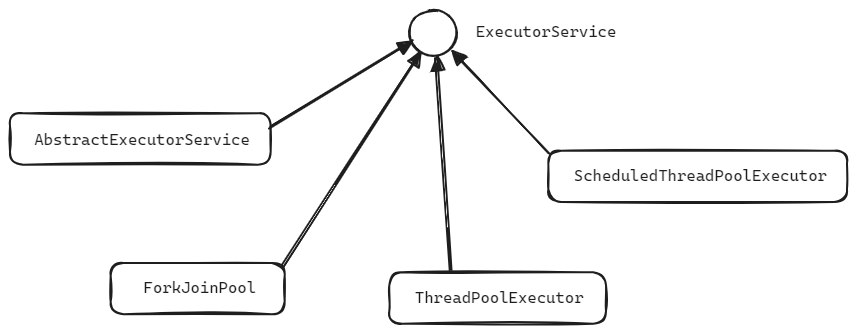

## ExecutorService

## ExecutorService

> 참고 : [ExecutorService](https://docs.oracle.com/javase/8/docs/api/java/util/concurrent/ExecutorService.html)  

 

[ExecutorService](https://docs.oracle.com/javase/8/docs/api/java/util/concurrent/ExecutorService.html) 는 하나의 interface 타입이고 구체타입으로는 [AbstractExecutorService](https://docs.oracle.com/javase/8/docs/api/java/util/concurrent/AbstractExecutorService.html), [ForkJoinPool](https://docs.oracle.com/javase/8/docs/api/java/util/concurrent/ForkJoinPool.html), [ScheduledThreadPoolExecutor](https://docs.oracle.com/javase/8/docs/api/java/util/concurrent/ScheduledThreadPoolExecutor.html), [ThreadPoolExecutor](https://docs.oracle.com/javase/8/docs/api/java/util/concurrent/ThreadPoolExecutor.html) 이 있습니다. 

ExecutorService 를 사용하면 스레드 풀을 정의할 수 있고 구체타입인 [AbstractExecutorService](https://docs.oracle.com/javase/8/docs/api/java/util/concurrent/AbstractExecutorService.html), [ForkJoinPool](https://docs.oracle.com/javase/8/docs/api/java/util/concurrent/ForkJoinPool.html), [ScheduledThreadPoolExecutor](https://docs.oracle.com/javase/8/docs/api/java/util/concurrent/ScheduledThreadPoolExecutor.html), [ThreadPoolExecutor](https://docs.oracle.com/javase/8/docs/api/java/util/concurrent/ThreadPoolExecutor.html) 클래스의 각 메서드 들의 정의 내용에 따라 작업들을 비동기적으로 처리하는 것이 가능합니다. 

ExecutorService 를 사용하면 별도의 스레드를 생성하거나 관리하는 작업을 하드코딩하지 않아도 되며, 코드가 더 간결하게 되니다. 또한 스레드 풀을 기반으로 자원을 효율적으로 관리할 수 있습니다. 

 

ExecutorService 에는 대표적으로 아래의 메서드 들이 정의 되어 있습니다.

- execute
  - Runnable 인터페이스에 대해 구현된 람다 또는 객체를 스레드 풀에서 비동기적으로 실행합니다.
- submit
  - Callable 인터페이스를 구현한 람다 또는 객체를 스레드 풀에서 비동기적으로 실행합니다. 작업의 결과는 Future\<T\> 객체로 반환됩니다.
- shutdown
  - ExecutorService 를 종료하고 예약한 스레드 자원들이 회수되게끔 하는 메서드입니다.

 

 

## Executors 팩토리 메서드

> 참고 : [Executors](https://docs.oracle.com/javase/8/docs/api/java/util/concurrent/Executors.html)  

Executors 에는 ExecutorService 객체를 생성할 수 있는 대표적으로 잘 알려진 팩토리 메서드 들이 있는데 아래와 같은 팩토리 메서드 들이 존재합니다. 

- newSingleThreadExecutor : 단일 스레드로 구성된 스레드 풀을 생성합니다.
  - **[newSingleThreadExecutor](https://docs.oracle.com/javase/8/docs/api/java/util/concurrent/Executors.html#newSingleThreadExecutor--)**()
  - **[newSingleThreadExecutor](https://docs.oracle.com/javase/8/docs/api/java/util/concurrent/Executors.html#newSingleThreadExecutor-java.util.concurrent.ThreadFactory-)**([ThreadFactory](https://docs.oracle.com/javase/8/docs/api/java/util/concurrent/ThreadFactory.html) threadFactory)
- newFixedThreadPool : 고정된 크기 n 만큼의 스레드 풀을 생성합니다.
  - **[newFixedThreadPool](https://docs.oracle.com/javase/8/docs/api/java/util/concurrent/Executors.html#newFixedThreadPool-int-)**(int nThreads)
  - **[newFixedThreadPool](https://docs.oracle.com/javase/8/docs/api/java/util/concurrent/Executors.html#newFixedThreadPool-int-java.util.concurrent.ThreadFactory-)**(int nThreads, [ThreadFactory](https://docs.oracle.com/javase/8/docs/api/java/util/concurrent/ThreadFactory.html) threadFactory)
- newCachedThreadPool : 
  - 사용가능한 스레드가 없다면 새로 생성해서 처리하고, 사용가능한 스레드가 있다면 재사용합니다. 스레드가 일정시간 사용되지 않으면 회수합니다. 다만, 스레드가 필요할 때마다 계속 생성하기에 요청의 양이 정해져 있는 IO 작업이 아닌 이상 사용이 권장되지는 않습니다.
  - **[newCachedThreadPool](https://docs.oracle.com/javase/8/docs/api/java/util/concurrent/Executors.html#newCachedThreadPool--)**()
  - **[newCachedThreadPool](https://docs.oracle.com/javase/8/docs/api/java/util/concurrent/Executors.html#newCachedThreadPool-java.util.concurrent.ThreadFactory-)**([ThreadFactory](https://docs.oracle.com/javase/8/docs/api/java/util/concurrent/ThreadFactory.html) threadFactory)
- newScheduledThreadPool : 
  - 스케쥴링 기반으로 일정주기마다 동작하는 작업을 실행하는 스레드 풀을 생성합니다. 주기적인 작업 또는 delay 가 발생하는 작업을 실행할 때 사용합니다.
  - **[newScheduledThreadPool](https://docs.oracle.com/javase/8/docs/api/java/util/concurrent/Executors.html#newScheduledThreadPool-int-)**(int corePoolSize)
  - **[newScheduledThreadPool](https://docs.oracle.com/javase/8/docs/api/java/util/concurrent/Executors.html#newScheduledThreadPool-int-java.util.concurrent.ThreadFactory-)**(int corePoolSize, [ThreadFactory](https://docs.oracle.com/javase/8/docs/api/java/util/concurrent/ThreadFactory.html) threadFactory)
- newWorkStealingPool : 
  - work steal 알고리즘을 사용하는 ForkJoinPool 을 생성
  - **[newWorkStealingPool](https://docs.oracle.com/javase/8/docs/api/java/util/concurrent/Executors.html#newWorkStealingPool--)**()
  - **[newWorkStealingPool](https://docs.oracle.com/javase/8/docs/api/java/util/concurrent/Executors.html#newWorkStealingPool-int-)**(int parallelism)

 

가급적이면 `ThreadFactory` 클래스를 잘 활용해서, 스레드 이름 등을 잘 명시해서 작성해두면 grafana 등에서 특정 스레드의 추이를 확인할 수 있기 때문에 ThreadFactory 를 잘 정의해두고 사용하는 것을 추천합니다. 

또한 위의 코드는 자주 사용될 가능성이 높은 객체 생성 코드 들를 대표적인 팩토리 메서드로 만들어놓은 것이기에 커스텀하게 타임아웃이나, 스레드 풀 내에서 개별 스레드를 위한 작업 큐 지정 등 더 세밀한 IO 작업 컨트롤을 하고 싶다면, 5개 함수 내부 구현을 보고, 새로운 함수를 만들어서 정의하시길 추천드립니다. 

 

