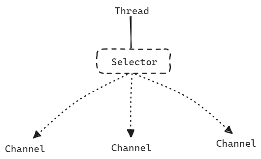
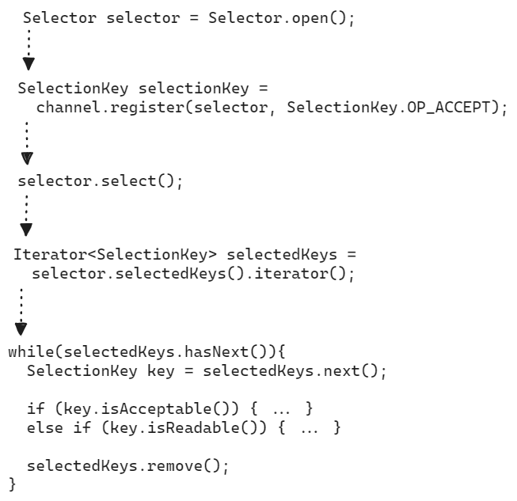
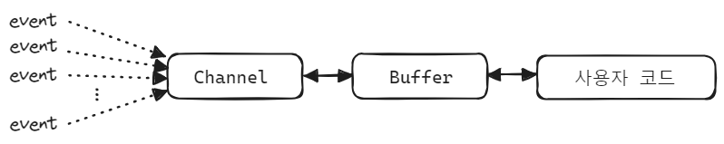

## Java IO Socket 통신

Java IO 버전의 소켓 통신의 절차는 아래와 같습니다.


<br/>


## Java NIO 셀렉터/채널 기반 소켓 프로그래밍

JAVA NIO 의 셀렉터/채널 기반의 소켓 프로그래밍은 하나의 스레드가 여러 채널을 처리(handle)할 수 있는 구조입니다.




각각의 channel 들은 Selector 에 등록되며, 하나의 스레드가 Selector 를 관리합니다. 이렇게 해서 스레드 하나가 Selector 를 통해 여러 Channel 을 처리할 수 있는 멀티플렉싱 방식으로 동작합니다.<br/>


구체적인 통신 과정은 다음과 같습니다.



channel 의 register() 메서드는 selector 객체를 전달받아서 자기자신을 Selector 를 등록합니다. 이 방식으로 하나 이상의 채널들을 셀렉터에 등록합니다. <br/>

> 만약 selector.register(...) 방식이었다면, 동시성 문제가 있었겠지만, selector 객체를 channel 에 넘겨준 방식은 기발한 방식이라고 느꼈던 것 같습니다.

이후 select() 메서드를 통해 호출할 때 등록된 채널 들 중 이벤트 준비가 완료된 하나 이상 발생할 때 까지 block 됩니다. select() 메서드 내에서 하나 이상의 채널의 이벤트가 발생하면 select() 메서드 다음으로 넘어갑니다. <br/>

그리고 selector.selectedKeys() 를 통해서 준비가 완료된 채널들의 목록을 통해서 채널들의 목록을 반환하며, 이 채널들의 이벤트 성격(Acceptable, Readable 등)에 따라 각각의 처리를 합니다.<br/><br/>


## Channel(채널), Buffer(버퍼)



<br/>


Channel 은 Stream 과 유사한 개념이며 Stream 과 비교해서 아래의 차이점들이 있습니다.

> 여기서 이야기하는 Stream 은 Java 8 의 Stream 이 아닌 Java I/O 에서의 InputStream, OutputStream 과 같은 IO 연산 관련 Stream 을 의미합니다.

- Channel 은 Read, Write 모두 가능하지만, Stream 은 단방향(Read 만 가능하거나 Write만 가능)으로만 가능합니다.
- Channel 은 비동기(Asynchronous)적으로 읽고 쓰는 것이 가능합니다.
- Channel 은 항상 Buffer 로부터 읽고 쓰는 작업을 수행합니다.

<br/>


Channel 에는 대표적으로 FileChannel, DatagramChannel, SocketChannel, ServerSocketChannel 이 있습니다.

- FileChannel : 파일에 데이터를 Read/Write 합니다.
- DatagramChannel : UDP 통신을 통해 네트워크 데이터를 Read/Write 합니다.
- SocketChannel : TCP 통신을 통해 네트워크 데이터를 Read/Write 합니다.
- ServerSocketChannel : TCP Listening(수신작업)을 수행합니다. 유입되는 연결마다 SocketChannel 이 만들어집니다.

<br/>


사용자가 채널에 데이터를 읽거나 쓰기위해서는 Buffer 를 통해서 읽고 씁니다. 데이터를 Buffer 를 통해 읽거나, Buffer 를 통해서 씁니다. Buffer 에는 아래와 같이 여러 종류의 Buffer 가 있습니다.

- ByteBuffer
- MappedByteBuffer
- CharBuffer
- ShortBuffer
- IntBuffer
- LongBuffer
- FloatBuffer
- DoubleBuffer


지금부터는 Buffer 라는 용어보다는 `버퍼` 라는 단어로 사용하겠습니다. (영타 전환이 불편해서요)<br/>

버퍼에 데이터를 쓸 때 버퍼는 지금까지 쓴 데이터의 양을 기록합니다. 데이터를 읽어들여야 할 때에는 flip() 메서드를 호출해서 버퍼를 쓰기 모드에서 읽기 모드로 전환합니다.<br/>

데이터를 모두 읽은 후에는 버퍼를 지우고 다시 쓸 준비를 해야하는데 이때 clear(), compact() 메서드 중 하나를 호출해서 전체 버퍼를 지웁니다. clear() 메서드는 버퍼 전체를 지우며, compact() 메서드는 이미 읽은 데이터만 지웁니다.<br/>


## NIO 소켓 프로그래밍 API

NIO 소켓 프로그래밍의 일반적인 API 와 통신 절차 등을 간략하게 정리해봅니다.<br/>


<br/>


### ServerSocketChannel 객체 생성, 소켓 개방

먼저 ServerSocketChannel 을 여는 과정입니다. ServerSocketChannel 객체의 static 메서드인 open() 메서드를 이용해서 Channel 을 열고 이 Channel 에 listen 할 주소를 bind 합니다. 그리고 마지막으로 channel 에 대해 configureBlocking(false) 를 지정해서 채널의 연산 동작은 Non Blocking 방식으로 동작하도록 지정해줬습니다.

```java
ServerSocketChannel channel = ServerSocketChannel.open();

channel.bind(new InetSocketAddress("localhost", 8080));
channel.configureBlocking(false); // Non Blocking 방식으로 Channel 의 이벤트를 읽어들이도록 지정 
```

<br/>


### Selector 객체 생성

```java
Selector selector = Selector.open();
```

<br/>


### Selector 에 Channel 등록

```java
// Selector 에 channel 을 등록
SelectionKey selectionKey = channel.register(selector, SelectionKey.OP_ACCEPT);
```

<br/>


### Selector 를 이용해서 채널 선택

```java
selector.select();
```

참고

- select()
  - 등록한 이벤트에 대해 하나 이상의 채널이 준비될 때 까지 blocking
  - 몇개의 채널이 준비되었는지 준비된 채널의 수를 return
  - 이 채널의 수는 마지막으로 select() 를 호출한 이후 준비된 채널 수를 의미
- select(long timeout)
  - 최대 몇 ms 동안 timeout 을 적용할지를 지정한 select() 메서드
- selectNow()
  - 채널이 준비될 때 까지 blocking 하지 않고 이미 준비되어 있는 채널이 있으면 그것을 즉시 return

<br/>


Channel 에 이벤트가 발생할 때 까지 대기하고 있는 것을 의미합니다. 위에서는 channel.configureBlocking(false) 로 지정했기 때문에 Non Blocking 방식으로 대기하게 됩니다. 마치 위의 코드는 블로킹 코드 처럼 보이지만 채널이 준비되기를 기다리는 동안 내부적으로는 다른 일을 처리하고 있습니다. <br/>

e.g.

```java
try{
    try(
          ServerSocketChannel serverChannel = ServerSocketChannel.open();
          Selector selector = Selector.open();
      ){
        serverChannel.bind(new InetSocketAddress("localhost", 8080));
        serverChannel.configureBlocking(false);
        serverChannel.register(selector, SelectionKey.OP_ACCEPT);
        
        while(true){
          selector.select();
          // ...
        }
    }
}
catch(...){}
finally{ executorService.shutdown(); }
```

<br/>


### selector.selectedKeys() 를 통해 이벤트가 발생한 채널들의 목록을 Set 으로 획득

이벤트가 발생한 채널들을 `Set<SelectionKey>` 으로 획득합니다.

```java
Set<SelectionKey> selectedKeys = selector.selectedKeys();
```

<br/>


참고로 `Selector.selectedKeys()` 가 반환하는 `Set<SelectionKey>` 는 Thread Safe 하지 않기 때문에 `Concurrent***` 계열의 자료구조에 복사해서 불변성 처리를 하는 것도 좋은 방법입니다.<br/>

<br/>


### 각각의 SelectionKey 에 대해 이벤트 처리 작업 수행

이벤트가 발생한 각각의 채널들에 대해 이벤트 처리를 수행합니다. 준비된 채널들을 획득하기 위해 획득한 `Set<SelectionKey>` 는 이벤트 처리가 완료되면 처리가 완료된 채널은 remove() 를 통해 삭제해줍니다.

```java
try{
    try(
          ServerSocketChannel serverChannel = ServerSocketChannel.open();
          Selector selector = Selector.open();
      ){
        // ...
        
        while(true){
          selector.select();
          
          // 준비된 채널들을 Set 형태로 변환후 Iterator 형식으로 변환
          Iterator<SelectionKey> selectedKeys = selector.selectedKeys().iterator();

          // 채널들 순회하면서 이벤트 처리 
          while(selectedKeys.hasNext()){
            SelectionKey key = selectedKeys.next();
            // selectedKeys.remove(); // 여기에서 remove() 해도 상관 없긴 합니다.

            if(key.isAcceptable()){
              SocketChannel clientSocket = ((ServerSocketChannel)key.channel()).accept();
              clientSocket.configureBlocking(false);
              clientSocket.register(selector, SelectionKey.OP_READ);
            }
            else if(key.isReadable()){
              SocketChannel clientSocket = (SocketChannel) key.channel();
              String requestBody = handleRequest(clientSocket);
              sendResponse(clientSocket, requestBody);
            }
            
            selectedKeys.remove();
          }
        }
    }
}
catch(...){}
finally{ executorService.shutdown(); }
```

<br/>


## 참고) SelectionKey

### SelectionKey 상수

SelectionKey 내에 정의된 상수들은 아래와 같습니다.

```java
SelectionKey.OP_CONNECT
SelectionKey.OP_ACCEPT
SelectionKey.OP_READ
SelectionKey.OP_WRITE
```

<br/>


위의 이벤트 상수들은 아래와 같이 조합해서 사용하는 것이 가능합니다.

```java
int events = SelectionKey.OP_READ | SelectionKey.OP_WRITE;
```

<br/>


### interestOps

```java
// Selector 에 channel 을 등록
SelectionKey selectionKey = channel.register(selector, SelectionKey.OP_ACCEPT);
```

SelectionKey 에는 interestOps() 라는 메서드가 있으며 셀렉터에 등록된 채널이 확인하려고 하는 이벤트들의 조합을 int 정수형으로 돌려받을 수 있습니다. 예를 들면 아래와 같은 형식입니다.

```java
int interestSet = selectionKey.interestOps();

boolean isInterestedInAccept  = interestSet & SelectionKey.OP_ACCEPT;
boolean isInterestedInConnect = interestSet & SelectionKey.OP_CONNECT;
boolean isInterestedInRead    = interestSet & SelectionKey.OP_READ;
boolean isInterestedInWrite   = interestSet & SelectionKey.OP_WRITE;
```

<br/>


### readyOps

readyOps() 는 셀렉터에 등록된 채널에서 준비되어 처리 가능한 이벤트들의 집합을 찾을 때 사용하는 메서드입니다.

```java
int readySet = SelectionKey.readyOps();
selectionKey.isAcceptable();
selectionKey.isConnectable();
selectionKey.isReadable();
selectionKey.isWritable();
```

<br/>


### SelectionKey 로 채널, 셀렉터에 접근 가능

```jav
Channel  channel  = selectionKey.channel();
Selector selector = selectionKey.selector(); 
```

<br/>


###  SelectionKey 에 객체를 첨부하는 것 역시 가능

채널에 추가 정보를 첨부하려고 하거나, 채널에서 사용하는 버퍼 객체 등을 첨부하려 할 때 사용 가능한 방법입니다.

```java
selectionKey.attach(theObject);
Object attachedObj = selectionKey.attachment();
```

<br/>


### 셀렉터에 채널을 등록할때 객체를 첨부하는 것 역시 가능

```java
SelectionKey key = channel.register(selector, SelectionKey.OP_READ, theObject);
```

<br/>


## e.g.1 : 단순한 버전의 Client, Server

예제코드는 [https://github.com/chagchagchag/webflux-mongo-mysql-redis/tree/main/demo-nio/src/main/java/io/chagchagchag/example/foobar/nio/socket](https://github.com/chagchagchag/webflux-mongo-mysql-redis/tree/main/demo-nio/src/main/java/io/chagchagchag/example/foobar/nio/socket) 에 `Example1_` 로 시작하는 파일명 들입니다.

<br/>


### Client

```java
package io.chagchagchag.example.foobar.nio.socket;

import java.net.InetSocketAddress;
import java.nio.ByteBuffer;
import java.nio.channels.SocketChannel;
import java.nio.charset.StandardCharsets;
import lombok.SneakyThrows;
import lombok.extern.slf4j.Slf4j;

@Slf4j
public class Example1_Client_SocketChannel {
  @SneakyThrows
  public static void main(String [] args){
    log.info("main function start");
    try(var socketChannel = SocketChannel.open()){
      var address = new InetSocketAddress("localhost", 8080);
      var connected = socketChannel.connect(address);
      log.info("connected : {}", connected);

      String message = "안녕하세요. 클라이언트에요.";
      ByteBuffer requestMessageBuffer = ByteBuffer.wrap(message.getBytes());
      socketChannel.write(requestMessageBuffer);
      requestMessageBuffer.clear();

      ByteBuffer result = ByteBuffer.allocateDirect(1024);
      while(socketChannel.read(result) > 0){
        result.flip();
        log.info("서버 응답 (Response) = {}", StandardCharsets.UTF_8.decode(result));
        result.clear();
      }
    }
    log.info("main function end");
  }
}
```

<br/>


### Server

Channel 을 통해서 소켓 커넥션을 열고 Channel 로 accept() 를 합니다. 소켓통신을 배워본적이 있다면 accept()는 클라이언트의 응답을 기다리는 동작이라는 것을 알고 계실 겁니다. Java IO 에서의 ServerSocket 의 accept() 는 블로킹이 발생하는 작업이지만, NIO는 accept() 를 논블로킹 방식으로 수행합니다. 

```java
package io.chagchagchag.example.foobar.nio.socket;

import java.net.InetSocketAddress;
import java.nio.ByteBuffer;
import java.nio.channels.ServerSocketChannel;
import java.nio.charset.StandardCharsets;
import lombok.SneakyThrows;
import lombok.extern.slf4j.Slf4j;

@Slf4j
public class Example1_Server_ServerSocketChannel {
  @SneakyThrows
  public static void main (String [] args){
    log.info("main function started");
    try(var serverChannel = ServerSocketChannel.open()){
      var address = new InetSocketAddress("localhost", 8080);
      serverChannel.bind(address);

      try(var clientSocket = serverChannel.accept()){
        ByteBuffer buffer = ByteBuffer.allocateDirect(1024);
        clientSocket.read(buffer);
        buffer.flip();

        var decodeMessage = StandardCharsets.UTF_8.decode(buffer);
        var clientMessage = String.valueOf(decodeMessage);
        log.info("클라이언트로부터 온 메시지 = {}", clientMessage);

        var responseMessage = "안녕하세요. 저는 서버입니다.";
        var responseBuffer = ByteBuffer.wrap(responseMessage.getBytes());
        clientSocket.write(responseBuffer);
        responseBuffer.flip();
      }
    }
    log.info("main function end");
  }
}
```

<br/>


### 출력결과

#### Client

```plain
10:37:59.175 [main] INFO io.chagchagchag.example.foobar.nio.socket.Example1_Client_SocketChannel -- main function start
10:37:59.196 [main] INFO io.chagchagchag.example.foobar.nio.socket.Example1_Client_SocketChannel -- connected : true
10:38:17.826 [main] INFO io.chagchagchag.example.foobar.nio.socket.Example1_Client_SocketChannel -- 서버 응답 (Response) = 안녕하세요. 저는 서버입니다.
10:38:17.827 [main] INFO io.chagchagchag.example.foobar.nio.socket.Example1_Client_SocketChannel -- main function end

Process finished with exit code 0
```

<br/>


#### Server

```plain
10:36:40.736 [main] INFO io.chagchagchag.example.foobar.nio.socket.Example1_Server_ServerSocketChannel -- main function started

Process finished with exit code 130
```

<br/>


## e.g. 2 :
