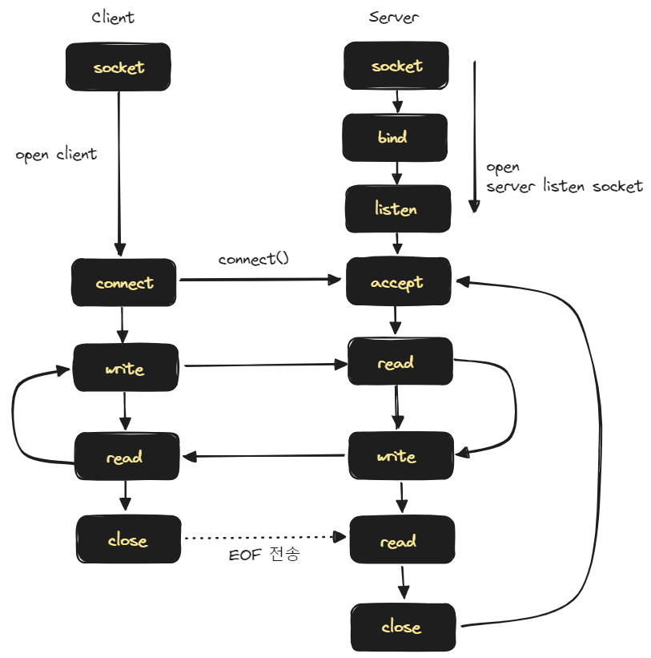

## Java 의 Socket 통신

설명은 추후 시간이 나는대로 계속해서 업데이트 해나갈 예정입니다.




## 예제 1

예제코드는 [https://github.com/chagchagchag/webflux-mongo-mysql-redis/tree/main/demo-nio/src/main/java/io/chagchagchag/example/foobar/nio/socket](https://github.com/chagchagchag/webflux-mongo-mysql-redis/tree/main/demo-nio/src/main/java/io/chagchagchag/example/foobar/nio/socket) 에 `Example1_` 로 시작하는 파일명 들입니다.

<br/>


### Client

```java
package io.chagchagchag.example.foobar.nio.socket;

import java.net.InetSocketAddress;
import java.nio.ByteBuffer;
import java.nio.channels.SocketChannel;
import java.nio.charset.StandardCharsets;
import lombok.SneakyThrows;
import lombok.extern.slf4j.Slf4j;

@Slf4j
public class Example1_Client_SocketChannel {
  @SneakyThrows
  public static void main(String [] args){
    log.info("main function start");
    try(var socketChannel = SocketChannel.open()){
      var address = new InetSocketAddress("localhost", 8080);
      var connected = socketChannel.connect(address);
      log.info("connected : {}", connected);

      String message = "안녕하세요. 클라이언트에요.";
      ByteBuffer requestMessageBuffer = ByteBuffer.wrap(message.getBytes());
      socketChannel.write(requestMessageBuffer);
      requestMessageBuffer.clear();

      ByteBuffer result = ByteBuffer.allocateDirect(1024);
      while(socketChannel.read(result) > 0){
        result.flip();
        log.info("서버 응답 (Response) = {}", StandardCharsets.UTF_8.decode(result));
        result.clear();
      }
    }
    log.info("main function end");
  }
}
```

<br/>


### Server

Channel 을 통해서 소켓 커넥션을 열고 Channel 로 accept() 를 합니다. 소켓통신을 배워본적이 있다면 accept()는 클라이언트의 응답을 기다리는 동작이라는 것을 알고 계실 겁니다. Java IO 에서의 ServerSocket 의 accept() 는 블로킹이 발생하는 작업이지만, NIO는 accept() 를 논블로킹 방식으로 수행합니다. 

```java
package io.chagchagchag.example.foobar.nio.socket;

import java.net.InetSocketAddress;
import java.nio.ByteBuffer;
import java.nio.channels.ServerSocketChannel;
import java.nio.charset.StandardCharsets;
import lombok.SneakyThrows;
import lombok.extern.slf4j.Slf4j;

@Slf4j
public class Example1_Server_ServerSocketChannel {
  @SneakyThrows
  public static void main (String [] args){
    log.info("main function started");
    try(var serverChannel = ServerSocketChannel.open()){
      var address = new InetSocketAddress("localhost", 8080);
      serverChannel.bind(address);

      try(var clientSocket = serverChannel.accept()){
        ByteBuffer buffer = ByteBuffer.allocateDirect(1024);
        clientSocket.read(buffer);
        buffer.flip();

        var decodeMessage = StandardCharsets.UTF_8.decode(buffer);
        var clientMessage = String.valueOf(decodeMessage);
        log.info("클라이언트로부터 온 메시지 = {}", clientMessage);

        var responseMessage = "안녕하세요. 저는 서버입니다.";
        var responseBuffer = ByteBuffer.wrap(responseMessage.getBytes());
        clientSocket.write(responseBuffer);
        responseBuffer.flip();
      }
    }
    log.info("main function end");
  }
}
```

<br/>


### 출력결과

#### Client

```plain
10:37:59.175 [main] INFO io.chagchagchag.example.foobar.nio.socket.Example1_Client_SocketChannel -- main function start
10:37:59.196 [main] INFO io.chagchagchag.example.foobar.nio.socket.Example1_Client_SocketChannel -- connected : true
10:38:17.826 [main] INFO io.chagchagchag.example.foobar.nio.socket.Example1_Client_SocketChannel -- 서버 응답 (Response) = 안녕하세요. 저는 서버입니다.
10:38:17.827 [main] INFO io.chagchagchag.example.foobar.nio.socket.Example1_Client_SocketChannel -- main function end

Process finished with exit code 0
```

<br/>


#### Server

```plain
10:36:40.736 [main] INFO io.chagchagchag.example.foobar.nio.socket.Example1_Server_ServerSocketChannel -- main function started

Process finished with exit code 130
```

<br/>


