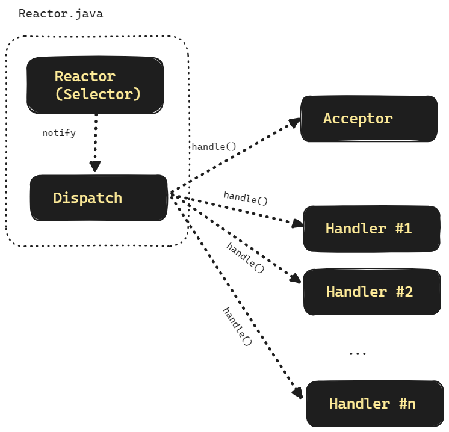
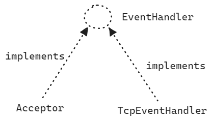

## Reactor Pattern

Reactor Pattern 을 적용하기 전, 이전에 살펴본 nio 채팅 코드는 아래와 같았습니다.

```java
// ...

  if(key.isAcceptable()){ // ACCEPT 이벤트일 경우
    // (1)
    // accept 를 통해 ClientSocket 획득
    var clientSocket = ((ServerSocketChannel) key.channel()).accept();
    // clientSocket 을 non-blocking 으로 설정
    clientSocket.configureBlocking(false);
    // clientSocket 을 selector 에 등록
    clientSocket.register(selector, SelectionKey.OP_READ);
  }
  if(key.isReadable()){ // READ 이벤트 일 때
    // clientSocket 을 얻어옴
    var clientSocket = (SocketChannel) key.channel();

    var requestBuffer = ByteBuffer.allocate(1024);
    // (2)
    clientSocket.read(requestBuffer); // clientSocket 으로부터 데이터 Read
    requestBuffer.flip();

    var received = new String(requestBuffer.array()).trim();
    log.info("client received = {}", received);

    var send = "답장보냅니다.";
    var responseBuffer = ByteBuffer.wrap(send.getBytes());
    clientSocket.write(responseBuffer);
    responseBuffer.clear();
    clientSocket.close();
  }

// ...
```

(1), (2) 로 표시한 부분에서는 accept, read 를 함수 호출로 처리하고 있습니다. 이렇게 함수를 그대로 작성해서 하는 것 보다는 조금은 확장성이 가능하도록 하는 코드를 작성해야 할 것 같습니다. 이번 문서에서는 이런 Plain 한 통신 로직을 Reactor Pattern 으로 바꾸면 어떻게 되는지를 확인해봅니다. Reactor 패턴은 이벤트를 감지하고 분류하는 Reactor 와 이벤트를 처리하는 Handler 로 이뤄져 있습니다.<br/>


## Reactor Pattern 이란?

Reactor 패턴은 동시에 들어오는 요청들을 처리하기 위해 만들어진 이벤트 핸들링 패턴입니다. Reactor 패턴에는 Reactor, Dispatcher, Handler 라고 하는 대표적인 3 요소가 있습니다.

Reactor

- 별도의 스레드에서 실행됩니다.
- 여러 요청의 Write, Accept, Read 이벤트를 한 곳에 등록 후 관찰하는 역할을 수행합니다.
- Connection 수립 후 TCP Handler 를 SelectionKey 에 대한 attachment 로 등록합니다.
- Selector로 select() 를 통해 이벤트가 발생했음을 감지했을 때 이벤트들 각각을 처리하는 것은 Dispatcher 가 처리하게끔 유도합니다.

Dispatcher 

- Reactor 로부터 전달받은 SelectionKey 내에 등록된 attachment 를 읽어들이는데, 이때 보통 attachment 는 EventHandler 입니다.
- Dispatcher 는 Handler가 Acceptor 인지 HttpEventHandler 인지는 모르고, 단순히 SelectionKey 에 attachment 로 등록된 EventHandler 타입의 handle() 을 호출합니다. 

Handler

- Handler 의 종류는 아래와 같이 구분했습니다.
  - Socket Accept 를 위한 용도의 Handler인 Acceptor
  - TCP 요청을 읽은 후 응답(Response)하기 위한 TcpEventHandler  


<br/>




<br/>

Reactor

- 이번 예제에서는 Selector 를 Reactor 라는 이름으로 사용합니다.


<br/>

Dispatch

- 이번예제에서는 Dispatch 는 객체로 선언하지 않고 Reactor 내에 dispatch() 라는 메서드로 구현해두었습니다.

<br/>


이번 예제에서 구현하려는 Acceptor, TcpEventHandler 의 기능을 요약해보면 아래와 같습니다.<br/>

Acceptor

- Acceptor 는 Application 전역적으로 1개의 객체만 존재합니다.
- Acceptor 가 handle() 을 수행할 때 ServerSocketChannel 이 accept() 를 성공적으로 수립했을 때 생성된 클라이언트의 SocketChannel 을 획득합니다.
- 이후에 TcpEventhHandler 객체를 생성하고, TcpEventHandler 객체 생성시에, 객체 내에 클라이언트의 SocketChannel 을 전달해주어 클라이언트 소켓을 바인딩해줍니다. 

- 신규 접속 생성시마다 해당하는 커넥션 하나당 하나의 HttpEventHandler 객체를 새로 생성합니다.


TcpEventHandler

- TcpEventHandler 는 전달받은 클라이언트 SocketChannel 을 이용해서 아래의 작업들을 수행합니다.
- 객체 생성 시에 전달받은 SocketChannel 을 Selector 에 등록해주고, 자기자신을 attachment 로 등록해줍니다.
- 따라서 Accept 이벤트가 아닌 Readable 이벤트일 경우 TcpEventHandler 를 거치게 됩니다.
- 요청으로 전달된 request 를 읽어들입니다.
- 요청 처리, 응답(send - clientSocket.write()) 을 수행합니다

<br/>


Acceptor, TcpEventHandler 는 Dispatch 입장에서는 EventHandler 라는 추상타입의 handle() 메서드를 통해 처리합니다. Dispatcher 입장에서는 Acceptor, TcpEventHandler 타입의 구체적인 동작을 알 필요 없이 EventHandler 의 handle() 메서드만을 호출하는 역할만을 수행합니다.



<br/>


예제는 별도의 실습 문서 들에서 따로 정리하며 예제는 아래의 두 종류의 예제를 예제로 수행합니다.<br/>

- Reactor 패턴 기반의 소켓 프로그램
- Reactor 패턴 기반의 Http 서버 프로그램

<br/>


