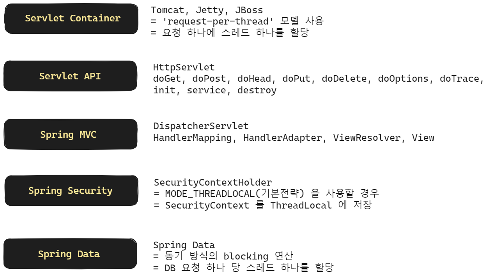
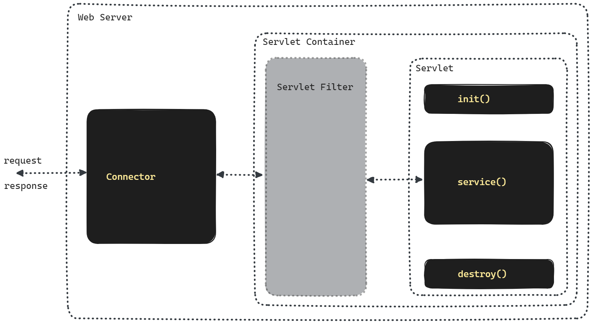

## Servlet Stack vs Reactive Stack

## Servlet Stack


<br/>

Servlet Stack 은 대표적으로 위와 같이 구성되어 있습니다. 스레드를 무분별하게 사용하는 것으로 문제되는 부분은 Servlet Container, Spring Security, Spring Data 스택입니다.<br/>

- Servlet Container
- Spring Security
- Spring Data

<br/>


### Servlet Container

Servlet Container 를 지원하는 대표적인 컨테이너는 Tomcat, Jetty, JBoss 가 있습니다. Servet Container 는 `request-per-thread` 모델을 사용하는데, 요청이 들어올 때마다 스레드를 할당하는 방식으로 클라이언트의 요청 처리에 동시성을 부여합니다.<br/>



<br/>

Connector 가 제일 앞단에서 HTTP 통신을 수행하고 Filter 가 Servlet 의 앞단에서 각 요청의 앞/뒤에서 미리 등록해둔 동작을 수행합니다. 그리고 request, response 는 Servlet 의 service() 에 전달 됩니다.<br/>

이 Connector 는 request 하나에 대해 하나의 thread 를 사용하며, tomcat 의 기본 설정 스레드 풀 사이즈는 200 개입니다.<br/>

전통적인 웹 서비스에서는 이런 모델이 어느 정도는 통했습니다. 하지만 최근의 트래픽 처리 모델에서는 IO 가 많고, 여러가지 http 요청 등을 수행하고 Security Context 관리, MVC 동작 수행등을 하면서 조금씩 요청 하나에 드는 비용이 커지기 시작했습니다.<br/>

따라서 하나의 스레드가 회수 되는 데에 예전보다 더 긴 시간이 소요되게 되었고, 스레드를 지나치게 낭비한다는 측면에서 단점이 있습니다.<br/>

<br/>


### Spring Security

Spring Security 는 인증 (Authentication), 인가(Authorization) 를 위한 유용한 기능들을 많이 제공합니다. 하지만 Servlet Stack 기반의 Spring Security 역시 Thread 모델로 인한 단점들이 존재합니다.<br/>

예를 들어 Spring Security 를 사용하다보면,  SecurityContextHolder 를 이용해서 authentication 을 set 하게 됩니다. 

```java
package org.springframework.security.core.context;

// ...
public class SecurityContextHolder {
  // ...

  private static void initializeStrategy() {
    if ("MODE_PRE_INITIALIZED".equals(strategyName)) {
      Assert.state(strategy != null, "When using MODE_PRE_INITIALIZED, setContextHolderStrategy must be called with the fully constructed strategy");
    } else {
      if (!StringUtils.hasText(strategyName)) {
        strategyName = "MODE_THREADLOCAL";
      }

      if (strategyName.equals("MODE_THREADLOCAL")) {
        strategy = new ThreadLocalSecurityContextHolderStrategy();
      } else if (strategyName.equals("MODE_INHERITABLETHREADLOCAL")) {
        strategy = new InheritableThreadLocalSecurityContextHolderStrategy();
      } else if (strategyName.equals("MODE_GLOBAL")) {
        strategy = new GlobalSecurityContextHolderStrategy();
      } else {
        try {
          Class<?> clazz = Class.forName(strategyName);
          Constructor<?> customStrategy = clazz.getConstructor();
          strategy = (SecurityContextHolderStrategy)customStrategy.newInstance();
        } catch (Exception var2) {
          ReflectionUtils.handleReflectionException(var2);
        }

      }
    }
  }
  
  // ...

}
```

SecurityContextHolder 가 사용하는 기본 공유 전략은 `MODE_THREADLOCAL` 입니다. 위 코드를 보면 ThreadLocal 을 사용하기에 reactive 환경 처럼 스레드가 계속 바뀌는 환경에서는 Spring Security 를 사용하기에는 쉽지 않습니다. SecurityContextHolder 의 공유 전략에 대해서는 아래의 자료들을 참고해주시기 바랍니다.

- [SpringContext 공유 전략](https://yoon0120.tistory.com/48)
- [SecurityContextHolder 의 내부를 파헤쳐보자](https://ohtaeg.tistory.com/8)

<br/>


### Spring Data

Spring Data 의 연산은 블로킹 방식의 동기연산을 수행합니다. 그리고 DB 요청 하나당 하나의 스레드를 사용합니다. 하나의 스레드가 블로킹 기반의 동기연산을 수행하는데, DB 연산의 비용(시간)이 꽤 높은 편에 속하기에 스레드를 어느 정도는 비싼 값을 치뤄서 사용합니다.<br/>

<br/>


## C10K (Client 10K)

1만개의 클라이언트가 요청을 하는 상황에 대한 문제를 의미하는 [C10K Problem](http://www.kegel.com/c10k.html)은 굉장히 잘 알려진 고전적인 주제입니다. [C10K Problem](http://www.kegel.com/c10k.html) 은 1999년 Dan Kegel 이라는 개발자가 제기한 문제입니다.<br/>

이것과 관련해서 읽어볼만한 자료들은 아래와 같습니다.

- [C10K Problem](http://www.kegel.com/c10k.html)
- [고전 돌아보기, C10K 문제 (C10K Problem)](https://oliveyoung.tech/blog/2023-10-02/c10-problem/)
- [about C10K problem](https://manhyuk.github.io/c10k-problem/)
- [쉽게 정리한 네트워크 | Apache와 Nginx의 요청 응답 구조](https://niklasjang.tistory.com/56)

<br/>


1초에 10000개의 클라이언트의 요청이 오는 것을 처리하려 할 때 흔히 처음에는 아래와 같은 생각을 할수도 있습니다.

- thread 를 이용해서 스레드를 request 마다 1개씩 할당한다.

<br/>


흔히 이 문제를 설명할 때 Apache 와 Nginx 의 차이점을 들어서 설명합니다.<br/>

> 참고 : [쉽게 정리한 네트워크 | Apache와 Nginx의 요청 응답 구조](https://niklasjang.tistory.com/56)

Apache 는 멀티 프로세스 + 멀티 스레드 방식을 사용합니다. 사용자의 요청에 대해 Process/Thread 를 생성하는 방식으로 대응합니다. 항상 여유로운 프로세스/스레드를 생성합니다. 미리 설정해둔 유휴(Idle) 프로세스의 수에 따라 넘어가면 kill 하고, 유휴 스레드가 적으면 kill 을 하는 방식으로 스레드를 관리합니다. Apache 는 일반적으로 요청 하나에 스레드 하나가 대응되도록 구성되어 있습니다. 하나의 프로세스가 관리할 수 있는 스레드의 수는 한정되어 있는데, 따라서 사용자의 접속이 증가하면 프로세스를 새로 fork 합니다. Apache 는 fork 를 할 때마다 CPU와 메모리 사용량이 증가한다는 단점이 있습니다.<br/>

Nginx 는 멀티 프로세스 + 싱글 스레드 방식을 사용합니다. low memory usage, high concurrency 를 지원하기 위해 async event driven 방식을 채택하고 있고 싱글스레드에서 요청에 응답을 합니다. Nginx 는 master process 가 다수의 worker process 를 관리합니다. master process 는 worker process 를 관리하는 일만을 담당하고 worker process 에서 사용자의 응답에 대응합니다. 각각의 worker 는 초당 수천개의 동시접속, 요청을 처리 가능합니다.

Apache, Nginx 의 동시 접속자가 늘어날 때 RPS (Request Per Second) 의 변화 추이는 아래 그림과 같습니다. RPS 는 1초에 처리 가능한 Request 의 개수라고 이해하시면 됩니다. 대표적인 웹 서버인 Apache 와 Nginx 에서의 RPS 처리 성능을 비교한 그래프를 보면 Apache Httpd 의 경우 성능이 급속도로 떨어지는 것을 확인 가능합니다.


<br/>


## 10K 의 스레드 실행시 생길수 있는 문제들

첫번째로 메모리 문제가 발생합니다. thread 각각은 메모리 스택을 가집니다. PCB 보다는 작지만 64Bit JVM 의 경우 1개의 스레드에 대해 1024KByte(1MB)를 사용한다고 합니다. 1만명일 경우 10000MB = 10GB 가 필요하다는 계산에 이르게 됩니다.<br/>

두번째로 스레드가 많을 경우 Context Switching 시에 경합(Racing Condition)이 발생합니다. 각각의 Thread 가 사용할 CPU 시간을 할당받기 위해 서로 경쟁을 하게 됩니다. 소켓 프로그래밍의 각 커넥션을 10K 의 스레드로 동작할 경우 10K 스레드 각각이 accept(), listen() 동작 등으로 인한 polling 을 하기 위한 경쟁이 발생합니다. 즉 Busy Wait 증상이 나타나기 시작합니다. 채팅창에 텍스트를 입력하지 않더라도 accept(), listen() 을 위한 무한 polling 을 10K의 스레드에서 수행중이기에 10K의 스레드 각각이 서로 CPU 자원을 차지하기 위해 싸우게 됩니다.<br/>

<br/>

[How Many Threads Is Too Many?](https://www.baeldung.com/cs/servers-threads-number) 에서는 아래의 그림으로 위 현상으로 인한 결과를 이야기합니다.


<br/>


## 가능한 해결책 : epoll(), kqueue, select()

