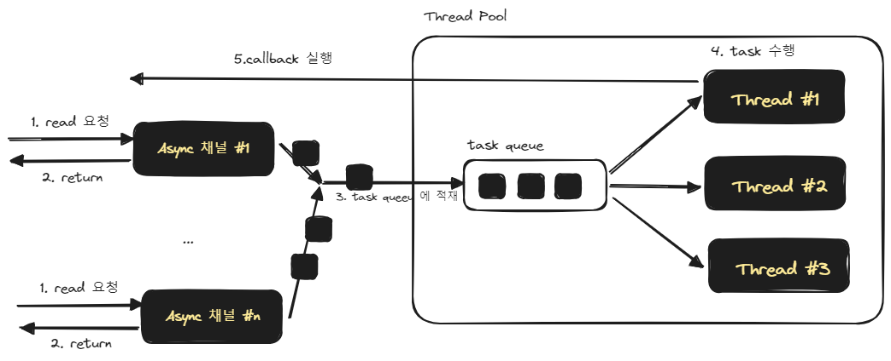

## AIO 의 개념

## Java AIO 란?

Java AIO 는 NIO2 라고도 불리는 라이브러리입니다. Java 1.7 부터 지원되기 시작했습니다. 

Java AIO 에서는 아래와 같은 비동기 채널들이 지원됩니다.

- AsynchronousChannel
- AsynchronousSocketChannel
- AsynchronousServerSocketChannel
- AsynchronousFileChannel

Java AIO 는 callback, future 를 이용해서 작업이 완료되었을 때의 동작을 식(Statement)로 전달할 수 있다는 장점이 있습니다.<br/>

<br/>


내부적으로는 Thread Pool, epoll, kqueue 등의 이벤트 알림 system call 을 이용해서 IO를 비동기적으로 처리합니다. IO 처리시에 내부적으로 처리를 하는 구조는 아래와 같습니다.<br/>



Read, Write 등과 같은 IO 요청이 왔을 때 요청에 대해서 calller에게 Channel 객체 또는 Future 를 반환해줍니다. 그리고 내부적인 Thread Pool 내에 존재하는 Task Queue 에 이것을 쌓아둡니다. 그리고 내부적인 Thread 들은 이 Task Queue 내의 작업을 처리합니다.<br/>

만약 처리가 모두 수행된다면 각각의 스레드는 자신에게 등록된 callback 을 수행합니다.<br/>

그리고 Caller 측에서는 Callee 로부터 전달받은 Channel 또는 Future 를 지속적으로 isDone(), isOpen() 같은 메서드를 주기적으로 검사하는 작업을 통해 작업이 끝났음을 확인해서 후처리하는 것이 가능합니다. 이런 검사 작업은 별도의 스레드에서 주기적으로 검사하게 하는 등의 작업을 수행하게 하는 식으로 비동기 논블로킹의 작업이 되도록 구성하는 것 역시 가능합니다.<br/>

<br/>


## 예제 1. File AIO - AsyncFileChannel 예제

자세한 설명은 추후 시간이 된다면 설명을 추가하도록 하겠습니다. 현재 취직을 준비중이어서 다른 작업을 해야 해서 설명은 생략하겠습니다.<br/>

### 코드
```java filename="Example1_AioFileChannel.java" {0} copy
package io..;

import java.io.File;
import java.nio.ByteBuffer;
import java.nio.channels.AsynchronousFileChannel;
import java.nio.channels.CompletionHandler;
import java.nio.charset.StandardCharsets;
import lombok.SneakyThrows;
import lombok.extern.slf4j.Slf4j;

@Slf4j
public class Example1_AioFileChannel {
  @SneakyThrows
  public static void main(String [] args){
    log.info("main function started");

    var filePath = Example1_AioFileChannel.class
        .getClassLoader()
        .getResource("example1-data.txt")
        .getFile();

    var file = new File(filePath);

    try(var channel = AsynchronousFileChannel.open(file.toPath())){
      ByteBuffer buffer = ByteBuffer.allocateDirect(1024);
      channel.read(buffer, 0, null, new CompletionHandler<Integer, Object>() {
        @SneakyThrows
        @Override
        public void completed(Integer result, Object attachment) {
          buffer.flip();
          var resultString = StandardCharsets.UTF_8.decode(buffer);
          log.info(String.format("resultString = %s", resultString));
          channel.close();
        }

        @Override
        public void failed(Throwable exc, Object attachment) {

        }

      });

      while (channel.isOpen()){
        log.info("Reading ... ");
      }
    }

    log.info("main function end");
  }
}
```
<br/>

### 출력결과
```plain
12:35:36.187 [main] INFO io...Example1_AioFileChannel -- main function started
12:35:36.202 [main] INFO io...Example1_AioFileChannel -- Reading ... 
12:35:36.202 [main] INFO io...Example1_AioFileChannel -- Reading ... 
12:35:36.202 [main] INFO io...Example1_AioFileChannel -- Reading ... 
12:35:36.202 [main] INFO io...Example1_AioFileChannel -- Reading ... 
12:35:36.202 [main] INFO io...Example1_AioFileChannel -- Reading ... 
12:35:36.202 [main] INFO io...Example1_AioFileChannel -- Reading ... 
12:35:36.202 [main] INFO io...Example1_AioFileChannel -- Reading ... 
12:35:36.202 [main] INFO io...Example1_AioFileChannel -- Reading ... 
12:35:36.202 [main] INFO io...Example1_AioFileChannel -- Reading ... 
12:35:36.202 [main] INFO io...Example1_AioFileChannel -- Reading ... 
12:35:36.202 [main] INFO io...Example1_AioFileChannel -- Reading ... 
12:35:36.202 [main] INFO io...Example1_AioFileChannel -- Reading ... 
12:35:36.202 [main] INFO io...Example1_AioFileChannel -- Reading ... 
12:35:36.202 [main] INFO io...Example1_AioFileChannel -- Reading ... 
12:35:36.203 [main] INFO io...Example1_AioFileChannel -- Reading ... 
12:35:36.203 [main] INFO io...Example1_AioFileChannel -- Reading ... 
12:35:36.203 [main] INFO io...Example1_AioFileChannel -- Reading ... 
12:35:36.203 [main] INFO io...Example1_AioFileChannel -- Reading ... 
12:35:36.203 [main] INFO io...Example1_AioFileChannel -- Reading ... 
12:35:36.203 [main] INFO io...Example1_AioFileChannel -- Reading ... 
12:35:36.203 [main] INFO io...Example1_AioFileChannel -- Reading ... 
12:35:36.203 [main] INFO io...Example1_AioFileChannel -- Reading ... 
12:35:36.203 [main] INFO io...Example1_AioFileChannel -- Reading ... 
12:35:36.203 [main] INFO io...Example1_AioFileChannel -- Reading ... 
12:35:36.203 [main] INFO io...Example1_AioFileChannel -- Reading ... 
12:35:36.203 [main] INFO io...Example1_AioFileChannel -- Reading ... 
12:35:36.203 [main] INFO io...Example1_AioFileChannel -- Reading ... 
12:35:36.203 [main] INFO io...Example1_AioFileChannel -- Reading ... 
12:35:36.203 [main] INFO io...Example1_AioFileChannel -- Reading ... 
12:35:36.203 [main] INFO io...Example1_AioFileChannel -- Reading ... 
12:35:36.203 [main] INFO io...Example1_AioFileChannel -- Reading ... 
12:35:36.203 [main] INFO io...Example1_AioFileChannel -- Reading ... 
12:35:36.203 [main] INFO io...Example1_AioFileChannel -- Reading ... 
12:35:36.203 [main] INFO io...Example1_AioFileChannel -- Reading ... 
12:35:36.203 [main] INFO io...Example1_AioFileChannel -- Reading ... 
12:35:36.203 [main] INFO io...Example1_AioFileChannel -- Reading ... 
12:35:36.203 [main] INFO io...Example1_AioFileChannel -- Reading ... 
12:35:36.203 [main] INFO io...Example1_AioFileChannel -- Reading ... 
12:35:36.204 [main] INFO io...Example1_AioFileChannel -- Reading ... 
12:35:36.204 [main] INFO io...Example1_AioFileChannel -- Reading ... 
12:35:36.204 [main] INFO io...Example1_AioFileChannel -- Reading ... 
12:35:36.204 [main] INFO io...Example1_AioFileChannel -- Reading ... 
12:35:36.204 [main] INFO io...Example1_AioFileChannel -- Reading ... 
12:35:36.204 [main] INFO io...Example1_AioFileChannel -- Reading ... 
12:35:36.204 [main] INFO io...Example1_AioFileChannel -- Reading ... 
12:35:36.204 [main] INFO io...Example1_AioFileChannel -- Reading ... 
12:35:36.204 [main] INFO io...Example1_AioFileChannel -- Reading ... 
12:35:36.204 [main] INFO io...Example1_AioFileChannel -- Reading ... 
12:35:36.204 [main] INFO io...Example1_AioFileChannel -- Reading ... 
12:35:36.204 [main] INFO io...Example1_AioFileChannel -- Reading ... 
12:35:36.204 [main] INFO io...Example1_AioFileChannel -- Reading ... 
12:35:36.204 [main] INFO io...Example1_AioFileChannel -- Reading ... 
12:35:36.204 [main] INFO io...Example1_AioFileChannel -- Reading ... 
12:35:36.204 [main] INFO io...Example1_AioFileChannel -- Reading ... 
12:35:36.204 [main] INFO io...Example1_AioFileChannel -- Reading ... 
12:35:36.204 [main] INFO io...Example1_AioFileChannel -- Reading ... 
12:35:36.204 [main] INFO io...Example1_AioFileChannel -- Reading ... 
12:35:36.204 [main] INFO io...Example1_AioFileChannel -- Reading ... 
12:35:36.204 [main] INFO io...Example1_AioFileChannel -- Reading ... 
12:35:36.204 [main] INFO io...Example1_AioFileChannel -- Reading ... 
12:35:36.205 [main] INFO io...Example1_AioFileChannel -- Reading ... 
12:35:36.205 [main] INFO io...Example1_AioFileChannel -- Reading ... 
12:35:36.205 [main] INFO io...Example1_AioFileChannel -- Reading ... 
12:35:36.205 [main] INFO io...Example1_AioFileChannel -- Reading ... 
12:35:36.205 [main] INFO io...Example1_AioFileChannel -- Reading ... 
12:35:36.205 [main] INFO io...Example1_AioFileChannel -- Reading ... 
12:35:36.205 [main] INFO io...Example1_AioFileChannel -- Reading ... 
12:35:36.205 [main] INFO io...Example1_AioFileChannel -- Reading ... 
12:35:36.205 [main] INFO io...Example1_AioFileChannel -- Reading ... 
12:35:36.205 [main] INFO io...Example1_AioFileChannel -- Reading ... 
12:35:36.205 [main] INFO io...Example1_AioFileChannel -- Reading ... 
12:35:36.205 [main] INFO io...Example1_AioFileChannel -- Reading ... 
12:35:36.205 [main] INFO io...Example1_AioFileChannel -- Reading ... 
12:35:36.205 [main] INFO io...Example1_AioFileChannel -- Reading ... 
12:35:36.205 [main] INFO io...Example1_AioFileChannel -- Reading ... 
12:35:36.205 [main] INFO io...Example1_AioFileChannel -- Reading ... 
12:35:36.205 [main] INFO io...Example1_AioFileChannel -- Reading ... 
12:35:36.205 [main] INFO io...Example1_AioFileChannel -- Reading ... 
12:35:36.205 [main] INFO io...Example1_AioFileChannel -- Reading ... 
12:35:36.205 [main] INFO io...Example1_AioFileChannel -- Reading ... 
12:35:36.205 [main] INFO io...Example1_AioFileChannel -- Reading ... 
12:35:36.205 [main] INFO io...Example1_AioFileChannel -- Reading ... 
12:35:36.205 [main] INFO io...Example1_AioFileChannel -- Reading ... 
12:35:36.205 [main] INFO io...Example1_AioFileChannel -- Reading ... 
12:35:36.205 [main] INFO io...Example1_AioFileChannel -- Reading ... 
12:35:36.205 [main] INFO io...Example1_AioFileChannel -- Reading ... 
12:35:36.205 [main] INFO io...Example1_AioFileChannel -- Reading ... 
12:35:36.205 [main] INFO io...Example1_AioFileChannel -- Reading ... 
12:35:36.205 [main] INFO io...Example1_AioFileChannel -- Reading ... 
12:35:36.205 [main] INFO io...Example1_AioFileChannel -- Reading ... 
12:35:36.205 [main] INFO io...Example1_AioFileChannel -- Reading ... 
12:35:36.205 [main] INFO io...Example1_AioFileChannel -- Reading ... 
12:35:36.205 [main] INFO io...Example1_AioFileChannel -- Reading ... 
12:35:36.205 [main] INFO io...Example1_AioFileChannel -- Reading ... 
12:35:36.205 [main] INFO io...Example1_AioFileChannel -- Reading ... 
12:35:36.205 [main] INFO io...Example1_AioFileChannel -- Reading ... 
12:35:36.205 [main] INFO io...Example1_AioFileChannel -- Reading ... 
12:35:36.205 [main] INFO io...Example1_AioFileChannel -- Reading ... 
12:35:36.205 [main] INFO io...Example1_AioFileChannel -- Reading ... 
12:35:36.205 [main] INFO io...Example1_AioFileChannel -- Reading ... 
12:35:36.205 [main] INFO io...Example1_AioFileChannel -- Reading ... 
12:35:36.205 [main] INFO io...Example1_AioFileChannel -- Reading ... 
12:35:36.205 [main] INFO io...Example1_AioFileChannel -- Reading ... 
12:35:36.205 [main] INFO io...Example1_AioFileChannel -- Reading ... 
12:35:36.205 [main] INFO io...Example1_AioFileChannel -- Reading ... 
12:35:36.205 [main] INFO io...Example1_AioFileChannel -- Reading ... 
12:35:36.205 [main] INFO io...Example1_AioFileChannel -- Reading ... 
12:35:36.205 [main] INFO io...Example1_AioFileChannel -- Reading ... 
12:35:36.205 [main] INFO io...Example1_AioFileChannel -- Reading ... 
12:35:36.205 [main] INFO io...Example1_AioFileChannel -- Reading ... 
12:35:36.205 [main] INFO io...Example1_AioFileChannel -- Reading ... 
12:35:36.206 [main] INFO io...Example1_AioFileChannel -- Reading ... 
12:35:36.206 [main] INFO io...Example1_AioFileChannel -- Reading ... 
12:35:36.206 [main] INFO io...Example1_AioFileChannel -- Reading ... 
12:35:36.206 [main] INFO io...Example1_AioFileChannel -- Reading ... 
12:35:36.206 [main] INFO io...Example1_AioFileChannel -- Reading ... 
12:35:36.206 [main] INFO io...Example1_AioFileChannel -- Reading ... 
12:35:36.206 [main] INFO io...Example1_AioFileChannel -- Reading ... 
12:35:36.206 [main] INFO io...Example1_AioFileChannel -- Reading ... 
12:35:36.206 [main] INFO io...Example1_AioFileChannel -- Reading ... 
12:35:36.206 [main] INFO io...Example1_AioFileChannel -- Reading ... 
12:35:36.206 [main] INFO io...Example1_AioFileChannel -- Reading ... 
12:35:36.206 [main] INFO io...Example1_AioFileChannel -- Reading ... 
12:35:36.206 [main] INFO io...Example1_AioFileChannel -- Reading ... 
12:35:36.206 [main] INFO io...Example1_AioFileChannel -- Reading ... 
12:35:36.206 [main] INFO io...Example1_AioFileChannel -- Reading ... 
12:35:36.206 [main] INFO io...Example1_AioFileChannel -- Reading ... 
12:35:36.206 [main] INFO io...Example1_AioFileChannel -- Reading ... 
12:35:36.206 [main] INFO io...Example1_AioFileChannel -- Reading ... 
12:35:36.206 [main] INFO io...Example1_AioFileChannel -- Reading ... 
12:35:36.206 [main] INFO io...Example1_AioFileChannel -- Reading ... 
12:35:36.206 [main] INFO io...Example1_AioFileChannel -- Reading ... 
12:35:36.206 [main] INFO io...Example1_AioFileChannel -- Reading ... 
12:35:36.206 [main] INFO io...Example1_AioFileChannel -- Reading ... 
12:35:36.206 [main] INFO io...Example1_AioFileChannel -- Reading ... 
12:35:36.206 [main] INFO io...Example1_AioFileChannel -- Reading ... 
12:35:36.206 [main] INFO io...Example1_AioFileChannel -- Reading ... 
12:35:36.206 [main] INFO io...Example1_AioFileChannel -- Reading ... 
12:35:36.206 [main] INFO io...Example1_AioFileChannel -- Reading ... 
12:35:36.206 [main] INFO io...Example1_AioFileChannel -- Reading ... 
12:35:36.206 [main] INFO io...Example1_AioFileChannel -- Reading ... 
12:35:36.206 [main] INFO io...Example1_AioFileChannel -- Reading ... 
12:35:36.206 [main] INFO io...Example1_AioFileChannel -- Reading ... 
12:35:36.206 [main] INFO io...Example1_AioFileChannel -- Reading ... 
12:35:36.206 [main] INFO io...Example1_AioFileChannel -- Reading ... 
12:35:36.206 [main] INFO io...Example1_AioFileChannel -- Reading ... 
12:35:36.206 [main] INFO io...Example1_AioFileChannel -- Reading ... 
12:35:36.206 [main] INFO io...Example1_AioFileChannel -- Reading ... 
12:35:36.206 [main] INFO io...Example1_AioFileChannel -- Reading ... 
12:35:36.206 [main] INFO io...Example1_AioFileChannel -- Reading ... 
12:35:36.206 [main] INFO io...Example1_AioFileChannel -- Reading ... 
12:35:36.206 [main] INFO io...Example1_AioFileChannel -- Reading ... 
12:35:36.206 [main] INFO io...Example1_AioFileChannel -- Reading ... 
12:35:36.206 [main] INFO io...Example1_AioFileChannel -- Reading ... 
12:35:36.206 [main] INFO io...Example1_AioFileChannel -- Reading ... 
12:35:36.206 [main] INFO io...Example1_AioFileChannel -- Reading ... 
12:35:36.206 [main] INFO io...Example1_AioFileChannel -- Reading ... 
12:35:36.206 [main] INFO io...Example1_AioFileChannel -- Reading ... 
12:35:36.206 [main] INFO io...Example1_AioFileChannel -- Reading ... 
12:35:36.206 [main] INFO io...Example1_AioFileChannel -- Reading ... 
12:35:36.206 [main] INFO io...Example1_AioFileChannel -- Reading ... 
12:35:36.206 [main] INFO io...Example1_AioFileChannel -- Reading ... 
12:35:36.206 [main] INFO io...Example1_AioFileChannel -- Reading ... 
12:35:36.206 [main] INFO io...Example1_AioFileChannel -- Reading ... 
12:35:36.206 [main] INFO io...Example1_AioFileChannel -- Reading ... 
12:35:36.206 [main] INFO io...Example1_AioFileChannel -- Reading ... 
12:35:36.206 [main] INFO io...Example1_AioFileChannel -- Reading ... 
12:35:36.206 [main] INFO io...Example1_AioFileChannel -- Reading ... 
12:35:36.206 [main] INFO io...Example1_AioFileChannel -- Reading ... 
12:35:36.206 [main] INFO io...Example1_AioFileChannel -- Reading ... 
12:35:36.206 [main] INFO io...Example1_AioFileChannel -- Reading ... 
12:35:36.206 [main] INFO io...Example1_AioFileChannel -- Reading ... 
12:35:36.206 [main] INFO io...Example1_AioFileChannel -- Reading ... 
12:35:36.206 [main] INFO io...Example1_AioFileChannel -- Reading ... 
12:35:36.206 [main] INFO io...Example1_AioFileChannel -- Reading ... 
12:35:36.206 [main] INFO io...Example1_AioFileChannel -- Reading ... 
12:35:36.206 [main] INFO io...Example1_AioFileChannel -- Reading ... 
12:35:36.206 [main] INFO io...Example1_AioFileChannel -- Reading ... 
12:35:36.206 [main] INFO io...Example1_AioFileChannel -- Reading ... 
12:35:36.206 [main] INFO io...Example1_AioFileChannel -- Reading ... 
12:35:36.206 [main] INFO io...Example1_AioFileChannel -- Reading ... 
12:35:36.206 [main] INFO io...Example1_AioFileChannel -- Reading ... 
12:35:36.206 [main] INFO io...Example1_AioFileChannel -- Reading ... 
12:35:36.206 [main] INFO io...Example1_AioFileChannel -- Reading ... 
12:35:36.206 [main] INFO io...Example1_AioFileChannel -- Reading ... 
12:35:36.207 [main] INFO io...Example1_AioFileChannel -- Reading ... 
12:35:36.207 [main] INFO io...Example1_AioFileChannel -- Reading ... 
12:35:36.207 [main] INFO io...Example1_AioFileChannel -- Reading ... 
12:35:36.207 [main] INFO io...Example1_AioFileChannel -- Reading ... 
12:35:36.207 [main] INFO io...Example1_AioFileChannel -- Reading ... 
12:35:36.207 [main] INFO io...Example1_AioFileChannel -- Reading ... 
12:35:36.207 [main] INFO io...Example1_AioFileChannel -- Reading ... 
12:35:36.207 [main] INFO io...Example1_AioFileChannel -- Reading ... 
12:35:36.207 [main] INFO io...Example1_AioFileChannel -- Reading ... 
12:35:36.207 [main] INFO io...Example1_AioFileChannel -- Reading ... 
12:35:36.207 [main] INFO io...Example1_AioFileChannel -- Reading ... 
12:35:36.207 [main] INFO io...Example1_AioFileChannel -- Reading ... 
12:35:36.207 [main] INFO io...Example1_AioFileChannel -- Reading ... 
12:35:36.207 [main] INFO io...Example1_AioFileChannel -- Reading ... 
12:35:36.207 [main] INFO io...Example1_AioFileChannel -- Reading ... 
12:35:36.207 [main] INFO io...Example1_AioFileChannel -- Reading ... 
12:35:36.207 [main] INFO io...Example1_AioFileChannel -- Reading ... 
12:35:36.207 [main] INFO io...Example1_AioFileChannel -- Reading ... 
12:35:36.207 [main] INFO io...Example1_AioFileChannel -- Reading ... 
12:35:36.207 [main] INFO io...Example1_AioFileChannel -- Reading ... 
12:35:36.207 [main] INFO io...Example1_AioFileChannel -- Reading ... 
12:35:36.207 [main] INFO io...Example1_AioFileChannel -- Reading ... 
12:35:36.207 [main] INFO io...Example1_AioFileChannel -- Reading ... 
12:35:36.207 [main] INFO io...Example1_AioFileChannel -- Reading ... 
12:35:36.207 [main] INFO io...Example1_AioFileChannel -- Reading ... 
12:35:36.207 [main] INFO io...Example1_AioFileChannel -- Reading ... 
12:35:36.207 [main] INFO io...Example1_AioFileChannel -- Reading ... 
12:35:36.207 [main] INFO io...Example1_AioFileChannel -- Reading ... 
12:35:36.207 [main] INFO io...Example1_AioFileChannel -- Reading ... 
12:35:36.207 [main] INFO io...Example1_AioFileChannel -- Reading ... 
12:35:36.207 [main] INFO io...Example1_AioFileChannel -- Reading ... 
12:35:36.207 [main] INFO io...Example1_AioFileChannel -- Reading ... 
12:35:36.207 [main] INFO io...Example1_AioFileChannel -- Reading ... 
12:35:36.207 [main] INFO io...Example1_AioFileChannel -- Reading ... 
12:35:36.207 [main] INFO io...Example1_AioFileChannel -- Reading ... 
12:35:36.207 [main] INFO io...Example1_AioFileChannel -- Reading ... 
12:35:36.207 [main] INFO io...Example1_AioFileChannel -- Reading ... 
12:35:36.207 [main] INFO io...Example1_AioFileChannel -- Reading ... 
12:35:36.207 [main] INFO io...Example1_AioFileChannel -- Reading ... 
12:35:36.207 [main] INFO io...Example1_AioFileChannel -- Reading ... 
12:35:36.207 [main] INFO io...Example1_AioFileChannel -- Reading ... 
12:35:36.207 [main] INFO io...Example1_AioFileChannel -- Reading ... 
12:35:36.207 [main] INFO io...Example1_AioFileChannel -- Reading ... 
12:35:36.207 [main] INFO io...Example1_AioFileChannel -- Reading ... 
12:35:36.207 [main] INFO io...Example1_AioFileChannel -- Reading ... 
12:35:36.207 [main] INFO io...Example1_AioFileChannel -- Reading ... 
12:35:36.207 [main] INFO io...Example1_AioFileChannel -- Reading ... 
12:35:36.207 [main] INFO io...Example1_AioFileChannel -- Reading ... 
12:35:36.207 [main] INFO io...Example1_AioFileChannel -- Reading ... 
12:35:36.207 [main] INFO io...Example1_AioFileChannel -- Reading ... 
12:35:36.207 [main] INFO io...Example1_AioFileChannel -- Reading ... 
12:35:36.207 [main] INFO io...Example1_AioFileChannel -- Reading ... 
12:35:36.207 [main] INFO io...Example1_AioFileChannel -- Reading ... 
12:35:36.207 [main] INFO io...Example1_AioFileChannel -- Reading ... 
12:35:36.207 [main] INFO io...Example1_AioFileChannel -- Reading ... 
12:35:36.207 [main] INFO io...Example1_AioFileChannel -- Reading ... 
12:35:36.207 [main] INFO io...Example1_AioFileChannel -- Reading ... 
12:35:36.207 [main] INFO io...Example1_AioFileChannel -- Reading ... 
12:35:36.207 [main] INFO io...Example1_AioFileChannel -- Reading ... 
12:35:36.207 [main] INFO io...Example1_AioFileChannel -- Reading ... 
12:35:36.207 [main] INFO io...Example1_AioFileChannel -- Reading ... 
12:35:36.207 [main] INFO io...Example1_AioFileChannel -- Reading ... 
12:35:36.207 [main] INFO io...Example1_AioFileChannel -- Reading ... 
12:35:36.208 [main] INFO io...Example1_AioFileChannel -- Reading ... 
12:35:36.208 [main] INFO io...Example1_AioFileChannel -- Reading ... 
12:35:36.208 [main] INFO io...Example1_AioFileChannel -- Reading ... 
12:35:36.208 [main] INFO io...Example1_AioFileChannel -- Reading ... 
12:35:36.208 [main] INFO io...Example1_AioFileChannel -- Reading ... 
12:35:36.208 [main] INFO io...Example1_AioFileChannel -- Reading ... 
12:35:36.208 [main] INFO io...Example1_AioFileChannel -- Reading ... 
12:35:36.208 [main] INFO io...Example1_AioFileChannel -- Reading ... 
12:35:36.208 [main] INFO io...Example1_AioFileChannel -- Reading ... 
12:35:36.208 [main] INFO io...Example1_AioFileChannel -- Reading ... 
12:35:36.208 [main] INFO io...Example1_AioFileChannel -- Reading ... 
12:35:36.208 [main] INFO io...Example1_AioFileChannel -- Reading ... 
12:35:36.208 [main] INFO io...Example1_AioFileChannel -- Reading ... 
12:35:36.208 [main] INFO io...Example1_AioFileChannel -- Reading ... 
12:35:36.208 [main] INFO io...Example1_AioFileChannel -- Reading ... 
12:35:36.208 [main] INFO io...Example1_AioFileChannel -- Reading ... 
12:35:36.208 [main] INFO io...Example1_AioFileChannel -- Reading ... 
12:35:36.208 [main] INFO io...Example1_AioFileChannel -- Reading ... 
12:35:36.208 [main] INFO io...Example1_AioFileChannel -- Reading ... 
12:35:36.208 [main] INFO io...Example1_AioFileChannel -- Reading ... 
12:35:36.208 [main] INFO io...Example1_AioFileChannel -- Reading ... 
12:35:36.208 [main] INFO io...Example1_AioFileChannel -- Reading ... 
12:35:36.208 [main] INFO io...Example1_AioFileChannel -- Reading ... 
12:35:36.208 [main] INFO io...Example1_AioFileChannel -- Reading ... 
12:35:36.208 [main] INFO io...Example1_AioFileChannel -- Reading ... 
12:35:36.208 [main] INFO io...Example1_AioFileChannel -- Reading ... 
12:35:36.208 [main] INFO io...Example1_AioFileChannel -- Reading ... 
12:35:36.208 [main] INFO io...Example1_AioFileChannel -- Reading ... 
12:35:36.208 [main] INFO io...Example1_AioFileChannel -- Reading ... 
12:35:36.208 [main] INFO io...Example1_AioFileChannel -- Reading ... 
12:35:36.208 [main] INFO io...Example1_AioFileChannel -- Reading ... 
12:35:36.208 [main] INFO io...Example1_AioFileChannel -- Reading ... 
12:35:36.208 [main] INFO io...Example1_AioFileChannel -- Reading ... 
12:35:36.208 [main] INFO io...Example1_AioFileChannel -- Reading ... 
12:35:36.208 [main] INFO io...Example1_AioFileChannel -- Reading ... 
12:35:36.208 [main] INFO io...Example1_AioFileChannel -- Reading ... 
12:35:36.208 [main] INFO io...Example1_AioFileChannel -- Reading ... 
12:35:36.208 [main] INFO io...Example1_AioFileChannel -- Reading ... 
12:35:36.208 [main] INFO io...Example1_AioFileChannel -- Reading ... 
12:35:36.208 [main] INFO io...Example1_AioFileChannel -- Reading ... 
12:35:36.208 [main] INFO io...Example1_AioFileChannel -- Reading ... 
12:35:36.208 [main] INFO io...Example1_AioFileChannel -- Reading ... 
12:35:36.208 [main] INFO io...Example1_AioFileChannel -- Reading ... 
12:35:36.208 [main] INFO io...Example1_AioFileChannel -- Reading ... 
12:35:36.208 [main] INFO io...Example1_AioFileChannel -- Reading ... 
12:35:36.209 [main] INFO io...Example1_AioFileChannel -- Reading ... 
12:35:36.209 [main] INFO io...Example1_AioFileChannel -- Reading ... 
12:35:36.209 [main] INFO io...Example1_AioFileChannel -- Reading ... 
12:35:36.209 [main] INFO io...Example1_AioFileChannel -- Reading ... 
12:35:36.209 [main] INFO io...Example1_AioFileChannel -- Reading ... 
12:35:36.209 [main] INFO io...Example1_AioFileChannel -- Reading ... 
12:35:36.209 [main] INFO io...Example1_AioFileChannel -- Reading ... 
12:35:36.209 [main] INFO io...Example1_AioFileChannel -- Reading ... 
12:35:36.209 [main] INFO io...Example1_AioFileChannel -- Reading ... 
12:35:36.209 [main] INFO io...Example1_AioFileChannel -- Reading ... 
12:35:36.209 [main] INFO io...Example1_AioFileChannel -- Reading ... 
12:35:36.209 [main] INFO io...Example1_AioFileChannel -- Reading ... 
12:35:36.209 [main] INFO io...Example1_AioFileChannel -- Reading ... 
12:35:36.209 [main] INFO io...Example1_AioFileChannel -- Reading ... 
12:35:36.209 [main] INFO io...Example1_AioFileChannel -- Reading ... 
12:35:36.209 [main] INFO io...Example1_AioFileChannel -- Reading ... 
12:35:36.209 [main] INFO io...Example1_AioFileChannel -- Reading ... 
12:35:36.209 [main] INFO io...Example1_AioFileChannel -- Reading ... 
12:35:36.209 [main] INFO io...Example1_AioFileChannel -- Reading ... 
12:35:36.209 [main] INFO io...Example1_AioFileChannel -- Reading ... 
12:35:36.209 [main] INFO io...Example1_AioFileChannel -- Reading ... 
12:35:36.209 [main] INFO io...Example1_AioFileChannel -- Reading ... 
12:35:36.209 [main] INFO io...Example1_AioFileChannel -- Reading ... 
12:35:36.209 [main] INFO io...Example1_AioFileChannel -- Reading ... 
12:35:36.209 [main] INFO io...Example1_AioFileChannel -- Reading ... 
12:35:36.209 [main] INFO io...Example1_AioFileChannel -- Reading ... 
12:35:36.209 [main] INFO io...Example1_AioFileChannel -- Reading ... 
12:35:36.209 [main] INFO io...Example1_AioFileChannel -- Reading ... 
12:35:36.209 [main] INFO io...Example1_AioFileChannel -- Reading ... 
12:35:36.209 [main] INFO io...Example1_AioFileChannel -- Reading ... 
12:35:36.209 [main] INFO io...Example1_AioFileChannel -- Reading ... 
12:35:36.209 [main] INFO io...Example1_AioFileChannel -- Reading ... 
12:35:36.209 [main] INFO io...Example1_AioFileChannel -- Reading ... 
12:35:36.209 [main] INFO io...Example1_AioFileChannel -- Reading ... 
12:35:36.209 [main] INFO io...Example1_AioFileChannel -- Reading ... 
12:35:36.209 [main] INFO io...Example1_AioFileChannel -- Reading ... 
12:35:36.209 [main] INFO io...Example1_AioFileChannel -- Reading ... 
12:35:36.209 [main] INFO io...Example1_AioFileChannel -- Reading ... 
12:35:36.209 [Thread-16] INFO io...Example1_AioFileChannel -- resultString = NVIDIA Corporation provides graphics, and compute and networking solutions in the United States, Taiwan, China, Hong Kong, and internationally. The Graphics segment offers GeForce GPUs for gaming and PCs, the GeForce NOW game streaming service and related infrastructure, and solutions for gaming platforms; Quadro/NVIDIA RTX GPUs for enterprise workstation graphics; virtual GPU or vGPU software for cloud-based visual and virtual computing; automotive platforms for infotainment systems; and Omniverse software for building and operating metaverse and 3D internet applications. The Compute & Networking segment comprises Data Center computing platforms and end-to-end networking platforms, including Quantum for InfiniBand and Spectrum for Ethernet; NVIDIA DRIVE automated-driving platform and automotive development agreements; Jetson robotics and other embedded platforms; NVIDIA AI Enterprise and other software; and DGX Cloud software and services. The company's products are used in gaming, professional visualization
12:35:36.209 [main] INFO io...Example1_AioFileChannel -- Reading ... 
12:35:36.210 [main] INFO io...Example1_AioFileChannel -- main function end

Process finished with exit code 0
```
<br/>

## 예제 2. File AIO - Future 기반 예제

자세한 설명은 추후 시간이 된다면 설명을 추가하도록 하겠습니다. 현재 취직을 준비중이어서 다른 작업을 해야 해서 설명은 생략하겠습니다.<br/>


### 코드
```java filename="Example2_AioFileFuture.java" {0} copy
package io..;

import java.io.File;
import java.nio.ByteBuffer;
import java.nio.channels.AsynchronousFileChannel;
import java.nio.charset.StandardCharsets;
import java.util.concurrent.Future;
import lombok.SneakyThrows;
import lombok.extern.slf4j.Slf4j;

@Slf4j
public class Example2_AioFileFuture {
  @SneakyThrows
  public static void main(String [] args){
    log.info("main function started");

    var filePath = Example1_AioFileChannel.class
        .getClassLoader()
        .getResource("example2-data.txt")
        .getFile();

    var file = new File(filePath);

    try(var channel = AsynchronousFileChannel.open(file.toPath())){
      ByteBuffer buffer = ByteBuffer.allocateDirect(1024);
      Future<Integer> readFuture = channel.read(buffer, 0);

      while (!readFuture.isDone()){
        log.info("Reading ... ");
      }
      buffer.flip();
      var resultString = StandardCharsets.UTF_8.decode(buffer);
      log.info(String.format("resultString = %s", resultString));
    }
    log.info("main function end");
  }
}
```
<br/>


### 출력결과
```plain
12:39:37.637 [main] INFO io...Example2_AioFileFuture -- main function started
12:39:37.651 [main] INFO io...Example2_AioFileFuture -- resultString = 
12:39:37.651 [main] INFO io...Example2_AioFileFuture -- main function end

Process finished with exit code 0
```
<br/>


## 예제 3. Socket AIO -  Channel 기반

자세한 설명은 추후 시간이 된다면 설명을 추가하도록 하겠습니다. 현재 취직을 준비중이어서 다른 작업을 해야 해서 설명은 생략하겠습니다.<br/>


### Server

```java
package io..;

import java.net.InetSocketAddress;
import java.nio.ByteBuffer;
import java.nio.channels.AsynchronousServerSocketChannel;
import java.nio.channels.AsynchronousSocketChannel;
import java.nio.channels.CompletionHandler;
import java.nio.charset.StandardCharsets;
import lombok.SneakyThrows;
import lombok.extern.slf4j.Slf4j;

@Slf4j
public class Example3_AioSocket_Channel_Server {
  @SneakyThrows
  public static void main(String [] args){
    log.info("main function started");

    try(var serverChannel = AsynchronousServerSocketChannel.open()){
      var address = new InetSocketAddress("localhost", 8080);
      serverChannel.bind(address);

      serverChannel.accept(null, new CompletionHandler<AsynchronousSocketChannel, Object>() {
        @Override
        public void completed(AsynchronousSocketChannel clientSocketChannel, Object attachment) {
          log.info("서버소켓 Accept 시작");
          var requestBuffer = ByteBuffer.allocateDirect(1024);

          clientSocketChannel.read(requestBuffer, null, new CompletionHandler<Integer, Object>() {
            @SneakyThrows
            @Override
            public void completed(Integer result, Object attachment) {
              requestBuffer.flip();
              var requestMessage = StandardCharsets.UTF_8.decode(requestBuffer);
              log.info("requestMessage = {}", requestMessage);

              var response = "안녕하세요. 저는 서버입니다. 이제 서버 끄겠습니다.";
              var responseMessageBuffer = ByteBuffer.wrap(response.getBytes());
              clientSocketChannel.write(responseMessageBuffer);
              clientSocketChannel.close();
              log.info("end client");
            }

            @Override
            public void failed(Throwable exc, Object attachment) {

            }
          });
        }

        @Override
        public void failed(Throwable exc, Object attachment) {

        }
      });

      Thread.sleep(100000); // 100 초 동안 서버 기동
    }
    log.info("main function end");
  }
}
```

<br/>


### Client

```java
package io..;

import java.io.IOException;
import java.net.InetSocketAddress;
import java.nio.ByteBuffer;
import java.nio.channels.SocketChannel;
import java.nio.charset.StandardCharsets;
import java.util.ArrayList;
import java.util.List;
import java.util.concurrent.CompletableFuture;
import java.util.concurrent.Executors;
import lombok.SneakyThrows;
import lombok.extern.slf4j.Slf4j;

@Slf4j
public class Example3_AioSocket_Channel_Client {
  @SneakyThrows
  public static void main(String [] args){
    List<CompletableFuture> completableFutures = new ArrayList<>();
    log.info("main function started");

    var executor = Executors.newFixedThreadPool(30);

    for(var i=0; i<100; i++){
      log.info("sending start");
      var future = CompletableFuture.runAsync(()->{
        SocketChannel socketChannel = null;
        try {
          socketChannel = SocketChannel.open();
          var address = new InetSocketAddress("localhost", 8080);
          var connected = socketChannel.connect(address);
          log.info("connected >> {}", connected);

          String request = "저는 클라이언트에요";
          ByteBuffer requestBuffer = ByteBuffer.wrap(request.getBytes());
          socketChannel.write(requestBuffer);

          ByteBuffer result = ByteBuffer.allocate(1024);
          if (!socketChannel.isConnected())
            return;

          while (socketChannel.isConnected() && socketChannel.read(result) > 0) {
            result.flip();
            log.info("서버에서 응답이 왔어요. 응답 메시지 >>> {}", StandardCharsets.UTF_8.decode(result));
            result.clear();
          }
        }
        catch (Exception e){
          e.printStackTrace();
          log.info("서버가 중지 되었습니다.");
        }
        finally {
          try {
            socketChannel.close();
          } catch (IOException e) {
            throw new RuntimeException(e);
          }
        }
        log.info("sending end");
      }, executor);

      completableFutures.add(future);
    }

    CompletableFuture.allOf(completableFutures.toArray(new CompletableFuture[0])).join();
    executor.shutdown();
    log.info("main function end");
  }
}
```

<br/>


### 출력결과

#### Server

```plain
15:02:49.400 [main] INFO io...Example3_AioSocket_Channel_Server -- main function started
15:03:00.973 [Thread-17] INFO io...Example3_AioSocket_Channel_Server -- 서버소켓 Accept 시작
15:03:00.980 [Thread-16] INFO io...Example3_AioSocket_Channel_Server -- requestMessage = 저는 클라이언트에요
15:03:00.984 [Thread-16] INFO io...Example3_AioSocket_Channel_Server -- end client
15:04:29.438 [main] INFO io...Example3_AioSocket_Channel_Server -- main function end

Process finished with exit code 0
```

<br/>


#### Client

```plain
15:03:00.937 [main] INFO io...Example3_AioSocket_Channel_Client -- main function started
15:03:00.942 [main] INFO io...Example3_AioSocket_Channel_Client -- sending start
15:03:00.945 [main] INFO io...Example3_AioSocket_Channel_Client -- sending start
15:03:00.945 [main] INFO io...Example3_AioSocket_Channel_Client -- sending start
15:03:00.945 [main] INFO io...Example3_AioSocket_Channel_Client -- sending start
15:03:00.946 [main] INFO io...Example3_AioSocket_Channel_Client -- sending start
15:03:00.946 [main] INFO io...Example3_AioSocket_Channel_Client -- sending start
15:03:00.946 [main] INFO io...Example3_AioSocket_Channel_Client -- sending start
15:03:00.946 [main] INFO io...Example3_AioSocket_Channel_Client -- sending start
15:03:00.946 [main] INFO io...Example3_AioSocket_Channel_Client -- sending start
15:03:00.946 [main] INFO io...Example3_AioSocket_Channel_Client -- sending start
15:03:00.947 [main] INFO io...Example3_AioSocket_Channel_Client -- sending start
15:03:00.947 [main] INFO io...Example3_AioSocket_Channel_Client -- sending start
15:03:00.948 [main] INFO io...Example3_AioSocket_Channel_Client -- sending start
15:03:00.948 [main] INFO io...Example3_AioSocket_Channel_Client -- sending start
15:03:00.949 [main] INFO io...Example3_AioSocket_Channel_Client -- sending start
15:03:00.949 [main] INFO io...Example3_AioSocket_Channel_Client -- sending start
15:03:00.949 [main] INFO io...Example3_AioSocket_Channel_Client -- sending start
15:03:00.949 [main] INFO io...Example3_AioSocket_Channel_Client -- sending start
15:03:00.950 [main] INFO io...Example3_AioSocket_Channel_Client -- sending start
15:03:00.950 [main] INFO io...Example3_AioSocket_Channel_Client -- sending start
15:03:00.950 [main] INFO io...Example3_AioSocket_Channel_Client -- sending start
15:03:00.951 [main] INFO io...Example3_AioSocket_Channel_Client -- sending start
15:03:00.951 [main] INFO io...Example3_AioSocket_Channel_Client -- sending start
15:03:00.951 [main] INFO io...Example3_AioSocket_Channel_Client -- sending start
15:03:00.951 [main] INFO io...Example3_AioSocket_Channel_Client -- sending start
15:03:00.951 [main] INFO io...Example3_AioSocket_Channel_Client -- sending start
15:03:00.952 [main] INFO io...Example3_AioSocket_Channel_Client -- sending start
15:03:00.952 [main] INFO io...Example3_AioSocket_Channel_Client -- sending start
15:03:00.952 [main] INFO io...Example3_AioSocket_Channel_Client -- sending start
15:03:00.953 [main] INFO io...Example3_AioSocket_Channel_Client -- sending start
15:03:00.953 [main] INFO io...Example3_AioSocket_Channel_Client -- sending start
15:03:00.953 [main] INFO io...Example3_AioSocket_Channel_Client -- sending start
15:03:00.953 [main] INFO io...Example3_AioSocket_Channel_Client -- sending start
15:03:00.953 [main] INFO io...Example3_AioSocket_Channel_Client -- sending start
15:03:00.953 [main] INFO io...Example3_AioSocket_Channel_Client -- sending start
15:03:00.953 [main] INFO io...Example3_AioSocket_Channel_Client -- sending start
15:03:00.953 [main] INFO io...Example3_AioSocket_Channel_Client -- sending start
15:03:00.953 [main] INFO io...Example3_AioSocket_Channel_Client -- sending start
15:03:00.953 [main] INFO io...Example3_AioSocket_Channel_Client -- sending start
15:03:00.953 [main] INFO io...Example3_AioSocket_Channel_Client -- sending start
15:03:00.953 [main] INFO io...Example3_AioSocket_Channel_Client -- sending start
15:03:00.953 [main] INFO io...Example3_AioSocket_Channel_Client -- sending start
15:03:00.953 [main] INFO io...Example3_AioSocket_Channel_Client -- sending start
15:03:00.953 [main] INFO io...Example3_AioSocket_Channel_Client -- sending start
15:03:00.953 [main] INFO io...Example3_AioSocket_Channel_Client -- sending start
15:03:00.953 [main] INFO io...Example3_AioSocket_Channel_Client -- sending start
15:03:00.953 [main] INFO io...Example3_AioSocket_Channel_Client -- sending start
15:03:00.953 [main] INFO io...Example3_AioSocket_Channel_Client -- sending start
15:03:00.953 [main] INFO io...Example3_AioSocket_Channel_Client -- sending start
15:03:00.953 [main] INFO io...Example3_AioSocket_Channel_Client -- sending start
15:03:00.953 [main] INFO io...Example3_AioSocket_Channel_Client -- sending start
15:03:00.953 [main] INFO io...Example3_AioSocket_Channel_Client -- sending start
15:03:00.953 [main] INFO io...Example3_AioSocket_Channel_Client -- sending start
15:03:00.953 [main] INFO io...Example3_AioSocket_Channel_Client -- sending start
15:03:00.953 [main] INFO io...Example3_AioSocket_Channel_Client -- sending start
15:03:00.953 [main] INFO io...Example3_AioSocket_Channel_Client -- sending start
15:03:00.953 [main] INFO io...Example3_AioSocket_Channel_Client -- sending start
15:03:00.953 [main] INFO io...Example3_AioSocket_Channel_Client -- sending start
15:03:00.953 [main] INFO io...Example3_AioSocket_Channel_Client -- sending start
15:03:00.953 [main] INFO io...Example3_AioSocket_Channel_Client -- sending start
15:03:00.954 [main] INFO io...Example3_AioSocket_Channel_Client -- sending start
15:03:00.954 [main] INFO io...Example3_AioSocket_Channel_Client -- sending start
15:03:00.954 [main] INFO io...Example3_AioSocket_Channel_Client -- sending start
15:03:00.954 [main] INFO io...Example3_AioSocket_Channel_Client -- sending start
15:03:00.954 [main] INFO io...Example3_AioSocket_Channel_Client -- sending start
15:03:00.954 [main] INFO io...Example3_AioSocket_Channel_Client -- sending start
15:03:00.954 [main] INFO io...Example3_AioSocket_Channel_Client -- sending start
15:03:00.954 [main] INFO io...Example3_AioSocket_Channel_Client -- sending start
15:03:00.954 [main] INFO io...Example3_AioSocket_Channel_Client -- sending start
15:03:00.954 [main] INFO io...Example3_AioSocket_Channel_Client -- sending start
15:03:00.954 [main] INFO io...Example3_AioSocket_Channel_Client -- sending start
15:03:00.954 [main] INFO io...Example3_AioSocket_Channel_Client -- sending start
15:03:00.954 [main] INFO io...Example3_AioSocket_Channel_Client -- sending start
15:03:00.954 [main] INFO io...Example3_AioSocket_Channel_Client -- sending start
15:03:00.954 [main] INFO io...Example3_AioSocket_Channel_Client -- sending start
15:03:00.954 [main] INFO io...Example3_AioSocket_Channel_Client -- sending start
15:03:00.954 [main] INFO io...Example3_AioSocket_Channel_Client -- sending start
15:03:00.954 [main] INFO io...Example3_AioSocket_Channel_Client -- sending start
15:03:00.954 [main] INFO io...Example3_AioSocket_Channel_Client -- sending start
15:03:00.954 [main] INFO io...Example3_AioSocket_Channel_Client -- sending start
15:03:00.954 [main] INFO io...Example3_AioSocket_Channel_Client -- sending start
15:03:00.954 [main] INFO io...Example3_AioSocket_Channel_Client -- sending start
15:03:00.955 [main] INFO io...Example3_AioSocket_Channel_Client -- sending start
15:03:00.955 [main] INFO io...Example3_AioSocket_Channel_Client -- sending start
15:03:00.955 [main] INFO io...Example3_AioSocket_Channel_Client -- sending start
15:03:00.955 [main] INFO io...Example3_AioSocket_Channel_Client -- sending start
15:03:00.955 [main] INFO io...Example3_AioSocket_Channel_Client -- sending start
15:03:00.955 [main] INFO io...Example3_AioSocket_Channel_Client -- sending start
15:03:00.955 [main] INFO io...Example3_AioSocket_Channel_Client -- sending start
15:03:00.955 [main] INFO io...Example3_AioSocket_Channel_Client -- sending start
15:03:00.955 [main] INFO io...Example3_AioSocket_Channel_Client -- sending start
15:03:00.955 [main] INFO io...Example3_AioSocket_Channel_Client -- sending start
15:03:00.955 [main] INFO io...Example3_AioSocket_Channel_Client -- sending start
15:03:00.955 [main] INFO io...Example3_AioSocket_Channel_Client -- sending start
15:03:00.955 [main] INFO io...Example3_AioSocket_Channel_Client -- sending start
15:03:00.955 [main] INFO io...Example3_AioSocket_Channel_Client -- sending start
15:03:00.955 [main] INFO io...Example3_AioSocket_Channel_Client -- sending start
15:03:00.955 [main] INFO io...Example3_AioSocket_Channel_Client -- sending start
15:03:00.955 [main] INFO io...Example3_AioSocket_Channel_Client -- sending start
15:03:00.955 [main] INFO io...Example3_AioSocket_Channel_Client -- sending start
15:03:00.972 [pool-1-thread-1] INFO io...Example3_AioSocket_Channel_Client -- connected >> true
15:03:00.972 [pool-1-thread-8] INFO io...Example3_AioSocket_Channel_Client -- connected >> true
15:03:00.972 [pool-1-thread-16] INFO io...Example3_AioSocket_Channel_Client -- connected >> true
15:03:00.973 [pool-1-thread-28] INFO io...Example3_AioSocket_Channel_Client -- connected >> true
15:03:00.973 [pool-1-thread-13] INFO io...Example3_AioSocket_Channel_Client -- connected >> true
15:03:00.973 [pool-1-thread-23] INFO io...Example3_AioSocket_Channel_Client -- connected >> true
15:03:00.972 [pool-1-thread-6] INFO io...Example3_AioSocket_Channel_Client -- connected >> true
15:03:00.972 [pool-1-thread-2] INFO io...Example3_AioSocket_Channel_Client -- connected >> true
15:03:00.972 [pool-1-thread-3] INFO io...Example3_AioSocket_Channel_Client -- connected >> true
15:03:00.973 [pool-1-thread-22] INFO io...Example3_AioSocket_Channel_Client -- connected >> true
15:03:00.973 [pool-1-thread-21] INFO io...Example3_AioSocket_Channel_Client -- connected >> true
15:03:00.972 [pool-1-thread-11] INFO io...Example3_AioSocket_Channel_Client -- connected >> true
15:03:00.973 [pool-1-thread-7] INFO io...Example3_AioSocket_Channel_Client -- connected >> true
15:03:00.972 [pool-1-thread-17] INFO io...Example3_AioSocket_Channel_Client -- connected >> true
15:03:00.974 [pool-1-thread-30] INFO io...Example3_AioSocket_Channel_Client -- connected >> true
15:03:00.973 [pool-1-thread-27] INFO io...Example3_AioSocket_Channel_Client -- connected >> true
15:03:00.973 [pool-1-thread-24] INFO io...Example3_AioSocket_Channel_Client -- connected >> true
15:03:00.974 [pool-1-thread-26] INFO io...Example3_AioSocket_Channel_Client -- connected >> true
15:03:00.972 [pool-1-thread-5] INFO io...Example3_AioSocket_Channel_Client -- connected >> true
15:03:00.972 [pool-1-thread-18] INFO io...Example3_AioSocket_Channel_Client -- connected >> true
15:03:00.974 [pool-1-thread-25] INFO io...Example3_AioSocket_Channel_Client -- connected >> true
15:03:00.972 [pool-1-thread-14] INFO io...Example3_AioSocket_Channel_Client -- connected >> true
15:03:00.973 [pool-1-thread-10] INFO io...Example3_AioSocket_Channel_Client -- connected >> true
15:03:00.972 [pool-1-thread-4] INFO io...Example3_AioSocket_Channel_Client -- connected >> true
15:03:00.973 [pool-1-thread-19] INFO io...Example3_AioSocket_Channel_Client -- connected >> true
15:03:00.972 [pool-1-thread-9] INFO io...Example3_AioSocket_Channel_Client -- connected >> true
15:03:00.973 [pool-1-thread-20] INFO io...Example3_AioSocket_Channel_Client -- connected >> true
15:03:00.972 [pool-1-thread-12] INFO io...Example3_AioSocket_Channel_Client -- connected >> true
15:03:00.973 [pool-1-thread-29] INFO io...Example3_AioSocket_Channel_Client -- connected >> true
15:03:00.972 [pool-1-thread-15] INFO io...Example3_AioSocket_Channel_Client -- connected >> true
15:03:00.985 [pool-1-thread-15] INFO io...Example3_AioSocket_Channel_Client -- 서버에서 응답이 왔어요. 응답 메시지 >>> 안녕하세요. 저는 서버입니다. 이제 서버 끄겠습니다.
15:03:00.986 [pool-1-thread-15] INFO io...Example3_AioSocket_Channel_Client -- sending end
15:03:00.987 [pool-1-thread-15] INFO io...Example3_AioSocket_Channel_Client -- connected >> true
... 
```

<br/>


## 예제 4. Socket AIO - Future 기반

자세한 설명은 추후 시간이 된다면 설명을 추가하도록 하겠습니다. 현재 취직을 준비중이어서 다른 작업을 해야 해서 설명은 생략하겠습니다.<br/>


### Server

```java
package io..;

import java.net.InetSocketAddress;
import java.nio.ByteBuffer;
import java.nio.channels.AsynchronousServerSocketChannel;
import java.nio.channels.AsynchronousSocketChannel;
import java.nio.charset.StandardCharsets;
import java.util.concurrent.Future;
import lombok.SneakyThrows;
import lombok.extern.slf4j.Slf4j;

@Slf4j
public class Example3_AioSocket_Future_Server {
  @SneakyThrows
  public static void main(String [] args){
    log.info("main function started");

    var serverSocketChannel = AsynchronousServerSocketChannel.open();
    var address = new InetSocketAddress("localhost", 8080);
    serverSocketChannel.bind(address);

    // client 접속 받는 Future
    Future<AsynchronousSocketChannel> clientSocketFuture = serverSocketChannel.accept();

    // 조금 더 갖춰진 예제를 만든다면 별도의 스레드에서 실행하도록 작성 필요
    while(!clientSocketFuture.isDone()){
      Thread.sleep(200);
      log.info("Client Socket is still live (ON)");
    }

    var clientSocket = clientSocketFuture.get();

    var requestBuffer = ByteBuffer.allocateDirect(1024);
    Future<Integer> readFuture = clientSocket.read(requestBuffer);
    while(!readFuture.isDone()){
      log.info("(Still Reading... ) Reading Future is Not Closed ... ");
    }

    requestBuffer.flip();
    var request = StandardCharsets.UTF_8.decode(requestBuffer);
    log.info("클라이언트의 메시지 >>> {}", request);

    var response = "서버입니다. 안녕히 잘 지내시죠? 이제 서버 끕니다.";
    var responseMessageBuffer = ByteBuffer.wrap(response.getBytes());
    clientSocket.write(responseMessageBuffer);
    clientSocket.close();

    log.info("main function end");
  }
}

```

<br/>


### Client

```java
package io..;

import java.io.IOException;
import java.net.InetSocketAddress;
import java.nio.ByteBuffer;
import java.nio.channels.SocketChannel;
import java.nio.charset.StandardCharsets;
import java.util.ArrayList;
import java.util.List;
import java.util.concurrent.CompletableFuture;
import java.util.concurrent.Executors;
import lombok.SneakyThrows;
import lombok.extern.slf4j.Slf4j;

@Slf4j
public class Example3_AioSocket_Future_Client {
  @SneakyThrows
  public static void main(String [] args){
    List<CompletableFuture> completableFutures = new ArrayList<>();
    log.info("main function started");

    var executor = Executors.newFixedThreadPool(30);

    for(var i=0; i<100; i++){
      log.info("sending start");
      var future = CompletableFuture.runAsync(()->{
        SocketChannel socketChannel = null;
        try {
          socketChannel = SocketChannel.open();
          var address = new InetSocketAddress("localhost", 8080);
          var connected = socketChannel.connect(address);
          log.info("connected >> {}", connected);

          String request = "저는 클라이언트에요";
          ByteBuffer requestBuffer = ByteBuffer.wrap(request.getBytes());
          socketChannel.write(requestBuffer);

          ByteBuffer result = ByteBuffer.allocate(1024);
          if (!socketChannel.isConnected())
            return;

          while (socketChannel.isConnected() && socketChannel.read(result) > 0) {
            result.flip();
            log.info("서버에서 응답이 왔어요. 응답 메시지 >>> {}", StandardCharsets.UTF_8.decode(result));
            result.clear();
          }
        }
        catch (Exception e){
          e.printStackTrace();
          log.info("서버가 중지 되었습니다.");
        }
        finally {
          try {
            socketChannel.close();
          } catch (IOException e) {
            throw new RuntimeException(e);
          }
        }
        log.info("sending end");
      }, executor);

      completableFutures.add(future);
    }

    CompletableFuture.allOf(completableFutures.toArray(new CompletableFuture[0])).join();
    executor.shutdown();
    log.info("main function end");
  }
}
```

<br/>


### 출력결과

#### Server

```plain
15:12:59.025 [main] INFO io...Example3_AioSocket_Future_Server -- main function started
15:12:59.260 [main] INFO io...Example3_AioSocket_Future_Server -- Client Socket is still live (ON)
15:12:59.463 [main] INFO io...Example3_AioSocket_Future_Server -- Client Socket is still live (ON)
15:12:59.668 [main] INFO io...Example3_AioSocket_Future_Server -- Client Socket is still live (ON)
15:12:59.869 [main] INFO io...Example3_AioSocket_Future_Server -- Client Socket is still live (ON)
15:13:00.072 [main] INFO io...Example3_AioSocket_Future_Server -- Client Socket is still live (ON)
15:13:00.274 [main] INFO io...Example3_AioSocket_Future_Server -- Client Socket is still live (ON)
15:13:00.480 [main] INFO io...Example3_AioSocket_Future_Server -- Client Socket is still live (ON)
15:13:00.682 [main] INFO io...Example3_AioSocket_Future_Server -- Client Socket is still live (ON)
15:13:00.887 [main] INFO io...Example3_AioSocket_Future_Server -- Client Socket is still live (ON)
15:13:01.089 [main] INFO io...Example3_AioSocket_Future_Server -- Client Socket is still live (ON)
15:13:01.289 [main] INFO io...Example3_AioSocket_Future_Server -- Client Socket is still live (ON)
15:13:01.491 [main] INFO io...Example3_AioSocket_Future_Server -- Client Socket is still live (ON)
15:13:01.694 [main] INFO io...Example3_AioSocket_Future_Server -- Client Socket is still live (ON)
15:13:01.894 [main] INFO io...Example3_AioSocket_Future_Server -- Client Socket is still live (ON)
15:13:02.097 [main] INFO io...Example3_AioSocket_Future_Server -- Client Socket is still live (ON)
15:13:02.299 [main] INFO io...Example3_AioSocket_Future_Server -- Client Socket is still live (ON)
15:13:02.501 [main] INFO io...Example3_AioSocket_Future_Server -- Client Socket is still live (ON)
15:13:02.702 [main] INFO io...Example3_AioSocket_Future_Server -- Client Socket is still live (ON)
15:13:02.904 [main] INFO io...Example3_AioSocket_Future_Server -- Client Socket is still live (ON)
15:13:03.111 [main] INFO io...Example3_AioSocket_Future_Server -- Client Socket is still live (ON)
15:13:03.313 [main] INFO io...Example3_AioSocket_Future_Server -- Client Socket is still live (ON)
15:13:03.529 [main] INFO io...Example3_AioSocket_Future_Server -- Client Socket is still live (ON)
15:13:03.733 [main] INFO io...Example3_AioSocket_Future_Server -- Client Socket is still live (ON)
15:13:03.935 [main] INFO io...Example3_AioSocket_Future_Server -- Client Socket is still live (ON)
15:13:04.141 [main] INFO io...Example3_AioSocket_Future_Server -- Client Socket is still live (ON)
15:13:04.348 [main] INFO io...Example3_AioSocket_Future_Server -- Client Socket is still live (ON)
15:13:04.561 [main] INFO io...Example3_AioSocket_Future_Server -- Client Socket is still live (ON)
15:13:04.762 [main] INFO io...Example3_AioSocket_Future_Server -- Client Socket is still live (ON)
15:13:04.965 [main] INFO io...Example3_AioSocket_Future_Server -- Client Socket is still live (ON)
15:13:05.167 [main] INFO io...Example3_AioSocket_Future_Server -- Client Socket is still live (ON)
15:13:05.370 [main] INFO io...Example3_AioSocket_Future_Server -- Client Socket is still live (ON)
15:13:05.572 [main] INFO io...Example3_AioSocket_Future_Server -- Client Socket is still live (ON)
15:13:05.787 [main] INFO io...Example3_AioSocket_Future_Server -- Client Socket is still live (ON)
15:13:05.992 [main] INFO io...Example3_AioSocket_Future_Server -- Client Socket is still live (ON)
15:13:06.194 [main] INFO io...Example3_AioSocket_Future_Server -- Client Socket is still live (ON)
15:13:06.398 [main] INFO io...Example3_AioSocket_Future_Server -- Client Socket is still live (ON)
15:13:06.612 [main] INFO io...Example3_AioSocket_Future_Server -- Client Socket is still live (ON)
15:13:06.817 [main] INFO io...Example3_AioSocket_Future_Server -- Client Socket is still live (ON)
15:13:07.022 [main] INFO io...Example3_AioSocket_Future_Server -- Client Socket is still live (ON)
15:13:07.228 [main] INFO io...Example3_AioSocket_Future_Server -- Client Socket is still live (ON)
15:13:07.431 [main] INFO io...Example3_AioSocket_Future_Server -- Client Socket is still live (ON)
15:13:07.633 [main] INFO io...Example3_AioSocket_Future_Server -- Client Socket is still live (ON)
15:13:07.836 [main] INFO io...Example3_AioSocket_Future_Server -- Client Socket is still live (ON)
15:13:08.036 [main] INFO io...Example3_AioSocket_Future_Server -- Client Socket is still live (ON)
15:13:08.238 [main] INFO io...Example3_AioSocket_Future_Server -- Client Socket is still live (ON)
15:13:08.441 [main] INFO io...Example3_AioSocket_Future_Server -- Client Socket is still live (ON)
15:13:08.642 [main] INFO io...Example3_AioSocket_Future_Server -- Client Socket is still live (ON)
15:13:08.846 [main] INFO io...Example3_AioSocket_Future_Server -- Client Socket is still live (ON)
15:13:09.048 [main] INFO io...Example3_AioSocket_Future_Server -- Client Socket is still live (ON)
15:13:09.252 [main] INFO io...Example3_AioSocket_Future_Server -- Client Socket is still live (ON)
15:13:09.456 [main] INFO io...Example3_AioSocket_Future_Server -- Client Socket is still live (ON)
15:13:09.458 [main] INFO io...Example3_AioSocket_Future_Server -- (Still Reading... ) Reading Future is Not Closed ... 
15:13:09.459 [main] INFO io...Example3_AioSocket_Future_Server -- 클라이언트의 메시지 >>> 저는 클라이언트에요
15:13:09.463 [main] INFO io...Example3_AioSocket_Future_Server -- main function end
```

<br/>

#### Client

```plain
15:13:09.284 [main] INFO io...Example3_AioSocket_Future_Client -- main function started
15:13:09.289 [main] INFO io...Example3_AioSocket_Future_Client -- sending start
15:13:09.296 [main] INFO io...Example3_AioSocket_Future_Client -- sending start
15:13:09.296 [main] INFO io...Example3_AioSocket_Future_Client -- sending start
15:13:09.296 [main] INFO io...Example3_AioSocket_Future_Client -- sending start
15:13:09.297 [main] INFO io...Example3_AioSocket_Future_Client -- sending start
15:13:09.297 [main] INFO io...Example3_AioSocket_Future_Client -- sending start
15:13:09.298 [main] INFO io...Example3_AioSocket_Future_Client -- sending start
15:13:09.298 [main] INFO io...Example3_AioSocket_Future_Client -- sending start
15:13:09.298 [main] INFO io...Example3_AioSocket_Future_Client -- sending start
15:13:09.299 [main] INFO io...Example3_AioSocket_Future_Client -- sending start
15:13:09.299 [main] INFO io...Example3_AioSocket_Future_Client -- sending start
15:13:09.300 [main] INFO io...Example3_AioSocket_Future_Client -- sending start
15:13:09.300 [main] INFO io...Example3_AioSocket_Future_Client -- sending start
15:13:09.300 [main] INFO io...Example3_AioSocket_Future_Client -- sending start
15:13:09.300 [main] INFO io...Example3_AioSocket_Future_Client -- sending start
15:13:09.300 [main] INFO io...Example3_AioSocket_Future_Client -- sending start
15:13:09.301 [main] INFO io...Example3_AioSocket_Future_Client -- sending start
15:13:09.301 [main] INFO io...Example3_AioSocket_Future_Client -- sending start
15:13:09.301 [main] INFO io...Example3_AioSocket_Future_Client -- sending start
15:13:09.301 [main] INFO io...Example3_AioSocket_Future_Client -- sending start
15:13:09.302 [main] INFO io...Example3_AioSocket_Future_Client -- sending start
15:13:09.304 [main] INFO io...Example3_AioSocket_Future_Client -- sending start
15:13:09.304 [main] INFO io...Example3_AioSocket_Future_Client -- sending start
15:13:09.305 [main] INFO io...Example3_AioSocket_Future_Client -- sending start
15:13:09.305 [main] INFO io...Example3_AioSocket_Future_Client -- sending start
15:13:09.305 [main] INFO io...Example3_AioSocket_Future_Client -- sending start
15:13:09.306 [main] INFO io...Example3_AioSocket_Future_Client -- sending start
15:13:09.307 [main] INFO io...Example3_AioSocket_Future_Client -- sending start
15:13:09.308 [main] INFO io...Example3_AioSocket_Future_Client -- sending start
15:13:09.308 [main] INFO io...Example3_AioSocket_Future_Client -- sending start
15:13:09.308 [main] INFO io...Example3_AioSocket_Future_Client -- sending start
15:13:09.309 [main] INFO io...Example3_AioSocket_Future_Client -- sending start
15:13:09.309 [main] INFO io...Example3_AioSocket_Future_Client -- sending start
15:13:09.309 [main] INFO io...Example3_AioSocket_Future_Client -- sending start
15:13:09.309 [main] INFO io...Example3_AioSocket_Future_Client -- sending start
15:13:09.309 [main] INFO io...Example3_AioSocket_Future_Client -- sending start
15:13:09.309 [main] INFO io...Example3_AioSocket_Future_Client -- sending start
15:13:09.309 [main] INFO io...Example3_AioSocket_Future_Client -- sending start
15:13:09.309 [main] INFO io...Example3_AioSocket_Future_Client -- sending start
15:13:09.309 [main] INFO io...Example3_AioSocket_Future_Client -- sending start
15:13:09.309 [main] INFO io...Example3_AioSocket_Future_Client -- sending start
15:13:09.309 [main] INFO io...Example3_AioSocket_Future_Client -- sending start
15:13:09.309 [main] INFO io...Example3_AioSocket_Future_Client -- sending start
15:13:09.309 [main] INFO io...Example3_AioSocket_Future_Client -- sending start
15:13:09.309 [main] INFO io...Example3_AioSocket_Future_Client -- sending start
15:13:09.309 [main] INFO io...Example3_AioSocket_Future_Client -- sending start
15:13:09.309 [main] INFO io...Example3_AioSocket_Future_Client -- sending start
15:13:09.309 [main] INFO io...Example3_AioSocket_Future_Client -- sending start
15:13:09.309 [main] INFO io...Example3_AioSocket_Future_Client -- sending start
15:13:09.310 [main] INFO io...Example3_AioSocket_Future_Client -- sending start
15:13:09.310 [main] INFO io...Example3_AioSocket_Future_Client -- sending start
15:13:09.310 [main] INFO io...Example3_AioSocket_Future_Client -- sending start
15:13:09.310 [main] INFO io...Example3_AioSocket_Future_Client -- sending start
15:13:09.310 [main] INFO io...Example3_AioSocket_Future_Client -- sending start
15:13:09.310 [main] INFO io...Example3_AioSocket_Future_Client -- sending start
15:13:09.310 [main] INFO io...Example3_AioSocket_Future_Client -- sending start
15:13:09.310 [main] INFO io...Example3_AioSocket_Future_Client -- sending start
15:13:09.310 [main] INFO io...Example3_AioSocket_Future_Client -- sending start
15:13:09.310 [main] INFO io...Example3_AioSocket_Future_Client -- sending start
15:13:09.310 [main] INFO io...Example3_AioSocket_Future_Client -- sending start
15:13:09.310 [main] INFO io...Example3_AioSocket_Future_Client -- sending start
15:13:09.310 [main] INFO io...Example3_AioSocket_Future_Client -- sending start
15:13:09.310 [main] INFO io...Example3_AioSocket_Future_Client -- sending start
15:13:09.310 [main] INFO io...Example3_AioSocket_Future_Client -- sending start
15:13:09.310 [main] INFO io...Example3_AioSocket_Future_Client -- sending start
15:13:09.310 [main] INFO io...Example3_AioSocket_Future_Client -- sending start
15:13:09.310 [main] INFO io...Example3_AioSocket_Future_Client -- sending start
15:13:09.310 [main] INFO io...Example3_AioSocket_Future_Client -- sending start
15:13:09.310 [main] INFO io...Example3_AioSocket_Future_Client -- sending start
15:13:09.310 [main] INFO io...Example3_AioSocket_Future_Client -- sending start
15:13:09.310 [main] INFO io...Example3_AioSocket_Future_Client -- sending start
15:13:09.310 [main] INFO io...Example3_AioSocket_Future_Client -- sending start
15:13:09.310 [main] INFO io...Example3_AioSocket_Future_Client -- sending start
15:13:09.310 [main] INFO io...Example3_AioSocket_Future_Client -- sending start
15:13:09.310 [main] INFO io...Example3_AioSocket_Future_Client -- sending start
15:13:09.310 [main] INFO io...Example3_AioSocket_Future_Client -- sending start
15:13:09.310 [main] INFO io...Example3_AioSocket_Future_Client -- sending start
15:13:09.310 [main] INFO io...Example3_AioSocket_Future_Client -- sending start
15:13:09.310 [main] INFO io...Example3_AioSocket_Future_Client -- sending start
15:13:09.310 [main] INFO io...Example3_AioSocket_Future_Client -- sending start
15:13:09.310 [main] INFO io...Example3_AioSocket_Future_Client -- sending start
15:13:09.310 [main] INFO io...Example3_AioSocket_Future_Client -- sending start
15:13:09.310 [main] INFO io...Example3_AioSocket_Future_Client -- sending start
15:13:09.310 [main] INFO io...Example3_AioSocket_Future_Client -- sending start
15:13:09.312 [main] INFO io...Example3_AioSocket_Future_Client -- sending start
15:13:09.312 [main] INFO io...Example3_AioSocket_Future_Client -- sending start
15:13:09.312 [main] INFO io...Example3_AioSocket_Future_Client -- sending start
15:13:09.312 [main] INFO io...Example3_AioSocket_Future_Client -- sending start
15:13:09.312 [main] INFO io...Example3_AioSocket_Future_Client -- sending start
15:13:09.312 [main] INFO io...Example3_AioSocket_Future_Client -- sending start
15:13:09.313 [main] INFO io...Example3_AioSocket_Future_Client -- sending start
15:13:09.313 [main] INFO io...Example3_AioSocket_Future_Client -- sending start
15:13:09.313 [main] INFO io...Example3_AioSocket_Future_Client -- sending start
15:13:09.313 [main] INFO io...Example3_AioSocket_Future_Client -- sending start
15:13:09.313 [main] INFO io...Example3_AioSocket_Future_Client -- sending start
15:13:09.313 [main] INFO io...Example3_AioSocket_Future_Client -- sending start
15:13:09.313 [main] INFO io...Example3_AioSocket_Future_Client -- sending start
15:13:09.313 [main] INFO io...Example3_AioSocket_Future_Client -- sending start
15:13:09.313 [main] INFO io...Example3_AioSocket_Future_Client -- sending start
15:13:09.313 [main] INFO io...Example3_AioSocket_Future_Client -- sending start
15:13:09.331 [pool-1-thread-23] INFO io...Example3_AioSocket_Future_Client -- connected >> true
15:13:09.332 [pool-1-thread-26] INFO io...Example3_AioSocket_Future_Client -- connected >> true
15:13:09.330 [pool-1-thread-11] INFO io...Example3_AioSocket_Future_Client -- connected >> true
15:13:09.331 [pool-1-thread-7] INFO io...Example3_AioSocket_Future_Client -- connected >> true
15:13:09.330 [pool-1-thread-3] INFO io...Example3_AioSocket_Future_Client -- connected >> true
15:13:09.331 [pool-1-thread-2] INFO io...Example3_AioSocket_Future_Client -- connected >> true
15:13:09.330 [pool-1-thread-4] INFO io...Example3_AioSocket_Future_Client -- connected >> true
15:13:09.332 [pool-1-thread-28] INFO io...Example3_AioSocket_Future_Client -- connected >> true
15:13:09.331 [pool-1-thread-19] INFO io...Example3_AioSocket_Future_Client -- connected >> true
15:13:09.330 [pool-1-thread-14] INFO io...Example3_AioSocket_Future_Client -- connected >> true
15:13:09.332 [pool-1-thread-27] INFO io...Example3_AioSocket_Future_Client -- connected >> true
15:13:09.331 [pool-1-thread-24] INFO io...Example3_AioSocket_Future_Client -- connected >> true
15:13:09.330 [pool-1-thread-16] INFO io...Example3_AioSocket_Future_Client -- connected >> true
15:13:09.331 [pool-1-thread-1] INFO io...Example3_AioSocket_Future_Client -- connected >> true
15:13:09.330 [pool-1-thread-8] INFO io...Example3_AioSocket_Future_Client -- connected >> true
15:13:09.332 [pool-1-thread-25] INFO io...Example3_AioSocket_Future_Client -- connected >> true
15:13:09.331 [pool-1-thread-22] INFO io...Example3_AioSocket_Future_Client -- connected >> true
15:13:09.330 [pool-1-thread-6] INFO io...Example3_AioSocket_Future_Client -- connected >> true
15:13:09.331 [pool-1-thread-5] INFO io...Example3_AioSocket_Future_Client -- connected >> true
15:13:09.330 [pool-1-thread-12] INFO io...Example3_AioSocket_Future_Client -- connected >> true
15:13:09.330 [pool-1-thread-15] INFO io...Example3_AioSocket_Future_Client -- connected >> true
15:13:09.331 [pool-1-thread-9] INFO io...Example3_AioSocket_Future_Client -- connected >> true
15:13:09.330 [pool-1-thread-21] INFO io...Example3_AioSocket_Future_Client -- connected >> true
15:13:09.330 [pool-1-thread-18] INFO io...Example3_AioSocket_Future_Client -- connected >> true
15:13:09.332 [pool-1-thread-30] INFO io...Example3_AioSocket_Future_Client -- connected >> true
15:13:09.330 [pool-1-thread-20] INFO io...Example3_AioSocket_Future_Client -- connected >> true
15:13:09.330 [pool-1-thread-17] INFO io...Example3_AioSocket_Future_Client -- connected >> true
15:13:09.332 [pool-1-thread-29] INFO io...Example3_AioSocket_Future_Client -- connected >> true
15:13:09.330 [pool-1-thread-13] INFO io...Example3_AioSocket_Future_Client -- connected >> true
15:13:09.331 [pool-1-thread-10] INFO io...Example3_AioSocket_Future_Client -- connected >> true
15:13:09.464 [pool-1-thread-21] INFO io...Example3_AioSocket_Future_Client -- 서버에서 응답이 왔어요. 응답 메시지 >>> 서버입니다. 안녕히 잘 지내시죠? 이제 서버 끕니다.
15:13:09.465 [pool-1-thread-21] INFO io...Example3_AioSocket_Future_Client -- sending end
15:13:09.467 [pool-1-thread-21] INFO io...Example3_AioSocket_Future_Client -- connected >> true
15:13:10.003 [pool-1-thread-19] INFO io...Example3_AioSocket_Future_Client -- 서버가 중지 되었습니다.
15:13:10.003 [pool-1-thread-19] INFO io...Example3_AioSocket_Future_Client -- sending end
15:13:10.004 [pool-1-thread-20] INFO io...Example3_AioSocket_Future_Client -- 서버가 중지 되었습니다.
15:13:10.004 [pool-1-thread-20] INFO io...Example3_AioSocket_Future_Client -- sending end
15:13:10.005 [pool-1-thread-27] INFO io...Example3_AioSocket_Future_Client -- 서버가 중지 되었습니다.
15:13:10.006 [pool-1-thread-27] INFO io...Example3_AioSocket_Future_Client -- sending end
15:13:10.006 [pool-1-thread-18] INFO io...Example3_AioSocket_Future_Client -- 서버가 중지 되었습니다.
15:13:10.006 [pool-1-thread-18] INFO io...Example3_AioSocket_Future_Client -- sending end
15:13:10.007 [pool-1-thread-13] INFO io...Example3_AioSocket_Future_Client -- 서버가 중지 되었습니다.
15:13:10.007 [pool-1-thread-13] INFO io...Example3_AioSocket_Future_Client -- sending end
15:13:10.007 [pool-1-thread-16] INFO io...Example3_AioSocket_Future_Client -- 서버가 중지 되었습니다.
15:13:10.008 [pool-1-thread-16] INFO io...Example3_AioSocket_Future_Client -- sending end
15:13:10.008 [pool-1-thread-3] INFO io...Example3_AioSocket_Future_Client -- 서버가 중지 되었습니다.
15:13:10.008 [pool-1-thread-3] INFO io...Example3_AioSocket_Future_Client -- sending end
15:13:10.008 [pool-1-thread-11] INFO io...Example3_AioSocket_Future_Client -- 서버가 중지 되었습니다.
15:13:10.009 [pool-1-thread-11] INFO io...Example3_AioSocket_Future_Client -- sending end
15:13:10.009 [pool-1-thread-9] INFO io...Example3_AioSocket_Future_Client -- 서버가 중지 되었습니다.
15:13:10.009 [pool-1-thread-9] INFO io...Example3_AioSocket_Future_Client -- sending end
15:13:10.009 [pool-1-thread-6] INFO io...Example3_AioSocket_Future_Client -- 서버가 중지 되었습니다.
15:13:10.009 [pool-1-thread-6] INFO io...Example3_AioSocket_Future_Client -- sending end
15:13:10.009 [pool-1-thread-14] INFO io...Example3_AioSocket_Future_Client -- 서버가 중지 되었습니다.
15:13:10.009 [pool-1-thread-14] INFO io...Example3_AioSocket_Future_Client -- sending end
15:13:10.009 [pool-1-thread-17] INFO io...Example3_AioSocket_Future_Client -- 서버가 중지 되었습니다.
15:13:10.009 [pool-1-thread-17] INFO io...Example3_AioSocket_Future_Client -- sending end
15:13:10.010 [pool-1-thread-8] INFO io...Example3_AioSocket_Future_Client -- 서버가 중지 되었습니다.
15:13:10.010 [pool-1-thread-8] INFO io...Example3_AioSocket_Future_Client -- sending end
15:13:10.010 [pool-1-thread-12] INFO io...Example3_AioSocket_Future_Client -- 서버가 중지 되었습니다.
15:13:10.010 [pool-1-thread-12] INFO io...Example3_AioSocket_Future_Client -- sending end
15:13:10.012 [pool-1-thread-7] INFO io...Example3_AioSocket_Future_Client -- 서버가 중지 되었습니다.
15:13:10.012 [pool-1-thread-7] INFO io...Example3_AioSocket_Future_Client -- sending end
15:13:10.012 [pool-1-thread-1] INFO io...Example3_AioSocket_Future_Client -- 서버가 중지 되었습니다.
15:13:10.012 [pool-1-thread-1] INFO io...Example3_AioSocket_Future_Client -- sending end
15:13:10.025 [main] INFO io...Example3_AioSocket_Future_Client -- main function end
```

<br/>


