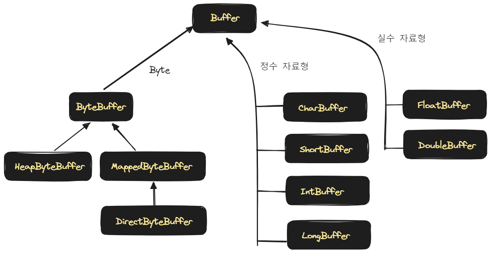
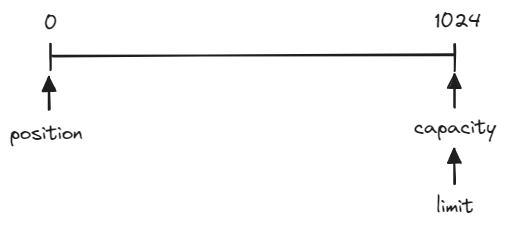
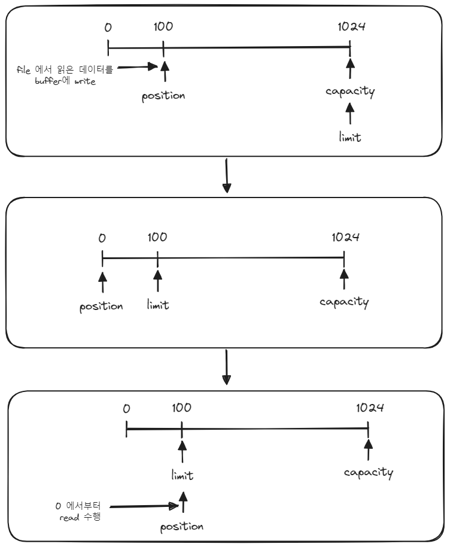
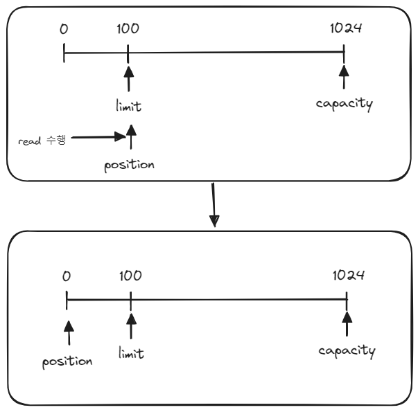
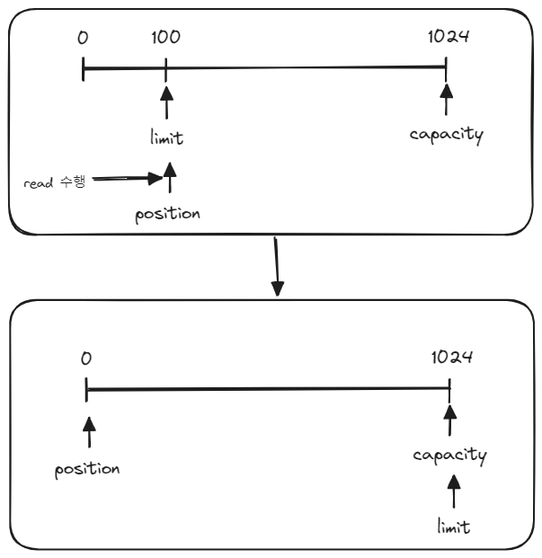
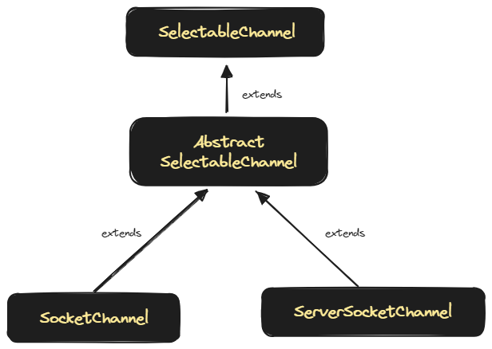

## Java NIO

Java NIO 는 `Java New Input/Output` 을 의미합니다. (Non blocking IO 를 의미하는 것은 아닙니다.)<br/>

Java NIO 는 Java 1.4 에서 처음 도입되었고 파일과 네트워크에 데이터를 읽고 쓸 수 있는 API 를 제공하고 있습니다. 대부분의 I/O에 대해서는 논블로킹 방식의 동기 연산을 지원하지만 Java NIO 역시 File I/O 의 경우는 블로킹 방식의 동기 연산만 지원됩니다.<br/>

Selector, Channel 기반으로 높은 성능을 제공하는데, 톰캣에서도 NIO가 지원되고 Netty 역시 NIO 기반으로 이루어져 있습니다. 다만 톰캣의 경우 스레드 풀 기반으로 커넥션 풀을 관리하는데 스레드를 그대로 가져다 쓰는 것으로 인해 Netty 에 비해 조금은 무거운 컨테이너입니다.<br/>

JAVA IO 는 byte 또는 character 기반의 데이터 단위로 데이터를 처리하지만 Java NIO 는 buffer 단위로 데이터를 처리합니다. Java IO 에서는 흔히 잘 알려져 있는 InputStream, OutputStream 을 이용해서 데이터를 처리하지만 Java NIO 에서는 Channel 단위로 데이터를 처리합니다.<br/>

지금까지의 내용을 정리해보면 아래와 같습니다.<br/>

|                  |                           Java NIO                           |                         Java IO                         |
| ---------------- | :----------------------------------------------------------: | :-----------------------------------------------------: |
| 데이터 처리 방향 |                            양방향                            |                         단방향                          |
| 데이터 처리 방식 |                           Channel                            |                InputStream, OutputStream                |
| 데이터 단위      |                            buffer                            |                     byte, character                     |
| nonblocking?     | File IO를 제외한 모든 IO에 대해 논블로킹방식의 동기연산을 지원 | 모든 IO 연산을 Blocking 방식의 동기연산으로만 수행 가능 |
| etc              |                        Selector 지원                         |                                                         |

<br/>


## Channel, Buffer 의 개념

위에서 살펴봤던 표에서는 `Channel`, `Buffer` 의 개념을 설명해보겠습니다. `Buffer` 는 데이터를 읽거나 쓰기 위해 데이터를 저장하는 용도로 사용합니다. 그리고 이 `Buffer` 에 접근하기 위해서는 `Channel` 의 read(), write() 함수를 사용해서 읽거나 쓰는 행동을 수행합니다.


- read() 함수를 수행할 때에는 사이즈에 맞는 Buffer 를 생성하고 Channel 으l read()  를 사용해서 File 의 내용들을 Buffer 에 기록합니다.
- write() 함수를 수행할 때에는 사이즈에 맞는 Buffer 를 생성하고 Channel 의 write() 를 사용해서 File 에 Buffer 에 있는 내용들을 기록합니다.

<br/>


## Buffer 클래스의 종류



- ByteBuffer : byte 단위로 데이터를 읽고 씁니다. 하위자료형으로는 HeapByteBuffer, MappedByteBuffer, DirectByteBuffer 가 있습니다. 이 Buffer 들에 대해서는 이 문서 내의 `Java NIO의 주요 Buffer들 (커널 접근 가능 여부 등)` 에 정리해두었습니다.
- CharBuffer, ShortBuffer, IntBuffer, LongBuffer
  - 각각 char 단위, short 단위, int 단위, long 단위를 읽을 수 있는 버퍼입니다.
- FloatBuffer, DoubleBuffer : 실수자료형을 취급하는 Buffer 입니다.

<br/>


## Java NIO 의 주요 Buffer들 (커널 접근 가능 여부 등)

### DirectByteBuffer

DirectByteBuffer 는 `off-heap` 메모리에 데이터를 저장합니다. 커널 메모리에서 복사ㅡㄹ 하지 않기에 데이터를 읽고 쓰는 속도가 빠릅니다. 다만 비용이 많이 드는 System Call 을 사용하기에 allocate, deallocate가 느리다는 단점이 있습니다.<br/>

allocateDirect() 함수로 생성가능합니다. 아래는 `DirectByteBuffer` 를 생성하는 예제 코드입니다.

```java
var directByteBuffer = ByteBuffer.allocateDirect(1024);
assert directByteBuffer.isDirect(); 
```

<br/>


### HeapByteBuffer

`HeapByteBuffer` 는 데이터를 JVM Heap 메모리에 저장합니다. byte array 를 래핑하는 Buffer 인데, 커널 메모리에서 복사해서 저장하는 버퍼이기에 복사에 대한 연산으로 인해 커널을 한번 더 IO 가 일어난다는 점에서 읽기 속도가 느리다는 단점이 있습니다. (내부적으로는 임시로 Direct Buffer 를 만드는 연산을 수행하기에 성능이 저하됩니다.)<br/>

GC에 의해 관리되기에 allocate, deallocate 가 빠릅니다.<br/>

allocate() 함수 또는 wrap() 함수로 생성 가능합니다. 아래는 `HeapByteBuffer` 를 생성하는 예제 코드 입니다.

```java
var heapByteBuffer = ByteBuffer.allocate(1024);
assert !heapByteBuffer.isDirect(); 

var byteBufferByWrap = ByteBuffer.wrap("hello".getBytes()); 
assert !byteBufferByWrap.isDirect();
```

<br/>


## Buffer 의 위치 관련 주요 필드

Buffer 에는 위치를 가리키는 주요 속성들이 있는데 이 속성들을 가리키는 메서드를 적절히 사용해야 NIO 소켓 프로그래밍 시에 유용하게 사용이 가능합니다.

- capacity
  - Buffer 가 저장할 수 있는 데이터의 최대 크기를 의미합니다. Buffer 생성시 지정해서 Buffer를 지정된 사이즈로 생성합니다. 한번 생성된 Buffer 사이즈는 변경이 불가합니다.
- position
  - Buffer 에서의 현재 위치를 가리키는 역할을 합니다. 버퍼에서 데이터를 읽거나 쓸때 현재 위치에서부터 시작하게 되고 Buffer 에 1Byte 가 추가될 때마다 1씩 위치 값이 증가합니다.
- limit
  - Buffer 에서 데이터를 읽거나 쓸 수 있는 마지막 위치를 의미합니다. capacity 와 같은 값입니다.
- mark
  - 현재 position 위치를 mark() 로 지정하는 것이 가능합니다. reset()을 호출할 경우에는 position 을 mark 로이동시킵니다.

<br/>


각 위치(오프셋) 또는 사이즈의 범위의 위치 등을 표현해보면 아래와 같습니다.

- `0 <= mark <= position <= limit <= capacity`

<br/>




Buffer 는 생성시에 capacity 를 기준으로 크기가 설정되는데 따라서 capacity 는 초기에 지정한 size 이기에 가장 맨 뒤의 위치를 가리키게 됩니다. limit 은 Buffer 생성 초기에는 capacity 가 가리키는 위치를 함께 가리킵니다. 그리고 데이터를 읽을 때는 처음부터 읽어야 하기 때문에 position 은 0 으로 초기에 세팅됩니다.<br/>

<br/>


## Buffer 의 주요 메서드

### flip()



- flip() 메서드 
  - buffer 의 limit 위치를 현재 position 으로 위치시킵니다. 
  - limit의 위치 변경이 완료되면 position 의 위치를 0으로 변경합니다.
  - buffer 를 쓰기 모드에서 읽기 모드로 전환할 때 사용합니다. 
  - 현재까지 읽던 위치로 limit 의 위치를 변경해서 position 을 0으로 해서 처음부터 limit 까지 읽는 동작을 의미합니다.


### rewind() 메서드



<br/>

- rewind()
  - 데이터를 처음부터 limit 만큼 읽어들일 때 사용하는 함수입니다. 데이터를 처음부터 읽어들이려 하는데 읽어들일 사이즈를 limit으로 지정합니다.
  - buffer 내의 position 을 0 으로 변경하는 이유는 데이터를 처음부터 다시 읽어들이기 위해서입니다.

<br/>


### clear() 메서드



- clear()
  - 버퍼를 초기화 할 때 사용합니다. 버퍼를 초기화하므로 모든 위치(오프셋) 관련 변수들은 기본 값으로 변경해줍니다.
  - buffer 내의 limit 포인터의 위치는 capacity 의 위치로 바꿔주고, position 은 버퍼의 제일 앞 부분인 0 으로 초기화 해줍니다.

<br/>


### Buffer 위치 이동 메서드 연습 예제

<br/>


## Java NIO 사용시 Non Blocking 방식으로 사용하는 방법

SocketChannel, ServerSeocketChannel 이 extends 하고 있는 AbstractSelectableChannel 은 `SelectableChannel` 을 extends 하고 있습니다.<br/>



<br/>


그리고 `SelectableChannel` 은 `configureBlocking(boolean)`, `register()` 함수를 제공하는데 그 중 `configureBlocking(boolean)` 메서드를 이용해 논블로킹을 지정가능합니다.

serverSocketChannel 의 accept(), socketChannel 의 connect() 사용시 위의 configureBlocking(boolean) 을 사용하면 논블로킹으로 네트워크 IO를 할지여부를 지정가능합니다.<br/>


e.g. ServerSocketChannel 의 accept() 메서드를 nonblocking 하게 실행

```java
try (var serverChannel = ServerSocketChannel.open()){
    var address = new InetSocketAddress("localhost", 8080);
    serverChannel.bind(address);
    serverChannel.configureBlocking(false); /// nonblocking 설정 
    
    var clientSocket = serverChannel.accept(); 
    assert clientSocket !== null;
}
```

 <br/>


e.g. SocketChannel 의 connect() 메서드를 nonblocking 하게 실행

```java
try (var socketChannel = SocketChannel.open()){
    var address = new InetSocketAddress("localhost", 8080);
    socketChannel.configureBlocking(false);
    var connected = socketChannel.connect(address);
    assert !connected;
}
```

<br/>


## NIO 기반 간단한 소켓 프로그래밍 예제

<br/>


