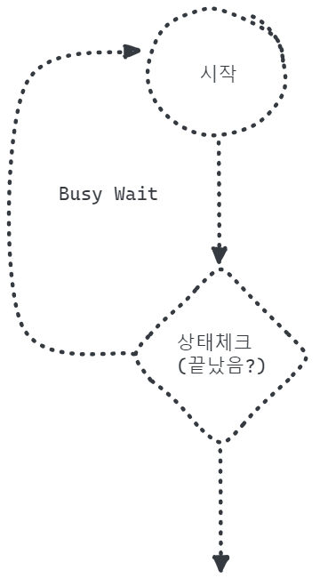
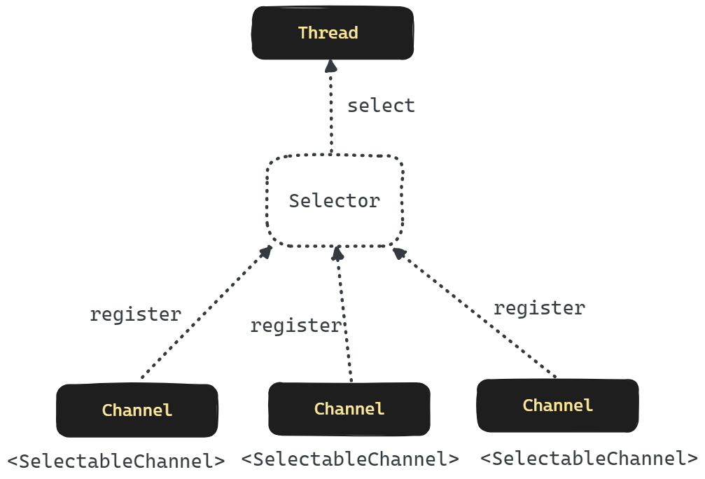

## Java NIO 의 논블로킹 방식 동기연산의 문제점과 해결책, 멀티플렉싱

## Busy Waiting

> [참고 : Busy Waiting이란?](https://nesoy.github.io/articles/2019-06/OS-Busy-Waiting) 

Java NIO 는 논블로킹 방식이지만 동기연산이 필요합니다.  

논블로킹 방식이지만 동기연산을 수행하기 때문에 IO 작업시 특정 루프 내에서 주기적으로 상태를 체크하고 자원관리를 해줘야 한다는 단점이 있습니다.  

이렇게 오랜 시간 동안 대기하면서 상태를 체크하는 것을 Busy Waiting 이라고 흔히 이야기 합니다. Busy Waiting 은 원하는 자원을 얻기 위해 권한을 얻을 수 있을때까지 주기적으로 체크를 수행하는 것을 의미합니다. 자원의 권한을 얻는데 드는 시간이 적거나, Context Switching 에 맡기기에는 가변운 작업일 경우에 Busy Waiting 을 하는 것을 선택합니다. 

이렇게 되면 지속적으로 CPU 를 점유하게 되므로 CPU 자원이 낭비된다는 단점이 있습니다. 그리고 확인하는 주기가 어떻게 되느냐에 따라서 응답 지연 시간 역시 어느 정도 발생하게 됩니다. 또한 코드의 복잡성이 증가합니다. 

Busy Waiting 을 하는 프로그램의 예를 들면 소켓 프로그램을 구현시 main 스레드에서 accept()가 되었는지 주기적으로 확인하는 구문을 작성하는 경우를 예로 들 수 있습니다. 이렇게 되면 채널 상태의 변화에 따라서 수동으로 상태를 체크하거나 특정 상태에 따라서 후 처리를 하는 등의 관리를 해야 하기 때문에 코드의 복잡성이 계속해서 증가하게 됩니다. 따라서 동시에 발생하는 요청이 증가할 경우 성능이 감소할 위험이 있습니다. 

 

## 해결책 : 여러개의 Channel 을 Selector 로 Multiplexing

일반적으로 멀티플렉싱은 하나의 고 수준의 채널에서 저 수준의 채널들을 분류해주고 관리해주는 것을 의미합니다. NIO 에서 I/O Multiplexing 은 여러개의 Channel 을 하나의 Selector 로 관리하는 것을 의미합니다.  

그림에서 보듯 Channel 들은 각각 Selector 에 자기 자신을 등록합니다. 그리고 Selector 는 Thread 를 선택해서 Thread 자원을 관리하고 있습니다. 즉, IO 입력 하나 하나가 Thread 를 가지고 있는 것이 아니라 Selector 에서 Thread 를 관리하면서 Selector 들을 선택하고 체크하는 역할을 수행합니다.  

이렇게 하는 것의 장점은 개별 IO 작업이 BUSY WAITING 으로 인한 자원의 과소비를 Selector 하나만으로 이 작업을 수행하게 함으로써 BUSY WAITING 을 줄였다는 점이 장점입니다. Selector 는 여러개 있을 수 있습니다.  

개별 Channel 이 가각 Thread 를 잡고 있는다거나 CPU를 과도하게 점유하는 것으로 인한 자원의 과소비나 BUSY WAITING 현상이 줄어들기에 Selector 를 활용한 Channel Multiplexing 개념은 Java NIO 의 논블로킹 방식의 동기 연산의 단점인 Busy Waiting 현상을 대폭 줄여주었습니다. 

## 예제 (NIO Socket Programming)

