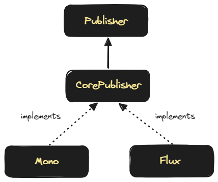

## Reactive Streams 라이브러리들

## Reactive Streams 구현체 라이브러리들

Reactive Streams 를 구현한 구현체 라이브러리들은 Project Reactor, RxJava, Mutiny 가 있습니다.

- Project Reactor
- RxJava
- Mutiny


**Project Reactor**<br/>

Pivotal 사에서 개발한 라이브러리입니다. Spring Reactor 내에 포함되어 있습니다. Mono, Flux 라는 이름의 Publisher 클래스가 있습니다.<br/>


**RxJava**<br/>

Netflix에서 개발한 프레임워크입니다. 닷넷 프레임워크에서 지원되던 Reactive Extensions를 Java 버전으로 포팅한 프레임워크입니다. Flowable, Observable, Single, Maybe, Completable 라는 이름의 퍼블리셔 클래스가 있습니다.<br/>


**Mutiny**<br/>

Hibernate Reactive 에서 비동기 라이브러리로 제공하는 라이브러리입니다. 대표적인 자료형 및 클래스는 Multi, Uni 라고 하는 퍼블리셔 클래스가 있습니다. <br/>


## Project Reactor

Pivotal 사에서 개발한 라이브러리입니다. Spring Reactor 내에 포함되어 있습니다. Mono, Flux 라는 이름의 Publisher 클래스가 있습니다.<br/>

Project Reactor 의 Official Website 는 [projectreactor.io](https://projectreactor.io/)이고

Reference Guide 는 [projectreactor.io - reference](https://projectreactor.io/docs/core/release/reference/) 입니다.



<br/>


### Mono 와 Flux

Mono 는 Optional\<T\> 를 상속받은(extends) 자료형입니다. (`Mono<T> : Optional<T>`)<br/>

값이 없는 경우 또는 하나의 값을 명시적으로 의미하고자 할 때 Mono 를 사용합니다.  흔히 Mono\<Void\> 를 사용하는 경우는 특정 작업이 완료되는 파이프라인이라는 것을 명시적으로 표현하고자 할 때 사용합니다.

<br/>

Flux 는 List\<T\> 를 상속받은(extends) 자료형입니다. (Flux\<T\>: List\<T\>)<br/>

무한한 값을 가리키거나 사이즈가 정해져있는 유한한 여러개의 요소들을 가리킬 때 Flux 를 사용합니다.<br/>


### Flux

참고 : [prjectreactor.io - reference#flux](https://projectreactor.io/docs/core/release/reference/#flux)


Flux 는 0 \~ n 개의 요소들을 전달합니다. 에러가 발생할경우에는 Error 시그널을 전달한 후에 종료를 합니다. 만약 모든 요소를 전달했을 경우에는 Complete 시그널이 전달되면서 종료됩니다. Flux 는 Backpressure 를 지원합니다.<br/>

Flux 를 Mono 로 바꿔야할 때가 있습니다. 아래의 두가지 방식으로 변환이 가능합니다.<br/>

Mono.from(Flux) 를 사용할 경우

- Flux 의 첫번째 요소만 Mono 에 전달됩니다.

Flux.collectList() 를 사용

- Flux.collectList() 를 사용해서 List 로 변환해서 이것을 Mono\<List\<T\>\> 자료형으로 변환한다면 Mono 타입의 List 로 변환이 가능합니다.

<br/>


#### 예제 1) request size 가 큰 Subscriber

한번 subscribe 요청 시에 한번에 request(Integer.MAX\_VALUE) 를 하는 커스텀 Subscriber 를 만들고<br/>

{100, 200, 300, 400, 500} 이라는 숫자열을 담고 있는 Flux 가 <br/>

이 Subscriber 를 subscribe 하는 예제를 만들어봅니다.<br/>

이 예제는 결국 적은 사이즈의 Flux 에 대해 subscribe 할 때 한번에 Integer.MAX_VALUE 만큼을request() 해서 onComlete() 가 발생하게끔 하는 결과를 만들어냅니다.

<br/>


BigRequestSizeSubscriber<br/>

간단한 Subscriber 입니다. 1초에 한개의 요소를 구독(request()) 합니다.

```java
package io.chagchagchag.example.foobar.reactive_streams_libraries.reactor.bigsize_request;

import lombok.RequiredArgsConstructor;
import lombok.SneakyThrows;
import lombok.extern.slf4j.Slf4j;
import org.reactivestreams.Subscriber;
import org.reactivestreams.Subscription;

@Slf4j
@RequiredArgsConstructor
public class BigRequestSizeSubscriber<T> implements Subscriber<T> {
  private final Integer requestSize;

  @Override
  public void onSubscribe(Subscription s) {
    log.info("(subscribe) --- ");
    s.request(requestSize);
    log.info(" >>> subscriber.request({})", requestSize);
  }

  @SneakyThrows
  @Override
  public void onNext(T t) {
    log.info("(next) item : {}", t);
    Thread.sleep(1000);
  }

  @Override
  public void onError(Throwable t) {
    log.error("error : {}", t.getMessage());
  }

  @Override
  public void onComplete() {
    log.info("=== (complete) ===");
  }
}
```

<br/>


FiniteFluxClient<br/>

```java
package io.chagchagchag.example.foobar.reactive_streams_libraries.reactor.bigsize_request;

import java.util.List;
import lombok.extern.slf4j.Slf4j;
import reactor.core.publisher.Flux;

@Slf4j
public class BigRequestSizeSubscribing_FluxClient {
  public static void main(String[] args) {
    log.info("main function started --- ");
    getItems().subscribe(new BigRequestSizeSubscriber<>(Integer.MAX_VALUE));
    log.info("main function end --- ");
  }

  private static Flux<Integer> getItems(){
    return Flux.fromIterable(List.of(100,200,300,400,500));
  }
}

```

<br/>


출력결과

```plain
08:24:50.463 [main] INFO io.chagchagchag.example.foobar.reactive_streams_libraries.reactor.bigsize_request.BigRequestSizeSubscribing_FluxClient -- main function started --- 
08:24:50.749 [main] INFO io.chagchagchag.example.foobar.reactive_streams_libraries.reactor.bigsize_request.BigRequestSizeSubscriber -- (subscribe) --- 
08:24:50.749 [main] INFO io.chagchagchag.example.foobar.reactive_streams_libraries.reactor.bigsize_request.BigRequestSizeSubscriber --  >>> subscriber.request(2147483647)
08:24:50.754 [main] INFO io.chagchagchag.example.foobar.reactive_streams_libraries.reactor.bigsize_request.BigRequestSizeSubscriber -- (next) item : 100
08:24:51.762 [main] INFO io.chagchagchag.example.foobar.reactive_streams_libraries.reactor.bigsize_request.BigRequestSizeSubscriber -- (next) item : 200
08:24:52.774 [main] INFO io.chagchagchag.example.foobar.reactive_streams_libraries.reactor.bigsize_request.BigRequestSizeSubscriber -- (next) item : 300
08:24:53.783 [main] INFO io.chagchagchag.example.foobar.reactive_streams_libraries.reactor.bigsize_request.BigRequestSizeSubscriber -- (next) item : 400
08:24:54.793 [main] INFO io.chagchagchag.example.foobar.reactive_streams_libraries.reactor.bigsize_request.BigRequestSizeSubscriber -- (next) item : 500
08:24:55.808 [main] INFO io.chagchagchag.example.foobar.reactive_streams_libraries.reactor.bigsize_request.BigRequestSizeSubscriber -- === (complete) ===
08:24:55.808 [main] INFO io.chagchagchag.example.foobar.reactive_streams_libraries.reactor.bigsize_request.BigRequestSizeSubscribing_FluxClient -- main function end --- 

Process finished with exit code 0
```

<br/>


#### 예제 2) request size 를 적절하게 지정한 Backpressure  Subscriber 예제 

한번 subscribe 시에 처음에는 request(1) 을 하고 그 다음부터는 onNext() 에서 1초에 1개씩 request(1) 하는 커스텀 Subscriber 를 만들고<br/>

{100, 200, 300, 400, 500} 이라는 숫자열을 담고 있는 Flux 가 <br/>

이 Subscriber 를 subscribe 하는 예제를 만들어봅니다.<br/>

이 예제는 결국 처음 subscribe 시에는 request(1) 을 해서 그 이후부터는 onNext 에서 200,300,400,500 를 차례로 request 하면서 마지막에 도달 시 onComlete() 가 발생하게끔 하는 결과를 만들어냅니다.<br/>

<br/>


SmallSizeBackpressureSubscriber.java

```java
package io.chagchagchag.example.foobar.reactive_streams_libraries.reactor.smallsize_request_backpressure;

import lombok.SneakyThrows;
import lombok.extern.slf4j.Slf4j;
import org.reactivestreams.Subscriber;
import org.reactivestreams.Subscription;

@Slf4j
public class SmallSizeBackpressureSubscriber<T> implements Subscriber<T> {
  private final Integer requestSize = 1;
  private Subscription subscription;

  @Override
  public void onSubscribe(Subscription s) {
    this.subscription = s;
    log.info("(subscribe) --- ");
    s.request(requestSize);
    log.info(" >>> subscriber.request({})", requestSize);
  }

  @SneakyThrows
  @Override
  public void onNext(T t) {
    log.info("(next) item : {}", t);
    Thread.sleep(1000);
    // BigRequestSizeSubscriber 예제에서는 onNext() 내부에서 아래와 같이 request 를 하지 않았다는 점과 비교해보셔야 합니다.
    subscription.request(requestSize);
    log.info("requestSize : {}", requestSize);
  }

  @Override
  public void onError(Throwable t) {
    log.error("error : {}", t.getMessage());
  }

  @Override
  public void onComplete() {
    log.info("=== (complete) ===");
  }
}
```

<br/>

SmallSizeBackpressureSubscribing_FluxClient.java

```
package io.chagchagchag.example.foobar.reactive_streams_libraries.reactor.smallsize_request_backpressure;

import java.util.List;
import reactor.core.publisher.Flux;

public class SmallSizeBackpressureSubscribing_FluxClient {

  public static void main(String[] args) {
    getItems().subscribe(
        new SmallSizeBackpressureSubscriber<>()
    );
  }

  public static Flux<Integer> getItems(){
    return Flux.fromIterable(List.of(1,2,3,4,5));
  }
}
```

<br/>

출력결과

```palin
08:56:18.125 [main] INFO io.chagchagchag.example.foobar.reactive_streams_libraries.reactor.smallsize_request_backpressure.SmallSizeBackpressureSubscriber -- (subscribe) --- 
08:56:18.132 [main] INFO io.chagchagchag.example.foobar.reactive_streams_libraries.reactor.smallsize_request_backpressure.SmallSizeBackpressureSubscriber --  >>> subscriber.request(1)
08:56:18.138 [main] INFO io.chagchagchag.example.foobar.reactive_streams_libraries.reactor.smallsize_request_backpressure.SmallSizeBackpressureSubscriber -- (next) item : 1
08:56:19.150 [main] INFO io.chagchagchag.example.foobar.reactive_streams_libraries.reactor.smallsize_request_backpressure.SmallSizeBackpressureSubscriber -- requestSize : 1
08:56:19.150 [main] INFO io.chagchagchag.example.foobar.reactive_streams_libraries.reactor.smallsize_request_backpressure.SmallSizeBackpressureSubscriber -- (next) item : 2
08:56:20.167 [main] INFO io.chagchagchag.example.foobar.reactive_streams_libraries.reactor.smallsize_request_backpressure.SmallSizeBackpressureSubscriber -- requestSize : 1
08:56:20.168 [main] INFO io.chagchagchag.example.foobar.reactive_streams_libraries.reactor.smallsize_request_backpressure.SmallSizeBackpressureSubscriber -- (next) item : 3
08:56:21.174 [main] INFO io.chagchagchag.example.foobar.reactive_streams_libraries.reactor.smallsize_request_backpressure.SmallSizeBackpressureSubscriber -- requestSize : 1
08:56:21.174 [main] INFO io.chagchagchag.example.foobar.reactive_streams_libraries.reactor.smallsize_request_backpressure.SmallSizeBackpressureSubscriber -- (next) item : 4
08:56:22.175 [main] INFO io.chagchagchag.example.foobar.reactive_streams_libraries.reactor.smallsize_request_backpressure.SmallSizeBackpressureSubscriber -- requestSize : 1
08:56:22.175 [main] INFO io.chagchagchag.example.foobar.reactive_streams_libraries.reactor.smallsize_request_backpressure.SmallSizeBackpressureSubscriber -- (next) item : 5
08:56:23.185 [main] INFO io.chagchagchag.example.foobar.reactive_streams_libraries.reactor.smallsize_request_backpressure.SmallSizeBackpressureSubscriber -- requestSize : 1
08:56:23.188 [main] INFO io.chagchagchag.example.foobar.reactive_streams_libraries.reactor.smallsize_request_backpressure.SmallSizeBackpressureSubscriber -- === (complete) ===

Process finished with exit code 0
```

<br/>


#### 예제 3) error 발생하면 곧바로 중지

onComplete() 호출이 되지 않고 바로 중지되는 것을 확인 가능합니다.

FluxErrorClient1.java

```java
package io.chagchagchag.example.foobar.reactive_streams_libraries.reactor.error;

import io.chagchagchag.example.foobar.reactive_streams_libraries.reactor.SimpleSubscriber;
import lombok.extern.slf4j.Slf4j;
import reactor.core.publisher.Flux;

@Slf4j
public class FluxErrorClient1 {
  public static void main(String[] args) {
    log.info("main function started");
    getItems()
        .subscribe(
            new SimpleSubscriber<>(Integer.MAX_VALUE)
        );
    log.info("main function end");
  }

  public static Flux<Integer> getItems(){
    return Flux.create(fluxSink -> {
      fluxSink.next(0);
      fluxSink.next(1);
      var error = new IllegalStateException("Error 발생");
      fluxSink.error(error);
    });
  }
}
```

<br/>

출력결과

```plain
09:33:15.405 [main] INFO io.chagchagchag.example.foobar.reactive_streams_libraries.reactor.error.FluxErrorClient1 -- main function started
09:33:15.519 [main] INFO io.chagchagchag.example.foobar.reactive_streams_libraries.reactor.SimpleSubscriber -- (subscribe) --- 
09:33:15.519 [main] INFO io.chagchagchag.example.foobar.reactive_streams_libraries.reactor.SimpleSubscriber --  >>> subscriber.request(2147483647)
09:33:15.523 [main] INFO io.chagchagchag.example.foobar.reactive_streams_libraries.reactor.SimpleSubscriber -- (next) item : 0
09:33:16.529 [main] INFO io.chagchagchag.example.foobar.reactive_streams_libraries.reactor.SimpleSubscriber -- (next) item : 1
09:33:17.547 [main] ERROR io.chagchagchag.example.foobar.reactive_streams_libraries.reactor.SimpleSubscriber -- error : Error 발생
09:33:17.547 [main] INFO io.chagchagchag.example.foobar.reactive_streams_libraries.reactor.error.FluxErrorClient1 -- main function end
```

<br/>

SimpleSubscriber.java

```java
package io.chagchagchag.example.foobar.reactive_streams_libraries.reactor;

import lombok.RequiredArgsConstructor;
import lombok.SneakyThrows;
import lombok.extern.slf4j.Slf4j;
import org.reactivestreams.Subscriber;
import org.reactivestreams.Subscription;

@Slf4j
@RequiredArgsConstructor
public class SimpleSubscriber<T> implements Subscriber<T> {
  private final Integer requestSize;
  @Override
  public void onSubscribe(Subscription s) {
    log.info("(subscribe) --- ");
    s.request(requestSize);
    log.info(" >>> subscriber.request({})", requestSize);
  }

  @SneakyThrows
  @Override
  public void onNext(T t) {
    log.info("(next) item : {}", t);
    Thread.sleep(1000);
  }

  @Override
  public void onError(Throwable t) {
    log.error("error : {}", t.getMessage());
  }

  @Override
  public void onComplete() {
    log.info("=== (complete) ===");
  }
}
```

<br/>


#### 예제 4) complete - complete 시그널 발생시 종료

```java
package io.chagchagchag.example.foobar.reactive_streams_libraries.reactor.complete;

import io.chagchagchag.example.foobar.reactive_streams_libraries.reactor.SimpleSubscriber;
import lombok.extern.slf4j.Slf4j;
import reactor.core.publisher.Flux;

@Slf4j
public class FluxCompleteClient {
  public static void main(String[] args) {
    log.info("main function started");
    getItems()
        .subscribe(
            new SimpleSubscriber<>(Integer.MAX_VALUE)
        );
    log.info("main function end");
  }

  public static Flux<Integer> getItems(){
    return Flux.create(fluxSink -> {
      fluxSink.complete();
    });
  }
}
```


출력결과

```plain
09:39:21.752 [main] INFO io.chagchagchag.example.foobar.reactive_streams_libraries.reactor.complete.FluxCompleteClient -- main function started
09:39:21.845 [main] INFO io.chagchagchag.example.foobar.reactive_streams_libraries.reactor.SimpleSubscriber -- (subscribe) --- 
09:39:21.846 [main] INFO io.chagchagchag.example.foobar.reactive_streams_libraries.reactor.SimpleSubscriber --  >>> subscriber.request(2147483647)
09:39:21.851 [main] INFO io.chagchagchag.example.foobar.reactive_streams_libraries.reactor.SimpleSubscriber -- === (complete) ===
09:39:21.851 [main] INFO io.chagchagchag.example.foobar.reactive_streams_libraries.reactor.complete.FluxCompleteClient -- main function end
```

<br/>


SimpleSubscriber.java

```java
package io.chagchagchag.example.foobar.reactive_streams_libraries.reactor;

import lombok.RequiredArgsConstructor;
import lombok.SneakyThrows;
import lombok.extern.slf4j.Slf4j;
import org.reactivestreams.Subscriber;
import org.reactivestreams.Subscription;

@Slf4j
@RequiredArgsConstructor
public class SimpleSubscriber<T> implements Subscriber<T> {
  private final Integer requestSize;
  @Override
  public void onSubscribe(Subscription s) {
    log.info("(subscribe) --- ");
    s.request(requestSize);
    log.info(" >>> subscriber.request({})", requestSize);
  }

  @SneakyThrows
  @Override
  public void onNext(T t) {
    log.info("(next) item : {}", t);
    Thread.sleep(1000);
  }

  @Override
  public void onError(Throwable t) {
    log.error("error : {}", t.getMessage());
  }

  @Override
  public void onComplete() {
    log.info("=== (complete) ===");
  }
}
```


#### 예제 5) Flux → Mono  (Mono.from(Flux))

Mono.from(Flux) 를 사용할 경우

- Flux 의 첫번째 요소만 Mono 에 전달됩니다.


예제

```java
package io.chagchagchag.example.foobar.reactive_streams_libraries.reactor.flux_to_mono;

import io.chagchagchag.example.foobar.reactive_streams_libraries.reactor.SimpleSubscriber;
import java.util.List;
import lombok.extern.slf4j.Slf4j;
import reactor.core.publisher.Flux;
import reactor.core.publisher.Mono;

@Slf4j
public class FluxToMonoClient_MonoFrom {
  public static void main(String[] args) {
    log.info("main function started");
    Mono
        .from(getItems())
        .subscribe(
            new SimpleSubscriber<>(Integer.MAX_VALUE)
        );
    log.info("main function end");
  }

  public static Flux<Integer> getItems(){
    return Flux.fromIterable(List.of(1,2,3,4,5));
  }
}

```

<br/>


#### 예제 6) Flux → Mono (Mono.from(Flux.collectList()))

Flux.collectList() 를 사용

- Flux.collectList() 를 사용해서 List 로 변환해서 이것을 Mono\<List\<T\>\> 자료형으로 변환한다면 Mono 타입의 List 로 변환이 가능합니다.

```java
package io.chagchagchag.example.foobar.reactive_streams_libraries.reactor.flux_to_mono;

import io.chagchagchag.example.foobar.reactive_streams_libraries.reactor.SimpleSubscriber;
import java.util.List;
import lombok.extern.slf4j.Slf4j;
import reactor.core.publisher.Flux;
import reactor.core.publisher.Mono;

@Slf4j
public class FluxToMonoClient_Flux_collectList {
  public static void main(String[] args) {
    log.info("main function started");
    Mono
        .from(getItems().collectList())
        .subscribe(new SimpleSubscriber<>(Integer.MAX_VALUE));
    log.info("main function end");
  }

  public static Flux<Integer> getItems(){
    return Flux.fromIterable(List.of(1,2,3,4,5));
  }
}
```

<br/>


### Mono

참고 : [prjectreactor.io - reference#mono](https://projectreactor.io/docs/core/release/reference/#mono)


Mono 는 0개 또는 1개의 요소를 전달합니다. 에러가 발생할 경우 Error 시그널을 전달한 후에 종료를 합니다. 만약 모든 요소를 전달했을 경우에는 Complete 시그널이 전달되면서 종료됩니다.<br/>

Mono 를 Flux 로 바꿔야 할 때가 있습니다. 이 경우 아래의 두 가지 방식으로 변환 가능합니다.<br/>

Mono::flux() 함수를 사용할 경우

- Mono\<List\<T\>\> 타입일 경우 이것을 flux() 함수를 이용해서 Flux\<List\<T\>\> 로 변환 가능합니다.
- e.g. `getListItems().flux().subscribe(...)`

Mono::flatMapMany() 함수를 사용할 경우 

- Mono\<List\<T\>\> 타입일 경우 이것을 flatMapMany() 를 사용해서 Flux\<T\> 로 풀어서 사용가능합니다.
- e.g. `getListItems().flatMapMany(v -> Flux.fromIterable(v)).subscribe(...)`

<br/>


#### 예제 1) Subscriber 

Mono 는 1개의 item만 전달하므로 next() 가 한번만 실행되면 바로 complete 가 호출되는 것이 보장됩니다.  그리고 값을 전달하지 않고도 complete 를 할 경우 값이 없다는 것을 의미합니다.<br/>

```java
package io.chagchagchag.example.foobar.reactive_streams_libraries.reactor.mono;

import io.chagchagchag.example.foobar.reactive_streams_libraries.reactor.SimpleSubscriber;
import lombok.SneakyThrows;
import lombok.extern.slf4j.Slf4j;
import reactor.core.publisher.Mono;

@Slf4j
public class SimpleMonoClient {
  @SneakyThrows
  public static void main(String[] args) {
    log.info("main function started");
    getITems().subscribe(
        new SimpleSubscriber<>(Integer.MAX_VALUE)
    );
    log.info("main function end");
  }

  public static Mono<Integer> getITems(){
    return Mono.create(monoSink -> {
      monoSink.success(1);
    });
  }
}
```

<br/>


SimpleSubscriber.java

```java
package io.chagchagchag.example.foobar.reactive_streams_libraries.reactor;

import lombok.RequiredArgsConstructor;
import lombok.SneakyThrows;
import lombok.extern.slf4j.Slf4j;
import org.reactivestreams.Subscriber;
import org.reactivestreams.Subscription;

@Slf4j
@RequiredArgsConstructor
public class SimpleSubscriber<T> implements Subscriber<T> {
  private final Integer requestSize;
  @Override
  public void onSubscribe(Subscription s) {
    log.info("(subscribe) --- ");
    s.request(requestSize);
    log.info(" >>> subscriber.request({})", requestSize);
  }

  @SneakyThrows
  @Override
  public void onNext(T t) {
    log.info("(next) item : {}", t);
    Thread.sleep(1000);
  }

  @Override
  public void onError(Throwable t) {
    log.error("error : {}", t.getMessage());
  }

  @Override
  public void onComplete() {
    log.info("=== (complete) ===");
  }
}
```

<br/>


출력결과

```plain
10:40:03.253 [main] INFO io.chagchagchag.example.foobar.reactive_streams_libraries.reactor.mono.SimpleMonoClient -- main function started
10:40:03.355 [main] INFO io.chagchagchag.example.foobar.reactive_streams_libraries.reactor.SimpleSubscriber -- (subscribe) --- 
10:40:03.356 [main] INFO io.chagchagchag.example.foobar.reactive_streams_libraries.reactor.SimpleSubscriber --  >>> subscriber.request(2147483647)
10:40:03.360 [main] INFO io.chagchagchag.example.foobar.reactive_streams_libraries.reactor.SimpleSubscriber -- (next) item : 1
10:40:04.386 [main] INFO io.chagchagchag.example.foobar.reactive_streams_libraries.reactor.SimpleSubscriber -- === (complete) ===
10:40:04.387 [main] INFO io.chagchagchag.example.foobar.reactive_streams_libraries.reactor.mono.SimpleMonoClient -- main function end

Process finished with exit code 0
```

<br/>


#### 예제 2) Mono → Flux (flux())

```java
package io.chagchagchag.example.foobar.reactive_streams_libraries.reactor.mono_to_flux;

import io.chagchagchag.example.foobar.reactive_streams_libraries.reactor.SimpleSubscriber;
import java.util.List;
import lombok.extern.slf4j.Slf4j;
import reactor.core.publisher.Flux;
import reactor.core.publisher.Mono;

@Slf4j
public class MonoToFluxClient_flux {
  public static void main(String[] args) {
    log.info("main function started");

    getItems()
        .flux()
        .subscribe(new SimpleSubscriber<>(Integer.MAX_VALUE));

    log.info("main function end");
  }

  public static Mono<List<Integer>> getItems(){
    return Mono.just(List.of(1,2,3,4,5));
  }
}
```

<br/>


출력결과

```plain
10:36:36.575 [main] INFO io.chagchagchag.example.foobar.reactive_streams_libraries.reactor.mono_to_flux.MonoToFluxClient_flux -- main function started
10:36:36.685 [main] INFO io.chagchagchag.example.foobar.reactive_streams_libraries.reactor.SimpleSubscriber -- (subscribe) --- 
10:36:36.685 [main] INFO io.chagchagchag.example.foobar.reactive_streams_libraries.reactor.SimpleSubscriber --  >>> subscriber.request(2147483647)
10:36:36.687 [main] INFO io.chagchagchag.example.foobar.reactive_streams_libraries.reactor.SimpleSubscriber -- (next) item : [1, 2, 3, 4, 5]
10:36:37.691 [main] INFO io.chagchagchag.example.foobar.reactive_streams_libraries.reactor.SimpleSubscriber -- === (complete) ===
10:36:37.691 [main] INFO io.chagchagchag.example.foobar.reactive_streams_libraries.reactor.mono_to_flux.MonoToFluxClient_flux -- main function end

Process finished with exit code 0
```

<br/>


#### 예제 3) Mono → Flux (flatMapMany())

```java
package io.chagchagchag.example.foobar.reactive_streams_libraries.reactor.mono_to_flux;

import io.chagchagchag.example.foobar.reactive_streams_libraries.reactor.SimpleSubscriber;
import java.util.List;
import lombok.extern.slf4j.Slf4j;
import reactor.core.publisher.Flux;
import reactor.core.publisher.Mono;

@Slf4j
public class MonoToFluxClient_flatMapMany {
  public static void main(String[] args) {
    log.info("main function started");

    getItems()
        .flatMapMany(
            list -> Flux.fromIterable(list)
        )
        .subscribe(
            new SimpleSubscriber<>(Integer.MAX_VALUE)
        );

    log.info("main function end");
  }

  public static Mono<List<Integer>> getItems(){
    return Mono.just(List.of(1,2,3,4,5));
  }
}
```

<br/>


출력결과

```plain
10:37:03.180 [main] INFO io.chagchagchag.example.foobar.reactive_streams_libraries.reactor.mono_to_flux.MonoToFluxClient_flatMapMany -- main function started
10:37:03.297 [main] INFO io.chagchagchag.example.foobar.reactive_streams_libraries.reactor.SimpleSubscriber -- (subscribe) --- 
10:37:03.298 [main] INFO io.chagchagchag.example.foobar.reactive_streams_libraries.reactor.SimpleSubscriber --  >>> subscriber.request(2147483647)
10:37:03.299 [main] INFO io.chagchagchag.example.foobar.reactive_streams_libraries.reactor.SimpleSubscriber -- (next) item : 1
10:37:04.302 [main] INFO io.chagchagchag.example.foobar.reactive_streams_libraries.reactor.SimpleSubscriber -- (next) item : 2
10:37:05.316 [main] INFO io.chagchagchag.example.foobar.reactive_streams_libraries.reactor.SimpleSubscriber -- (next) item : 3
10:37:06.320 [main] INFO io.chagchagchag.example.foobar.reactive_streams_libraries.reactor.SimpleSubscriber -- (next) item : 4
10:37:07.320 [main] INFO io.chagchagchag.example.foobar.reactive_streams_libraries.reactor.SimpleSubscriber -- (next) item : 5
10:37:08.335 [main] INFO io.chagchagchag.example.foobar.reactive_streams_libraries.reactor.SimpleSubscriber -- === (complete) ===
10:37:08.335 [main] INFO io.chagchagchag.example.foobar.reactive_streams_libraries.reactor.mono_to_flux.MonoToFluxClient_flatMapMany -- main function end

Process finished with exit code 0
```

<br/>


## RxJava

Netflix에서 개발한 프레임워크입니다. 닷넷 프레임워크에서 지원되던 Reactive Extensions를 Java 버전으로 포팅한 프레임워크입니다. Flowable, Observable, Single, Maybe, Completable 라는 이름의 퍼블리셔 클래스가 있습니다.<br/>


### Flowable

### Observable

### Single

### Maybe

### Completable


## Mutiny

Hibernate Reactive 에서 비동기 라이브러리로 제공하는 라이브러리입니다. 대표적인 자료형 및 클래스는 Multi, Uni 라고 하는 퍼블리셔 클래스가 있습니다. <br/>


### Multi

### Uni

