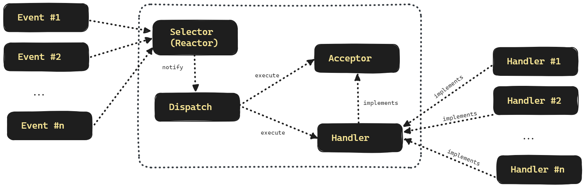

## Reactor Pattern

Reactor Pattern 을 적용하기 전, 이전에 살펴본 nio 채팅 코드는 아래와 같았습니다.

```java
// ...

  if(key.isAcceptable()){ // ACCEPT 이벤트일 경우
    // (1)
    // accept 를 통해 ClientSocket 획득
    var clientSocket = ((ServerSocketChannel) key.channel()).accept();
    // clientSocket 을 non-blocking 으로 설정
    clientSocket.configureBlocking(false);
    // clientSocket 을 selector 에 등록
    clientSocket.register(selector, SelectionKey.OP_READ);
  }
  if(key.isReadable()){ // READ 이벤트 일 때
    // clientSocket 을 얻어옴
    var clientSocket = (SocketChannel) key.channel();

    var requestBuffer = ByteBuffer.allocate(1024);
    // (2)
    clientSocket.read(requestBuffer); // clientSocket 으로부터 데이터 Read
    requestBuffer.flip();

    var received = new String(requestBuffer.array()).trim();
    log.info("client received = {}", received);

    var send = "답장보냅니다.";
    var responseBuffer = ByteBuffer.wrap(send.getBytes());
    clientSocket.write(responseBuffer);
    responseBuffer.clear();
    clientSocket.close();
  }

// ...
```

(1), (2) 로 표시한 부분에서는 accept, read 를 함수 호출로 처리하고 있습니다. 이렇게 함수를 그대로 작성해서 하는 것 보다는 조금은 확장성이 가능하도록 하는 코드를 작성해야 할 것 같습니다. 이번 문서에서는 이런 Plain 한 통신 로직을 Reactor Pattern 으로 바꾸면 어떻게 되는지를 확인해봅니다. Reactor 패턴은 이벤트를 감지하고 분류하는 Reactor 와 이벤트를 처리하는 Handler 로 이뤄져 있습니다.<br/>


## Reactor Pattern 이란?

Reactor 패턴은 동시에 들어오는 요청들을 처리하기 위해 만들어진 이벤트 핸들링 패턴입니다. Reactor 패턴에는 Reactor, Handler 라고 하는 대표적인 두 요소가 있습니다.

- Reactor : 별도의 스레드에서 실행합니다. 여러 요청의 WRITE, ACCEPT, READ 이벤트를 한 곳에 등록한 후 관찰합니다. 그리고 준비완료된 이벤트가 있을 경우 해당 이벤트를 request handler 에 전달합니다.
- Handler : Reactor 로부터 이벤트를 받아서 처리합니다. 이 Handler 는 들어오는 요청들을 demultiplexing (다중화 된 것을 풀어서 원하는 주소를 찾는 방식)을 해서 요청에 맞는 Request Handler 에 동기적으로 전달합니다. 

이렇게 이벤트의 처리를 핸들러가 처리하게끔 하는 방식은 Selector 를 이용한 Java NIO 처리와 유사한 모습이 있습니다. 조금 더 자세히 살펴보면 아래와 같은 구조로 처리를 수행합니다.<br/>



<br/>

위 그림에서 ACCEPT 이벤트를 처리하는 Handler, READ 이벤트를 처리하는 Handler 가 각각 존재합니다. 각각을 설명해보면 아래와 같습니다.

Acceptor

- EventHandler 구현체의 일부입니다. Acceptor 는 ACCEPT 이벤트에만 집중합니다.<br/>

Acceptor 외의 Handler  (그림에서는 오른쪽 Handler)

- 위 그림에서는 `Handler #1`, `Handler #2`, ... `Handler #n` 이 Handler 입니다.
- READ 이벤트에 집중해서 처리를 합니다.

<br/>


## Reactor 구현

Reactor 는 별도의 스레드에서 동작해야 합니다. 주로 Runnable 기반의 람다를 별도의 ExecutorService 에서 실행하는 경우가 많습니다.<br/>

그리고 Selector 를 이용해서 요청들을 받으면서 요청이 어떤 이벤트인지 분류하고 이벤트들을 등록하고, 감시합니다. <br/>

그리고 이벤트의 준비가 되면 Dispatch 를 합니다. EventHandler 객체를 생성하고 call 을 합니다.<br/>

<br/>


## Event Handler 구현

Reactor 로부터 이벤트를 받아서 처리합니다. Read 이벤트, Accept 이벤트에 따라 EventHandler를 각각 따로 EventHandler 를 만듭니다. 그리고 EventHandler 의 처리는 Reactor 에 영향을 주어서는 안되기에 EventHandler 의 처리는 별도의 스레드에서 실행합니다.<br/>

<br/>


## 예제


