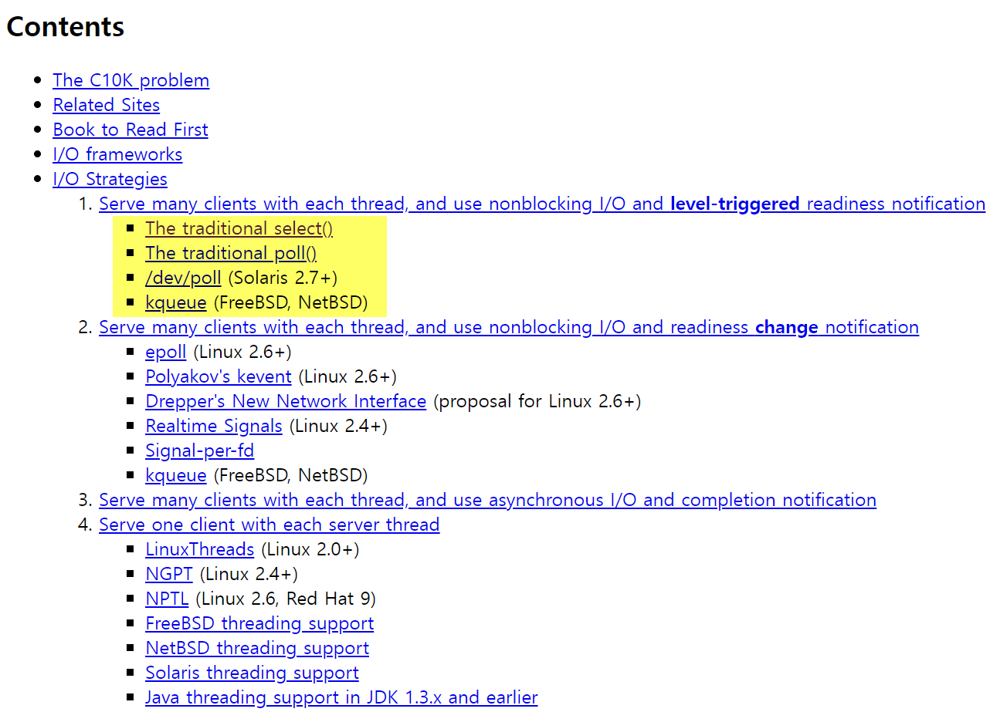

## epoll 이란?

## 참고자료
- [C10K Problem](http://www.kegel.com/c10k.html)
- [고전 돌아보기, C10K 문제 (C10K Problem)](https://oliveyoung.tech/blog/2023-10-02/c10-problem/)
- [about C10K problem](https://manhyuk.github.io/c10k-problem/)
- [쉽게 정리한 네트워크 | Apache와 Nginx의 요청 응답 구조](https://niklasjang.tistory.com/56)
- [쉽게 정리한 네트워크 | Apache와 Nginx의 요청 응답 구조](https://niklasjang.tistory.com/56)
- [How Many Threads Is Too Many?](https://www.baeldung.com/cs/servers-threads-number)
 

## C10K Problem (Client 10K)
epoll 을 알아보기 전에 [C10K Problem](http://www.kegel.com/c10k.html)이 어떤 이야기인지 알아야 합니다. 
1만개의 클라이언트가 요청을 하는 상황에 대한 문제를 의미하는 [C10K Problem](http://www.kegel.com/c10k.html)은 굉장히 잘 알려진 고전적인 주제입니다. [C10K Problem](http://www.kegel.com/c10k.html) 은 1999년 Dan Kegel 이라는 개발자가 제기한 문제입니다. 

이것과 관련해서 읽어볼만한 자료들은 아래와 같습니다.

- [C10K Problem](http://www.kegel.com/c10k.html)
- [고전 돌아보기, C10K 문제 (C10K Problem)](https://oliveyoung.tech/blog/2023-10-02/c10-problem/)
- [about C10K problem](https://manhyuk.github.io/c10k-problem/)
- [쉽게 정리한 네트워크 | Apache와 Nginx의 요청 응답 구조](https://niklasjang.tistory.com/56)

 

1초에 10000개의 클라이언트의 요청이 오는 것을 처리하려 할 때 흔히 처음에는 아래와 같은 생각을 할수도 있습니다.

- thread 를 이용해서 스레드를 request 마다 1개씩 할당한다.

 

흔히 이 문제를 설명할 때 Apache 와 Nginx 의 차이점을 들어서 설명합니다. 

> 참고 : [쉽게 정리한 네트워크 | Apache와 Nginx의 요청 응답 구조](https://niklasjang.tistory.com/56)

Apache 는 멀티 프로세스 + 멀티 스레드 방식을 사용합니다. 사용자의 요청에 대해 Process/Thread 를 생성하는 방식으로 대응합니다. 항상 여유로운 프로세스/스레드를 생성합니다. 미리 설정해둔 유휴(Idle) 프로세스의 수에 따라 넘어가면 kill 하고, 유휴 스레드가 적으면 kill 을 하는 방식으로 스레드를 관리합니다. Apache 는 일반적으로 요청 하나에 스레드 하나가 대응되도록 구성되어 있습니다. 하나의 프로세스가 관리할 수 있는 스레드의 수는 한정되어 있는데, 따라서 사용자의 접속이 증가하면 프로세스를 새로 fork 합니다. Apache 는 fork 를 할 때마다 CPU와 메모리 사용량이 증가한다는 단점이 있습니다. 

Nginx 는 멀티 프로세스 + 싱글 스레드 방식을 사용합니다. low memory usage, high concurrency 를 지원하기 위해 async event driven 방식을 채택하고 있고 싱글스레드에서 요청에 응답을 합니다. Nginx 는 master process 가 다수의 worker process 를 관리합니다. master process 는 worker process 를 관리하는 일만을 담당하고 worker process 에서 사용자의 응답에 대응합니다. 각각의 worker 는 초당 수천개의 동시접속, 요청을 처리 가능합니다.

Apache, Nginx 의 동시 접속자가 늘어날 때 RPS (Request Per Second) 의 변화 추이는 아래 그림과 같습니다. RPS 는 1초에 처리 가능한 Request 의 개수라고 이해하시면 됩니다. 대표적인 웹 서버인 Apache 와 Nginx 에서의 RPS 처리 성능을 비교한 그래프를 보면 Apache Httpd 의 경우 성능이 급속도로 떨어지는 것을 확인 가능합니다.

 

## 10K 의 스레드 실행시 생길수 있는 문제들

첫번째로 메모리 문제가 발생합니다. thread 각각은 메모리 스택을 가집니다. PCB 보다는 작지만 64Bit JVM 의 경우 1개의 스레드에 대해 1024KByte(1MB)를 사용한다고 합니다. 1만명일 경우 10000MB = 10GB 가 필요하다는 계산에 이르게 됩니다. 

두번째로 스레드가 많을 경우 Context Switching 시에 경합(Racing Condition)이 발생합니다. 각각의 Thread 가 사용할 CPU 시간을 할당받기 위해 서로 경쟁을 하게 됩니다. 소켓 프로그래밍의 각 커넥션을 10K 의 스레드로 동작할 경우 10K 스레드 각각이 accept(), listen() 동작 등으로 인한 polling 을 하기 위한 경쟁이 발생합니다. 즉 Busy Wait 증상이 나타나기 시작합니다. 채팅창에 텍스트를 입력하지 않더라도 accept(), listen() 을 위한 무한 polling 을 10K의 스레드에서 수행중이기에 10K의 스레드 각각이 서로 CPU 자원을 차지하기 위해 싸우게 됩니다. 

 

[How Many Threads Is Too Many?](https://www.baeldung.com/cs/servers-threads-number) 에서는 아래의 그림으로 위 현상으로 인한 결과를 이야기합니다.

 

## 가능한 해결책 : select, poll, epoll, kqueue, iocp 를 이용한 다중화(멀티플렉싱)

[C10K Problem](http://www.kegel.com/c10k.html) 에서는 아래와 같이 select(), poll(), kqueue 등의 방법을 제안하고 있습니다. 1990 년도의 linux 에서는 epoll 이 없었기에 BSD OS기반의 서버에서 kqueue 를 사용하거나 select, poll 을 사용하는 것이 주요 방법이었습니다.

 

### select, poll

위 문서에서 보듯 1990년대에 10K 문제는 select, poll 을 통해서 해결했습니다. select, poll 을 쉽게 설명하면 IO 를 멀티플렉싱(다중화)하고 통지하고, 감시할 수 있도록 해주는 기술이라고 생각하면 됩니다. 

select 함수는 아래의 특징을 갖습니다.

- 다중 소켓 관리 : 여러 개의 소켓, 파일 디스크립터를 한번에 감시할 수 있습니다.
- 이벤트 기반(Event Driven) : 특정 소켓에서 이벤트가 발생했을 때 알림을 받아 처리할 수 있습니다. 이렇게 함으로써 블로킹 되지 않고 다른 작업을 수행하다가 필요한 소켓에서 이벤트가 발생했을 때에 처리를 할 수 있습니다.
- 비동기(Asynchronous) : 비동기적으로 동작하여, 입출력이 준비되지 않아도 다른 작업을 처리 가능합니다.

 

1990년대 네트워크 IO 모델은 select(), poll() 이 전부였습니다. select 는 파일디스크립터를 사용하기 때문에 클라이언트 1024개만 처리가 가능합니다. poll() 의 경우 제한이 없습니다. 두 모델 모두 이벤트 발생시 어떤 소켓에서 처리해야 할지 알수 없기에 소켓들을 모두 하나씩 체크합니다. 일일이 소켓들을 하나씩 체크하기에 O(n)의 시간이 소요되는데, 이벤트가 발생할 때마다 소켓을 검색하기 위해 O(n)의 시간이 소요됩니다.  

참고) 파일디스크립터

- 유닉스 계열의 OS 에서는 일반적인 파일, 네트워크 소켓, 파이프, 블록 디바이스, 캐릭터 디바이스 등의 모든 객체를 파일로 관리합니다.
- 열려있는 파일에 접근할 때 fd 를 이용해서 파일을 지정하는데, fd 는 음이 아닌 정수이며, file descriptor table의 index로 사용됩니다. 

 

파일디스크립터의 수가 클 수록 그 수에 도달하기까지 for 문을 순회해야 한다는 문제도 있고 애플리케이션에서 fd  들을 관리해야 했기 때문에 유지보수가 쉽지 않았다는 문제 역시 있었습니다. 

또한 select 함수는 커널에 의해 완성되는 기능이 아니라 순수 함수에 의해 동작하기 때문에 select 함수 호출 시 전달된 정보는 운영체제에 등록되지 않고, 따라서 select 호출 시 마다 매번 과련 정보를 전달해줘야 했습니다. 따라서 관찰 대상의 범위, 내용에 변경이 있을 때 변경 사항만 알려줄 수 있으면 한다는 요구사항을 epoll 이 충족시켜줬습니다.  

 

### epoll, kqueue, IOCP

epoll, kqueue, IOCP는 널리 알려진 I/O 멀티플렉싱(다중화) 기술이며, non-blocking I/O 에 널리 사용되는 방식입니다. 

리눅스에서 사용되는 epoll() 은 select 의 단점을 보완한 IO 통지 모델입니다. 파일디스크립터를 사용자가 아닌 커널이 관리를 합니다. 파일 디스크립터를 지속적으로 감시할 필요가 없기에 BUSY WAIT 으로 인한 CPU 점유율 문제도 없습니다. select 를 사용시에는 파일 디스크립터를 찾기 위해 전체 파일 디스크립터를 순차검색하기 위햔 FD_ISSET 루프를 돌려야 했지만, epoll 은 이벤트가 발생한 파일 디스크립터만 구조제 배열로 넘겨주기에 메모리 카피 비용이 줄어들었습니다. 

우리에게 많이 알려진 Node.js 는 내부적으로 epoll() 을 기반으로 구현되어 있습니다. Nginx 는 epoll(), select(), kqueue() 를 기반으로 구현된 웹 서버입니다. Nginx 의 성능이 좋은 이유는 내부적으로 non-blocking I/O 방식의 epoll() 방식으로 구현되어 있었기 때문입니다. 

자바에서는 NIO 가 JDK4 에서부터 도입되었고 JDK 1.7 에서는 NIO2 라고 불리는 AIO가 도입되었습니다. NIO, AIO 는 모두 Non-Blocking I/O, Zero Copy 기술을 지원합니다. Netty 는 NIO 를 기반으로 동작합니다. NIO 역시 epoll 기반으로 이루어져 있습니다.(윈도우에서는 IOCP 기반, NIO2 에서는 윈도우 JVM 역시 epoll 기반으로 동작) 

kqueue, IOCP 는 epoll 과 같은 기능을 하는 BSD, MS Window 운영체제의 기능입니다. BSD 에서는 아주 오래전부터 kqueue 가 구현되어 있었습니다.  epoll 은 BSD 보다 늦게 나타났고, linux 2.6 부터 지원하기 시작했습니다. IOCP(Input/Output Completion Port)은 Microsoft Windows 에서 지원하는 기술이며, epoll 보다 먼저 구현되어 있었고 네트워크 성능면에서는 리눅스보다 우월했다는 평가도 존재했습니다. 

BSD 는 socket 을 처음으로 구현한 유닉스 버전이고, 네트워크 성능을 최대로 사용할 수 있는 유닉스 커널이었습니다. 이런 이유로 초창기 고성능 인터넷 서버는 BSD 기반의 서버가 많았습니다. 

 

### epoll

epoll 은 리눅스에서 select() 의 단점을 보완해서 사용이 가능하도록 만든 I/O 다중화 (Multiplexing) 모델입니다.  

select() 를 사용할 때는 프로그래머가 직접 파일 디스크립터 배열을 가지고 있고 select() 함수가 호출될 때마다 전체 파일 디스크립터가 프로그래머가 관리하는 배열로 복사됩니다. 

하지만 epoll 을 사용할 때는 커널 공간이 파일 디스크립터를 관리하고 변경된 파일디스크립터 들만을 사용자에게 통지해주기 때문에 select 보다는 빠르게 동작할 수 있습니다. 

epoll 의 주요 함수는 `epoll_create`, `epoll_ctl`, `epoll_wait` 이 잇습니다.  `epoll_create` 를 이용해서 epoll 구조체를 생성할 수 있고 `epoll_ctl` 를 사용하면 파일디스크립터를 등록,수정,삭제하는 작업이 가능하며, `epoll_wait` 을 사용하면 파일 디스크립터의 변화를 감지할 수 있습니다. 

 

epoll 의 주요 특징은 아래와 같습니다.

- Event Driven (이벤트 기반) : epoll 은 이벤트가 발생한 소켓에 대해 알림을 받아서 처리합니다. 풀링 작업 업싱 발생한 이벤트에 대해서만 작업을 처리합니다.
- Asynchronous (비동기) : 비동기적으로 동작하고, 입출력이 준비되지 않은 상태에서도 다른 작업을 수행 가능합니다.
- Scalability (스케일링 가능성) : epoll 은 연결 수가 증가해도 성능 저하가 적게 발생합니다. 따라서 대규머 네트워크 애플리케이션에서 많은 수의 연결을 관리할 때 효과적입니다.

 

## Netty

Netty 는 비동기 이벤트 기반의 오픈 소스 네트워크 애플리케이션 프레임워크 입니다. 

Netty 는 epoll 과 같은 운영체제 수준의 이벤트 루프를 활용해서 네트워크 이벤트를 처리합니다. epoll 은 위에서 살펴봤듯 I/O 멀티플렉싱(다중화) 기술 중 하나입니다. Netty 는 이벤트 기반 아키텍처를 선택하고 있기 때문에 비동기 논 플로킹 기반의 작업 처리가 가능합니다. 

HTTP 외에도 다양한 프로토콜을 지원하고 Java NIO, Selector 기반으로 적은 리소스로 높은 성능을 보장해줍니다. 불필요한 메모리 copy 를 최소한으로 하며, 이벤트 모델 기반입니다. 

 