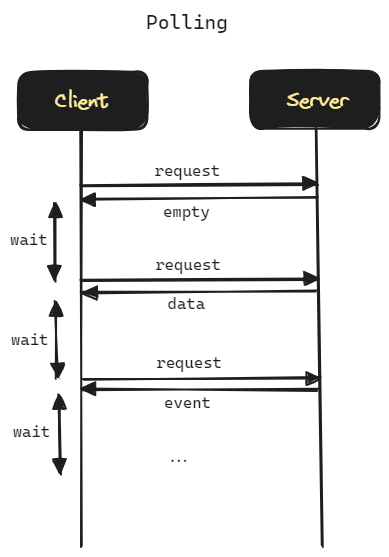
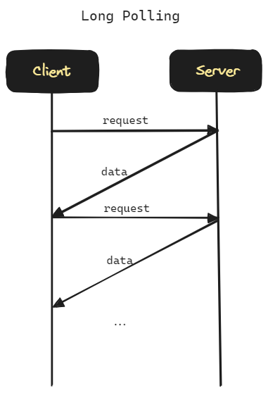
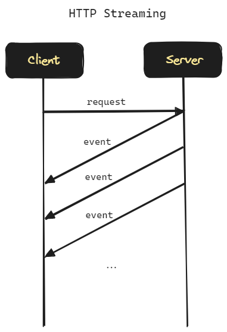
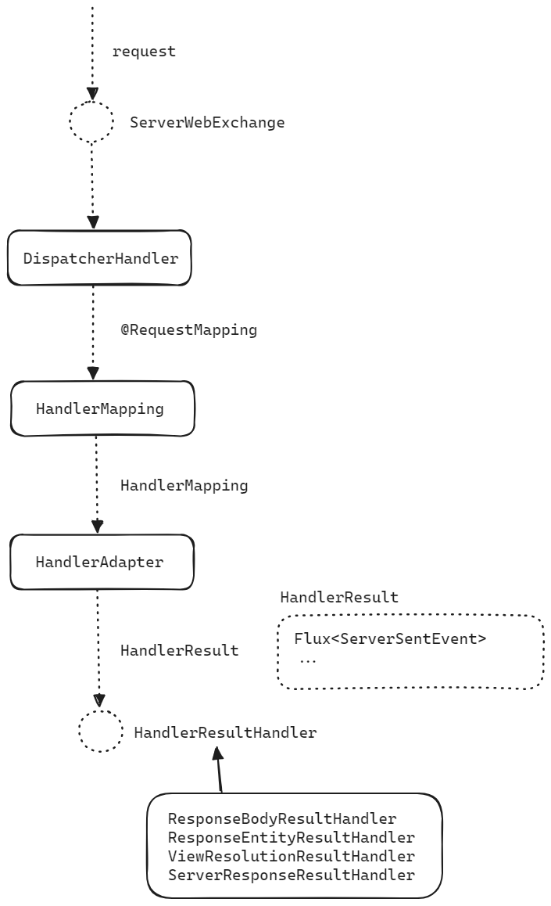
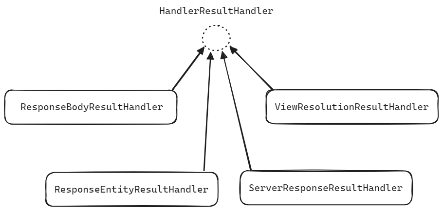
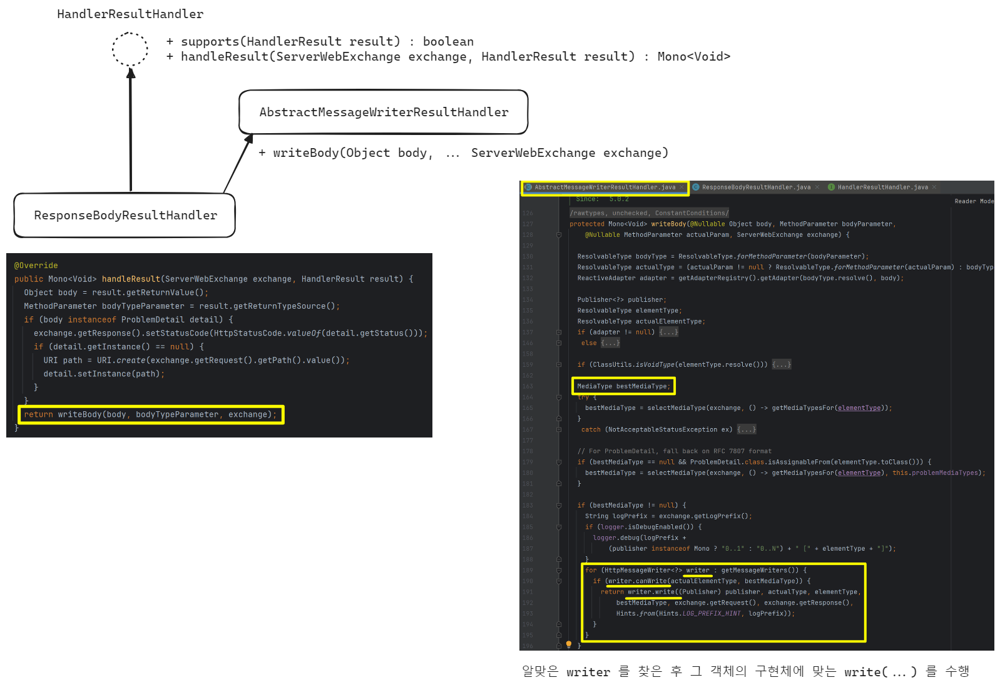
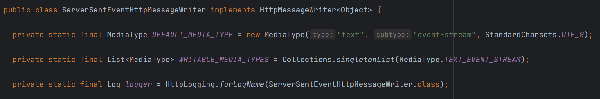
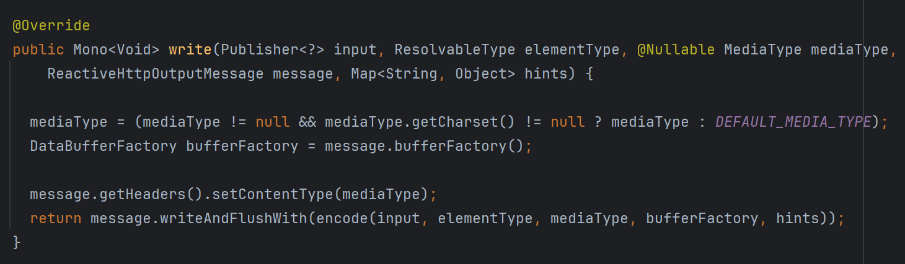
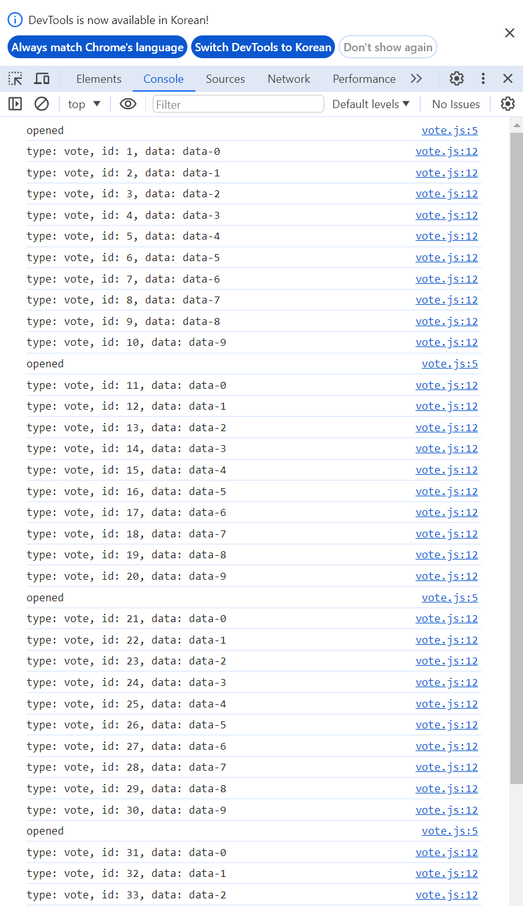

## Server Sent Event

## 참고자료

- [Using Server Sent events (MDN)](https://developer.mozilla.org/en-US/docs/Web/API/Server-sent_events/Using_server-sent_events)
- [HandlerResultHandler](https://docs.spring.io/spring-framework/docs/current/javadoc-api/org/springframework/web/reactive/HandlerResultHandler.html), [ResponseBodyResultHandler](https://docs.spring.io/spring-framework/docs/current/javadoc-api/org/springframework/web/reactive/result/method/annotation/ResponseBodyResultHandler.html), [ResponseEntityResultHandler](https://docs.spring.io/spring-framework/docs/current/javadoc-api/org/springframework/web/reactive/result/method/annotation/ResponseEntityResultHandler.html), [ViewResolutionResultHandler](https://docs.spring.io/spring-framework/docs/current/javadoc-api/org/springframework/web/reactive/result/view/ViewResolutionResultHandler.html), [ServerResponseResultHandler](https://docs.spring.io/spring-framework/docs/current/javadoc-api/org/springframework/web/reactive/function/server/support/ServerResponseResultHandler.html) 
- [ServerSentEventHttpMessageWriter](https://docs.spring.io/spring-framework/docs/current/javadoc-api/org/springframework/http/codec/ServerSentEventHttpMessageWriter.html)

<br/>


## Polling, Long Polling, HTTP Streaming

### Polling



서버는 요청을 기다리고 있다가 요청이 왔을 때 응답을 해주는 역할만을 수행합니다. <br/>

클라이언트는 일정 간격마다 한번 씩 Request 를 합니다.<br/>

클라이언트가 짧은 주기마다 서버에 요청을 요청하면 서버에 부담이 가고, 서버에 요청을 하는 주기를 길게 잡으면 실시간성이 떨어집니다. <br/>

<br/>


### Long Polling



클라이언트는 서버에 request 를 합니다. 서버는 미리 지정한 timeout 기간 마다 timeout 기간 내에 데이터 또는 이벤트를 클라이언트에 전달합니다. 서버는 데이터가 준비되지 않았거나 이벤트가 없더라도 timeout 이 지났다면 데이터가 없다거나 이벤트가 없다는 내용을 response 로 전달해줍니다.<br/>

클라이언트는 응답을 받은 후 대기 없이 바로 다시 request 를 합니다.<br/>

만약 클라이언트에게 제공할 데이터/이벤트가 여러개일 경우 각각의 데이터/이벤트를 단건으로 여러개의 long poll 요청에 나눠서 전달해줍니다.<br/>

구현의 난이도가 낮으며, 이벤트, 데이터가 있을 때마다 데이터를 돌려주는 방식이기에 Polling 방식보다는 실시간성이 조금은 높습니다.<br/>

하지만 서버 측에서는 TCP/IP 연결을 오랫동안 열어둔 상태로 대기해야 한다는 점, Connection Pool 관리 문제가 있고 클라이언트 측에서는 브라우저, gateway 등의 timeout 을 고려해서 서버의 long poll 대기 시간을 정해야 하기에 운영환경에 따라 재배포 이슈가 생기게 됩니다.<br/>

<br/>


### HTTP Streaming



클라이언트는 최초 1회 Server 에 요청을 보냅니다.<br/>

서버는 전달할 데이터가 있거나 이벤트가 있을 때마다 응답을 전달해줍니다. 클라이언트의 request 는 닫지 않고 계속해서 이벤트, 데이터가 생길때마다 클라이언트 측에 전달해줍니다.<br/>

서버 입장에서는 응답을 내려 줄 때 Content-Length 를 내려주기 곤란한 경우가 있습니다. 예를 들면 컨텐츠의 길이를 알 수 없이 계속 해서 생기는 경우가 있기도 하고 길이 자체를 미리 알 수 없는 경우입니다.<br/>

이런 경우 HTTP Streaming 을 아래와 같이 구현합니다.

Transfer-Encoding 헤더

- Transfer-Encoding: chunked 를 헤더에 추가해서 chunk 단위로 데이터를 나눠서 보냄을 명시합니다.
- 클라이언트는 비어있는 chunk 를 전달받기 전까지는 계속해서 값을 읽음 
  - 예를 들어 개행문자가 두번 이어질 경우 데이터의 끝임을 클라이언트 측에서 인지합니다.
- HTTP/1.1 이상에서만 사용가능합니다.

EOF

- 서버의 연결 종료를 양방향 간에 파악하는 방법입니다.

- Connection: close 를 헤더에 추가합니다.
- 서버가 연결을 종료하겠다는 메시지를 보내기 전까지는 들어오는 값을 읽습니다.

<br/>


## Server Sent Event 


## 데이터 형식

참고 : [Using Server Sent events (MDN)](https://developer.mozilla.org/en-US/docs/Web/API/Server-sent_events/Using_server-sent_events#fields)

```plain
id:0 
event:vote 
:election-event-k
data:김철수

id:1 
event:vote 
:election-event-k
data:고영희

```


id

- 클라이언트에서는 이벤트의 id 를 저장하고 있고 연결이 끊기거나 재접속을 할 때 `Last-Event-ID` 헤더에 이벤트의 id 를 첨부해서 가장 마지막으로 받은 이벤트가 무엇인지 전달합니다.
- 이렇게 하면 서버는 lastEventId 보다 큰 이벤트만 전달 가능함을 보장할 수 있습니다.

event

- 이벤트의 타입을 표현하는 데에 사용됩니다.
- 정해진 것은 없고 위의 예제에서는 투표하는 경우를 예로 들어서 `vote` 로 지정해주었습니다.

data

- 이벤트가 가진 data 를 표현합니다.
- 만약 data 가 여러 줄로 표현되는 경우 new line (개행문자)로 구분해서 표현합니다.

retry

- 재접속(reconnection)을 위한 대기시간을 클라이언트에 전달할 때 사용하는 필드입니다.
- 밀리세컨드로 표현됩니다.
- 만약 문제가 생겨서 연결이 유실되면 retry 에 명시한 대기시간 만큼 대기한 후 재접속을 요청합니다.

comment

- 위에서는 `:election-event-k` 라고 표현된 필드입니다.
- 단순히 정보를 남기기 위해서 사용하는 필드입니다.

<br/>


## Spring 내에서의 상호작용

### DispatcherHandler 의 요청 처리

일반적으로 잘 알려진 RequestMapping → HandlerMapping → HandlerMappingAdapter → ResultHandler(ResponseBodyResultHandler)의 순서를 따릅니다.



ServerWebExchange

- request 는 ServerWebExchange 타입으로 변환됩니다.

DispatcherHandler

- 요청의 내용들을 기반으로 알맞은 HandlerMapping을 찾습니다

HandlerMapping

- DispatcherHandler 는 HandlerAdapter 를 이용해서 방금 찾은 HandlerMapping을 HandlerAdapter에 함께 넘겨 주어서 적절한 Controller 나 Functional Endpoint 를 찾습니다.

HandlerAdapter

- Controller 등에서 처리한 애플리케이션의 `Flux<ServerSentEvent` 같은 처리 결과는 `HandlerResult` 라는 타입 안에 담아서 HandlerResult를 `HandlerResultHandler` 에 전달해줍니다.
- HandlerResult 는 Flux\<ServerSentEvent\> 와 같은 애플리케이션의 응답 데이터인 retureValue를 바인딩하고 있습니다.

HandlerResultHandler

- byteBuffer 단위의 네트워킹 연산을 수행합니다.
- [HandlerResultHandler](https://docs.spring.io/spring-framework/docs/current/javadoc-api/org/springframework/web/reactive/HandlerResultHandler.html) 는 interface 이며, 구체 타입으로는 아래와 같이 [ResponseBodyResultHandler](https://docs.spring.io/spring-framework/docs/current/javadoc-api/org/springframework/web/reactive/result/method/annotation/ResponseBodyResultHandler.html), [ResponseEntityResultHandler](https://docs.spring.io/spring-framework/docs/current/javadoc-api/org/springframework/web/reactive/result/method/annotation/ResponseEntityResultHandler.html), [ViewResolutionResultHandler](https://docs.spring.io/spring-framework/docs/current/javadoc-api/org/springframework/web/reactive/result/view/ViewResolutionResultHandler.html), [ServerResponseResultHandler](https://docs.spring.io/spring-framework/docs/current/javadoc-api/org/springframework/web/reactive/function/server/support/ServerResponseResultHandler.html) 등과 같이 여러 종류가 있습니다.
- 만약 SSE 가 @ResponseBody 를 리턴할 경우 [ResponseBodyResultHandler](https://docs.spring.io/spring-framework/docs/current/javadoc-api/org/springframework/web/reactive/result/method/annotation/ResponseBodyResultHandler.html)를 따르게 됩니다.

 <br/>




<br/>


### HandlerResultHandler 가 ResponseBody 를 처리하는 과정

> 내부 동작에 대한 설명입니다. 다소 필요없어보일 수도 있겠지만, 내부 동작을 보면서 원리를 파악하는 것도 좋겠다는 생각이 들어서 정리합니다.<br/>

위에서는 DispatcherHandler 에서 HandlerResultHandler 타입까지 어떻게 요청이 분류되는지를 살펴봤습니다. 이번에는 HandlerResultHandler 가 ServerSocketEvent 를 ResponseBody 로 처리하려 할 때 어떻게 내부 동작이 이뤄지는지를 살펴봅니다.



<br/>

**ResponseBodyResultHandler::handleResult(...) → AbstractMessageWriterResultHandler::writeBody(...)**<br/>

- ResponseBodyResultHandler 내에서 handleResult 의 요청을 처리한 후 제일 마지막으로 writeBody(...) 메서드를 호출하는데 이것은 AbstractMessageWriterResultHandler 내부의 writeBody(...)를 호출하게 됩니다.<br/>

**AbstractMessageWriterResultHandler::writeBody(...) → HttpMessageWriter::write(Publisher)**<br/>

- writeBody() 메서드에서는 요청에 맞는 HttpMessageWriter 에 대한 구체타입을 for loop 을 순회하면서 찾고, 요청에 맞는 writer 를 찾았다면, 그 구체타입에 대한 HttpMessageWriter 객체의 write(Publisher) 메서드를 실행합니다.<br/>

<br/>


그리고 HttpMessageWriter 타입의 객체 들 중 SSE 를 처리하는 타입은 [ServerSentEventHttpMessageWriter](https://docs.spring.io/spring-framework/docs/current/javadoc-api/org/springframework/http/codec/ServerSentEventHttpMessageWriter.html) 입니다.<br/>

그리고 내부 구현중 일부를 보면 아래와 같이 `WRITABLE_MEDIA_TYPES` 에 `TEXT_EVENT_STREAM` 이 지정되어 있고, `DEFAULT_MEDIA_TYPE` 은 text, event-stream 이라는 것을 확인 가능합니다.<br/>



<br/>


그리고 실제 write 연산은 아래와 같이 DataBufferFactory 를 이용해서 물리적인 전송 연산을 수행하고 있습니다.



<br/>


## 구현

### Controller #1

SSE 를 전송하는 서버 애플리케이션의 Controller 는 예를 들면 아래와 같은 모습입니다.

```java
package io.chagchagchag.example.foobar.sse.application;

import java.time.Duration;
import org.springframework.stereotype.Controller;
import org.springframework.web.bind.annotation.GetMapping;
import org.springframework.web.bind.annotation.ResponseBody;
import reactor.core.publisher.Flux;

@Controller
public class VoteController {
  @ResponseBody
  @GetMapping(path = "/vote", produces = "text/event-stream")
  public Flux<String> getVote(){
    return Flux
        .interval(Duration.ofMillis(100))
        .map(ms -> "고영희 " + ms);
  }
}
```

<br/>

SSE 를 사용하기 위해서는 @GetMapping 내에 반드시 `produces = "text/event-stream"` 을 꼭 명시해줘야 합니다.<br/>

이렇게 해줘야 위에서 살펴봤던 MessageWriter 를 찾는 과정에서 `produces = "text/event-stream"` 을 보고 `writer.canWrite()` 메서드를 통해서 ServerSentEventHttpMessageWriter를 찾을 수 있습니다.<br/>

이 text/event-stream 은 Spring 에서 제공하는 `MediaType.TEXT_EVENT_STREAM_VALUE` 타입을 사용해서 대체 가능합니다.<br/>

<br/>

위의 예제는 단순 문자열을 전송하고 있기 때문에 결과값으로는 data 필드에 문자열만 채워지고 나머지 필드들은 `type: message`, `id:`, `data: 고영희 1` 과 같은 형태로 데이터가 클라이언트에 전송됩니다.

<br/>


### 구독

http 클라이언트를 통해서 구독을 해봅니다.

```http
GET http://localhost:8080/vote
```

<br/>


출력결과는 아래와 같이 나타납니다.

```plain
data:고영희 0

data:고영희 1

data:고영희 2

data:고영희 3

data:고영희 4

data:고영희 5

data:고영희 6

data:고영희 7

data:고영희 8

data:고영희 9

data:고영희 10

data:고영희 11

data:고영희 12

data:고영희 13

data:고영희 14

data:고영희 15

data:고영희 16

data:고영희 17

data:고영희 18

data:고영희 19

data:고영희 20
.. 
```

<br/>


### Controller #2

이번에는 조금 더 복잡하게 보내보고, 구독은  javascript 로 구독요청을 해봅니다.<br/>

먼저 controller 예제입니다.

```java
package io.chagchagchag.example.foobar.sse.application;

import java.time.Duration;
import org.springframework.http.MediaType;
import org.springframework.http.codec.ServerSentEvent;
import org.springframework.stereotype.Controller;
import org.springframework.web.bind.annotation.GetMapping;
import org.springframework.web.bind.annotation.RequestHeader;
import org.springframework.web.bind.annotation.ResponseBody;
import reactor.core.publisher.Flux;

@Controller
public class VoteController {
  // ... 
  
  @ResponseBody
  @GetMapping(path = "/vote2", produces = MediaType.TEXT_EVENT_STREAM_VALUE)
  public Flux<ServerSentEvent<String>> getVote2(
      @RequestHeader(name = "Last-Event-ID", required = false, defaultValue = "0") Long lastEventId
  ){
    return Flux
        .range(0, 10)
        .delayElements(Duration.ofMillis(10))
        .map(
            i -> ServerSentEvent.<String>builder()
                .event("vote")
                .id(String.valueOf(i + lastEventId + 1))
                .data("data-"+i)
                .comment("comment-"+i)
                .build()
        );
  }
}
```

<br/>


아까와는 다르게 ServerSentEvent 의 데이터 형식을 맞추어서 Response 를 하고 있습니다.

<br/>


### CorsConfig

랜덤한 javascript 포트에서 요청을 할 것이기에 아래의 코드를 추가해주었습니다.

```java
package io.chagchagchag.example.foobar.sse.config;

import org.springframework.context.annotation.Configuration;
import org.springframework.web.reactive.config.CorsRegistry;
import org.springframework.web.reactive.config.WebFluxConfigurer;

@Configuration
public class CorsConfig implements WebFluxConfigurer {

  @Override
  public void addCorsMappings(CorsRegistry registry) {
    registry
        .addMapping("/**")
        .allowedOriginPatterns("*")
        .allowedMethods("*");
  }
}

```

<br/>


### 구독

이번에는 구독하는 측의 코드입니다.

vote.html

```html
<!DOCTYPE html>
<html lang="en">
<head>
  <meta charset="UTF-8">
  <title>Vote</title>
</head>
<body>
  <script type="text/javascript" src="vote.js"/>
</body>
</html>
```

<br/>


vote.js

```javascript
window.onload = function(){
  const eventSource = new EventSource('http://localhost:8080/vote2');

  eventSource.onopen = event => {
    console.log('opened');
  }

  eventSource.addEventListener('vote', event => {
    const type = event.type;
    const id = event.lastEventId;
    const data = event.data;
    console.log(`type: ${type}, id: ${id}, data: ${data}`);
  });
}
```

<br/>


출력결과

vote.html 파일을 브라우저에서 열어서 개발자 도구를 열어서 확인하면, 출력결과가 아래와 같이 나타나는 것을 확인 가능합니다. html 파일은 intellij 내장 기능을 통해 크롬에서 구동했습니다. 랜덤 포트에서 구동되기에 서버측 컨트롤러에 위에서 작성한 CorsConfig 설정을 꼭 해줘야 아래의 결과가 나타납니다.<br/>




