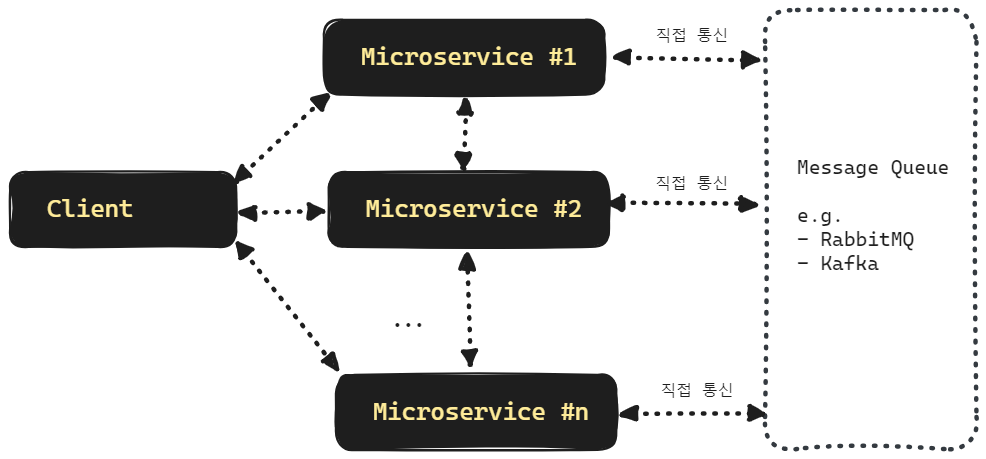
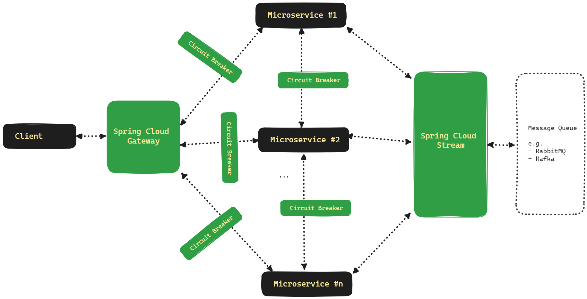
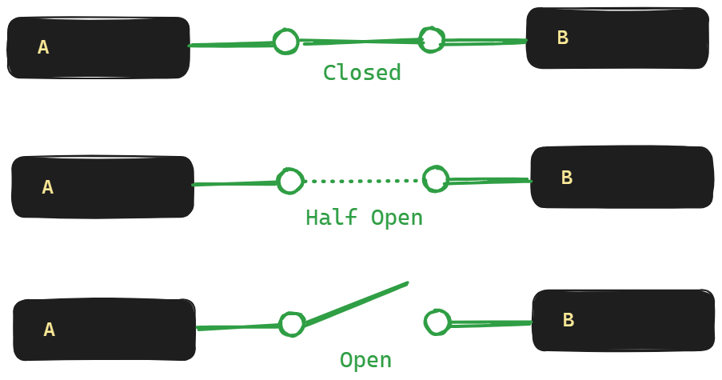

## Reactive Circuit Breaker 

## Plain MSA
Spring Cloud 와 API 통신 추상화 계층이 없는 MSA의 구조는 아래와 같습니다.


클라이언트와 API간의 통신 복잡성

- MSA#1, MSA#2, ... MSA#n 의 IP 주소, 호스트 네임, fqdn 등을 모두 알고 있어야 하고 MSA#1, MSA#2, ... MSA#n의 네트워크 주소, FQDN 등이 변경될때마다 클라이언트(AOS/IOS/WEB)에 모두 반영해줘야 합니다.


MSA API 간의 통신 안정성 확보 불가

- API 간의 통신 시에 단절이 어떻게 되는지 판정할 방법과 Healthcheck 를 할 방법, Client 측의 Loadbalancing 등에 대한 대책이 분명하지 않습니다.<br/>


메시지 큐와의 통신 구현 라이브러리 종속 

- 각각의 MSA는 메시지 큐와 통신할 때에는 메시지 큐의 구체적인 종류에 따라 구현이 계속 달라지게 되고, 메시지 큐의 종류를 바꾸는 것 역시 쉽지 않습니다.<br/>
- 즉 메시지 큐의 종류에 종속됩니다.

<br/>


## Spring Cloud Circuit Breaker 를 적용하면
MSA 구조에 Spring Cloud Circuit Breaker 를 적용하면 아래와 같은 방식으로 통신이 이루어집니다.

<br/>


Client와 MSA API 간의 통신

- Client 와 MSA API 가 통신을 할 때 Client 는 모든 MSA API 의 주소를 알고 있을 필요가 없습니다. Spring Cloud Gateway 서버의 주소만 알고 있으면 됩니다.
- 각각의 개별 MSA 들이 주소가 바뀌거나 도메인 호스팅이 바뀌거나 FQDN 등이 변경되는 것은 Spring Cloud Gateway 내에서 설정을 바꿔주면 되고, Client 는 Spring Cloud Gateway 내에서 제공하는 주소만 알고 있으면 됩니다.

<br/>


MSA API 간의 통신 안정성 확보

- MSA간 통신을 할 때 통신이 확보되지 않는 경우에 대한 구현은 Spring Cloud Circuit Breaker 에 추상화되어 있습니다. 만약 Circuit Breaker 를 사용하지 않는다면, 개발자가 직접 heartbeat, API 상태체크, 실패율 측정 등의 기능을 직접 개발해야 합니다.
- 장애가 격리됩니다. 모놀리딕 구조에서는 모든 서비스가 하나의 애플리케이션에서 동작하는데 이때 특정 장애가 발생하면 전체 서비스가 장애가 날 수 있습니다. 하지만, MSA 구조로 분해를 하면 장애가 격리된다는 점에서 장점을 가집니다. 하지만, 장애 발생할 경우에 특정 API에서 잘못된 결과를 낼 수 있는 가능성 역시 남아있게 되는데 여기에 대해서는 Circuit Breaker 의 장애감지, 회로 차단 등의 기능을 통해서 미연에 트래픽을 차단하는 등의 기능을 제공하는게 가능하게 됩니다.

<br/>


Spring Cloud Stream 을 이용한 메시징 라이브러리 추상화

- Spring Cloud Stream 을 사용하면 메시지 큐의 종류에 종속되는 정도가 대폭 줄어듭니다. 따라서 서비스 성격,운영 비용에 따라 메시지 큐의 종류를 바꾸는 것이 조금 더 자유로워지게 됩니다.

<br/>


Spring Cloud Config Server 사용시 설정 변경 사항 즉시 반영

- Gateway, Circuit Breaker 의 세부적인 모니터링 주기라든지, Filter 관련 내용들을 변경해서 새로 적용할 때 Spring Cloud Config Server 에서 property를 관리하고 있다면 서버의 재기동 없이 상태가 반영될 수 있습니다.

<br/>


## Spring Cloud Release
- [github.com - spring-cloud-release](https://github.com/spring-cloud/spring-cloud-release)
- [Spring Cloud Release - Supported Release](https://github.com/spring-cloud/spring-cloud-release/wiki/Supported-Versions#supported-releases)
- [spring.io/projects/spring-cloud#overivew](https://spring.io/projects/spring-cloud#overview)

<br/>


## Resilience4j Circuit Breaker
Spring Cloud Circuit Breaker 는 추상화된 라이브러리이고, 구현되어 있는 구현체가 필요합니다. 이 중 Reactor 기반의 Circuit Breaker 를 지원하는 것은 현재 Resilience4j 의 Cricuit Breaiker 뿐 입니다.
- [Resilience4j Circuit Breaker](https://resilience4j.readme.io/docs/circuitbreaker)
- [github.com/resilience4j/resilience4j](https://github.com/resilience4j/resilience4j)

<br/>


## Circuit Breaker 의 3가지 상태

<br/>


**Closed** 

- 정상적으로 요청을 받을 수 있는 상태입니다. 처음 본다면  `Closed` 라는 단어를 보고 차단되었다고 착각하기 쉽지만, `Closed` 는 회로 차단기로 **회로를 차단(Close)**했다. 라고 이해하면 수월합니다.

**Half Open**

- 트래픽을 어느 정도 흘려본 후 Open 을 유지할 지 Closed 로 변경할지 결정하는 상태입니다.

**Open**

- Circuit Breaker 가 중지된 상태입니다. 차단기의 **스위치를 열어두었다.(Open)** 로 이해하면 수월합니다.

<br/>


Resilience4j 의 로고 역시 이와 같은 3종류의 상태를 잘 표현하고 있습니다. 검은색 원은 Closed, 반정도 차있는 원은 Half Open, 비어있는 원은 Open 상태를 의미합니다.


<br/>


## 의존성
의존성은 아래와 같습니다.
```kotlin
repositories {
  mavenCentral()
}

extra["springCloudVersion"] = "2023.0.0"

dependencies {
  implementation("org.springframework.cloud:spring-cloud-starter-circuitbreaker-resilience4j")
  testImplementation("org.springframework.boot:spring-boot-starter-test")
}

dependencyManagement {
  imports {
    mavenBom("org.springframework.cloud:spring-cloud-dependencies:${property("springCloudVersion")}")
  }
}
```
<br/>


## 설정

Circuit Breaker 와 같은 모니터링이나 장애 탐지를 위한 성격의 코드들은 가급적 Java 코드 보다는 yaml 파일에 따로 분리해서 관리해두는 편입니다. 이렇게 yaml 파일을 따로 분리해둔 후 Spring Cloud Config Server 에서 관리하게끔 하면, 실제 서비스의 기능 릴리즈가 아닌 Circuit Breaker 설정 변경만 해야 할 경우에 Spring Cloud Config Server 내에 yml 파일의 속성을 변경해주면 반영되기 때문입니다.<br/>

이번 문서에서는 Java Bean 설정방법과 yaml 설정 방식 모두 어떤 필드가 있는지 이런 것들을 정리해봅니다.<br/>


### Java Bean 설정

Java 설정 시에는 `ReactiveResilience4JCircuitBreakerFactory` 객체를 바로 생성하지 않고 `Customizer<ReactiveResilience4JCircuitBreakerFactory>` 타입의 람다 구문을 생성해서 Bean 으로 등록합니다. 즉, 객체를 생성하지 않고 식을 인스턴스화 해서 넘기는 지연(lazy) 초기화 방식입니다.<br/>

```java
@Bean
public Customizer<ReactiveResilience4JCircuitBreakerFactory> foobarCircuitBreaker(){
  var circuitBreakerConfig = CircuitBreakerConfig
      .custom()
      .slidingWindowSize(10)
      .failureRateThreshold(75)
      .enableAutomaticTransitionFromOpenToHalfOpen()
      .waitDurationInOpenState(Duration.ofSeconds(5))
      .permittedNumberOfCallsInHalfOpenState(6)
      .ignoreExceptions(ArithmeticException.class)
      .maxWaitDurationInHalfOpenState(Duration.ofSeconds(30))
      .build();

  var timeLimiterConfig = TimeLimiterConfig.custom()
      .cancelRunningFuture(true)
      .timeoutDuration(Duration.ofSeconds(3))
      .build();

  var circuitBreakerId = "foobar";

  return factory -> {
    factory.addCircuitBreakerCustomizer(loggingCustomizer(), circuitBreakerId);
    factory.configure(builder -> {
      builder
          .circuitBreakerConfig(circuitBreakerConfig)
          .timeLimiterConfig(timeLimiterConfig);
    }, circuitBreakerId);
  };
}
```

<br/>


#### CircuitBreakerConfig

CircuitBreakerConfig 를 설정하는 코드는 아래와 같습니다.

```java
  var circuitBreakerConfig = CircuitBreakerConfig
      .custom()
      .slidingWindowSize(10)
      .failureRateThreshold(75)
      .enableAutomaticTransitionFromOpenToHalfOpen()
      .waitDurationInOpenState(Duration.ofSeconds(5))
      .permittedNumberOfCallsInHalfOpenState(6)
      .ignoreExceptions(ArithmeticException.class)
      .maxWaitDurationInHalfOpenState(Duration.ofSeconds(30))
      .build();
```


- slidingWindowSize : 호출 결과를 저장할 sliding window 입니다. 기본 사이즈는 100 입니다.
- failureRateThreshold : 몇번 실패해야 실패로 인정할지에 대한 백분율 비율입니다. 기본 값은 50 (퍼센트)입니다.
- enableAutomaticTransitionFromOpenToHalfOpen 
  - open 에서 halfopen 으로 자동으로 전환하게끔 enable 하는 메서드입니다. 
  - 기본값은 false 이지만 enableAutomaticTransitionFromOpenToHalfOpen () 메서드를 호출하면 true 로 설정됩니다.
- waitDurationInOpenState
  - open 에서 half open 으로 전환할 때 까지 필요한 시간(Duration)입니다.
  - 설정하지 않으면 기본값으로 설정되며 기본값은 60초 입니다.
- permittedNumberOfCallsInHalfOpenState
  - half open 상태에서 허용할 호출 수 입니다. 
  - 기본값은 10 입니다.
- ignoreExceptions
  - 서비스에서 exception 을 던지더라도 차단을 걸지 않고 허용할 exceptions 목록입니다.
- maxWaitDurationInHalfOpenState
  - half open 상태에서 대기할 수 있는 최대시간 입니다.
  - 기본값은 0 입니다.

<br/>


#### TimeLimiterConfig

```java
    var timeLimiterConfig = TimeLimiterConfig.custom()
        .cancelRunningFuture(true)
        .timeoutDuration(Duration.ofSeconds(3))
        .build();
```


- cancelRunningFuture
  - Future 가 진행중일 경우 cancel 할지 여부를 결정합니다. 기본 값은 true 입니다.
- timeoutDuration
  - timeout 기준 시간입니다. 기본 값은 1초 입니다.

<br/>


#### Customizer\<T\> 설정

Customizer 타입의 람다를 생성해서 리턴 값으로 넘기는 방식으로 Bean 을 생성합니다. 객체를 생성하지 않고 식을 인스턴스화 해서 넘기는 지연(lazy) 초기화 방식입니다.

```JAVA
  return factory -> {
    factory.addCircuitBreakerCustomizer(loggingCustomizer(), circuitBreakerId);
    factory.configure(builder -> {
      builder
          .circuitBreakerConfig(circuitBreakerConfig)
          .timeLimiterConfig(timeLimiterConfig);
    }, circuitBreakerId);
  };
```

- configure(builder, circuitBreaker Id)
  - circuit breaker 의 id 를 전달해서 특정 id 에 대한 circuit breaker 에 대한 설정을 합니다.
  - 일반적인 모든 circuit breaker 에 설정을 적용하려면 `configureDefault()`  메서드를 사용하면 됩니다.

<br/>


### yaml 설정

```yaml
resilience4j:
  circuitbreaker:
    instances:
      basic:
        sliding-window-size: 10
        failure-rate-threshold: 70
        automatic-transition-from-open-to-half-open-enabled: true
        wait-duration-in-open-state:
          seconds: 5s
        permitted-number-of-calls-in-half-open-state: 6
        ignore-exceptions:
          - java.lang.IllegalCallerException
        max-wait-duration-in-half-open-state:
          seconds: 30s
    configs:
      default:
        register-health-indicator: true
        sliding-window-size: 50
  timelimiter:
    instances:
      basic:
        timeout-duration:
          seconds: 1
        cancel-running-future: true
```

<br/>


#### `resilience4j.circuitbreaker.instances`

개별 circuitbreaker 들ㅇ르 설정합니다. 아래 코드에서는 `basic` 이라는 circuitbreaker 를 설정하고 있습니다.

```yaml
resilience4j:
  circuitbreaker:
    instances:
      basic:
        sliding-window-size: 10
        failure-rate-threshold: 70
        automatic-transition-from-open-to-half-open-enabled: true
        wait-duration-in-open-state:
          seconds: 5s
        permitted-number-of-calls-in-half-open-state: 6
        ignore-exceptions:
          - java.lang.IllegalCallerException
        max-wait-duration-in-half-open-state:
          seconds: 30s
    configs:
    # ... 
  timelimiter:
    # ... 
```

<br/>

- sliding-window-size : 호출 결과를 저장할 sliding window 입니다. 기본 사이즈는 100 입니다.
- failure-rate-threshold : 몇번 실패해야 실패로 인정할지에 대한 백분율 비율입니다. 기본 값은 50 (퍼센트)입니다.
- automatic-transition-from-open-to-half-open-enabled
  - open 에서 halfopen 으로 자동으로 전환하게끔 enable 하는 메서드입니다. 
  - 기본값은 false 이지만 위에서는 enable 시켜서 true 가 되었습니다.
- wait-duration-in-open-state
  - open 에서 half open 으로 전환할 때 까지 필요한 시간(Duration)입니다.
  - 설정하지 않으면 기본값으로 설정되며 기본값은 60초 입니다.
- permitted-number-of-calls-in-half-open-state
  - half open 상태에서 허용할 호출 수 입니다. 
  - 기본값은 10 입니다.
- ignore-exceptions
  - 서비스에서 exception 을 던지더라도 차단을 걸지 않고 허용할 exceptions 목록입니다.
- max-wait-duration-in-half-open-state
  - half open 상태에서 대기할 수 있는 최대시간 입니다.
  - 기본값은 0 입니다.

<br/>


#### `resilience4j.timelimiter.instances`

```yaml
resilience4j:
  circuitbreaker:
    # ... 
  timelimiter:
    instances:
      basic:
        timeout-duration:
          seconds: 1
        cancel-running-future: true
```

<br/>

- cancelRunningFuture
  - Future 가 진행중일 경우 cancel 할지 여부를 결정합니다. 기본 값은 true 입니다.
- timeoutDuration
  - timeout 기준 시간입니다. 기본 값은 1초 입니다.

<br/>


#### `resilience4j.circuitbreaker.configs.default`

```yaml
resilience4j:
  circuitbreaker:
    # ...
    configs:
      default:
        register-health-indicator: true
        sliding-window-size: 50
  timelimiter:
    # ...
```

<br/>

- 이미 정의해둔 instance 들 중 매칭되는 것이 없을 경우 `resilience4j.circuitbreaker.configs.default` 에 설정해둔 속성을 사용하게 됩니다.

<br/>


## 테스트 코드

### closed


### half open


### open


