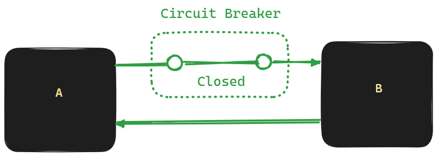
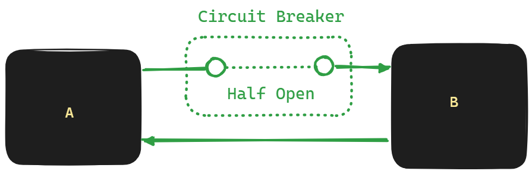
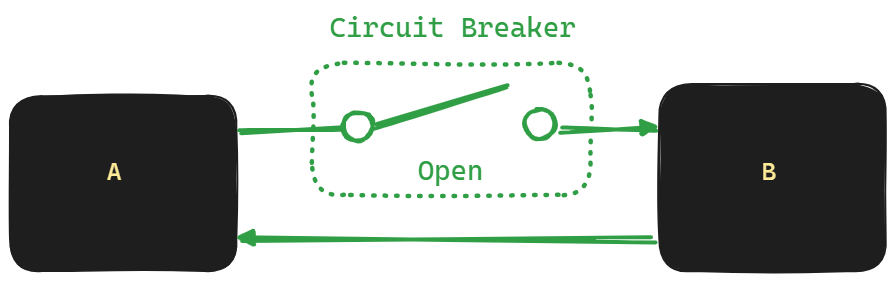
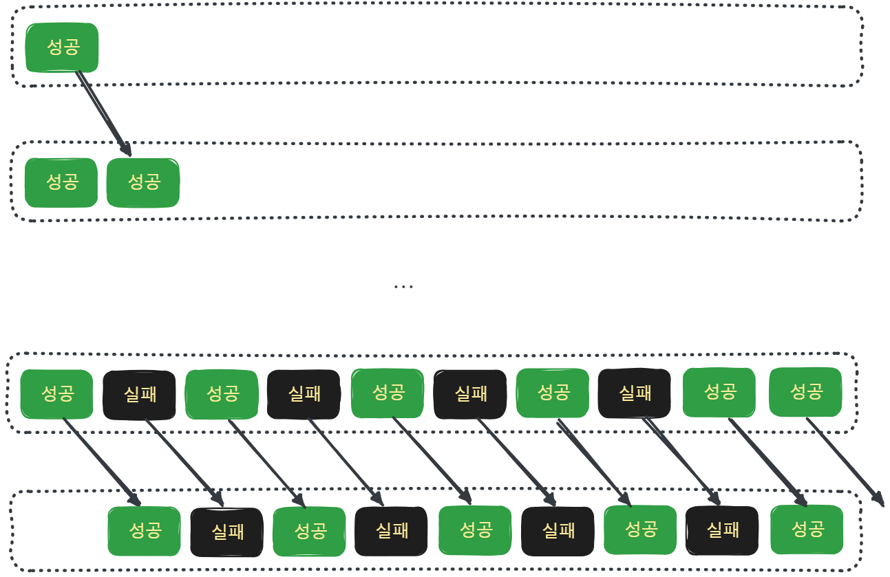

## Reactive Circuit Breaker 

## 참고자료

- [Service resiliency with Spring Boot and Resilience4j](https://symphony.is/about-us/blog/service-resiliency-with-spring-boot-and-resilience4j)
- [Circuitbreaker를 사용한 장애 전파 방지](https://oliveyoung.tech/blog/2023-08-31/circuitbreaker-inventory-squad/)

<br/>


## Plain MSA
Spring Cloud 와 API 통신 추상화 계층이 없는 MSA의 구조는 아래와 같습니다.


클라이언트와 API간의 통신 복잡성

- MSA#1, MSA#2, ... MSA#n 의 IP 주소, 호스트 네임, fqdn 등을 모두 알고 있어야 하고 MSA#1, MSA#2, ... MSA#n의 네트워크 주소, FQDN 등이 변경될때마다 클라이언트(AOS/IOS/WEB)에 모두 반영해줘야 합니다.


MSA API 간의 통신 안정성 확보 불가

- API 간의 통신 시에 단절이 어떻게 되는지 판정할 방법과 Healthcheck 를 할 방법, Client 측의 Loadbalancing 등에 대한 대책이 분명하지 않습니다.<br/>


메시지 큐와의 통신 구현 라이브러리 종속 

- 각각의 MSA는 메시지 큐와 통신할 때에는 메시지 큐의 구체적인 종류에 따라 구현이 계속 달라지게 되고, 메시지 큐의 종류를 바꾸는 것 역시 쉽지 않습니다.<br/>
- 즉 메시지 큐의 종류에 종속됩니다.

<br/>


## Spring Cloud Circuit Breaker 를 적용하면
MSA 구조에 Spring Cloud Circuit Breaker 를 적용하면 아래와 같은 방식으로 통신이 이루어집니다.

<br/>


Client와 MSA API 간의 통신

- Client 와 MSA API 가 통신을 할 때 Client 는 모든 MSA API 의 주소를 알고 있을 필요가 없습니다. Spring Cloud Gateway 서버의 주소만 알고 있으면 됩니다.
- 각각의 개별 MSA 들이 주소가 바뀌거나 도메인 호스팅이 바뀌거나 FQDN 등이 변경되는 것은 Spring Cloud Gateway 내에서 설정을 바꿔주면 되고, Client 는 Spring Cloud Gateway 내에서 제공하는 주소만 알고 있으면 됩니다.

<br/>


MSA API 간의 통신 안정성 확보

- MSA간 통신을 할 때 통신이 확보되지 않는 경우에 대한 구현은 Spring Cloud Circuit Breaker 에 추상화되어 있습니다. 만약 Circuit Breaker 를 사용하지 않는다면, 개발자가 직접 heartbeat, API 상태체크, 실패율 측정 등의 기능을 직접 개발해야 합니다.
- 장애가 격리됩니다. 모놀리딕 구조에서는 모든 서비스가 하나의 애플리케이션에서 동작하는데 이때 특정 장애가 발생하면 전체 서비스가 장애가 날 수 있습니다. 하지만, MSA 구조로 분해를 하면 장애가 격리된다는 점에서 장점을 가집니다. 하지만, 장애 발생할 경우에 특정 API에서 잘못된 결과를 낼 수 있는 가능성 역시 남아있게 되는데 여기에 대해서는 Circuit Breaker 의 장애감지, 회로 차단 등의 기능을 통해서 미연에 트래픽을 차단하는 등의 기능을 제공하는게 가능하게 됩니다.

<br/>


Spring Cloud Stream 을 이용한 메시징 라이브러리 추상화

- Spring Cloud Stream 을 사용하면 메시지 큐의 종류에 종속되는 정도가 대폭 줄어듭니다. 따라서 서비스 성격,운영 비용에 따라 메시지 큐의 종류를 바꾸는 것이 조금 더 자유로워지게 됩니다.

<br/>


Spring Cloud Config Server 사용시 설정 변경 사항 즉시 반영

- Gateway, Circuit Breaker 의 세부적인 모니터링 주기라든지, Filter 관련 내용들을 변경해서 새로 적용할 때 Spring Cloud Config Server 에서 property를 관리하고 있다면 서버의 재기동 없이 상태가 반영될 수 있습니다.

<br/>


## Spring Cloud Release
- [github.com - spring-cloud-release](https://github.com/spring-cloud/spring-cloud-release)
- [Spring Cloud Release - Supported Release](https://github.com/spring-cloud/spring-cloud-release/wiki/Supported-Versions#supported-releases)
- [spring.io/projects/spring-cloud#overivew](https://spring.io/projects/spring-cloud#overview)

<br/>


## Resilience4j Circuit Breaker
Spring Cloud Circuit Breaker 는 추상화된 라이브러리이고, 구현되어 있는 구현체가 필요합니다. 이 중 Reactor 기반의 Circuit Breaker 를 지원하는 것은 현재 Resilience4j 의 Cricuit Breaiker 뿐 입니다.
- [Resilience4j Circuit Breaker](https://resilience4j.readme.io/docs/circuitbreaker)
- [github.com/resilience4j/resilience4j](https://github.com/resilience4j/resilience4j)

<br/>


## Circuit Breaker 의 3가지 상태

Circuit Breaker 는 Closed, Half Open, Open 상태를 그림을 보고 이해해야 합니다. <br/>

> 참고 
>
> - [Service resiliency with Spring Boot and Resilience4j](https://symphony.is/about-us/blog/service-resiliency-with-spring-boot-and-resilience4j)
> - [Circuitbreaker를 사용한 장애 전파 방지](https://oliveyoung.tech/blog/2023-08-31/circuitbreaker-inventory-squad/)

<br/>


### Closed



- 정상적으로 요청을 받을 수 있는 상태입니다. 
- 처음 보거나 오랜만에 봤다면  `Closed` 라는 단어를 보고 차단되었다고 착각하기 쉽습니다. 주의해야 합니다.
- `Closed` 는 회로차단기의 스위치를 닫아(Closed)서 스위치가 붙어있는 상태를 기억하면 이해가 쉽습니다.

<br/>


### Half Open



- 트래픽을 어느 정도 흘려본 후 Open 을 유지할지 Closed 로 변경할지 결정하는 상태입니다.

<br/>


### Open



- Circuit Breaker 가 회로를 끊어둔 상태입니다. 
- 회로 차단기가 켜져있는 상태입니다.
- 특정 목적지로 가는 트래픽을 차단하고 있는 상태입니다.

<br/>


Resilience4j 의 로고 역시 이와 같은 3종류의 상태를 잘 표현하고 있습니다. 검은색 원은 Closed, 반정도 차있는 원은 Half Open, 비어있는 원은 Open 상태를 의미합니다.


<br/>


## 상태 변이 (State Transition)


<br/>

> 출처 : [resilience4j.readme.io/docs/circuitbreaker#introduction](https://resilience4j.readme.io/docs/circuitbreaker#introduction)

<br/>


### Closed → Open

Closed 에서는 Open 으로만 상태 변화가 가능합니다.<br/>

통신이 열려있는 상태에서는 차단 하는 것만 가능하다는 것으로 이해하면 기억하기 쉽습니다.<br/>

<br/>


### Half Open → Open, Half Open → Closed

Half Open 상태에서는 Open, Closed 상태로만 변화가 가능합니다.<br/>

<br/>


### Open → Half Open

회로가 차단되어 있는 Open 상태에서는 Half Open 상태로만 진입이 가능합니다.<br/>

Half Open 으로 전환하는 방법은 코드로 실행시키는 방식, 일정시간 대기 후 Open 으로 전환되도록 하는 방식이 있습니다. 일반적으로 코드 레벨에서 하드코딩으로 Half Open 으로 전환되도록 하는 방식은 추천되는 방식은 아닙니다.<br/>

가급적이면 일정 시간 이후에 Half Open 이 되도록 delay 시간을 주어야 합니다.

- enableAutomaticTransitionFromOpenToHalfOpen()
- waitDurationInOpenState()

위의 두 함수를 통해서 이 설정을 활성화하는 것이 가능합니다. 아래의 yml 설정으로도 이 설정을 지정할 수 있습니다.

- automatic-transition-from-open-to-half-open-enabled
  - open 에서 halfopen 으로 자동으로 전환하게끔 enable 하는 메서드입니다. 
  - 기본값은 false 이지만 위에서는 enable 시켜서 true 가 되었습니다.
- wait-duration-in-open-state
  - open 에서 half open 으로 전환할 때 까지 필요한 시간(Duration)입니다.
  - 설정하지 않으면 기본값으로 설정되며 기본값은 60초 입니다.

<br/>

## Sliding Window



슬라이딩 윈도우는 위와 같은 방식으로 동작합니다. circular array 처럼 동작합니다.<br/>

슬라이딩 윈도우는 실패, 성공 여부를 sliding window size 만큼 쌓아두고 실패율(failure rate)을 측정하기 위해 사용합니다. circuit breaker 를 이용해서 통신을 차단하거나 허용할 때는 이 실패율을 기준으로 판단합니다.<br/>

sliding window 로 측정을 할 때에는 sliding Window Size 에 도달할 때 까지 계속해서 측정을 합니다. 그리고 측정한 개수가 n개에 도달했을 경우 가장 최초에 저장했던 결과를 제거한 후 새로운 결과를 저장합니다.<br/>

<br/>


## 의존성
의존성은 아래와 같습니다.
```kotlin
repositories {
  mavenCentral()
}

extra["springCloudVersion"] = "2023.0.0"

dependencies {
  implementation("org.springframework.cloud:spring-cloud-starter-circuitbreaker-resilience4j")
  testImplementation("org.springframework.boot:spring-boot-starter-test")
}

dependencyManagement {
  imports {
    mavenBom("org.springframework.cloud:spring-cloud-dependencies:${property("springCloudVersion")}")
  }
}
```
<br/>


## 설정

Circuit Breaker 와 같은 모니터링이나 장애 탐지를 위한 성격의 코드들은 가급적 Java 코드 보다는 yaml 파일에 따로 분리해서 관리해두는 편입니다. 이렇게 yaml 파일을 따로 분리해둔 후 Spring Cloud Config Server 에서 관리하게끔 하면, 실제 서비스의 기능 릴리즈가 아닌 Circuit Breaker 설정 변경만 해야 할 경우에 Spring Cloud Config Server 내에 yml 파일의 속성을 변경해주면 반영되기 때문입니다.<br/>

이번 문서에서는 Java Bean 설정방법과 yaml 설정 방식 모두 어떤 필드가 있는지 이런 것들을 정리해봅니다.<br/>


### Java Bean 설정

Java 설정 시에는 `ReactiveResilience4JCircuitBreakerFactory` 객체를 바로 생성하지 않고 `Customizer<ReactiveResilience4JCircuitBreakerFactory>` 타입의 람다 구문을 생성해서 Bean 으로 등록합니다. 즉, 객체를 생성하지 않고 식을 인스턴스화 해서 넘기는 지연(lazy) 초기화 방식입니다.<br/>

```java
@Bean
public Customizer<ReactiveResilience4JCircuitBreakerFactory> foobarCircuitBreaker(){
  var circuitBreakerConfig = CircuitBreakerConfig
      .custom()
      .slidingWindowSize(10)
      .failureRateThreshold(75)
      .enableAutomaticTransitionFromOpenToHalfOpen()
      .waitDurationInOpenState(Duration.ofSeconds(5))
      .permittedNumberOfCallsInHalfOpenState(6)
      .ignoreExceptions(ArithmeticException.class)
      .maxWaitDurationInHalfOpenState(Duration.ofSeconds(30))
      .build();

  var timeLimiterConfig = TimeLimiterConfig.custom()
      .cancelRunningFuture(true)
      .timeoutDuration(Duration.ofSeconds(3))
      .build();

  var circuitBreakerId = "foobar";

  return factory -> {
    factory.addCircuitBreakerCustomizer(loggingCustomizer(), circuitBreakerId);
    factory.configure(builder -> {
      builder
          .circuitBreakerConfig(circuitBreakerConfig)
          .timeLimiterConfig(timeLimiterConfig);
    }, circuitBreakerId);
  };
}
```

<br/>


#### CircuitBreakerConfig

CircuitBreakerConfig 를 설정하는 코드는 아래와 같습니다.

```java
  var circuitBreakerConfig = CircuitBreakerConfig
      .custom()
      .slidingWindowSize(10)
      .failureRateThreshold(75)
      .enableAutomaticTransitionFromOpenToHalfOpen()
      .waitDurationInOpenState(Duration.ofSeconds(5))
      .permittedNumberOfCallsInHalfOpenState(6)
      .ignoreExceptions(ArithmeticException.class)
      .maxWaitDurationInHalfOpenState(Duration.ofSeconds(30))
      .build();
```


- slidingWindowSize : 호출 결과를 저장할 sliding window 입니다. 기본 사이즈는 100 입니다.
- failureRateThreshold : 몇번 실패해야 실패로 인정할지에 대한 백분율 비율입니다. 기본 값은 50 (퍼센트)입니다.
- enableAutomaticTransitionFromOpenToHalfOpen 
  - open 에서 halfopen 으로 자동으로 전환하게끔 enable 하는 메서드입니다. 
  - 기본값은 false 이지만 enableAutomaticTransitionFromOpenToHalfOpen () 메서드를 호출하면 true 로 설정됩니다.
- waitDurationInOpenState
  - open 에서 half open 으로 전환할 때 까지 필요한 시간(Duration)입니다.
  - 설정하지 않으면 기본값으로 설정되며 기본값은 60초 입니다.
- permittedNumberOfCallsInHalfOpenState
  - half open 상태에서 허용할 호출 수 입니다. 
  - 기본값은 10 입니다.
- ignoreExceptions
  - 서비스에서 exception 을 던지더라도 차단을 걸지 않고 허용할 exceptions 목록입니다.
- maxWaitDurationInHalfOpenState
  - half open 상태에서 대기할 수 있는 최대시간 입니다.
  - 기본값은 0 입니다.

<br/>


#### TimeLimiterConfig

```java
    var timeLimiterConfig = TimeLimiterConfig.custom()
        .cancelRunningFuture(true)
        .timeoutDuration(Duration.ofSeconds(3))
        .build();
```


- cancelRunningFuture
  - Future 가 진행중일 경우 cancel 할지 여부를 결정합니다. 기본 값은 true 입니다.
- timeoutDuration
  - timeout 기준 시간입니다. 기본 값은 1초 입니다.

<br/>


#### Customizer\<T\> 설정

Customizer 타입의 람다를 생성해서 리턴 값으로 넘기는 방식으로 Bean 을 생성합니다. 객체를 생성하지 않고 식을 인스턴스화 해서 넘기는 지연(lazy) 초기화 방식입니다.

```JAVA
  return factory -> {
    factory.addCircuitBreakerCustomizer(loggingCustomizer(), circuitBreakerId);
    factory.configure(builder -> {
      builder
          .circuitBreakerConfig(circuitBreakerConfig)
          .timeLimiterConfig(timeLimiterConfig);
    }, circuitBreakerId);
  };
```

- configure(builder, circuitBreaker Id)
  - circuit breaker 의 id 를 전달해서 특정 id 에 대한 circuit breaker 에 대한 설정을 합니다.
  - 일반적인 모든 circuit breaker 에 설정을 적용하려면 `configureDefault()`  메서드를 사용하면 됩니다.

<br/>


### yaml 설정

```yaml
resilience4j:
  circuitbreaker:
    instances:
      basic:
        sliding-window-size: 10
        failure-rate-threshold: 70
        automatic-transition-from-open-to-half-open-enabled: true
        wait-duration-in-open-state:
          seconds: 5s
        permitted-number-of-calls-in-half-open-state: 6
        ignore-exceptions:
          - java.lang.IllegalCallerException
        max-wait-duration-in-half-open-state:
          seconds: 30s
    configs:
      default:
        register-health-indicator: true
        sliding-window-size: 50
  timelimiter:
    instances:
      basic:
        timeout-duration:
          seconds: 1
        cancel-running-future: true
```

<br/>


#### `resilience4j.circuitbreaker.instances`

개별 circuitbreaker 들ㅇ르 설정합니다. 아래 코드에서는 `basic` 이라는 circuitbreaker 를 설정하고 있습니다.

```yaml
resilience4j:
  circuitbreaker:
    instances:
      basic:
        sliding-window-size: 10
        failure-rate-threshold: 70
        automatic-transition-from-open-to-half-open-enabled: true
        wait-duration-in-open-state:
          seconds: 5s
        permitted-number-of-calls-in-half-open-state: 6
        ignore-exceptions:
          - java.lang.IllegalCallerException
        max-wait-duration-in-half-open-state:
          seconds: 30s
    configs:
    # ... 
  timelimiter:
    # ... 
```

<br/>

- sliding-window-size : 호출 결과를 저장할 sliding window 입니다. 기본 사이즈는 100 입니다.
- failure-rate-threshold : 몇번 실패해야 실패로 인정할지에 대한 백분율 비율입니다. 기본 값은 50 (퍼센트)입니다.
- automatic-transition-from-open-to-half-open-enabled
  - open 에서 halfopen 으로 자동으로 전환하게끔 enable 하는 메서드입니다. 
  - 기본값은 false 이지만 위에서는 enable 시켜서 true 가 되었습니다.
- wait-duration-in-open-state
  - open 에서 half open 으로 전환할 때 까지 필요한 시간(Duration)입니다.
  - 설정하지 않으면 기본값으로 설정되며 기본값은 60초 입니다.
- permitted-number-of-calls-in-half-open-state
  - half open 상태에서 허용할 호출 수 입니다. 
  - 기본값은 10 입니다.
- ignore-exceptions
  - 서비스에서 exception 을 던지더라도 차단을 걸지 않고 허용할 exceptions 목록입니다.
- max-wait-duration-in-half-open-state
  - half open 상태에서 대기할 수 있는 최대시간 입니다.
  - 기본값은 0 입니다.

<br/>


#### `resilience4j.timelimiter.instances`

```yaml
resilience4j:
  circuitbreaker:
    # ... 
  timelimiter:
    instances:
      basic:
        timeout-duration:
          seconds: 1
        cancel-running-future: true
```

<br/>

- cancelRunningFuture
  - Future 가 진행중일 경우 cancel 할지 여부를 결정합니다. 기본 값은 true 입니다.
- timeoutDuration
  - timeout 기준 시간입니다. 기본 값은 1초 입니다.

<br/>


#### `resilience4j.circuitbreaker.configs.default`

```yaml
resilience4j:
  circuitbreaker:
    # ...
    configs:
      default:
        register-health-indicator: true
        sliding-window-size: 50
  timelimiter:
    # ...
```

<br/>

- 이미 정의해둔 instance 들 중 매칭되는 것이 없을 경우 `resilience4j.circuitbreaker.configs.default` 에 설정해둔 속성을 사용하게 됩니다.

<br/>


## 테스트 코드

### ReactiveHealthcheckService.java

> 코드 : [ReactiveHealthcheckService.java](https://github.com/chagchagchag/webflux-mongo-mysql-redis/blob/main/demo-spring-cloud-reactive-circuit-breaker/src/main/java/io/chagchagchag/example/foobar/reactive_circuit_breaker/ReactiveHealthcheckService.java)

이번 테스트 코드에서 사용할 기능은 ReactiveHealthcheckService 내의 ready() 함수 기능입니다.<br/>

장애가 걸리는 상황을 가정해서 테스트하 위해 인자값으로 delayMs 를 사용했습니다.<br/>

자세한 설명은 주석으로 추가해두었습니다.<br/>

흔히 백엔드 애플리케이션에서 actuator 또는 probe 를 위해 "OK" 등과 같은 문자열을 내보내는 `ready()`, `readyWithId(...)`, `readyWithException(...)` 을 서킷브레이커로 감싼 클래스입니다.<br/>

```java
package io.chagchagchag.example.foobar.reactive_circuit_breaker;

import io.chagchagchag.example.foobar.reactive_circuit_breaker.common.Ready;
import java.time.Duration;
import lombok.RequiredArgsConstructor;
import lombok.extern.slf4j.Slf4j;
import org.springframework.cloud.client.circuitbreaker.ReactiveCircuitBreakerFactory;
import org.springframework.stereotype.Service;
import reactor.core.publisher.Mono;

@Slf4j
@RequiredArgsConstructor
@Service
public class ReactiveHealthcheckService {
  private final ReactiveCircuitBreakerFactory healthCheckCircuitBreaker;
  private final Ready ready;

  private final String fallbackMessage = "FoobarHealthCircuitBreaker Fallback";

  /**
   * health 체크를 위한 "OK (ServiceName)" 문자열을 Mono 기반의 동시성 코드로 생성하는 공통 코드입니다.
   * @param from SERVICE 명
   * @param delayMs 지연할 시간
   * @return
   */
  public Mono<String> delayedOk(String from, Long delayMs){
    var duration = Duration.ofMillis(delayMs);
    return Mono.delay(duration)
        .then()
        .then(Mono.fromCallable(() -> ready.ok(from)));
  }

  /**
   * 다른 설정이 되지 않은 기본설정이 되어 있는 circuitBreaker 를 기반으로 ready() 함수에 대해 회로차단기를 걸어두었습니다.
   * "OK" 신호를 내보내는 데에 delayMs 로 들어온 지연 시간이 걸리도록 합니다.
   * 이때 CircuitBreaker 내의 허용된 지연시간, 실패 횟수, 슬라이딩윈도우, 실패율 등에 따라
   * CircuitBreaker 가 이 기능을 차단할지, 차단하지 않을지를 결정하게 됩니다.
   * @param from SERVICE 명
   * @param delayMs 지연할 시간
   * @return
   */
  public Mono<String> ready(String from, Long delayMs){
    return delayedOk(from, delayMs)
        .transform(it -> {
          var cb = healthCheckCircuitBreaker.create("normal");
          return cb.run(it, throwable -> Mono.just(fallbackMessage));
        });
  }

  /**
   * "OK"신호를 내보낼 때 exception 이 발생하는 경우를 가정합니다.
   * @param from SERVICE 명
   * @return
   */
  public Mono<String> readyWithException(String from){
    Mono<String> mono = Mono.error(new RuntimeException("Err"));

    return mono.transform(it -> {
      var circuitBreaker = healthCheckCircuitBreaker.create("exception");
      return circuitBreaker
          .run(it, throwable -> Mono.just(fallbackMessage));
    });
  }

  /**
   * "OK" 신호를 내보내는 기능을 특정 ID를 가진 서킷브레이커로 감쌉니다.
   * @param id
   * @param from SERVICE 명
   * @param delayMs 지연할 시간
   * @return
   */
  public Mono<String> readyWithId(String id, String from, Long delayMs){
    return delayedOk(from, delayMs)
        .transform(it -> {
          var cb = healthCheckCircuitBreaker.create(id);
          return cb.run(it, throwable -> Mono.just(fallbackMessage));
        });
  }

  public Mono<String> readyWithIdAndGroup(
      String id, String group, String from, Long delayMs
  ){
    return delayedOk(from, delayMs)
        .transform(it -> {
          var cb = healthCheckCircuitBreaker.create(id, group);
          return cb.run(it, throwable -> Mono.just(fallbackMessage));
        });
  }
}

```

<br/>

### TestCircuitBreakerConfig

서킷 브레이커 설정들을 모아둔 클래스입니다. 예제를 위한 용도여서 자바 기반 코드로 작성했습니다. yaml 기반 코드로 작성하는 것이 더 효율적인 경우도 있습니다. 이번 문서에서는 자바 설정 코드로 예제 테스트를 진행합니다.

```java
package io.chagchagchag.example.foobar.reactive_circuit_breaker;

import io.github.resilience4j.circuitbreaker.CircuitBreaker;
import io.github.resilience4j.circuitbreaker.CircuitBreakerConfig;
import io.github.resilience4j.timelimiter.TimeLimiterConfig;
import java.time.Duration;
import lombok.extern.slf4j.Slf4j;
import org.springframework.boot.test.context.TestConfiguration;
import org.springframework.cloud.circuitbreaker.resilience4j.ReactiveResilience4JCircuitBreakerFactory;
import org.springframework.cloud.circuitbreaker.resilience4j.Resilience4JConfigBuilder;
import org.springframework.cloud.client.circuitbreaker.Customizer;
import org.springframework.context.annotation.Bean;

@Slf4j
@TestConfiguration
public class TestCircuitBreakerConfig {
  @Bean
  public Customizer<ReactiveResilience4JCircuitBreakerFactory> healthCheck(){
    var circuitBreakerConfig = CircuitBreakerConfig.custom()
        .slidingWindowSize(10)
        .failureRateThreshold(75)
        .enableAutomaticTransitionFromOpenToHalfOpen()
        .waitDurationInOpenState(Duration.ofSeconds(5))
        .permittedNumberOfCallsInHalfOpenState(6)
        .ignoreExceptions(ArithmeticException.class)
        .maxWaitDurationInHalfOpenState(Duration.ofSeconds(30))
        .build();

    var timeLimiterConfig = TimeLimiterConfig.custom()
        .cancelRunningFuture(true)
        .timeoutDuration(Duration.ofSeconds(3))
        .build();

    var circuitBreakerId = "healthCheck";

    return factory -> {
      factory.addCircuitBreakerCustomizer(loggingCustomizer(), circuitBreakerId);
      factory.configure(builder -> {
        builder
            .circuitBreakerConfig(circuitBreakerConfig)
            .timeLimiterConfig(timeLimiterConfig);
      }, circuitBreakerId);
    };
  }

  private Customizer<CircuitBreaker> loggingCustomizer(){
    return Customizer.once(circuitBreaker -> {
      var cbName = circuitBreaker.getName();
      circuitBreaker.getEventPublisher()
          .onSuccess(event -> log.info("circuit breaker ({}) success", cbName))
          .onError(event -> log.info("circuit breaker ({}) error ===> {}", cbName, event.getThrowable().toString()))
          .onStateTransition(event -> {
            log.info("circuit breaker ({}) changed from {} to {}",
                cbName,
                event.getStateTransition().getFromState(),
                event.getStateTransition().getToState());
          })
          .onSlowCallRateExceeded(event ->
              log.info("circuit breaker ({}) slow call rate exceeded ===> {}",
                  cbName, event.getSlowCallRate()))
          .onFailureRateExceeded(event ->
              log.info("circuit breaker ({}) failure rate exceeded ===> {}",
                  cbName, event.getFailureRate()));

    }, CircuitBreaker::getName);
  }

  @Bean
  public Customizer<ReactiveResilience4JCircuitBreakerFactory> defaultCustomizer(){
    return factory -> {
      factory.configureDefault(id -> {
        factory.addCircuitBreakerCustomizer(loggingCustomizer(), id);
        return new Resilience4JConfigBuilder(id)
            .circuitBreakerConfig(CircuitBreakerConfig.ofDefaults())
            .build();
      });
    };
  }

  @Bean
  public Customizer<ReactiveResilience4JCircuitBreakerFactory> tinyCustomizer(){
    var cbConfig = CircuitBreakerConfig.custom()
        .failureRateThreshold(50)
        .slidingWindowSize(3)
        .build();

    var targets = new String[]{"tiny"};
    return factory -> {
      factory.addCircuitBreakerCustomizer(loggingCustomizer(), targets);
      factory.configure(
          builder -> builder.circuitBreakerConfig(cbConfig),
          targets
      );
    };
  }

  @Bean
  public Customizer<ReactiveResilience4JCircuitBreakerFactory> autoHalf(){
    var cbConfig = CircuitBreakerConfig.custom()
        .failureRateThreshold(50)
        .slidingWindowSize(3)
        .enableAutomaticTransitionFromOpenToHalfOpen() // auto half 설정
        .waitDurationInOpenState(Duration.ofSeconds(5))
        .build();

    var targets = new String[]{"autoHalf"};
    return factory -> {
      factory.addCircuitBreakerCustomizer(
          loggingCustomizer(), targets);
      factory.configure(builder -> {
        builder.circuitBreakerConfig(cbConfig);
      }, targets);
    };
  }

  @Bean
  public Customizer<ReactiveResilience4JCircuitBreakerFactory> halfOpen() {
    var cbConfig = CircuitBreakerConfig.custom()
        .failureRateThreshold(50)
        .slidingWindowSize(3)
        .enableAutomaticTransitionFromOpenToHalfOpen()
        .waitDurationInOpenState(Duration.ofSeconds(3))
        .permittedNumberOfCallsInHalfOpenState(6) //
        .build();

    var targets = new String[]{"halfOpen"};

    return factory -> {
      factory.addCircuitBreakerCustomizer(loggingCustomizer(), targets);
      factory.configure(
          builder -> builder.circuitBreakerConfig(cbConfig),
          targets
      );
    };
  }
}
```

<br/>


### Delay 없을 때 CircuitBreaker 가 구동되는지 테스트

간단한 몸풀기 용도의 예제입니다.

```java
@Slf4j
@Import(TestCircuitBreakerConfig.class)
@ImportAutoConfiguration(
    classes = {
        ReactiveResilience4JAutoConfiguration.class,
        Resilience4JAutoConfiguration.class,
        CircuitBreakerAutoConfiguration.class,
        TimeLimiterAutoConfiguration.class
    }
)
@SpringBootTest
public class HealthCheckCircuitBreakerTest {
  @Autowired
  private ReactiveHealthcheckService reactiveHealthcheckService;
  @Autowired
  private CircuitBreakerRegistry circuitBreakerRegistry;
  @SpyBean
  private Ready ready;

  String fallbackMessage = "FoobarHealthCircuitBreaker Fallback";
    
  @DisplayName("READY_WITHOUT_DELAY")
  @Test
  public void TEST_READY_WITHOUT_DELAY(){
    // given
    var serviceName = "order-service";
    var expectedMessage = String.format("OK (%s)", serviceName);

    // when
    var mono = reactiveHealthcheckService.ready(serviceName, 0L);

    // then
    StepVerifier.create(mono)
        .expectNext(expectedMessage)
        .verifyComplete();

    Mockito.verify(ready).ok(serviceName);
  }
  
  // ...

}
```

<br/>


### Close → Open

테스트로 사용한 서킷브레이커의 설정은 아래와 같습니다.

```java
@Slf4j
@TestConfiguration
public class TestCircuitBreakerConfig {
  // ...
  
  @Bean
  public Customizer<ReactiveResilience4JCircuitBreakerFactory> tinyCustomizer(){
    var cbConfig = CircuitBreakerConfig.custom()
        .failureRateThreshold(50)
        .slidingWindowSize(3)
        .build();

    var targets = new String[]{"tiny"};
    return factory -> {
      factory.addCircuitBreakerCustomizer(loggingCustomizer(), targets);
      factory.configure(
          builder -> builder.circuitBreakerConfig(cbConfig),
          targets
      );
    };
  }
    
  // ...
    
}
```

<br/>tiny 라는 이름의 CircuitBreaker 를 이용해서 `ready()` 기능을 호출합니다. 주석으로 설명을 추가해두었기 때문에 자세한 설명은 생략하겠습니다.

```java
@Slf4j
@Import(TestCircuitBreakerConfig.class)
@ImportAutoConfiguration(
    classes = {
        ReactiveResilience4JAutoConfiguration.class,
        Resilience4JAutoConfiguration.class,
        CircuitBreakerAutoConfiguration.class,
        TimeLimiterAutoConfiguration.class
    }
)
@SpringBootTest
public class HealthCheckCircuitBreakerTest {
  @Autowired
  private ReactiveHealthcheckService reactiveHealthcheckService;
  @Autowired
  private CircuitBreakerRegistry circuitBreakerRegistry;
  @SpyBean
  private Ready ready;

  String fallbackMessage = "FoobarHealthCircuitBreaker Fallback";
  
  // ...
  
  // tiny 회로차단기 ON 되는 테스트 케이스
  @DisplayName("READY_METHOD_MAKE_CB_STATE_OPEN")
  @Test
  public void TEST_READY_METHOD_MAKE_CB_STATE_OPEN(){
    // given
    String serviceName = "order-service";
    String successMessage = String.format("OK (%s)", serviceName);
    String expectedMessage = fallbackMessage;

    // when (delay 없는 call 은 성공, 3개의 call 실행, Sliding Window 채우기 위한 용도)
    for(int i=0; i<3; i++){
      StepVerifier.create(reactiveHealthcheckService.readyWithId("tiny", serviceName, 0L))
          .expectNext(successMessage)
          .verifyComplete();
    }

    // then (5s delay call 을 2번 실행 -> 50% 실패 -> circuit breaker closed)
    for(int i=0; i<2; i++){
      StepVerifier
          .withVirtualTime(()->reactiveHealthcheckService.readyWithId("tiny", serviceName, 7000L))
          .thenAwait(Duration.ofSeconds(2))
          .expectNext(expectedMessage)
          .verifyComplete();
    }

    for(int i=0; i<100; i++){
      StepVerifier
          .create(reactiveHealthcheckService.readyWithId("tiny", serviceName, 0L))
          .expectNext(expectedMessage)
          .verifyComplete();
    }

    Mockito.verify(ready, Mockito.times(3)).ok(serviceName);
  }
  
  // ...

}
```

<br/>


### Open → Half Open

#### (수동전환) 하드코딩으로 Half State 로 전환

추천되는 방식은 아닙니다. 

테스트에서 사용하는 서킷브레이커 설정은 아래와 같습니다.

```java
@Slf4j
@TestConfiguration
public class TestCircuitBreakerConfig {
  // ...
  
  @Bean
  public Customizer<ReactiveResilience4JCircuitBreakerFactory> tinyCustomizer(){
    var cbConfig = CircuitBreakerConfig.custom()
        .failureRateThreshold(50)
        .slidingWindowSize(3)
        .build();

    var targets = new String[]{"tiny"};
    return factory -> {
      factory.addCircuitBreakerCustomizer(loggingCustomizer(), targets);
      factory.configure(
          builder -> builder.circuitBreakerConfig(cbConfig),
          targets
      );
    };
  }
    
  // ...
    
}
```

<br/>


테스트 코드는 아래와 같습니다.<br/>

```java
@Slf4j
@Import(TestCircuitBreakerConfig.class)
@ImportAutoConfiguration(
    classes = {
        ReactiveResilience4JAutoConfiguration.class,
        Resilience4JAutoConfiguration.class,
        CircuitBreakerAutoConfiguration.class,
        TimeLimiterAutoConfiguration.class
    }
)
@SpringBootTest
public class HealthCheckCircuitBreakerTest {
  @Autowired
  private ReactiveHealthcheckService reactiveHealthcheckService;
  @Autowired
  private CircuitBreakerRegistry circuitBreakerRegistry;
  @SpyBean
  private Ready ready;

  String fallbackMessage = "FoobarHealthCircuitBreaker Fallback";
  
  // ...
  
  // 회로차단기 OPEN (ON) 상태 -> HALF OPEN 상태 테스트 케이스
  @DisplayName("READY_METHOD_MAKE_CB_STATE_FROM_OPEN_TO_HALF_OPEN_DEFAULT_OPTION")
  @Test
  public void TEST_READY_METHOD_MAKE_CB_STATE_FROM_OPEN_TO_HALF_OPEN_DEFAULT_OPTION(){
    // given
    String serviceName = "order-service";
    String successMessage = String.format("OK (%s)", serviceName);

    // 차단(OPEN, ON) 된 차단기 준비
    for(int i=0; i<3; i++){
      StepVerifier.withVirtualTime(()->reactiveHealthcheckService.readyWithId("tiny", serviceName, 5000L))
          .thenAwait(Duration.ofSeconds(2))
          .expectNext(fallbackMessage)
          .verifyComplete();
    }

    // when
    var tinyCb = circuitBreakerRegistry.circuitBreaker("tiny");
    tinyCb.transitionToHalfOpenState();
    log.info("Half Open 상태로 전환 완료");

    // then
    var state = circuitBreakerRegistry.circuitBreaker("tiny").getState();
    Assertions.assertThat(state).isEqualTo(CircuitBreaker.State.HALF_OPEN);

    StepVerifier.create(reactiveHealthcheckService.readyWithId("tiny", serviceName, 0L))
        .expectNext(successMessage)
        .verifyComplete();
  }
  
  // ...

}
```

<br/>


#### (자동전환) 일정 시간 동안 CircuitBreaker 가 기다린 후 체크하도록 하는 방식

CircuitBreaker 설정 코드에서는 `autoHalf` 라는 설정이 있는데 아래와 같이 설정했습니다.

```java
@Slf4j
@TestConfiguration
public class TestCircuitBreakerConfig {
  // ...
  
  @Bean
  public Customizer<ReactiveResilience4JCircuitBreakerFactory> autoHalf(){
    var cbConfig = CircuitBreakerConfig.custom()
        .failureRateThreshold(50)
        .slidingWindowSize(3)
        .enableAutomaticTransitionFromOpenToHalfOpen() // auto half 설정
        .waitDurationInOpenState(Duration.ofSeconds(5))
        .build();

    var targets = new String[]{"autoHalf"};
    return factory -> {
      factory.addCircuitBreakerCustomizer(
          loggingCustomizer(), targets);
      factory.configure(builder -> {
        builder.circuitBreakerConfig(cbConfig);
      }, targets);
    };
  }
```

<br/>


테스트 코드는 아래와 같습니다.

```java
@Slf4j
@Import(TestCircuitBreakerConfig.class)
@ImportAutoConfiguration(
    classes = {
        ReactiveResilience4JAutoConfiguration.class,
        Resilience4JAutoConfiguration.class,
        CircuitBreakerAutoConfiguration.class,
        TimeLimiterAutoConfiguration.class
    }
)
@SpringBootTest
public class HealthCheckCircuitBreakerTest {
  @Autowired
  private ReactiveHealthcheckService reactiveHealthcheckService;
  @Autowired
  private CircuitBreakerRegistry circuitBreakerRegistry;
  @SpyBean
  private Ready ready;
    
  // ...
    
  @SneakyThrows
  @DisplayName("READY_METHOD_MAKE_CB_STATE_FROM_OPEN_TO_HALF_OPEN_AUTO_DETECT")
  @Test
  public void TEST_READY_METHOD_MAKE_CB_STATE_FROM_OPEN_TO_HALF_OPEN_AUTO_DETECT(){
    // given
    String serviceName = "order-service";
    String successMessage = String.format("OK (%s)", serviceName);

    // 회로차단기가 ON (OPEN) 되도록 지연을 유발하는 CALL 호출 3회 수행
    for(int i=0; i<3; i++){
      StepVerifier
          .withVirtualTime(()-> reactiveHealthcheckService.readyWithId("autoHalf", serviceName, 5000L))
          .thenAwait(Duration.ofSeconds(3))
          .expectNext(fallbackMessage)
          .verifyComplete();
    }

    // when
    log.info("7초 대기");
    Thread.sleep(7000);

    // then
    var state = circuitBreakerRegistry.circuitBreaker("autoHalf").getState();
    Assertions.assertThat(state).isEqualTo(CircuitBreaker.State.HALF_OPEN);

    StepVerifier.create(reactiveHealthcheckService.readyWithId("autoHalf", serviceName, 0L))
        .expectNext(successMessage)
        .verifyComplete();
  }
 
  // ...
}
```

<br/>


### Half Open → Close

테스트를 위해 사용하는 서킷브레이커 설정은 아래와 같습니다.

```java
@Slf4j
@TestConfiguration
public class TestCircuitBreakerConfig {
  // ...
  
  @Bean
  public Customizer<ReactiveResilience4JCircuitBreakerFactory> halfOpen() {
    var cbConfig = CircuitBreakerConfig.custom()
        .failureRateThreshold(50)
        .slidingWindowSize(3)
        .enableAutomaticTransitionFromOpenToHalfOpen()
        .waitDurationInOpenState(Duration.ofSeconds(3))
        .permittedNumberOfCallsInHalfOpenState(6) //
        .build();

    var targets = new String[]{"halfOpen"};

    return factory -> {
      factory.addCircuitBreakerCustomizer(loggingCustomizer(), targets);
      factory.configure(
          builder -> builder.circuitBreakerConfig(cbConfig),
          targets
      );
    };
  }
  
  // ...   
}
```

<br/>


테스트코드입니다.

```java
@Slf4j
@Import(TestCircuitBreakerConfig.class)
@ImportAutoConfiguration(
    classes = {
        ReactiveResilience4JAutoConfiguration.class,
        Resilience4JAutoConfiguration.class,
        CircuitBreakerAutoConfiguration.class,
        TimeLimiterAutoConfiguration.class
    }
)
@SpringBootTest
public class HealthCheckCircuitBreakerTest {
  @Autowired
  private ReactiveHealthcheckService reactiveHealthcheckService;
  @Autowired
  private CircuitBreakerRegistry circuitBreakerRegistry;
  @SpyBean
  private Ready ready;

  String fallbackMessage = "FoobarHealthCircuitBreaker Fallback";
  
  // ...

  // half open -> close (차단기 OFF)
  @SneakyThrows
  @DisplayName("READY_METHOD_MAKE_CB_STATE_FROM_HALF_OPEN_TO_CLOSE")
  @Test
  public void TEST_READY_METHOD_MAKE_CB_STATE_FROM_HALF_OPEN_TO_CLOSE(){
    // given
    String serviceName = "order-service";
    String successMessage = String.format("OK (%s)", serviceName);
    String cbId = "halfOpen";

    for(int i=0; i<3; i++){
      StepVerifier.withVirtualTime(() -> reactiveHealthcheckService.readyWithId(cbId, serviceName, 5000L))
          .thenAwait(Duration.ofSeconds(2))
          .expectNext(fallbackMessage)
          .verifyComplete();
    }

    log.info("3초 대기");
    Thread.sleep(3000);

    // when
    var successCnt = 4;
    var failCnt = 2;
    var total = successCnt + failCnt;

    // 1) 4번 성공시킴
    for(int i=0; i<successCnt; i++){
      StepVerifier.withVirtualTime(() -> reactiveHealthcheckService.readyWithId(cbId, serviceName, 0L))
          .expectNext(successMessage)
          .verifyComplete();
    }
    // 2) 2번 실패 시킴
    for(int i=0; i<failCnt; i++){
      StepVerifier.withVirtualTime(() -> reactiveHealthcheckService.readyWithId(cbId, serviceName, 5000L))
          .thenAwait(Duration.ofSeconds(2))
          .expectNext(fallbackMessage)
          .verifyComplete();
    }

    // then
    var state = circuitBreakerRegistry
        .circuitBreaker(cbId)
        .getState();

    Assertions.assertThat(state).isEqualTo(CircuitBreaker.State.CLOSED);
  }

  // ...
  
}
```

<br/>


### Half Open → Open

테스트를 위해 사용하는 서킷브레이커 설정은 아래와 같습니다.

```java
@Slf4j
@TestConfiguration
public class TestCircuitBreakerConfig {
  // ...
  
  @Bean
  public Customizer<ReactiveResilience4JCircuitBreakerFactory> halfOpen() {
    var cbConfig = CircuitBreakerConfig.custom()
        .failureRateThreshold(50)
        .slidingWindowSize(3)
        .enableAutomaticTransitionFromOpenToHalfOpen()
        .waitDurationInOpenState(Duration.ofSeconds(3))
        .permittedNumberOfCallsInHalfOpenState(6) //
        .build();

    var targets = new String[]{"halfOpen"};

    return factory -> {
      factory.addCircuitBreakerCustomizer(loggingCustomizer(), targets);
      factory.configure(
          builder -> builder.circuitBreakerConfig(cbConfig),
          targets
      );
    };
  }
  
  // ...   
}
```

<br/>


테스트코드입니다.

```java
@Slf4j
@Import(TestCircuitBreakerConfig.class)
@ImportAutoConfiguration(
    classes = {
        ReactiveResilience4JAutoConfiguration.class,
        Resilience4JAutoConfiguration.class,
        CircuitBreakerAutoConfiguration.class,
        TimeLimiterAutoConfiguration.class
    }
)
@SpringBootTest
public class HealthCheckCircuitBreakerTest {
  @Autowired
  private ReactiveHealthcheckService reactiveHealthcheckService;
  @Autowired
  private CircuitBreakerRegistry circuitBreakerRegistry;
  @SpyBean
  private Ready ready;

  String fallbackMessage = "FoobarHealthCircuitBreaker Fallback";
  
  // ...
  
  // half open -> open (차단기 ON)
  @SneakyThrows
  @DisplayName("READY_METHOD_MAKE_CB_STATE_FROM_HALF_OPEN_TO_OPEN")
  @Test
  public void TEST_READY_METHOD_MAKE_CB_STATE_FROM_HALF_OPEN_TO_OPEN(){
    // given
    String serviceName = "order-service";
    String successMessage = String.format("OK (%s)", serviceName);
    String cbId = "halfOpen";

    for(int i=0; i<3; i++){
      StepVerifier
          .withVirtualTime(() -> reactiveHealthcheckService.readyWithId(cbId, serviceName, 5000L))
          .thenAwait(Duration.ofSeconds(2))
          .expectNext(fallbackMessage)
          .verifyComplete();
    }

    log.info("3초 대기");
    Thread.sleep(3000);

    // when (실패율 50% 로 조정)
    var successCnt = 3;
    var failCnt = 3;
    var total = successCnt + failCnt;

    for(int i=0; i<successCnt; i++){
      StepVerifier
          .create(reactiveHealthcheckService.readyWithId(cbId, serviceName, 0L))
          .expectNext(successMessage)
          .verifyComplete();
    }

    for(int i=0; i<failCnt; i++){
      StepVerifier
          .withVirtualTime(() -> reactiveHealthcheckService.readyWithId(cbId, serviceName, 5000L))
          .thenAwait(Duration.ofSeconds(2))
          .expectNext(fallbackMessage)
          .verifyComplete();
    }

    // then
    var state = circuitBreakerRegistry.circuitBreaker(cbId)
        .getState();
    Assertions.assertThat(state).isEqualTo(CircuitBreaker.State.OPEN);
  }
}
```


