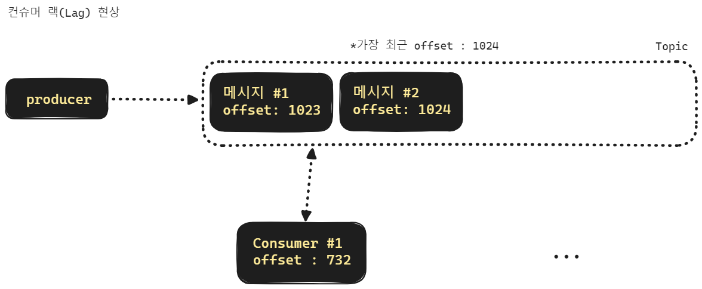

## kafka 의 주요 개념들

 

> 출처 : https://www.educba.com/kafka-replication-factor/

 

> 출처 : https://medium.com/@_amanarora/replication-in-kafka-58b39e91b64e

 

## Kafka 의 주요 특징

1. **분산 시스템:**
   - Kafka는 여러 브로커(서버)로 구성된 분산 시스템입니다. 이는 확장성을 지원하며 높은 부하와 대량의 데이터를 처리할 수 있도록 합니다.
2. **고가용성 및 복제:**
   - Kafka는 데이터의 고가용성을 보장하기 위해 데이터를 여러 브로커에 복제합니다. 따라서 하나의 브로커에 장애가 발생하더라도 데이터 손실 없이 서비스를 지속할 수 있습니다.
   - 데이터의 복제본을 여러 서버에 분산시켜서 저장하기에 서버하나가 실패하더라도 데이터 손실을 방지할 수 있다는 것은 장점입니다. 
   - 고가용성은 시스템이 장애나 오류에 강건하게 대응하고 지속적으로 운영되며 사용가능한 상태를 유지하는 능력을 의미합니다. 고가용성이 높은 시스템은 사용자에게 지속적인 서비스를 제공할 수 있으며 장애 발생 시에도 데이터의 손실을 최소화 하고 빠른 회복을 할 수 있습니다.
3. **고성능:**
   - Kafka는 대용량 데이터 처리를 목표로 하기 때문에 높은 성능을 제공합니다. 특히 디스크에 기록하면서도 낮은 지연 시간을 유지할 수 있습니다.
4. **스트림 처리:**
   - Kafka는 데이터를 실시간으로 처리할 수 있도록 스트림 처리를 지원합니다. Kafka Streams API를 사용하면 데이터에 대한 복잡한 연산을 수행하고 결과를 생성할 수 있습니다.
5. **확장성:**
   - 새로운 브로커를 추가함으로써 Kafka 클러스터의 용량을 쉽게 확장할 수 있습니다. 이는 시스템의 요구 사항이 변할 때 유연하게 대응할 수 있음을 의미합니다.
6. **유연한 보관 및 보존:**
   - Kafka는 데이터를 보관하고 기간별로 데이터를 보존할 수 있습니다. 이는 영구적인 데이터 저장과 이력 추적에 유용합니다.
7. **토픽 기반 메시지 시스템:**
   - Kafka는 토픽을 사용하여 메시지를 구분하고 구독하는 방식을 채택합니다. 이를 통해 데이터의 흐름을 조직화하고 특정 주제에 대한 데이터를 관리할 수 있습니다.
8. **다양한 클라이언트 지원:**
   - Kafka는 다양한 언어로 구현된 클라이언트를 지원하며, 프로듀서 및 컨슈머를 통한 데이터 흐름을 구축하기 위한 다양한 라이브러리를 제공합니다.

 

## 토픽

메시지를 적재하거나 구독할 수 있는 하나의 메시지 대기열 같은 개념입니다. 토픽은 파티션 1개로만 운영할 수도 있고 여러개의 파티션으로 나누어 운영할 수 도 있습니다.  

파티션을 1개로 구성할 경우 컨슈머 랙 증상이 발생할 수 있기 때문에 파티션을 여러개로 구성해서 사용하는 경우가 많습니다. 

일반적으로는 토픽 하나에 파티션을 여러 개 두어서 컨슈머 랙 증상을 방지하는 편입니다. 

여러 개의 파티션으로 나눌 경우 각 파티션을 바라봐야 할 컨슈머 개수도 파티션의 개수에 맞춰서 운영합니다. 그런데 파티션의 개수보다 컨슈머의 수가 더 많을 경우 일부 컨슈머는 파티션을 할당받지 못하고 대기 상태가 됩니다. 위의 그림에서는 초록색 배경으로 표시한 컨슈머가 유휴상태에 진입했네요. 컨슈머와 컨슈머 그룹, 컨슈머 리밸런싱에 대해서는 뒤에서 따로 정리합니다. 

 

## 메시지, 프로듀서, 컨슈머, 컨슈머 그룹

**메시지** 

토픽에 적재되는 개별 데이터를 메시지라고 합니다. 메시지는 key, value, timestamp 로 구성됩니다.  

 

**프로듀서** 

토픽에 데이터를 적재하는 역할을 합니다. 

프로듀서는 여러가지 언어로 작성 가능합니다. 

 

**컨슈머** 

컨슈머는 토픽을 구독해서 메시지를 읽어들이는 역할을 수행합니다. 보통 컨슈머의 개수는 파티션의 개수에 맞춰서 띄웁니다. 

 

**컨슈머 그룹** 

보통 토픽을 파티션 1개로만 운영하는 경우가 없기때문에 여러개의 파티션으로 구성하는데, 이렇게 파티션을 여러개로 나누어 둔 경우 컨슈머 역시 파티션 갯수에 맞춰서 띄웁니다. 그리고 띄운 컨슈머들을 하나의 그룹으로 묶어서 하나의 그룹으로 인식하는데 이것을 컨슈머 그룹이라고 합니다.. 

  

## 컨슈머 랙

컨슈머는 토픽을 구독해서 메시지를 읽어들입니다.  그런데 프로듀서가 메시지를 발행하는 속도에 비해 컨슈머가 메시지를 읽어서 처리하는 속도가 느릴 경우 점점 컨슈머의 오프셋이 가장 최신 오프셋으로부터 멀어지게 됩니다. 이렇게 컨슈머의 읽기 속도가 메시지 발급속도를 따라가지 못하는 현상을 **"컨슈머 랙(Consumer Lag)"** 이라고 부릅니다. 

 

## 파티션과 컨슈머 그룹

컨슈머 랙 증상은 토픽을 여러 개의 파티션으로 구성하고 각각의 파티션을 구독하는 컨슈머들을 파티션 갯수만큼 띄우는 것으로 해결이 가능합니다.

**파티션** 

파티션은 토픽을 여러개로 나눈 토픽 내부의 메시지 대기열을 의미합니다. 파티션은 프로듀서가 보내는 메시지의 메시지 키 값에 의해 파티션이 선택됩니다. 이 메시지 키 값을 지정하지 않고 메시지를 전송할 경우 내부적으로 라운드 로빈 방식으로 파티션을 선택해서 데이터를 전송하게 됩니다. 

위의 그림은 파티션 키 알고리즘을 메시지 키가 정수일 때 홀수/짝수인지에 따라서 파티션이 선택되도록 한 경우로 지정했을 경우에 대한 그림입니다. 실무에서는 파티션 키를 제품의 키를 기준으로 한다던가 등등 여러가지 케이스들이 있습니다. 

 

**컨슈머 그룹** 

하나의 토픽 내에 파티션을 각각 하나씩 바라보는 컨슈머들을 하나의 그룹으로 묶을 수 있는데 이것을 컨슈머 그룹이라고 합니다. 컨슈머 그룹은 여러개를 운영하는 것이 가능합니다.  

만약 토픽 하나에 대한 파티션 개수보다 컨슈머 그룹내의 컨슈머 개수가 더 많다면 어떻게 될까요? 이런 경우 놀고 있는(유휴(Idle)) 상태의 컨슈머가 생기게 됩니다. 장애로 이어지지는 않지만 자원 낭비가 생기게 됩니다. 

 

## 순서가 중요한 메시지일 경우

순차적인 메시지 처리를 하게끔 해야 하는 경우가 있습니다. 이런 경우 어떻게 하면 문제를 해결할 수 있는지를 정리해봅니다.

토픽을 여러 개의 파티션으로 파티셔닝하면 메시지가 순차적으로 처리는 것을 보장하지 못하게 됩니다.  

예를 들어서 **주문완료 → 결제완료 → 상품준비중** 의 순서로 메시지를 보내야 하는 경우가 있습니다. 

만약 파티션 알고리즘에 따라 처리하거나, 기본 설정인 라운드 로빈 방식으로 처리할 경우 주문완료 메시지는 파티션 1에, 결제완료는 파티션 2에, 상품 준비중 이벤트는 파티션1에 쌓이게 되어서 메시지가 순차적으로 전달되지 않을 수 있습니다. 

이런 경우 특정 상품을 장바구니에서 주문/결제 하는 기능에 대해서는 특정 파티션을 선택해서 메시지를 전송하게끔 하는 것으로 이런 문제를 해결 가능합니다. 

 

## 카프카 브로커

카프카 브로커는 토픽들과 파티션들을 가지고 운영하고 있는 하나의 물리적인 서버를 의미합니다. 

> 어쩌다 보니 그림이 너무 크게 추출되었는데 그림 사이즈 수정하는 도구를 찾아서 문제를 해결하겠습니다!!! 

 

## 카프카 브로커 클러스터링

몽고DB의 레플리카셋, 샤드 클러스터를 구성해보셨거나 k8s 앱을 작성해보신 분들이라면 클러스터링이라는 것이 무엇을 의미하는지 아실 겁니다. 카프카 브로커 역시 클러스터링이 가능합니다. 

위의 그림에서 보듯 주키퍼(zookeeper)를 통해서 브로커들의 상태를 관리하고, 리더파티션 선출, 메타데이터 관리 등의 역할을 합니다. 주키퍼(zookeeper) 역시 클러스터링이 가능합니다. 

## 카프카 브로커 장애 발생시 리더 파티션 재선출

위의 그림에서는 1번 브로커 에서 장애가 생겼습니다. 브로커 1 에는 파티션 1을 리더 파티션으로 운영되고 있었습니다. 이렇게 장애가 생긴 경우 주키퍼(zookeeper)가 브로커들의 상태를 체크하고 있다가 장애를 파악하면 리더 파티션을 투표를 통해서 선출하게 되는데요. 위의 그림에서는 2번 브로커 내의 1번 파티션이 리더로 선출된 것을 확인 가능합니다. 

참고로 주키퍼(zookeeper) 역시 클러스터링이 가능합니다. 

 

## 가용성(Availability)

**가용성(Availability) 라는 단어는 Available 해야 한다**는 성격을 의미합니다. **어떤 노드나 커넥션 포인트가 계속해서 접근이 가능한 성격을 띄어야 한다**는 이야기 입니다. 만약 노드 하나가 통신이 불가능한 상황이 되었을 때 같은 그룹 내의 다른 노드가 그 역할을 대신할 수 있어야 하는데, 이와 같은 용어를 가용성(Availability) 라고 부릅니다. 

가용성 이라는 한글,한문 단어는 흔히 자주 언급되는 개념이지만, 쉽게 와닿지 않는 답답한 단어 같습니다. 오히려 영어인 Availability 가 더 합리적인 단어로 느껴집니다.  

가용성(Availability)를 지원하는 순간 리소스를 어느 정도는 소모를 해야 합니다. 다른 노드 들에 데이터를 복제한다던가 healthcheck 를 한다던가 하는 동작이 필요합니다. 따라서 단순한 로컬 캐시에 비해서는 성능적으로 조금은 느려질 수 있지만, 크게 느려지는 수준은 아니며, 증분방식의 메트릭 수집등을 하기에 심각한 성능 소모는 없습니다. 

예를 들면 로컬 캐시를 구성하더라도 로컬 캐시가 노드마다 하나씩 복제되어 있다거나 하는 그런 안전한 대책이 필요하다면 EhCache 기반의 로컬 캐시를 사용하기 보다는 Hazelcast 를 기반으로 로컬 캐시 역할도 가능하면서 Clustering 이 가능하도록 인메모리 그리드로 구성하게 됩니다. 

레디스를 구성할 때 여러 노드 기반으로 클러스터링이 된 클러스터를 구성하는 것 역시 가용성(Availability) 를 제공하기 위한 개념 중 하나라고 할 수 있습니다. 

## Partition, RF, ISR 

### Partition

> 위에서 한번 정리했지만, 이번에는 RF, ISR 을 설명하기 위해 간단하게 요약해봅니다.

하나의 토픽은 여러개의 파티션으로 분리될 수 있습니다. 파티션은 데이터가 저장될 위치를 의미합니다. 즉, 데이터에 대해 파티셔닝 알고리즘을 적용해서 특정 파티션으로만 데이터가 전달될 수 있도록 파티션의 위치를 지정해주는 것을 파티셔닝이라고 합니다. 

파티션이 많으면 성능은 향상되지만 절대적이지는 않습니다. 브로커 성능에는 한계가 있기 때문입니다. 

### RF (Replication Factor)

하나의 파티션은 1개 이상의 복제본 (Replica) 을 가질 수 있습니다. RF (Replication Factor) 는 복제본의 갯수를 의미합니다. RF가 1보다 크면 클수록 가용성(Availability)이 높아진다고 할 수 있습니다. 물론, 이때 브로커 갯수가 충분해야 합니다. 

RF 가 너무 크면 저장공간이 낭비된다는 단점이 있습니다. Produce 시에도 지연시간이 길어집니다. 복제해줘야 하는 노드가 많아지기 때문입니다. 

일반적으로 Replica 의 갯수는 Broker 의 갯수보다 적은 것이 권장됩니다. 그래야 안정적이고 성능 부하가 없습니다. 

아래의 그림들을 참고해주시기 바랍니다.

> 출처 : https://www.educba.com/kafka-replication-factor/

 

> 출처 : https://medium.com/@_amanarora/replication-in-kafka-58b39e91b64e

 

### ISR (In-Sync Replica)

Replica 중 Sync 를 맞출 Replica 의 그룹을 ISR (In-Sync Replica) 그룹이라고 이야기합니다. 

Partition 의 복제본이 많아지면 가용성(Availability)가 늘어납니다. 그리고 'Produce' 시에도 복제해야 할 데이터가 늘어납니다. 이렇게 되면 Produce 시의 지연 시간이 길어질 수 있다는 단점이 생깁니다. 

 

ISR 그룹에 많은 파티션을 포함하고 있으면

- Produce 신뢰성/가용성 향상
- but, 지연시간 증가

ISR 그룹에 적은 파티션을 포함하고 있으면

- Produce 신뢰성/가용성 하락
- but, 지연시간 감소

 

"적절하게 토픽에 Produce 되었다"

- → "토픽 내의 파티션들의 모든 ISR 그룹에 복제가 잘 이뤄졌다."

 

Produce 가 되었다는 의미에는 꼭 ISR 그룹에 복제하는 작업도 모두 완료되었다는 의미가 내포되어 있다는 사실을 기억해야 합니다. 

 

## RabbitMQ

RabbitMQ 의 경우 데이터를 그대로 보냅니다. 전송 레벨에서의 commit, rollback 이 없습니다. 따라서 전송실패나 예외 상황에 대한 예외 처리를 직접 작성해줘야 합니다. 캐싱전략을 잘짜거나 등등 이런 전략을 잘 구현한다면 예외 상황에 대한 대응이 가능해집니다. 

 

## Kafka

카프카의 경우 전송 레벨에서의 commit, rollback 이 지원됩니다. 메시지 큐 레벨에서의 메시지 트랜잭션이라는 것이 존재합니다. 그런데, 간혹 이것을 비즈니스 실패시의 실패와 혼동해서 사용할 경우가 가끔 있는데, 단순한 전송 기능의 실패와 비즈니스 로직 실패와는 구별해서 사용해야 합니다. 

 

