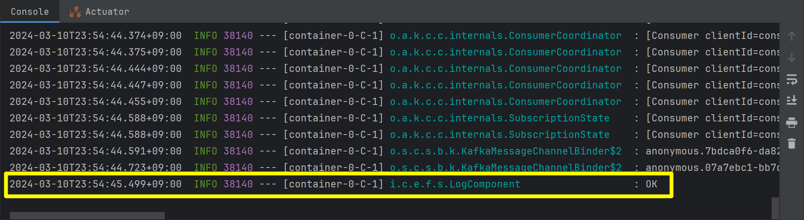
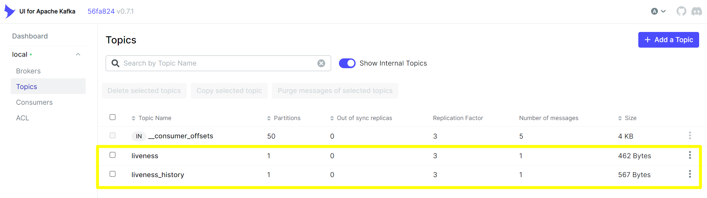
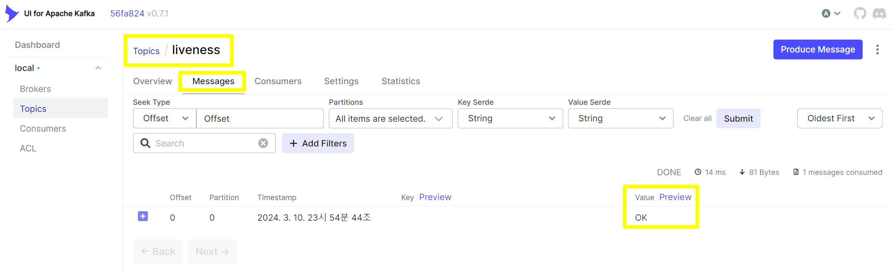
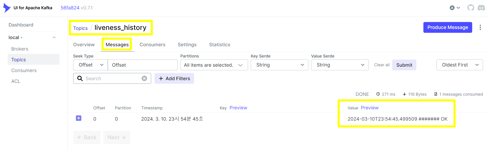

## Spring Cloud Stream Kafka Binder

## 참고

- [Spring Cloud Stream Reference Guide](https://docs.spring.io/spring-cloud-stream/docs/current-snapshot/reference/htmlsingle/)
- [docs.spring.io - spring cloud stream / Spring Cloud Function Support](https://docs.spring.io/spring-cloud-stream/docs/current/reference/html/spring-cloud-stream.html#spring_cloud_function)
- [docs.spring.io - Producing and Consuming Messages](https://docs.spring.io/spring-cloud-stream/reference/spring-cloud-stream/producing-and-consuming-messages.html)
- [spring-cloud-stream/Spring Cloud Stream Reference Documentation/Testing](https://docs.spring.io/spring-cloud-stream/reference/spring-cloud-stream/spring_integration_test_binder.html)
- [Streaming with Spring Cloud](https://medium.com/walmartglobaltech/streaming-with-spring-cloud-24a001ad307a)
- [Introduction to Spring Cloud Stream](https://www.baeldung.com/spring-cloud-stream)
- [Guide to Spring Cloud Stream with Kafka, Apache Avro and Confluent Schema Registry](https://www.baeldung.com/spring-cloud-stream-kafka-avro-confluent)

<br/>


## Spring Cloud Stream Kafka Binder 란?

설명 추가 예정


<br/>


## 도커 구동

개발 용도의 카프카를 로컬에서 구동해서 결과를 확인하시려면 [Docker Compose](/spring-cloud-stream-and-kafka/kafka-docker-compose) 을 참고해주세요.<br/>

<br/>


## 예제 시나리오

설명 추가 예정


<br/>


## 의존성 추가

```kotlin
extra["springCloudVersion"] = "2023.0.0"

dependencies {
    // spring-cloud-stream
    implementation("org.springframework.cloud:spring-cloud-stream")
    testImplementation("org.springframework.cloud:spring-cloud-stream-test-binder")
    
	// spring-cloud-stream-binder-kafka
    implementation("org.springframework.cloud:spring-cloud-stream-binder-kafka")
    
    // ...
}

dependencyManagement {
  imports {
    mavenBom("org.springframework.cloud:spring-cloud-dependencies:${property("springCloudVersion")}")
  }
}
```

<br/>


## application.yml


위의 그림과 같은 입력 출력을 갖도록 하기 위해 Spring Cloud Stream 의 bindings 를 작성해주고 kakfa 에 대한 binder 와 bindings 를 작성해줍니다.<br/>

아래 3개의 속성들에 대해 세부 속성들을 설정합니다.

- spring.cloud.stream.kafka.binder
- spring.cloud.stream.kafka.bindings
- spring.cloud.stream.bindings

```yaml
spring:
  cloud:
    function:
      definition: livenessCheck;appendCurrTime;logLiveness
    stream:
      kafka:
        binder:
          brokers: localhost:9092,localhost:9093,localhost:9094
        bindings:
          appendCurrTime-in-0:
            consumer:
              start-offset: latest
          logLiveness-in-0:
            consumer:
              start-offset: earliest
      bindings:
        livenessCheck-out-0:
          binder: kafka
          destination: liveness
          content-type: text/plain
        appendCurrTime-in-0:
          binder: kafka
          destination: liveness
          content-type: text/plain
        appendCurrTime-out-0:
          binder: kafka
          destination: liveness_history
          content-type: text/plain
        logLiveness-in-0:
          binder: kafka
          destination: liveness
          content-type: text/plain

```

<br/>


### spring.cloud.function.definition

```yaml
spring:
  cloud:
    function:
      definition: livenessCheck;appendCurrTime;logLiveness
    stream:
      kafka:
        binder:
          # ...
        bindings:
          # ...
      bindings:
        # ...
```

<br/>


### spring.cloud.stream.kafka.binder

설명 추가 예정

```yaml
spring:
  cloud:
  	function:
      definition: # ...
    stream:
      kafka:
        binder:
          brokers: localhost:9092,localhost:9093,localhost:9094
        # ...
      bindings:
        # ...
```

<br/>


### spring.cloud.stream.kafka.bindings

설명 추가 예정

```yaml
spring:
  cloud:
  	function:
      definition: # ...
    stream:
      kafka:
        binder:
          # ...
        bindings:
          appendCurrTime-in-0:
            consumer:
              start-offset: latest
          logLiveness-in-0:
            consumer:
              start-offset: earliest
      bindings:
        # ...
```


### spring.cloud.stream.bindings

설명 추가 예정

```yaml
spring:
  cloud:
  	function:
      definition: # ...
    stream:
      kafka:
        binder:
          # ...
        bindings:
          # ...
      bindings:
        livenessCheck-out-0:
          binder: kafka
          destination: liveness
          content-type: text/plain
        appendCurrTime-in-0:
          binder: kafka
          destination: liveness
          content-type: text/plain
        appendCurrTime-out-0:
          binder: kafka
          destination: liveness_history
          content-type: text/plain
        logLiveness-in-0:
          binder: kafka
          destination: liveness
          content-type: text/plain
```

<br/>


## StreamFunctionConfig.java


위의 그림과 같은 입력, 출력을 위한 Supplier, Function, Consumer 정의입니다.

```java
package io.chagchagchag.example.foobar.spring_cloud_stream_kafka.config;

import io.chagchagchag.example.foobar.spring_cloud_stream_kafka.LogComponent;
import java.time.Duration;
import java.time.LocalDateTime;
import java.util.function.Consumer;
import java.util.function.Function;
import java.util.function.Supplier;
import lombok.RequiredArgsConstructor;
import org.springframework.context.annotation.Bean;
import org.springframework.context.annotation.Configuration;
import reactor.core.publisher.Flux;
import reactor.core.publisher.Mono;

@RequiredArgsConstructor
@Configuration
public class StreamFunctionsConfig {
  private final LogComponent logComponent;
  @Bean
  public Supplier<Flux<String>> livenessCheck(){
    return () -> Mono
        .delay(Duration.ofSeconds(10))
        .thenMany(Flux.just("OK"));
  }

  @Bean
  public Function<Flux<String>, Flux<String>> appendCurrTime(){
    return fluxString -> fluxString.handle((str, sink) -> {
      try{
        var currTime = LocalDateTime.now().toString();
        sink.next(String.format("%s ####### %s", currTime, str));
      }
      catch (Exception e){
        e.printStackTrace();
        sink.error(new IllegalStateException("stringToBigDecimal Error"));
      }
    });
  }

  @Bean
  public Consumer<Flux<String>> logLiveness(){
    return strFlux -> strFlux.subscribe(str -> logComponent.info(str));
  }

}
```

<br/>


### LogComponent.java

위의 코드에서 주입받았던 LogComponent 코드는 아래와 같습니다.

```java
package io.chagchagchag.example.foobar.spring_cloud_stream_kafka;

import lombok.extern.slf4j.Slf4j;
import org.springframework.stereotype.Component;

@Slf4j
@Component
public class LogComponent {
  public void info(String msg){
    log.info(msg);
  }
}
```

<br/>


## 애플리케이션 실행 & 동작 확인

### SpringCloudStreamKafkaApplication

애플리케이션 코드를 실행합니다.

```java
package io.chagchagchag.example.foobar.spring_cloud_stream_kafka;

import org.springframework.boot.SpringApplication;
import org.springframework.boot.autoconfigure.SpringBootApplication;

@SpringBootApplication
public class SpringCloudStreamKafkaApplication {
  public static void main(String[] args) {
    SpringApplication.run(SpringCloudStreamKafkaApplication.class, args);
  }
}
```

<br/>


### ok 로그 확인

애플리케이션 로그가 로딩 시에 아래와 같이 잘 나타나는지 확인합니다.



<br/>


## 카프카 토픽 확인

### 토픽 생성 확인



<br/>


### liveness 토픽 확인



<br/>


### livenss_history 토픽 확인

데이터가 정상적으로 저장되어 있음을 확인 가능합니다.


