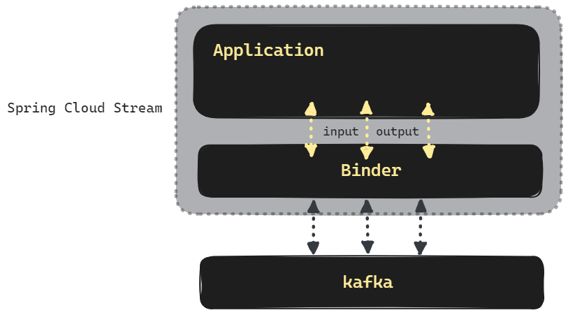
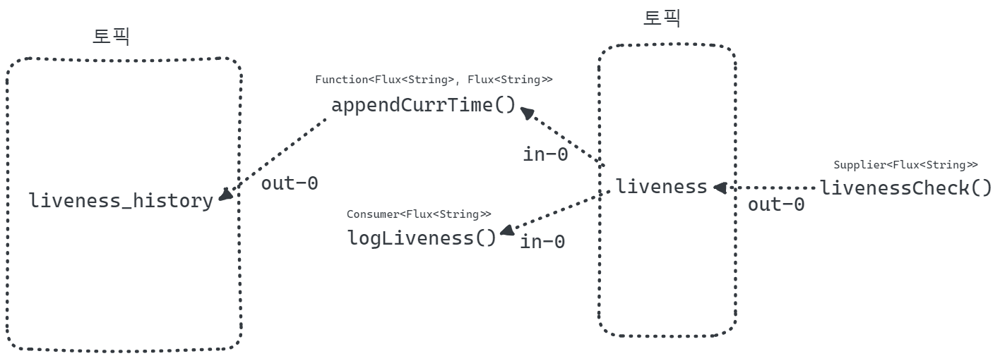

## Spring Cloud Stream Kafka Binder

## 참고

- [Spring Cloud Stream Reference Guide](https://docs.spring.io/spring-cloud-stream/docs/current-snapshot/reference/htmlsingle/)
- [docs.spring.io - spring cloud stream / Spring Cloud Function Support](https://docs.spring.io/spring-cloud-stream/docs/current/reference/html/spring-cloud-stream.html#spring_cloud_function)
- [docs.spring.io - Producing and Consuming Messages](https://docs.spring.io/spring-cloud-stream/reference/spring-cloud-stream/producing-and-consuming-messages.html)
- [spring-cloud-stream/Spring Cloud Stream Reference Documentation/Testing](https://docs.spring.io/spring-cloud-stream/reference/spring-cloud-stream/spring_integration_test_binder.html)
- [Streaming with Spring Cloud](https://medium.com/walmartglobaltech/streaming-with-spring-cloud-24a001ad307a)
- [Introduction to Spring Cloud Stream](https://www.baeldung.com/spring-cloud-stream)
- [Guide to Spring Cloud Stream with Kafka, Apache Avro and Confluent Schema Registry](https://www.baeldung.com/spring-cloud-stream-kafka-avro-confluent)

<br/>


## Spring Cloud Stream Kafka Binder 란?

설명 추가 예정


<br/>


## 예제 시나리오

설명 추가 예정



<br/>


## 의존성 추가

```kotlin
extra["springCloudVersion"] = "2023.0.0"

dependencies {
    // spring-cloud-stream
    implementation("org.springframework.cloud:spring-cloud-stream")
    testImplementation("org.springframework.cloud:spring-cloud-stream-test-binder")
    
	// spring-cloud-stream-binder-kafka
    implementation("org.springframework.cloud:spring-cloud-stream-binder-kafka")
    
    // ...
}

dependencyManagement {
  imports {
    mavenBom("org.springframework.cloud:spring-cloud-dependencies:${property("springCloudVersion")}")
  }
}
```

<br/>


