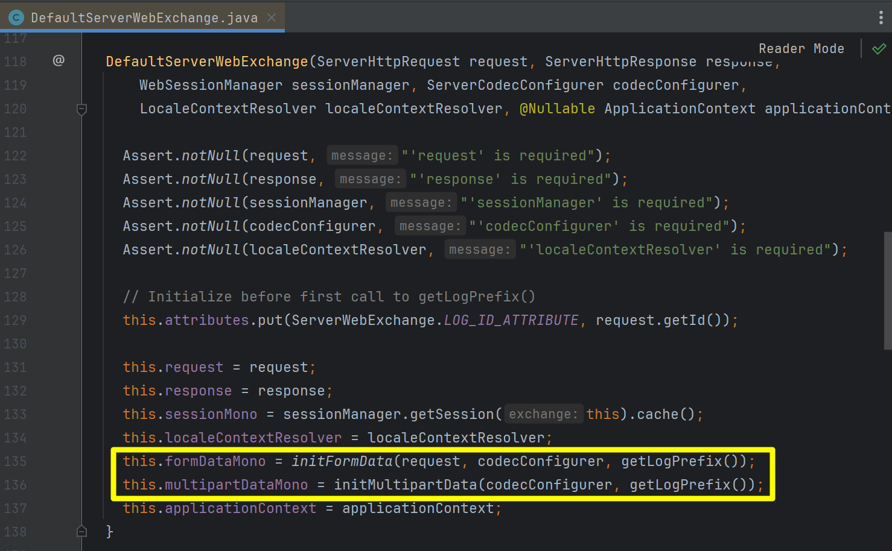
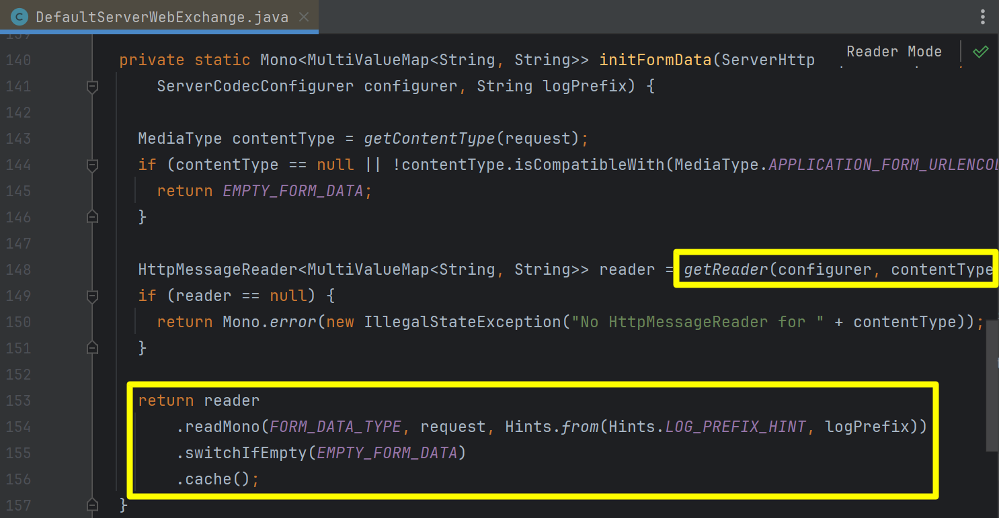
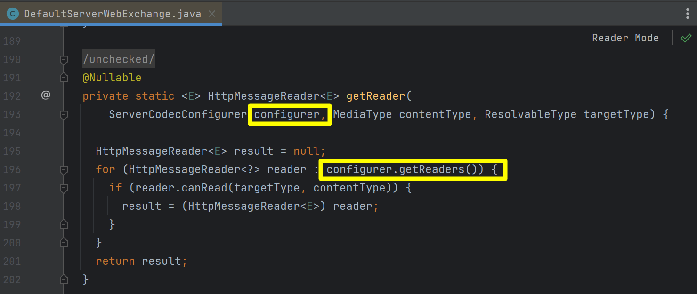

## Codec

Codec 은 어떤 타입의 객체를 다른 타입의 객체로 변환해주는 기능을 의미합니다. 주로 `-Encoder`, `-Decoder` 라는 접두사가 붙는 경우가 많습니다. Spring Webflux 외에도 Spring MVC, JPA, Spring Reactive MongoDB, Spring Dat aR2DBC, 메시징 등에서 커스텀 자료형 변환을 위해 널리 인식되는 개념들입니다. 

## 내부 동작

이전 문서에서 살펴봤듯 DispatchHandler 는 HandlerAdapter 의 handle() 메서드를 호출해서 요청을 처리합니다. 만약 일반적인 웹 요청이라면 일반적으로 HttpWebHandlerAdapter 의 handle() 메서드를 사용하게 됩니다. 

그리고 handle() 메서드 내부에서는 `createExchange(req, resp)` 메서드를 호출해서 `ServerWebExchange` 객체를 생성합니다. 객체 생성시에 DefaultServerWebExchange 객체로 생성하는데 이때 HttpWebHandlerAdapter 내부의 codecConfigurer 를 인자값으로 전달해주는 것을 확인 가능합니다. 

 

DefaultServerWebExchange 에서는 객체 생성의 생성자는 아래와 같습니다. 

Form Data 또는 Multipart Data 에 대해서 codecConfigurer 와 request 를 기반으로 Mono\<MultiValueMap\<String, String\>\> 객체로 만들어서 formDataMono, multipartDataMono 와 같은 필드들을 초기화합니다.

 

initFormData() 메서드의 내부를 보면 적절한 Reader 객체로 만들고 이것을 기반으로 Mono\<MultiValueMap\<String, String\>\> 타입의 데이터를 만들어서 return 하고 있습니다.

 

DefaultServerWebExchange 클래스 내의 getReader() 메서드 내의 구현을 보면 아래와 같습니다. configurer 내에 등록된 여러 종류의 Reader 를 순회하면서 원하는 타입을 읽을수 있는지 없는지를 체크 후 찾았다면 해당 Reader 를 반환하는 방식입니다. 이 코드를 통해 알 수 있는 것은 **"각각의 개별 CodecConfigurer는 자기 자신에 맞는 Reader 들을 여러 종류로 가지고 있다."** 라는 것을 확인 가능합니다.

 

## Decoder, Reader

Spring Webflux 에서 자주 쓰이는 대표적인 Decoder, Reader 들을 정리해봅니다.

## Encoder, Writer

Spring Webflux 에서 자주 쓰이는 대표적인 Encoder, Writer 들을 정리해봅니다.

