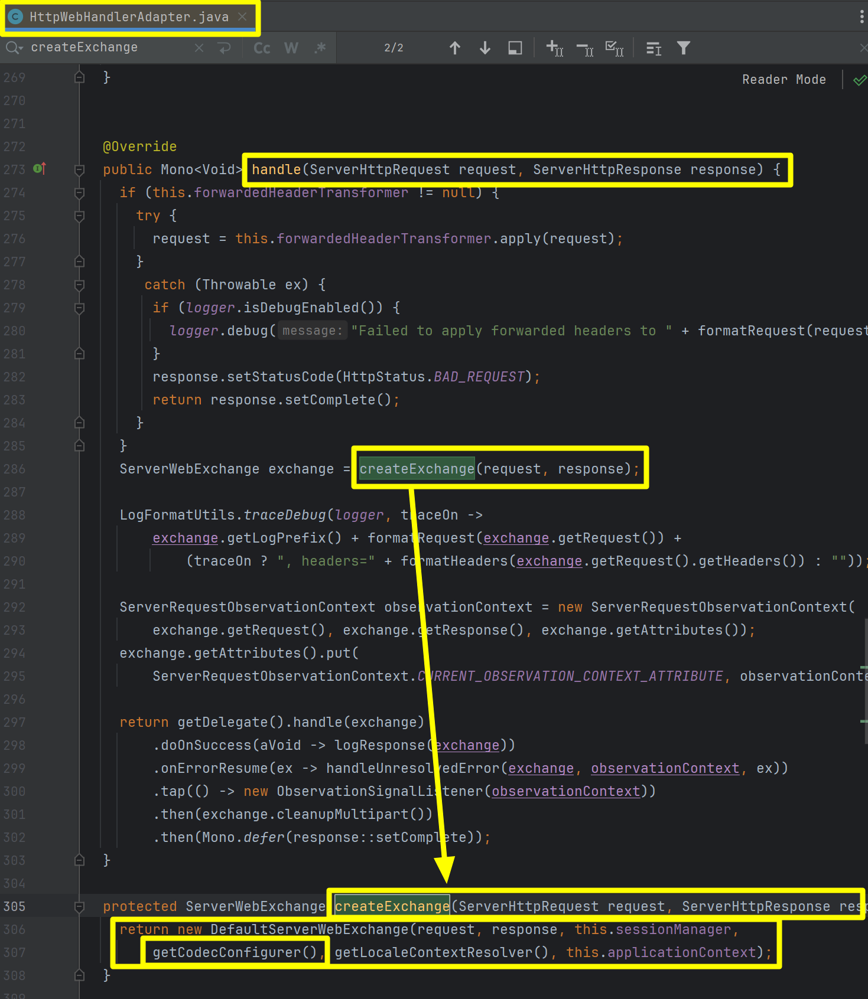

## Codec

Codec 은 어떤 타입의 객체를 다른 타입의 객체로 변환해주는 기능을 의미합니다. 주로 `-Encoder`, `-Decoder` 라는 접두사가 붙는 경우가 많습니다. Spring Webflux 외에도 Spring MVC, JPA, Spring Reactive MongoDB, Spring Dat aR2DBC, 메시징 등에서 커스텀 자료형 변환을 위해 널리 인식되는 개념들입니다.<br/>


## 내부 동작

이전 문서에서 살펴봤듯 DispatchHandler 는 HandlerAdapter 의 handle() 메서드를 호출해서 요청을 처리합니다. 만약 일반적인 웹 요청이라면 일반적으로 HttpWebHandlerAdapter 의 handle() 메서드를 사용하게 됩니다.<br/>

그리고 handle() 메서드 내부에서는 `createExchange(req, resp)` 메서드를 호출해서 `ServerWebExchange` 객체를 생성합니다. 객체 생성시에 DefaultServerWebExchange 객체로 생성하는데 이때 HttpWebHandlerAdapter 내부의 codecConfigurer 를 인자값으로 전달해주는 것을 확인 가능합니다.<br/>



<br/>


DefaultServerWebExchange 에서는 객체 생성의 생성자는 아래와 같습니다.<br/>

Form Data 또는 Multipart Data 에 대해서 codecConfigurer 와 request 를 기반으로 Mono\<MultiValueMap\<String, String\>\> 객체로 만들어서 formDataMono, multipartDataMono 와 같은 필드들을 초기화합니다.


<br/>


initFormData() 메서드의 내부를 보면 적절한 Reader 객체로 만들고 이것을 기반으로 Mono\<MultiValueMap\<String, String\>\> 타입의 데이터를 만들어서 return 하고 있습니다.


<br/>


DefaultServerWebExchange 클래스 내의 getReader() 메서드 내의 구현을 보면 아래와 같습니다. configurer 내에 등록된 여러 종류의 Reader 를 순회하면서 원하는 타입을 읽을수 있는지 없는지를 체크 후 찾았다면 해당 Reader 를 반환하는 방식입니다. 이 코드를 통해 알 수 있는 것은 **"각각의 개별 CodecConfigurer는 자기 자신에 맞는 Reader 들을 여러 종류로 가지고 있다."** 라는 것을 확인 가능합니다.


<br/>


## Decoder, Reader

Spring Webflux 에서 자주 쓰이는 대표적인 Decoder, Reader 들을 정리해봅니다.

### 기본자료형 Decoder 

- ByteArrayDecoder : DataBuffer 를 byte array 로 decode 하는 decoder 입니다.
- ByteBufferDecoder : DataBuffer 를 `java.nio.ByteBuffer` 로 decode 하는 decoder 입니다.
- DataBufferDecoder : DataBuffer 를 DataBuffer 로 decode 하는 decoder 입니다.
- NettyByteBufDecoder : DataBuffer 를 `io.netty.buffer.ByteBuf` 로 decode 하는 decoder 입니다.
- ResourceDecoder : DataBuffer 를 Spring 의 Resource 로 decode 하는 decoder 입니다.
- StringDecoder : DataBuffer 를 String 으로 decode 하는 decoder 입니다.
- ProtobufDecoder : DataBuffer 를 `com.google.protobuf.Message` 로 decode 하는 decoder 입니다. `decode.google.protobuf` 라이브러리가 있을 때에만 등록됩니다.

<br/>

### 객체 Serialization 관련 Decoder

- Jackson2JsonDecoder : jackson 라이브러리로 json 형태의 DataBuffer 를 객체로 decode 하는 Decoder 입니다. jackson 라이브러리가 있을 때에만 등록됩니다.
- KotlinSerializationJsonDecoder : `kotlinx.serialization` 라이브러리를 사용해서 json 형태의 DataBuffer 를 특정 객체 타입으로 decode 하는 decoder 입니다. `kotlinx.serialization` 라이브러리가 잇을 때에만 등록됩니다.
- Jackson2SmileDecoder : jackson 라이브러리를 사용해서 smail 형태의 DataBuffer 를 객체로 decode 하는 Decoder 입니다. `jackson-smile` 라이브러리가 있을 경우에만 등록됩니다.
- Jaxb2XmlDecoder : jaxb 를 사용해서 xml 형태의 DataBuffer 를 객체로 decode 하는 Decoder 입니다. jaxb 라이브러리가 있을 경우에만 등록됩니다.

<br/>

### Reader

- FormHttpMessaeReader : `application/x-www-form-urlencoded` 인 MediaType 에 대해 form 을 `MultiValueMap<String, String>` 형태로 읽어들이는 Reader 입니다.
- DefaultPartHttpMessageReader : `multipart/form-data` 인 MediaType 에 대해 Part 를 stream 형태로 읽어들이는 Reader 입니다.
- MultipartHttpMessageReader : `multipart/form-data` 인 MediaType 에 대해 `MultiValueMap<String, String>` 형태로 읽어들이는 Reader 입니다.

<br/>


## Encoder, Writer

Spring Webflux 에서 자주 쓰이는 대표적인 Encoder, Writer 들을 정리해봅니다.

<br/>


### 기본자료형 Encoder

- ByteArrayEncoder : byte array 를 DataBuffer 로 encode 하는 Encoder 입니다.
- ByteBufferEncoder : `java.nio.ByteBuffer` 를 DataBuffer 로 encode 하는 Encoder 입니다.
- DataBufferEncoder : DataBuffer 를 DataBuffer 로 encode 하는 Encoder 입니다.
- NettyByteBufEncoder : `io.netty.buffer.ByteBuf` 를 DataBuffer 로 encode 하는 Encoder 입니다.
- CharSequenceEncoder : CharSequence 를 DataBuffer 로 encode 하는 Encoder 입니다.

<br/>


### 객체 Serializaion 관련 Encoder

- Jackson2JsonEncoder : jackson 라이브러리를 사용해서 객체를 json 형태의 DataBuffer 로 encode 하는 encoder 입니다. jackson 라이브러리가 있을 때에만 등록됩니다.
- KotlinSerializationJsonEncoder : `kotlinx.serialization` 라이브러리를 활용해서 객체를 json 형태의 DataBuffer 로 encode 하는 encoder 입니다. `kotlinx.serialization` 라이브러리가 있을 경우에만 등록됩니다.
- Jackson2SmailEncoder : `jackson` 라이브러리로 객체를 smile 형태의 DataBuffer 로 encode 하는 encoder 입니다. `jackson-smile` 라이브러리가 있을 때에만 등록됩니다.
- Jaxb2XmlEncoder : jaxb 를 사용해서 객체를 xml 형태의 DataBuffer 로 encode 하는 encoder 입니다. jaxb 라이브러리가 있을 때에만 등록됩니다.

<br/>


### 기본 웹 응답 Writer

- [ResourceHttpMessageWriter](https://docs.spring.io/spring-framework/docs/current/javadoc-api/org/springframework/http/codec/ResourceHttpMessageWriter.html) : HTTP 응답으로 리소스를 쓰는 역할을 수행합니다. canWrite(), writeResource(), write(), getWritableMediaTypes(), addHeaders(), addDefaultHeaders() 등과 같은 메서드를 제공합니다.
- [ProtobufHttpMessageWriter](https://docs.spring.io/spring-framework/docs/current/javadoc-api/org/springframework/http/codec/protobuf/ProtobufHttpMessageWriter.html) : Protocol Buffers 형식으로 직렬화된 데이터를 HTTP 응답으로 전송하는 역할을 합니다. Protocol Buffers는 구조화된 데이터를 효율적으로 직렬화하고 파싱하기 위한 바이너리 형식입니다.

<br/>


### 객체 응답 Writer

- ServerSentEventHttpMessageWriter : Server-Sent Events (SSE) 프로토콜을 통해 객체를 ServerSentEvent 로 encode 해서 write 하는 역할을 수행


## HTTP 요청,응답 구조

### JSON

#### webHandler 코드

Json 응답형식 테스트를 위해 간단한 WebHandler 코드를 작성했습니다. Content-Type 이 `application/json` 일 경우에 대한 코드입니다.<br/>

**JsonDataWebHandlerExample1.java**

```java
package io.chagchagchag.example.foobar.spring_webflux.codec;

import lombok.SneakyThrows;
import lombok.extern.slf4j.Slf4j;
import org.springframework.core.io.buffer.DataBuffer;
import org.springframework.http.codec.ServerCodecConfigurer;
import org.springframework.http.server.reactive.ReactorHttpHandlerAdapter;
import org.springframework.web.reactive.function.server.ServerRequest;
import org.springframework.web.server.ServerWebExchange;
import org.springframework.web.server.WebHandler;
import org.springframework.web.server.adapter.WebHttpHandlerBuilder;
import reactor.core.publisher.Mono;
import reactor.netty.http.server.HttpServer;

@Slf4j
public class JsonDataWebHandlerExample1 {
  private static record TickerQuery(
      String ticker
  ){}

  @SneakyThrows
  public static void main(String[] args) {
    log.info("main function started");

    var webHandler = new WebHandler(){
      @Override
      public Mono<Void> handle(ServerWebExchange exchange) {
        ServerCodecConfigurer codecConfigurer = ServerCodecConfigurer.create();
        var request = ServerRequest.create(
            exchange, codecConfigurer.getReaders()
        );

        var response = exchange.getResponse();

        var bodyMono = request.bodyToMono(TickerQuery.class);
        return bodyMono.flatMap(query -> {
          String tickerQuery = query.ticker();
          String ticker = tickerQuery == null ? "MSFT" : tickerQuery;

          String content = "You picked " + ticker;
          log.info("content = {}", content);

          Mono<DataBuffer> responseBody = Mono.just(
              response.bufferFactory().wrap(content.getBytes())
          );

          response.getHeaders()
              .add("Content-Type", "text/plain");

          return response.writeWith(responseBody);
        });
      }
    };

    var httpHandler = WebHttpHandlerBuilder
        .webHandler(webHandler)
        .build();

    var handlerAdapter = new ReactorHttpHandlerAdapter(httpHandler);

    HttpServer.create()
        .host("localhost").port(8080)
        .handle(handlerAdapter)
        .bindNow()
        .channel().closeFuture().sync();

    log.info("main function end");
  }
}
```

<br/>


#### http 요청 (intellij http)

```http
POST http://localhost:8080
Content-Type: application/json

{
  "ticker": "SMCI"
}

###
```


<br/>

#### 응답

```plain
HTTP/1.1 200 OK
Content-Type: text/plain
content-length: 15

You picked SMCI
```

<br/>


### Form

#### webhandler 코드

Form Data 응답 형식 테스트를 위해 WebHandler 코드를 작성했습니다. Content-Type 이 `x-www-form-urlencoded` 일 경우 exchange 객체 내의 getFormData() 메서드를 통해서 Form Data 를 MultiValueMap 형식으로 추출가능합니다.<br/>


**FormDataWebHandlerExample1.java**<br/>

```java 
package io.chagchagchag.example.foobar.spring_webflux.codec;

// ..

@Slf4j
public class FormDataWebHandlerExample1 {
  @SneakyThrows
  public static void main(String[] args) {
    log.info("main function started");

    var webHandler = new WebHandler(){
      @Override
      public Mono<Void> handle(ServerWebExchange exchange) {
        var request = exchange.getRequest();
        var response = exchange.getResponse();

        // 여기
        return exchange.getFormData()
            .flatMap(multiValueMap -> {
              String tickerQuery = multiValueMap.getFirst("ticker");
              String ticker = tickerQuery == null ? "NVDA" : tickerQuery;

              String content = "You picked " + ticker;
              log.info("content = {}", content);

              Mono<DataBuffer> responseBody = Mono.just(
                  response.bufferFactory()
                      .wrap(content.getBytes())
              );

              response.addCookie(ResponseCookie.from("ticker", ticker).build());
              response.getHeaders().add("Content-Type", "text/plain");
              return response.writeWith(responseBody);
            });
      }
    };

    var httpHandler = WebHttpHandlerBuilder
        .webHandler(webHandler)
        .build();

    var handlerAdapter = new ReactorHttpHandlerAdapter(httpHandler);

    HttpServer.create()
            .host("localhost").port(8080)
            .handle(handlerAdapter)
            .bindNow()
            .channel().closeFuture().sync();

    log.info("main function end");
  }
}

```

<br/>


#### http 요청 (intellij http)

```http
POST http://localhost:8080/
Content-Type: application/x-www-form-urlencoded

ticker=AMZN
```

<br/>


#### 응답

```plain
HTTP/1.1 200 OK
Content-Type: text/plain
set-cookie: ticker=AMZN
content-length: 15

You picked AMZN
```

<br/>


### Multipart

#### webhandler 코드 

간단한 테스트를 위해 multipart 데이터 요청을 처리하는 webHandler 코드를 작성했습니다.<br/>

**MultipartDataWebHandlerExample1.java**

```java
package io.chagchagchag.example.foobar.spring_webflux.codec;

import lombok.SneakyThrows;
import lombok.extern.slf4j.Slf4j;
import org.springframework.core.io.buffer.DataBuffer;
import org.springframework.http.ResponseCookie;
import org.springframework.http.codec.multipart.FormFieldPart;
import org.springframework.http.server.reactive.ReactorHttpHandlerAdapter;
import org.springframework.web.server.ServerWebExchange;
import org.springframework.web.server.WebHandler;
import org.springframework.web.server.adapter.WebHttpHandlerBuilder;
import reactor.core.publisher.Mono;
import reactor.netty.http.server.HttpServer;

@Slf4j
public class MultipartDataWebHandlerExample1 {
  @SneakyThrows
  public static void main(String[] args) {
    log.info("main function started");

    var webHandler = new WebHandler(){
      @Override
      public Mono<Void> handle(ServerWebExchange exchange) {
        return exchange.getMultipartData()
            .map(multiValueMap -> {
              return ((FormFieldPart) multiValueMap.getFirst("ticker")).value();
            })
            .flatMap(tickerQuery -> {
              String ticker = tickerQuery == null ? "MSFT" : tickerQuery;
              String content = "You picked " + ticker;
              log.info("content = {}", content);

              Mono<DataBuffer> responseBody = Mono.just(
                  exchange.getResponse()
                      .bufferFactory()
                      .wrap(content.getBytes())
              );

              exchange.getResponse().addCookie(
                  ResponseCookie.from("ticker", ticker).build()
              );

              exchange.getResponse().getHeaders()
                  .add("Content-Type", "text/plain");

              return exchange.getResponse().writeWith(responseBody);
            });
      }
    };

    var httpHandler = WebHttpHandlerBuilder
        .webHandler(webHandler)
        .build();

    var handlerAdapter = new ReactorHttpHandlerAdapter(httpHandler);

    HttpServer.create()
        .host("localhost").port(8080)
        .handle(handlerAdapter)
        .bindNow()
        .channel().closeFuture().sync();

    log.info("main function end");
  }
}
```

<br/>


#### http 요청 (intellij http)

```http
POST http://localhost:8080
Content-Type: multipart/form-data; boundary=WebAppBoundary

--WebAppBoundary
Content-Disposition: form-data; name="ticker"
Content-Type: text/plain

SMCI
--WebAppBoundary--
###
```


#### 응답

```plain
HTTP/1.1 200 OK
Content-Type: text/plain
set-cookie: ticker=SMCI
content-length: 15

You picked SMCI
```

