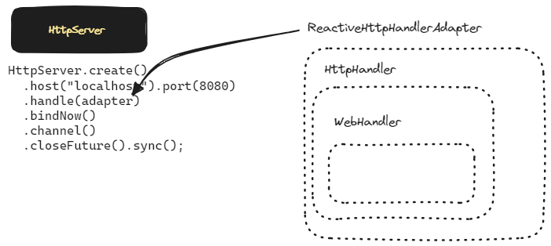
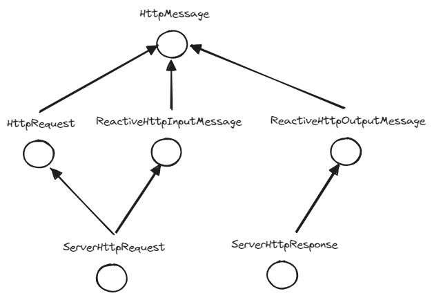
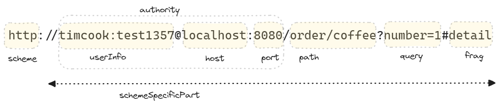

## DispatcherHandler 와 Spring Webflux

우리는 Servlet 기반의 Spring 을 개발할 때에는 보통 DispatcherServlet의 개념과 HandlerMapping 이 어떻게 매핑되고 요청이 응답되는지를 스터디해왔습니다.<br/>

Project Reactor 또는 RxJava, Mutiny 등과 같은 Reactive Manifesto 를 따르는 Reactive Streams 계열의 브러리는 Reactor Netty 환경에서 동작가능합니다.<br/>

그리고 Reactor Netty 환경에서는 DispatcherServlet 이 아닌 `DispatcherHandler` 를 중심으로 Request 와 Response 의 상호작용을 해결합니다.<br/>


## 참고자료

- [An introduction to Reactive Web](https://hantsy.github.io/spring-reactive-sample/web/intro.html)

<br/>


## DispatcherHandler 의 request,response 처리 흐름

DispatcherHandler 가 Resquest, Response 를 응답하기 위해 다른 객체들과 상호작용하는 그림을 그려보면 아래와 같습니다. DispatcherServlet 에서 보던 그림과 어느 정도는 유사하기에 친숙하게 느껴집니다.


<br/>

1\.

- 외부로부터 요청이 Reactor Netty 에 도착합니다.<br/>
- React Netty 는 이 요청을 DispatcherHandler 에 전달합니다.<br/>

2\. 3\. 

- DispatcherHandler 는 요청의 파라미터 등을 파악해서 이 요청은 어떤 HandlerMapping 에 맞는 것인지를 조회해서 적절한 HandlerMapping 을 찾아냅니다.

4\. 5\.

- DispatcherHandler 는 HandlerMapping 을 처리하기에 알맞는 HandlerAdapter 를 HandlerAdapter 목록에서 찾습니다. 

6\. 7\. 8\. 9\.

- DispatcherHandler 는 4\.5\. 에서 찾아낸 HandlerAdapter 객체의 handle() 메서드를 실행합니다. 이 `HandlerAdapter` 는 interface 인데, 이 것을 구현하고 있는 구현체 들 중 하나로부터 적절한 Controller 등을 찾아내서 Request 에 대한 처리를 수행합니다. 이 때 결과값은 HandlerResult 로 전달받게 됩니다.

10\. 11\.

- 위에서 구한 HandlerResult 를 처리할 수 있는 객체는 HandlerResultHandler 타입의 객체인데 보통 이런 HandlerResultHandler 는 여러개입니다. 이 중 적절한 HandlerResultHandler 를 찾아냅니다.

12\.

- DispatcherHandler 는 찾아낸 HandlerResultHandler 객체 내의 `handleResult()` 메서드를 실행합니다. 

13\.

- 그리고 DispatcherHandler 는 handleResult() 메서드로 실행한 결과를 Response 로 해서 Reactor Netty 에게 반환해줍니다.

<br/>


예를 들면 WebHandler 는 직접 작성한다면 아래와 같이 작성할 수 있습니다.

```java
package io.chagchagchag.example.foobar.spring_webflux;

import lombok.SneakyThrows;
import lombok.extern.slf4j.Slf4j;
import org.springframework.core.io.buffer.DataBuffer;
import org.springframework.http.ResponseCookie;
import org.springframework.http.server.reactive.HttpHandler;
import org.springframework.http.server.reactive.ReactorHttpHandlerAdapter;
import org.springframework.http.server.reactive.ServerHttpRequest;
import org.springframework.http.server.reactive.ServerHttpResponse;
import reactor.core.publisher.Mono;
import reactor.netty.http.server.HttpServer;

@Slf4j
public class HttpHandlerExample1 {
  @SneakyThrows
  public static void main(String[] args) {
    log.info("main function started");
    var httpHandler = new HttpHandler(){
      @Override
      public Mono<Void> handle(
          ServerHttpRequest request, ServerHttpResponse response
      ) {
        String tickerQueryParam = request.getQueryParams().getFirst("ticker");
        String ticker = tickerQueryParam == null ? "MSFT" : tickerQueryParam;

        String content = "You picked " + ticker;
        log.info("responseBody = {}", content);

        Mono<DataBuffer> responseBody = Mono.just(
            response.bufferFactory().wrap(content.getBytes())
        );

        response.addCookie(ResponseCookie.from("ticker", ticker).build());
        response.getHeaders().add("Content-Type", "text/plain");
        return response.writeWith(responseBody);
      }
    };

    var adapter = new ReactorHttpHandlerAdapter(httpHandler);
    HttpServer.create()
        .host("localhost").port(8080)
        .handle(adapter)
        .bindNow()
        .channel().closeFuture().sync();

    log.info("main function end");
  }
}

```

HttpHandler 는 HttpHandlerAdapter 에 주입 가능합니다. 그리고 HttpServer 는 HttpHandlerAdapter 를 주입받아서 처리할 수 있도록 로직을 작성합니다.<br/>


## Functional Endpoint, Annotated Controller 의 동작

Spring Webflux 에서는 함수형 엔드포인트, 선언형 컨트롤러(Annotated Controller) 가 있습니다. 두 방식 모두 잘 쓰이는 방식입니다. 개인적으로는 선언형 컨트롤러 (Annotated Controller) 를 선호합니다.<br/>

Functional Endpoint 와 Annotated Controller 는 DispatcherServlet 내에서 아래와 같이 동작합니다.


함수형 엔드포인트를 사용할 경우에는 RouterFunction 을 사용한다는 점과 선언형 컨트롤러 (Annotated Controller) 를 사용할 때에는 @RequestMapping 을 사용한다는 점을 기억하면 이해가 쉽습니다.

예를 들어 함수형 엔드포인트는 아래와 같이 Router 를 작성해서 어떤 REST API 의 어떤 METHOD 를 처리할 지를 명시하고 이 Router 를 처리할 Handler 를 정의하는 방식으로 작성합니다.

e.g.

> 예제 코드는 [https://github.com/chagchagchag/stock-cells-kr/tree/main/backend/stock-cells-kr-backend/src/main/java/io/stock/evaluation/web/price/api] 에서 확인 가능합니다.<br/>

<br/>

PriceApiRouter.java

```java
package io.stock.evaluation.web.price.api;

// ...

@Configuration
public class PriceApiRouter {

    @Bean
    public RouterFunction<ServerResponse> stockPriceByTickerRouter(PriceApiHandler priceApiHandler){
        return RouterFunctions
                .route().GET(
                        "/stock/price",
                        RequestPredicates.queryParam("ticker", v -> true),
                        priceApiHandler::getPriceBasicValuation
                ).build();
    }
}
```

<br/>


PriceApiHandler.java

```java
package io.stock.evaluation.web.price.api;

import io.stock.evaluation.web.crawling.stock.price.application.CrawlingValuationService;
import org.springframework.http.MediaType;
import org.springframework.stereotype.Component;
import org.springframework.web.reactive.function.BodyInserters;
import org.springframework.web.reactive.function.server.ServerRequest;
import org.springframework.web.reactive.function.server.ServerResponse;
import reactor.core.publisher.Mono;

import static org.springframework.web.reactive.function.server.ServerResponse.notFound;
import static org.springframework.web.reactive.function.server.ServerResponse.ok;

@Component
public class PriceApiHandler {
    private final CrawlingValuationService crawlingValuationService;

    public PriceApiHandler(CrawlingValuationService crawlingValuationService){
        this.crawlingValuationService = crawlingValuationService;
    }

    public Mono<ServerResponse> getPriceBasicValuation (ServerRequest serverRequest){
        return serverRequest.queryParam("ticker")
                .map(ticker -> {
                    return crawlingValuationService.getPriceBasicValuationData(ticker)
                            .flatMap(cdata -> ok()
                                        .contentType(MediaType.APPLICATION_JSON)
                                        .body(BodyInserters.fromValue(cdata))
                                        .switchIfEmpty(notFound().build())
                            );
                })
                .orElse(notFound().build());
    }
}
```

<br/>


## ServerWebExchange

ServerWebExchange 는 ServerHttpRequest, ServerHttpResponse 와 같은 요청객체, 응답객체를 접근가능하도록 하는 메서드를 제공하는 interface 입니다. 그리고 mulitpartData, formData 등을 모두 접근할 수 있는 메서드 역시 추상화 되어 있는 interface 입니다. [ServerWebExchange](https://docs.spring.io/spring-framework/docs/current/javadoc-api/org/springframework/web/server/ServerWebExchange.html) 자체는 interface 이며 구현체로는 [DefaultServerWebExchange](https://docs.spring.io/spring-framework/docs/current/javadoc-api/org/springframework/web/server/adapter/DefaultServerWebExchange.html), [MockServerWebExchange](https://docs.spring.io/spring-framework/docs/current/javadoc-api/org/springframework/mock/web/server/MockServerWebExchange.html), [ServerWebExchangeDecorator](https://docs.spring.io/spring-framework/docs/current/javadoc-api/org/springframework/web/server/ServerWebExchangeDecorator.html) 가 있습니다.<br/>

Servlet 기반의 Spring 환경에서는 HttpServletRequest, HttpServletResponse 객체를 사용했었습니다. Reactor Netty 기반의 Spring 환경에서는 HttpServerRequest, HttpServerResponse 객체를 요청/응답 객체로 사용한다는 사실을 기억해주시기 바랍니다.<br/>

일반적으로 Router 나 Controller 메서드에서 ServerHttpRequest, ServerHttpResponse 를 개별적으로 주입받아서 사용 가능하지만 ServerWebExchange 자체를 주입받아서 사용하는 경우도 있습니다.

**ServerWebExchange.java**<br/>

```java
public interface ServerWebExchange {
	String LOG_ID_ATTRIBUTE = ServerWebExchange.class.getName() + ".LOG_ID";
	ServerHttpRequest getRequest();
	ServerHttpResponse getResponse();

	Map<String, Object> getAttributes();

	@SuppressWarnings("unchecked")
	@Nullable
	default <T> T getAttribute(String name) {
		return (T) getAttributes().get(name);
	}
	@SuppressWarnings("unchecked")
	default <T> T getRequiredAttribute(String name) {
		T value = getAttribute(name);
		Assert.notNull(value, () -> "Required attribute '" + name + "' is missing");
		return value;
	}
	@SuppressWarnings("unchecked")
	default <T> T getAttributeOrDefault(String name, T defaultValue) {
		return (T) getAttributes().getOrDefault(name, defaultValue);
	}
	Mono<WebSession> getSession();
	<T extends Principal> Mono<T> getPrincipal();
	Mono<MultiValueMap<String, String>> getFormData();
	Mono<MultiValueMap<String, Part>> getMultipartData();
    
	default Mono<Void> cleanupMultipart() {
		return getMultipartData()
				.onErrorComplete()  // ignore errors reading multipart data
				.flatMapIterable(Map::values)
				.flatMapIterable(Function.identity())
				.flatMap(part -> part.delete().onErrorComplete())
				.then();
	}
    
	LocaleContext getLocaleContext();
    
	@Nullable
	ApplicationContext getApplicationContext();
	boolean isNotModified();
	boolean checkNotModified(Instant lastModified);
	boolean checkNotModified(String etag);
	boolean checkNotModified(@Nullable String etag, Instant lastModified);
	String transformUrl(String url);
	void addUrlTransformer(Function<String, String> transformer);
	String getLogPrefix();
	default Builder mutate() {
		return new DefaultServerWebExchangeBuilder(this);
	}

	interface Builder {
		Builder request(Consumer<ServerHttpRequest.Builder> requestBuilderConsumer);
		Builder request(ServerHttpRequest request);
		Builder response(ServerHttpResponse response);
		Builder principal(Mono<Principal> principalMono);
		ServerWebExchange build();
	}

}
```

주요 메서드들을 정리해보면 아래와 같습니다.

- getRequest(), getResponse : ServerHttpRequest, ServerHttpResponse

- getAttributes() : 요청 중 추가/변경 가능한 key/value 형태의 Map을 접근하는 함수.
- getSession() : Session 정보를 담고 있는 WebSessions **Publisher**를 반환
- getPrincipal() : Security 정보와 관련된 Principal **Publisher**를 반환
- getFormData() : Content-Type 이 application/x-www-form-urlencoded 인 데이터에 대해 MultiValueMap 의 형태의 데이터를 제공하는 **Publisher** 를 반환
- getMultipartData() : Content-Type 이 multipart/form-data 인 데이터에 대해 body 를 MultiValueMap 형태로 제공
- getApplicationContext() : Spring 환경에서 구동된 경우 applicationContext 를 반환. Spring 환경에서 구동된 것이 아닐 경우에는 null 을 리턴

<br/>


## WebHandler

ServerWebExchange 단위로 요청을 받으며, WebHandler 내에서 ServerWebExchanbe 객체를 통해 request, response 에 접근 가능합니다.

예를 들면 제일 처음에 봤던 예제인 아래 코드처럼 작성될 수 있습니다.

```java
package io.chagchagchag.example.foobar.spring_webflux;

// ...


@Slf4j
public class WebHandlerExample1_AcceptOnlyJson {
  private static record TickerRecord(
      String ticker
  ){

  }

  @SneakyThrows
  public static void main(String[] args) {
    var codecConfigurer = ServerCodecConfigurer.create();
    var webHandler = new WebHandler(){
      @Override
      public Mono<Void> handle(ServerWebExchange exchange) {
        final ServerRequest request = ServerRequest.create(exchange, codecConfigurer.getReaders());
        final ServerHttpResponse response = exchange.getResponse();

        var bodyToMono = request.bodyToMono(TickerRecord.class);
        return bodyToMono.flatMap(tickerRecord -> {
          String tickerQuery = tickerRecord.ticker();
          String ticker = tickerQuery == null ? "NVDA" : tickerQuery;

          String content = "You picked " + ticker;
          log.info("responseBody : {}", content);

          Mono<DataBuffer> responseBody = Mono.just(
              response.bufferFactory().wrap(content.getBytes())
          );

          response.getHeaders().add("Content-Type", "text/plain");
          return response.writeWith(responseBody);
        });
      }
    };

    final HttpHandler httpHandler = WebHttpHandlerBuilder
        .webHandler(webHandler)
        .build();

    final var adapter = new ReactorHttpHandlerAdapter(httpHandler);
    HttpServer.create()
        .host("localhost").port(8080)
        .handle(adapter)
        .bindNow()
        .channel().closeFuture().sync();
  }
}

```

WebHandler 를 생성한 후 HttpHandler에 바인딩했습니다. 그리고 생성한 HttpHandler 는 ReactiveHttpHandlerAdapter 내에 바인딩했고, 이렇게 생성한 adapter 는 HttpServer 객체 내에 handle() 메서드를 통해 HttpHandler 를 바인딩합니다.<br/>

HttpHandler 는 WebHandler 보다 row level 에서 동작하는 Handler 입니다. 그래서 httpHandler 내에서 조금더 상위 버전인 webHandler 를 바인딩해서 기능을 확장했습니다. 자세한 내용은 [An introduction to Reactive Web](https://hantsy.github.io/spring-reactive-sample/web/intro.html) 을 참고하시기 바랍니다.<br/>



<br/>


## ServerHttpRequest, ServerHttpResponse

ServerWebExchange 객체로 접근할 수 있는 요청/응답 객체인 ServerHttpRequest, ServerHttpResponse 객체에 대해서 알아봅니다.<br/>

위에서 이야기했듯 Reactor Netty 기반의 Spring 환경에서는 HttpServerRequest, HttpServerResponse 객체를 요청/응답 객체로 사용합니다. [ServerHttpRequest](https://docs.spring.io/spring-framework/docs/current/javadoc-api/org/springframework/http/server/reactive/ServerHttpRequest.html), [ServerHttpResponse](https://docs.spring.io/spring-framework/docs/current/javadoc-api/org/springframework/http/server/reactive/ServerHttpResponse.html) interface 는 아래와 같이 [HttpMessage](https://docs.spring.io/spring-framework/docs/current/javadoc-api/org/springframework/http/HttpMessage.html) 라는 interface 라는 상위타입으로 대체가 가능합니다.



<br/>


### ServerHttpRequest

ServerHttpRequest 의 정의는 아래와 같다.

```java
/*
 * Copyright 2002-2021 the original author or authors.
 *
 * Licensed under the Apache License, Version 2.0 (the "License");
 * you may not use this file except in compliance with the License.
 * You may obtain a copy of the License at
 *
 *      https://www.apache.org/licenses/LICENSE-2.0
 *
 * Unless required by applicable law or agreed to in writing, software
 * distributed under the License is distributed on an "AS IS" BASIS,
 * WITHOUT WARRANTIES OR CONDITIONS OF ANY KIND, either express or implied.
 * See the License for the specific language governing permissions and
 * limitations under the License.
 */

package org.springframework.http.server.reactive;

import java.net.InetSocketAddress;
import java.net.URI;
import java.util.function.Consumer;

import org.springframework.http.HttpCookie;
import org.springframework.http.HttpHeaders;
import org.springframework.http.HttpMethod;
import org.springframework.http.HttpRequest;
import org.springframework.http.ReactiveHttpInputMessage;
import org.springframework.http.server.RequestPath;
import org.springframework.lang.Nullable;
import org.springframework.util.MultiValueMap;

public interface ServerHttpRequest extends HttpRequest, ReactiveHttpInputMessage {
	String getId();
	RequestPath getPath();
	MultiValueMap<String, String> getQueryParams();
	MultiValueMap<String, HttpCookie> getCookies();

	@Nullable
	default InetSocketAddress getLocalAddress() {
		return null;
	}

	@Nullable
	default InetSocketAddress getRemoteAddress() {
		return null;
	}

	@Nullable
	default SslInfo getSslInfo() {
		return null;
	}

	default ServerHttpRequest.Builder mutate() {
		return new DefaultServerHttpRequestBuilder(this);
	}

	interface Builder {
		Builder method(HttpMethod httpMethod);
		Builder uri(URI uri);
		Builder path(String path);
		Builder contextPath(String contextPath);
		Builder header(String headerName, String... headerValues);
		Builder headers(Consumer<HttpHeaders> headersConsumer);
		Builder sslInfo(SslInfo sslInfo);
		Builder remoteAddress(InetSocketAddress remoteAddress);
		ServerHttpRequest build();
	}

}
```

- getPath() : query 를 포함되지 않은 path 를 리턴
- getQueryParams() : decoded 된 query parameter map 을 return
- getCookies() : 클라이언트가 전달하는 read only 쿠키를 Map 으로 제공
- mutate() : default 로 선언된 메서드. uri, path, header 등을 변경할 수 있는 ServerHttpRequest Builder 를 제공
- getBody() : 클라이언트가 전달하는 request body를 Flux\<DataBuffer\> 형태로 수신합니다. Flux 이므로 DataBuffer 가 여러번에 걸쳐서 전달됨을 유추 가능합니다.
- getHeaders() : HttpHeaders 객체에 접근하는 메서드. [HttpHeaders](https://docs.spring.io/spring-framework/docs/current/javadoc-api/org/springframework/http/HttpHeaders.html) 클래스는 헤더 추가, 삭제 등 헤더에 관련된 유용한 메서드 들이 존재합니다. 

- getMethod() : HTTP 요청 메서드를 파악할 때 사용
- getURI() : query param 이 모두 포함된 전체 URI 정보를 return

<br/>


#### URI

URI 객체는 아래와 같이 구성됩니다.



<br/>


#### RequestPath

[RequestPath](https://docs.spring.io/spring-framework/docs/current/javadoc-api/org/springframework/http/server/RequestPath.html) 를 사용하면 contextPath(), pathWithinApplication() 과 같은 메서드 들을 사용할 수 있습니다. <br/>

Spring Webflux 는 기본적으로 Root Context Path 를 "/" 으로 갖습니다. 이 값은 `spring.webflux.base-path` 프로퍼티를 제공해서 변경 가능합니다.

e.g.

```properties
spring.webflux.base-path=/wow
```

<br/>


e.g.

```java
package io.chagchagchag.example.foobar.spring_webflux;

import java.net.URI;
import lombok.SneakyThrows;
import lombok.extern.slf4j.Slf4j;
import org.springframework.http.server.RequestPath;

@Slf4j
public class URIExample1 {
  @SneakyThrows
  public static void main(String[] args) {
    URI uri = new URI("http://localhost:8080/order/coffee?number=1#detail");
    RequestPath requestPath = RequestPath.parse(uri, "/order");
    log.info("requestPath.pathWithinApplication() : {}", requestPath.pathWithinApplication());
    log.info("requestPath.contextPath() : {}", requestPath.contextPath());
  }
}
```


출력결과

```plain
00:52:32.353 [main] INFO io.chagchagchag.example.foobar.spring_webflux.URIExample1 -- requestPath.pathWithinApplication() : /coffee
00:52:32.367 [main] INFO io.chagchagchag.example.foobar.spring_webflux.URIExample1 -- requestPath.contextPath() : /order
```

<br/>


### ServerHttpResponse

