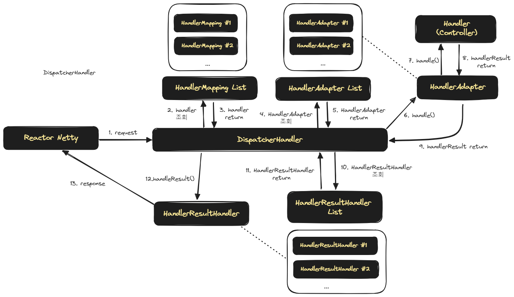
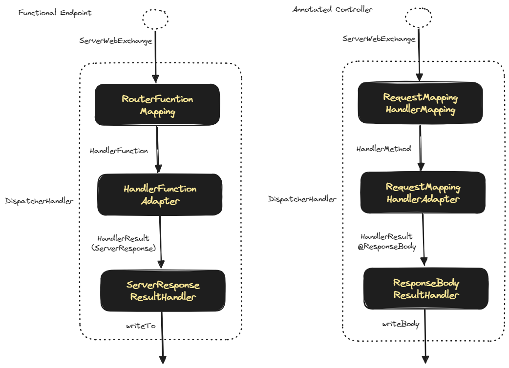

## DispatcherHandler 와 Spring Webflux

우리는 Servlet 기반의 Spring 을 개발할 때에는 보통 DispatcherServlet의 개념과 HandlerMapping 이 어떻게 매핑되고 요청이 응답되는지를 스터디해왔습니다.<br/>

Project Reactor 또는 RxJava, Mutiny 등과 같은 Reactive Manifesto 를 따르는 Reactive Streams 계열의 브러리는 Reactor Netty 환경에서 동작가능합니다.<br/>

그리고 Reactor Netty 환경에서는 DispatcherServlet 이 아닌 `DispatcherHandler` 를 중심으로 Request 와 Response 의 상호작용을 해결합니다.<br/>


## DispatcherHandler 의 request,response 처리 흐름

DispatcherHandler 가 Resquest, Response 를 응답하기 위해 다른 객체들과 상호작용하는 그림을 그려보면 아래와 같습니다. DispatcherServlet 에서 보던 그림과 어느 정도는 유사하기에 친숙하게 느껴집니다.



<br/>

1\.

- 외부로부터 요청이 Reactor Netty 에 도착합니다.<br/>
- React Netty 는 이 요청을 DispatcherHandler 에 전달합니다.<br/>

2\. 3\. 

- DispatcherHandler 는 요청의 파라미터 등을 파악해서 이 요청은 어떤 HandlerMapping 에 맞는 것인지를 조회해서 적절한 HandlerMapping 을 찾아냅니다.

4\. 5\.

- DispatcherHandler 는 HandlerMapping 을 처리하기에 알맞는 HandlerAdapter 를 HandlerAdapter 목록에서 찾습니다. 

6\. 7\. 8\. 9\.

- DispatcherHandler 는 4\.5\. 에서 찾아낸 HandlerAdapter 객체의 handle() 메서드를 실행합니다. 이 `HandlerAdapter` 는 interface 인데, 이 것을 구현하고 있는 구현체 들 중 하나로부터 적절한 Controller 등을 찾아내서 Request 에 대한 처리를 수행합니다. 이 때 결과값은 HandlerResult 로 전달받게 됩니다.

10\. 11\.

- 위에서 구한 HandlerResult 를 처리할 수 있는 객체는 HandlerResultHandler 타입의 객체인데 보통 이런 HandlerResultHandler 는 여러개입니다. 이 중 적절한 HandlerResultHandler 를 찾아냅니다.

12\.

- DispatcherHandler 는 찾아낸 HandlerResultHandler 객체 내의 `handleResult()` 메서드를 실행합니다. 

13\.

- 그리고 DispatcherHandler 는 handleResult() 메서드로 실행한 결과를 Response 로 해서 Reactor Netty 에게 반환해줍니다.

<br/>


예를 들면 WebHandler 는 직접 작성한다면 아래와 같이 작성할 수 있습니다.

```java
package io.chagchagchag.example.foobar.spring_webflux;

import lombok.SneakyThrows;
import lombok.extern.slf4j.Slf4j;
import org.springframework.core.io.buffer.DataBuffer;
import org.springframework.http.ResponseCookie;
import org.springframework.http.server.reactive.HttpHandler;
import org.springframework.http.server.reactive.ReactorHttpHandlerAdapter;
import org.springframework.http.server.reactive.ServerHttpRequest;
import org.springframework.http.server.reactive.ServerHttpResponse;
import reactor.core.publisher.Mono;
import reactor.netty.http.server.HttpServer;

@Slf4j
public class WebHandlerExample1 {
  @SneakyThrows
  public static void main(String[] args) {
    log.info("main function started");
    var httpHandler = new HttpHandler(){
      @Override
      public Mono<Void> handle(
          ServerHttpRequest request, ServerHttpResponse response
      ) {
        String tickerQueryParam = request.getQueryParams().getFirst("ticker");
        String ticker = tickerQueryParam == null ? "MSFT" : tickerQueryParam;

        String content = "You picked " + ticker;
        log.info("responseBody = {}", content);

        Mono<DataBuffer> responseBody = Mono.just(
            response.bufferFactory().wrap(content.getBytes())
        );

        response.addCookie(ResponseCookie.from("ticker", ticker).build());
        response.getHeaders().add("Content-Type", "text/plain");
        return response.writeWith(responseBody);
      }
    };

    var adapter = new ReactorHttpHandlerAdapter(httpHandler);
    HttpServer.create()
        .host("localhost").port(8080)
        .handle(adapter)
        .bindNow()
        .channel().closeFuture().sync();
    
    log.info("main function end");
  }
}

```

HttpHandler 는 HttpHandlerAdapter 에 주입 가능합니다. 그리고 HttpServer 는 HttpHandlerAdapter 를 주입받아서 처리할 수 있도록 로직을 작성합니다.<br/>


## Functional Endpoint, Annotated Controller 의 동작

Spring Webflux 에서는 함수형 엔드포인트, 선언형 컨트롤러(Annotated Controller) 가 있습니다. 두 방식 모두 잘 쓰이는 방식입니다. 개인적으로는 선언형 컨트롤러 (Annotated Controller) 를 선호합니다.<br/>

Functional Endpoint 와 Annotated Controller 는 DispatcherServlet 내에서 아래와 같이 동작합니다.



함수형 엔드포인트를 사용할 경우에는 RouterFunction 을 사용한다는 점과 선언형 컨트롤러 (Annotated Controller) 를 사용할 때에는 @RequestMapping 을 사용한다는 점을 기억하면 이해가 쉽습니다.

예를 들어 함수형 엔드포인트는 아래와 같이 Router 를 작성해서 어떤 REST API 의 어떤 METHOD 를 처리할 지를 명시하고 이 Router 를 처리할 Handler 를 정의하는 방식으로 작성합니다.

e.g.

> 예제 코드는 [https://github.com/chagchagchag/stock-cells-kr/tree/main/backend/stock-cells-kr-backend/src/main/java/io/stock/evaluation/web/price/api] 에서 확인 가능합니다.<br/>

<br/>

PriceApiRouter.java

```java
package io.stock.evaluation.web.price.api;

// ...

@Configuration
public class PriceApiRouter {

    @Bean
    public RouterFunction<ServerResponse> stockPriceByTickerRouter(PriceApiHandler priceApiHandler){
        return RouterFunctions
                .route().GET(
                        "/stock/price",
                        RequestPredicates.queryParam("ticker", v -> true),
                        priceApiHandler::getPriceBasicValuation
                ).build();
    }
}
```

<br/>


PriceApiHandler.java

```java
package io.stock.evaluation.web.price.api;

import io.stock.evaluation.web.crawling.stock.price.application.CrawlingValuationService;
import org.springframework.http.MediaType;
import org.springframework.stereotype.Component;
import org.springframework.web.reactive.function.BodyInserters;
import org.springframework.web.reactive.function.server.ServerRequest;
import org.springframework.web.reactive.function.server.ServerResponse;
import reactor.core.publisher.Mono;

import static org.springframework.web.reactive.function.server.ServerResponse.notFound;
import static org.springframework.web.reactive.function.server.ServerResponse.ok;

@Component
public class PriceApiHandler {
    private final CrawlingValuationService crawlingValuationService;

    public PriceApiHandler(CrawlingValuationService crawlingValuationService){
        this.crawlingValuationService = crawlingValuationService;
    }

    public Mono<ServerResponse> getPriceBasicValuation (ServerRequest serverRequest){
        return serverRequest.queryParam("ticker")
                .map(ticker -> {
                    return crawlingValuationService.getPriceBasicValuationData(ticker)
                            .flatMap(cdata -> ok()
                                        .contentType(MediaType.APPLICATION_JSON)
                                        .body(BodyInserters.fromValue(cdata))
                                        .switchIfEmpty(notFound().build())
                            );
                })
                .orElse(notFound().build());
    }
}
```

<br/>

