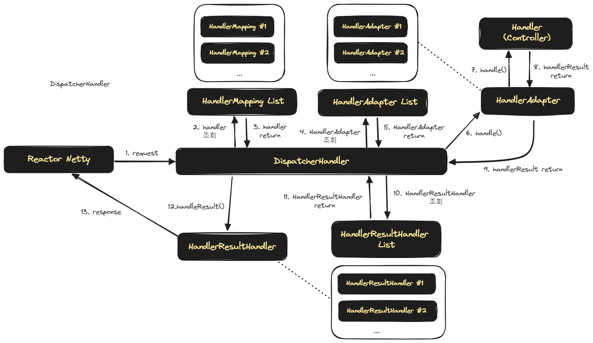

## DispatcherHandler 의 상호작용

우리는 Servlet 기반의 Spring 을 개발할 때에는 보통 DispatcherServlet의 개념과 HandlerMapping 이 어떻게 매핑되고 요청이 응답되는지를 스터디해왔습니다. 

Project Reactor 또는 RxJava, Mutiny 등과 같은 Reactive Manifesto 를 따르는 Reactive Streams 계열의 브러리는 Reactor Netty 환경에서 동작가능합니다. 

그리고 Reactor Netty 환경에서는 DispatcherServlet 이 아닌 `DispatcherHandler` 를 중심으로 Request 와 Response 의 상호작용을 해결합니다. 

## DispatcherHandler 의 request,response 처리 흐름

DispatcherHandler 가 Resquest, Response 를 응답하기 위해 다른 객체들과 상호작용하는 그림을 그려보면 아래와 같습니다. DispatcherServlet 에서 보던 그림과 어느 정도는 유사하기에 친숙하게 느껴집니다.

 

