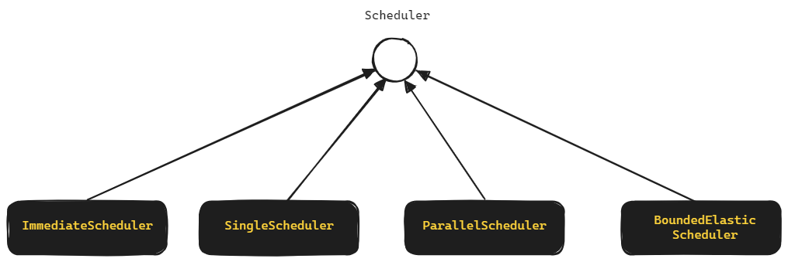

## Reactor 프로그래밍 2 (Thread, Scheduler, Context, defer())

## 참고자료

- [Scheduler | github](https://github.com/reactor/reactor-core/blob/main/reactor-core/src/main/java/reactor/core/scheduler/Scheduler.java), [Scheduler | docs](https://projectreactor.io/docs/core/release/api/reactor/core/scheduler/Scheduler.html)
- [Schedulers | docs](https://projectreactor.io/docs/core/release/api/reactor/core/scheduler/Schedulers.html)

<br/>


## Scheduler, Thread

아무 설정을 하지 않으면 Publisher 는 subscribe 를 호출한 caller 가 속했던 스레드에서 실행됩니다. subscribe() 내에 제공된 lambda 또는 Scheduler 역시 caller 가 속해있던 스레드에서 실행됩니다.<br/>

publish 또는 subscribe 에서 어떤 Scheduler 를 적용했는지에 따라 task 가 실행될 스레드 풀이 달라지게 됩니다. <br/>

<br/>


## Scheduler

- ImmediateScheduler
- SingleScheduler
- ParallelScheduler
- BoundedElasticScheduler

<br/>



<br/>

[Scheduler](https://projectreactor.io/docs/core/release/api/reactor/core/scheduler/Scheduler.html) 를 implements 하고 있는 클래스는 ImmediateScheduler, SingleScheduler, ParallelScheduler, BoundedElasticScheduler 가 있습니다.<br/>

각각의 Scheduler 객체는 아래에서 설명하게 될 Schedulers.immediate(), Schedulers.single(), Schedulers.parallel(), Schedulers.boundedElastic() 메서드를 통해서 생성할 수 있습니다.

- Schedulers.immediate()
- Schedulers.single()
- Schedulers.parallel()
- Schedulers.boundedElastic()

<br/>


## Schedulers

### Schedulers.immediate()

subscribe 를 호출한 caller 스레드에서 즉시 실행합니다. <br/>

Flux, Mono 등의 Publisher 코드를 subscribe 하는 코드에서 별도로 Schedulers 를 지정하지 않으면 기본적으로 Schedulers.immediate 를 사용하게 됩니다.<br/>

```java
package io.chagchagchag.example.foobar.spring_webflux.schedulers;

import lombok.extern.slf4j.Slf4j;
import reactor.core.publisher.Flux;
import reactor.core.scheduler.Schedulers;

@Slf4j
public class SchedulersImmediate_Example1 {
  public static void main(String[] args) {
    Flux.create(fluxSink -> {
      for(int i=0; i<=3; i++){
        log.info("i == " + i);
        fluxSink.next(i);
      }
    })
    .subscribeOn(Schedulers.immediate())
    .subscribe(
        v -> {
          log.info("v == " + v);
        }
    );
  }
}
```

<br/>


출력결과

```plain
18:17:03.980 [main] INFO io...schedulers.SchedulersImmediate_Example1 -- i == 0
18:17:03.982 [main] INFO io...schedulers.SchedulersImmediate_Example1 -- v == 0
18:17:03.983 [main] INFO io...schedulers.SchedulersImmediate_Example1 -- i == 1
18:17:03.983 [main] INFO io...schedulers.SchedulersImmediate_Example1 -- v == 1
18:17:03.983 [main] INFO io...schedulers.SchedulersImmediate_Example1 -- i == 2
18:17:03.983 [main] INFO io...schedulers.SchedulersImmediate_Example1 -- v == 2
18:17:03.983 [main] INFO io...schedulers.SchedulersImmediate_Example1 -- i == 3
18:17:03.983 [main] INFO io...schedulers.SchedulersImmediate_Example1 -- v == 3

Process finished with exit code 0
```

<br/>


### Schedulers.single()

1개의 스레드를 사용하는 스레드 풀이며, 캐싱된 스레드 풀입니다. Schedulers.single 을 사용하면 publish, subscribe 가 하나의 스레드에서 실행됩니다.

```java
package io.chagchagchag.example.foobar.spring_webflux.schedulers;

import lombok.SneakyThrows;
import lombok.extern.slf4j.Slf4j;
import reactor.core.publisher.Flux;
import reactor.core.scheduler.Schedulers;

@Slf4j
public class SchedulersSingle_Example1 {
  @SneakyThrows
  public static void main(String[] args) {
    for(int i=0; i<15; i++){
      final int index = i;
      Flux.create(fluxSink -> {
        log.info("index == " + index);
        fluxSink.next(index);
      }).subscribeOn(
          Schedulers.single()
      ).subscribe(
          v -> {
            log.info("v ::: " + v);
          }
      );
    }

    Thread.sleep(2000);
  }
}
```

<br/>


출력결과를 보면 모두 같은 스레드인 `single-1` 에서 실행되었음을 확인 가능합니다.<br/>

<br/>


출력결과

```plain
18:26:36.501 [single-1] INFO io...schedulers.SchedulersSingle_Example1 -- index == 0
18:26:36.503 [single-1] INFO io...schedulers.SchedulersSingle_Example1 -- v ::: 0
18:26:36.503 [single-1] INFO io...schedulers.SchedulersSingle_Example1 -- index == 1
18:26:36.503 [single-1] INFO io...schedulers.SchedulersSingle_Example1 -- v ::: 1
18:26:36.503 [single-1] INFO io...schedulers.SchedulersSingle_Example1 -- index == 2
18:26:36.503 [single-1] INFO io...schedulers.SchedulersSingle_Example1 -- v ::: 2
18:26:36.503 [single-1] INFO io...schedulers.SchedulersSingle_Example1 -- index == 3
18:26:36.503 [single-1] INFO io...schedulers.SchedulersSingle_Example1 -- v ::: 3
18:26:36.503 [single-1] INFO io...schedulers.SchedulersSingle_Example1 -- index == 4
18:26:36.503 [single-1] INFO io...schedulers.SchedulersSingle_Example1 -- v ::: 4
18:26:36.503 [single-1] INFO io...schedulers.SchedulersSingle_Example1 -- index == 5
18:26:36.503 [single-1] INFO io...schedulers.SchedulersSingle_Example1 -- v ::: 5
18:26:36.504 [single-1] INFO io...schedulers.SchedulersSingle_Example1 -- index == 6
18:26:36.504 [single-1] INFO io...schedulers.SchedulersSingle_Example1 -- v ::: 6
18:26:36.504 [single-1] INFO io...schedulers.SchedulersSingle_Example1 -- index == 7
18:26:36.504 [single-1] INFO io...schedulers.SchedulersSingle_Example1 -- v ::: 7
18:26:36.504 [single-1] INFO io...schedulers.SchedulersSingle_Example1 -- index == 8
18:26:36.504 [single-1] INFO io...schedulers.SchedulersSingle_Example1 -- v ::: 8
18:26:36.504 [single-1] INFO io...schedulers.SchedulersSingle_Example1 -- index == 9
18:26:36.504 [single-1] INFO io...schedulers.SchedulersSingle_Example1 -- v ::: 9
18:26:36.504 [single-1] INFO io...schedulers.SchedulersSingle_Example1 -- index == 10
18:26:36.504 [single-1] INFO io...schedulers.SchedulersSingle_Example1 -- v ::: 10
18:26:36.504 [single-1] INFO io...schedulers.SchedulersSingle_Example1 -- index == 11
18:26:36.504 [single-1] INFO io...schedulers.SchedulersSingle_Example1 -- v ::: 11
18:26:36.504 [single-1] INFO io...schedulers.SchedulersSingle_Example1 -- index == 12
18:26:36.504 [single-1] INFO io...schedulers.SchedulersSingle_Example1 -- v ::: 12
18:26:36.504 [single-1] INFO io...schedulers.SchedulersSingle_Example1 -- index == 13
18:26:36.504 [single-1] INFO io...schedulers.SchedulersSingle_Example1 -- v ::: 13
18:26:36.504 [single-1] INFO io...schedulers.SchedulersSingle_Example1 -- index == 14
18:26:36.504 [single-1] INFO io...schedulers.SchedulersSingle_Example1 -- v ::: 14

Process finished with exit code 0
```

<br/>


### Schedulers.parallel()

n 개의 캐싱된 스레드를 가진 스레드 풀을 생성하는 메서드 입니다. 스레드 풀은 CPU 코어 수 만큼의 크기를 가집니다.

```java
package io.chagchagchag.example.foobar.spring_webflux.schedulers;

import lombok.SneakyThrows;
import lombok.extern.slf4j.Slf4j;
import reactor.core.publisher.Flux;
import reactor.core.scheduler.Schedulers;

@Slf4j
public class SchedulersParallel_Example1 {
  @SneakyThrows
  public static void main(String[] args) {
    for(int i=0; i<15; i++){
      final int index = i;
      Flux.create(fluxSink -> {
        log.info("index = " + index);
        fluxSink.next(index);
      })
      .subscribeOn(Schedulers.parallel())
      .subscribe(v -> {
        log.info("v ::: " + v);
      });
    }

    Thread.sleep(2000);
  }
}
```


출력결과

```plain
18:36:59.042 [parallel-9] INFO io...schedulers.SchedulersParallel_Example1 -- index = 8
18:36:59.042 [parallel-5] INFO io...schedulers.SchedulersParallel_Example1 -- index = 4
18:36:59.042 [parallel-4] INFO io...schedulers.SchedulersParallel_Example1 -- index = 3
18:36:59.042 [parallel-2] INFO io...schedulers.SchedulersParallel_Example1 -- index = 1
18:36:59.042 [parallel-12] INFO io...schedulers.SchedulersParallel_Example1 -- index = 11
18:36:59.042 [parallel-14] INFO io...schedulers.SchedulersParallel_Example1 -- index = 13
18:36:59.042 [parallel-7] INFO io...schedulers.SchedulersParallel_Example1 -- index = 6
18:36:59.042 [parallel-1] INFO io...schedulers.SchedulersParallel_Example1 -- index = 0
18:36:59.042 [parallel-10] INFO io...schedulers.SchedulersParallel_Example1 -- index = 9
18:36:59.042 [parallel-15] INFO io...schedulers.SchedulersParallel_Example1 -- index = 14
18:36:59.042 [parallel-8] INFO io...schedulers.SchedulersParallel_Example1 -- index = 7
18:36:59.048 [parallel-12] INFO io...schedulers.SchedulersParallel_Example1 -- v ::: 11
18:36:59.048 [parallel-10] INFO io...schedulers.SchedulersParallel_Example1 -- v ::: 9
18:36:59.042 [parallel-13] INFO io...schedulers.SchedulersParallel_Example1 -- index = 12
18:36:59.042 [parallel-3] INFO io...schedulers.SchedulersParallel_Example1 -- index = 2
18:36:59.042 [parallel-11] INFO io...schedulers.SchedulersParallel_Example1 -- index = 10
18:36:59.048 [parallel-3] INFO io...schedulers.SchedulersParallel_Example1 -- v ::: 2
18:36:59.042 [parallel-6] INFO io...schedulers.SchedulersParallel_Example1 -- index = 5
18:36:59.048 [parallel-4] INFO io...schedulers.SchedulersParallel_Example1 -- v ::: 3
18:36:59.048 [parallel-5] INFO io...schedulers.SchedulersParallel_Example1 -- v ::: 4
18:36:59.048 [parallel-7] INFO io...schedulers.SchedulersParallel_Example1 -- v ::: 6
18:36:59.048 [parallel-6] INFO io...schedulers.SchedulersParallel_Example1 -- v ::: 5
18:36:59.048 [parallel-1] INFO io...schedulers.SchedulersParallel_Example1 -- v ::: 0
18:36:59.048 [parallel-15] INFO io...schedulers.SchedulersParallel_Example1 -- v ::: 14
18:36:59.048 [parallel-2] INFO io...schedulers.SchedulersParallel_Example1 -- v ::: 1
18:36:59.048 [parallel-14] INFO io...schedulers.SchedulersParallel_Example1 -- v ::: 13
18:36:59.048 [parallel-8] INFO io...schedulers.SchedulersParallel_Example1 -- v ::: 7
18:36:59.048 [parallel-9] INFO io...schedulers.SchedulersParallel_Example1 -- v ::: 8
18:36:59.048 [parallel-13] INFO io...schedulers.SchedulersParallel_Example1 -- v ::: 12
18:36:59.048 [parallel-11] INFO io...schedulers.SchedulersParallel_Example1 -- v ::: 10

Process finished with exit code 0
```

<br/>


### Schedulers.boundedElastic()

고정되지 않은 크기의 스레드 풀이며, 캐싱된 스레드 풀입니다. 재사용할 수 있는 스레드가 있으면 재사용하고, 재사용할 수 있는 스레드가 없으면 새로 스레드를 생성합니다. 생성 가능한 스레드 수는 cpu 코어수 x 10 입니다. I/O Blocking 작업의 수행에 적합하고, 특정시간 (기본 60초) 동안 사용하지 않으면 사용되지 않는 스레드는 스레드 풀에서 제거되게끔 관리됩니다.<br/>

```java
package io.chagchagchag.example.foobar.spring_webflux.schedulers;

import lombok.SneakyThrows;
import lombok.extern.slf4j.Slf4j;
import reactor.core.publisher.Flux;
import reactor.core.scheduler.Schedulers;

@Slf4j
public class SchedulersBoundedElastic_Example {
  @SneakyThrows
  public static void main(String[] args) {
    for(int i=0; i<300; i++){
      final int index = i;
      Flux.create(fluxSink -> {
        log.info("index == " + index);
        fluxSink.next(index);
      })
      .subscribeOn(Schedulers.boundedElastic())
      .subscribe(
          v -> {
            log.info("v ::: " + v);
          }
      );
    }

    Thread.sleep(2000);
  }
}
```

<br/>


출력결과

```plain
 ...
18:41:16.822 [boundedElastic-117] INFO io...schedulers.SchedulersBoundedElastic_Example -- index == 276
18:41:16.822 [boundedElastic-117] INFO io...schedulers.SchedulersBoundedElastic_Example -- v ::: 276
18:41:16.822 [boundedElastic-118] INFO io...schedulers.SchedulersBoundedElastic_Example -- index == 277
18:41:16.822 [boundedElastic-119] INFO io...schedulers.SchedulersBoundedElastic_Example -- index == 278
18:41:16.822 [boundedElastic-118] INFO io...schedulers.SchedulersBoundedElastic_Example -- v ::: 277
18:41:16.822 [boundedElastic-119] INFO io...schedulers.SchedulersBoundedElastic_Example -- v ::: 278
...
```

<br/>


### `Schedulers.new---`

위에서 살펴본 Schedulers.immediate(), Schedulers.single(), Schedulers.parallel(), Schedulers.boundedElastic() 메서드 들은 캐싱되지 않는 스레드 풀이었지만, `Schedulers.new---` 과 같은 이름을 가진 메서드들인 Schedulers.newSingle(), Schedulers.newParallel(), Schedulers.newBoundedElastic() 은 **캐싱된 스레드 풀을 사용**합니다.<br/>

- Schedulers.newSingle()
- Schedulers.newParallel()
- Schedulers.newBoundedElastic()

스레드 풀의 해제는 dispose() 로 해제합니다.<br/>

<br/>


```java
package io.chagchagchag.example.foobar.spring_webflux.schedulers;

import lombok.SneakyThrows;
import lombok.extern.slf4j.Slf4j;
import reactor.core.publisher.Flux;
import reactor.core.scheduler.Schedulers;

@Slf4j
public class SchedulersNew_Example1 {
  @SneakyThrows
  public static void main(String[] args) {
    for(int i=0; i<100; i++){
      var newSingle = Schedulers.newSingle("싱글스레드");
      final int index = i;
      Flux.create(fluxSink -> {
        log.info("index == " + index);
        fluxSink.next(index);
      })
      .subscribeOn(newSingle)
      .subscribe(v -> {
        log.info("v ::: " + v);
        newSingle.dispose();
      });
    }
  }
}
```


출력결과

```plain
...

18:54:50.336 [싱글스레드-80] INFO io...schedulers.SchedulersNew_Example1 -- index == 79
18:54:50.336 [싱글스레드-61] INFO io...schedulers.SchedulersNew_Example1 -- index == 60
18:54:50.336 [싱글스레드-96] INFO io...schedulers.SchedulersNew_Example1 -- index == 95
18:54:50.335 [싱글스레드-8] INFO io...schedulers.SchedulersNew_Example1 -- index == 7
... 
```

<br/>


### Schedulers.fromExecutorService(executorService)

커스텀하게 직접 생성한 ExecutorService 를 이용해서 Scheduler 를 생성합니다.

```java
package io.chagchagchag.example.foobar.spring_webflux.schedulers;

import java.util.concurrent.Executors;
import lombok.SneakyThrows;
import lombok.extern.slf4j.Slf4j;
import reactor.core.publisher.Flux;
import reactor.core.scheduler.Schedulers;

@Slf4j
public class SchedulersFromExecutorService_Example1 {
  @SneakyThrows
  public static void main(String[] args) {
    var executorService = Executors.newSingleThreadExecutor();
    for(int i=0; i<100; i++){
      final int index = i;
      Flux.create(fluxSink -> {
        log.info("index == " + index);
        fluxSink.next(index);
      })
      .subscribeOn(Schedulers.fromExecutorService(executorService))
      .subscribe(v -> {
        log.info("v == " + v);
      });
    }

    Thread.sleep(2000);
    executorService.shutdown();
  }
}
```

<br/>


출력결과

```plain
...

18:59:27.838 [pool-1-thread-1] INFO io...schedulers.SchedulersFromExecutorService_Example1 -- index == 84
18:59:27.838 [pool-1-thread-1] INFO io...schedulers.SchedulersFromExecutorService_Example1 -- v == 84
18:59:27.838 [pool-1-thread-1] INFO io...schedulers.SchedulersFromExecutorService_Example1 -- index == 85
18:59:27.838 [pool-1-thread-1] INFO io...schedulers.SchedulersFromExecutorService_Example1 -- v == 85
18:59:27.838 [pool-1-thread-1] INFO io...schedulers.SchedulersFromExecutorService_Example1 -- index == 86
18:59:27.838 [pool-1-thread-1] INFO io...schedulers.SchedulersFromExecutorService_Example1 -- v == 86
18:59:27.838 [pool-1-thread-1] INFO io...schedulers.SchedulersFromExecutorService_Example1 -- index == 87
18:59:27.838 [pool-1-thread-1] INFO io...schedulers.SchedulersFromExecutorService_Example1 -- v == 87

...
```

<br/>


## publishOn(), subscribeOn()

**publishOn(Scheduler)**<br/>

publishOn(Scheduler) 는 어느 위치에서 사용했는지가 중요합니다. 만약 A→B→C 순으로 연산자가 체이닝되어 있을 경우 publishOn(Scheduler) 를 선언하지 않으면, A를 실행한 스레드가 B를 수행하고, B를 실행한 스레드는 C를 실행합니다. 체이닝된 연산 수행시 스레드 역시 체이닝되어 수행됩니다.<br/>

publishOn(Scheduler) 는 Publisher 가 데이터를 공급할 때 사용되는 연산이기 때문에 Publisher 코드의 체이닝 코드 중간의 어디에서든 publishOn(Scheduler) 를 선언가능하고 데이터 흐름의 중간에 실행 스레드를 변경할 수 있습니다.<br/>

<br/>

**subscribeOn(Scheduler)**<br/>

subscribeOn(Scheduler)는 어느 위치에서 사용했는지가 중요하지 않습니다. Subscriber 가 Publisher를 subscribe 할 때 사용될 스레드이기에 subscrieOn(Scheduler)는 데이터 소스가 실행될 스레드에 영향을 줍니다.<br/>

<br/>


### publishOn(Scheduler)

publishOn(Scheduler) 코드 다음에 실행되는 스레드는 publishOn(Scheduler) 에서 지정한 스레드 풀에 의해 변경됩니다. 즉 실행되는 중간에 publishOn(Scheduler)를 통해 다른 설정을 사용하면 실행되는 스레드를 변경할 수 있습니다. 스레드 풀 중 하나의 스레드만 지속적으로 사용되는 성격이 있습니다.<br/>

publishOn(Scheduler) 는 Publisher 가 데이터를 공급할 때 사용되는 연산이기 때문에 Publisher 코드의 체이닝 코드 중간의 어디에서든 publishOn(Scheduler) 를 선언가능하고 데이터 흐름의 중간에 실행 스레드를 변경할 수 있습니다.<br/>

<br/>

```java
package io.chagchagchag.example.foobar.spring_webflux.publish_on_subscribe_on;

import lombok.SneakyThrows;
import lombok.extern.slf4j.Slf4j;
import reactor.core.publisher.Flux;
import reactor.core.scheduler.Schedulers;

@Slf4j
public class PublishOn_Example1 {
  @SneakyThrows
  public static void main(String[] args) {
    Flux.create(fluxSink -> {
      for(int i=0; i<7; i++){
        log.info("i == " + i);
        fluxSink.next(i);
      }
    })
    .publishOn(Schedulers.single())
    .doOnNext(element -> {
      log.info("doOnNext1 :: " + element);
    })
    .publishOn(Schedulers.boundedElastic())
    .doOnNext(element -> {
      log.info("doOnNext2 :: " + element);
    })
    .subscribe(v -> {
      log.info("v ::: " + v);
    });

    Thread.sleep(2000);
  }
}
```

실행 결과를 보면 doOnNext1 은 `single-1` 스레드에서 실행되고 doOnNext2 는 `boundedElastic-1` 에서 실행됩니다. 그리고 각각의 스레드는 개별적으로 수행되면서 가끔은 `single-1` 이 먼저 수행하고, 가끔은 `boundedElastic-1` 이 먼저 수행되기도 하는 것을 확인 가능합니다.<br/>

<br/>


출력결과

```plain
19:17:27.086 [main] INFO io...publish_on_subscribe_on.PublishOn_Example1 -- i == 0
19:17:27.089 [main] INFO io...publish_on_subscribe_on.PublishOn_Example1 -- i == 1
19:17:27.089 [main] INFO io...publish_on_subscribe_on.PublishOn_Example1 -- i == 2
19:17:27.089 [main] INFO io...publish_on_subscribe_on.PublishOn_Example1 -- i == 3
19:17:27.089 [single-1] INFO io...publish_on_subscribe_on.PublishOn_Example1 -- doOnNext1 :: 0
19:17:27.089 [main] INFO io...publish_on_subscribe_on.PublishOn_Example1 -- i == 4
19:17:27.089 [single-1] INFO io...publish_on_subscribe_on.PublishOn_Example1 -- doOnNext1 :: 1
19:17:27.089 [main] INFO io...publish_on_subscribe_on.PublishOn_Example1 -- i == 5
19:17:27.089 [single-1] INFO io...publish_on_subscribe_on.PublishOn_Example1 -- doOnNext1 :: 2
19:17:27.089 [main] INFO io...publish_on_subscribe_on.PublishOn_Example1 -- i == 6
19:17:27.089 [boundedElastic-1] INFO io...publish_on_subscribe_on.PublishOn_Example1 -- doOnNext2 :: 0
19:17:27.090 [single-1] INFO io...publish_on_subscribe_on.PublishOn_Example1 -- doOnNext1 :: 3
19:17:27.090 [single-1] INFO io...publish_on_subscribe_on.PublishOn_Example1 -- doOnNext1 :: 4
19:17:27.090 [single-1] INFO io...publish_on_subscribe_on.PublishOn_Example1 -- doOnNext1 :: 5
19:17:27.090 [boundedElastic-1] INFO io...publish_on_subscribe_on.PublishOn_Example1 -- v ::: 0
19:17:27.090 [single-1] INFO io...publish_on_subscribe_on.PublishOn_Example1 -- doOnNext1 :: 6
19:17:27.090 [boundedElastic-1] INFO io...publish_on_subscribe_on.PublishOn_Example1 -- doOnNext2 :: 1
19:17:27.090 [boundedElastic-1] INFO io...publish_on_subscribe_on.PublishOn_Example1 -- v ::: 1
19:17:27.090 [boundedElastic-1] INFO io...publish_on_subscribe_on.PublishOn_Example1 -- doOnNext2 :: 2
19:17:27.090 [boundedElastic-1] INFO io...publish_on_subscribe_on.PublishOn_Example1 -- v ::: 2
19:17:27.090 [boundedElastic-1] INFO io...publish_on_subscribe_on.PublishOn_Example1 -- doOnNext2 :: 3
19:17:27.090 [boundedElastic-1] INFO io...publish_on_subscribe_on.PublishOn_Example1 -- v ::: 3
19:17:27.090 [boundedElastic-1] INFO io...publish_on_subscribe_on.PublishOn_Example1 -- doOnNext2 :: 4
19:17:27.090 [boundedElastic-1] INFO io...publish_on_subscribe_on.PublishOn_Example1 -- v ::: 4
19:17:27.090 [boundedElastic-1] INFO io...publish_on_subscribe_on.PublishOn_Example1 -- doOnNext2 :: 5
19:17:27.090 [boundedElastic-1] INFO io...publish_on_subscribe_on.PublishOn_Example1 -- v ::: 5
19:17:27.090 [boundedElastic-1] INFO io...publish_on_subscribe_on.PublishOn_Example1 -- doOnNext2 :: 6
19:17:27.090 [boundedElastic-1] INFO io...publish_on_subscribe_on.PublishOn_Example1 -- v ::: 6

Process finished with exit code 0
```

<br/>


### subscribeOn(Scheduler)

subscribeOn(Scheduler)는 어느 위치에서 사용했는지가 중요하지 않습니다. Scheduler 를 인자로 받으며, Subscriber 가 Publisher를 subscribe 할 때 사용될 스레드이기에 subscrieOn(Scheduler)는 데이터 소스가 실행될 스레드에 영향을 줍니다.<br/>

```java
package io.chagchagchag.example.foobar.spring_webflux.publish_on_subscribe_on;

import lombok.SneakyThrows;
import lombok.extern.slf4j.Slf4j;
import reactor.core.publisher.Flux;
import reactor.core.scheduler.Schedulers;

@Slf4j
public class SubscribeOn_Example1 {
  @SneakyThrows
  public static void main(String[] args) {
    Flux.create(fluxSink -> {
      for(int i=0; i<8; i++){
        log.info("i == " + i);
        fluxSink.next(i);
      }
    })
    .doOnNext(element -> {
      log.info("doOnNext1 :: " + element);
    })
    .doOnNext(element -> {
      log.info("doOnNext2 :: " + element);
    })
    .subscribeOn(Schedulers.boundedElastic())
    .subscribe(v -> {
      log.info("v ::: " + v);
    });

    Thread.sleep(2000);
  }
}
```


출력결과

```plain
19:25:28.579 [boundedElastic-1] INFO io...publish_on_subscribe_on.SubscribeOn_Example1 -- i == 0
19:25:28.582 [boundedElastic-1] INFO io...publish_on_subscribe_on.SubscribeOn_Example1 -- doOnNext1 :: 0
19:25:28.582 [boundedElastic-1] INFO io...publish_on_subscribe_on.SubscribeOn_Example1 -- doOnNext2 :: 0
19:25:28.582 [boundedElastic-1] INFO io...publish_on_subscribe_on.SubscribeOn_Example1 -- v ::: 0
19:25:28.582 [boundedElastic-1] INFO io...publish_on_subscribe_on.SubscribeOn_Example1 -- i == 1
19:25:28.582 [boundedElastic-1] INFO io...publish_on_subscribe_on.SubscribeOn_Example1 -- doOnNext1 :: 1
19:25:28.582 [boundedElastic-1] INFO io...publish_on_subscribe_on.SubscribeOn_Example1 -- doOnNext2 :: 1
19:25:28.582 [boundedElastic-1] INFO io...publish_on_subscribe_on.SubscribeOn_Example1 -- v ::: 1
19:25:28.582 [boundedElastic-1] INFO io...publish_on_subscribe_on.SubscribeOn_Example1 -- i == 2
19:25:28.582 [boundedElastic-1] INFO io...publish_on_subscribe_on.SubscribeOn_Example1 -- doOnNext1 :: 2
19:25:28.582 [boundedElastic-1] INFO io...publish_on_subscribe_on.SubscribeOn_Example1 -- doOnNext2 :: 2
19:25:28.582 [boundedElastic-1] INFO io...publish_on_subscribe_on.SubscribeOn_Example1 -- v ::: 2
19:25:28.582 [boundedElastic-1] INFO io...publish_on_subscribe_on.SubscribeOn_Example1 -- i == 3
19:25:28.582 [boundedElastic-1] INFO io...publish_on_subscribe_on.SubscribeOn_Example1 -- doOnNext1 :: 3
19:25:28.582 [boundedElastic-1] INFO io...publish_on_subscribe_on.SubscribeOn_Example1 -- doOnNext2 :: 3
19:25:28.582 [boundedElastic-1] INFO io...publish_on_subscribe_on.SubscribeOn_Example1 -- v ::: 3
19:25:28.582 [boundedElastic-1] INFO io...publish_on_subscribe_on.SubscribeOn_Example1 -- i == 4
19:25:28.582 [boundedElastic-1] INFO io...publish_on_subscribe_on.SubscribeOn_Example1 -- doOnNext1 :: 4
19:25:28.582 [boundedElastic-1] INFO io...publish_on_subscribe_on.SubscribeOn_Example1 -- doOnNext2 :: 4
19:25:28.582 [boundedElastic-1] INFO io...publish_on_subscribe_on.SubscribeOn_Example1 -- v ::: 4
19:25:28.582 [boundedElastic-1] INFO io...publish_on_subscribe_on.SubscribeOn_Example1 -- i == 5
19:25:28.582 [boundedElastic-1] INFO io...publish_on_subscribe_on.SubscribeOn_Example1 -- doOnNext1 :: 5
19:25:28.582 [boundedElastic-1] INFO io...publish_on_subscribe_on.SubscribeOn_Example1 -- doOnNext2 :: 5
19:25:28.583 [boundedElastic-1] INFO io...publish_on_subscribe_on.SubscribeOn_Example1 -- v ::: 5
19:25:28.583 [boundedElastic-1] INFO io...publish_on_subscribe_on.SubscribeOn_Example1 -- i == 6
19:25:28.583 [boundedElastic-1] INFO io...publish_on_subscribe_on.SubscribeOn_Example1 -- doOnNext1 :: 6
19:25:28.583 [boundedElastic-1] INFO io...publish_on_subscribe_on.SubscribeOn_Example1 -- doOnNext2 :: 6
19:25:28.583 [boundedElastic-1] INFO io...publish_on_subscribe_on.SubscribeOn_Example1 -- v ::: 6
19:25:28.583 [boundedElastic-1] INFO io...publish_on_subscribe_on.SubscribeOn_Example1 -- i == 7
19:25:28.583 [boundedElastic-1] INFO io...publish_on_subscribe_on.SubscribeOn_Example1 -- doOnNext1 :: 7
19:25:28.583 [boundedElastic-1] INFO io...publish_on_subscribe_on.SubscribeOn_Example1 -- doOnNext2 :: 7
19:25:28.583 [boundedElastic-1] INFO io...publish_on_subscribe_on.SubscribeOn_Example1 -- v ::: 7

Process finished with exit code 0
```

<br/>


## Context

Context 는 파이프라인 내부의 어디에서든 접근 가능한 key, value 저장소입니다. subscribeOn, publishOn 등으로 인해 실행되는 스레드가 달라질 때 Context 를 통해서 특정 key 에 대한 value 를 조회 또는 수정할 수 있습니다.  Map 과 유사한 형식이며, Context 의 종류로는 읽기전용인 ContextView, 쓰기가능한 Context 가 있습니다.

- contextWrite() : 컨텍스트 쓰기
- contextView() : 컨텍스트 읽기
- deferContextual() 

<br/>


## defer()

<br/>


## defer() 를 flatMap() 으로

flatMap() 에서 Supplier 동작을 하려 할 때

<br/>


