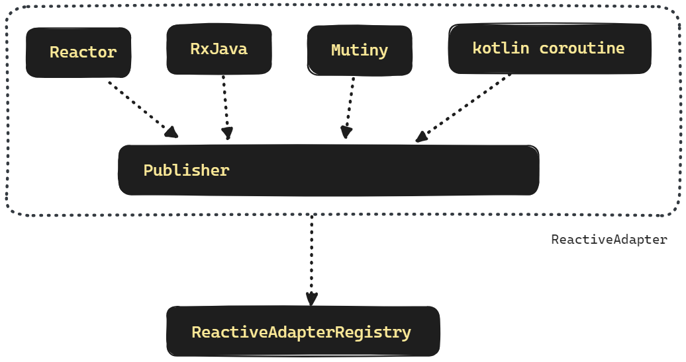
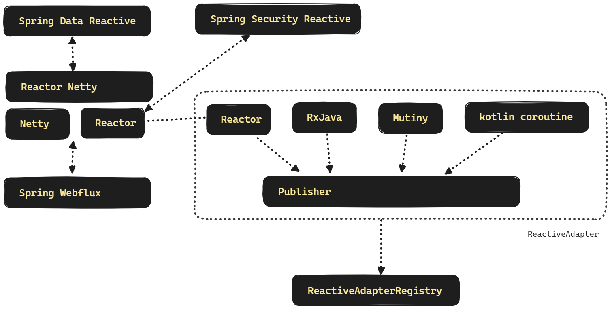

## Spring MVC vs Spring Webflux

참고 : https://docs.spring.io/spring-framework/reference/web/webflux/new-framework.html

 

Spring Webflux 에서도 Annotated Controller 라고 불리는 @Controller를 사용가능합니다. Spring MVC 에서도 Spring Webflux 의 Reactive Client 를 사용가능합니다. 그리고 Spring Webflux 에서도 Tomcat, Jetty, Undertow 등을 사용 가능합니다. 

 

### Reactive 구현체와 Reactive Adapter

Reactor, RxJava, Mutiny, kotlin coroutine 등과 같은 Reactive Streams 구현체는 모두 Reactive Streams 의 Publiser 타입으로 호환이 가능합니다. 그리고 이 Publisher 는 ReactiveAdapter 를 통해서 적용이 되며, Reactive AdapterRegistry 에 등록되어서 여러 종류의 Reactive Streams 구현체를 사용하는 것이 가능합니다. 

 

## Spring Reactive Stack 의 구성

 

Reactor 기반의 Netty 를 사용한다면 Reactor Netty 를 사용하게 됩니다. Reactor Netty 는 Netty 를 Reactor 기반으로 조합성,편의성을 크게 확장한 WAS 컨테이너 입니다. 

Reactor 는 Pivotal 사에서 공식적으로 제공한 Reactive Streams 구현체 라이브러리입니다. 

Spring Webflux 는  Servlet 기반 웹 애플리케이션의 동기적인 처리 방식 대신 비동기 및 반응형 프로그래밍 모델을 제공합니다. Spring WebFlux는 Java 8의 CompletableFuture 및 Reactor 프로젝트를 기반으로 한 리액티브 라이브러리를 활용하여 구현되어있는 Spring Web 을 위한 반응형 프로그래밍 라이브러리 입니다. 

Spring Webflux 의 주요특징, 개념은 아래와 같습니다.

1. **비동기 및 반응형 프로그래밍:** Spring WebFlux는 비동기적이며 반응형 프로그래밍 모델을 채택합니다. 이는 높은 동시성과 확장성을 제공하며, 논블로킹 I/O를 활용하여 더 많은 동시 요청을 처리할 수 있습니다.
2. **Reactor 라이브러리:** Spring WebFlux는 Reactor 라이브러리를 기반으로 하여, Flux와 Mono라는 리액티브 타입을 제공합니다. Flux는 여러 개의 데이터를 처리하는 데 사용되고, Mono는 0 또는 1개의 데이터를 처리하는 데 사용됩니다.
3. **함수형 엔드포인트:** Spring WebFlux는 기존의 컨트롤러 대신 함수형 엔드포인트를 제공합니다. 이는 람다 표현식이나 Java 8의 함수형 인터페이스를 사용하여 간결하고 가독성 있는 코드를 작성할 수 있게 합니다.
4. **반응형 서버 및 클라이언트:** Spring WebFlux는 반응형 서버와 클라이언트를 모두 제공합니다. 서버 측에서는 Netty와 같은 서버를 이용하여 비동기적으로 요청을 처리하고, 클라이언트 측에서는 WebClient를 통해 외부 서비스에 비동기적으로 요청을 보낼 수 있습니다.
5. **어노테이션 기반의 라우팅:** Spring WebFlux는 기존의 Spring MVC와 유사한 어노테이션 기반의 라우팅을 지원하여 빠르게 웹 애플리케이션을 개발할 수 있습니다.
6. **모노리틱 및 마이크로서비스 아키텍처 지원:** Spring WebFlux는 단일 서버에서 실행되는 전통적인 모노리틱 애플리케이션부터 분산된 마이크로서비스 아키텍처까지 다양한 환경에서 사용할 수 있습니다.

 

