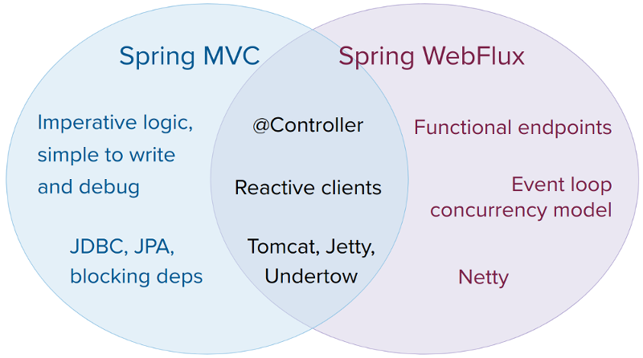

## Spring MVC vs Spring Webflux

참고 : https://docs.spring.io/spring-framework/reference/web/webflux/new-framework.html

 

Spring Webflux 에서도 Annotated Controller 라고 불리는 @Controller를 사용가능합니다. Spring MVC 에서도 Spring Webflux 의 Reactive Client 를 사용가능합니다. 그리고 Spring Webflux 에서도 Tomcat, Jetty, Undertow 등을 사용 가능합니다. 

 

