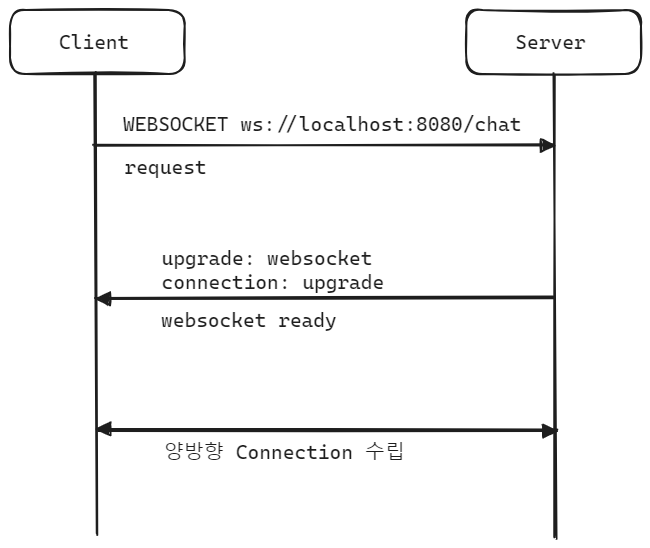

## Websocket 개념, Spring Webflux, 예제

## Websocket 프로토콜


<br/>


Websocket 프로토콜은 Application, Presentation, Session, Transport 계층에 걸쳐서 기술이 이뤄져있습니다. 4개의 계층에 골고루 Websocket 통신에 필요한 기술을 사용하고 있습니다. Websocket 은 양방향 통신이 가능하며, HTTP 와 다르게 지속적으로 연결을 유지하고 있을 경우에는 오버헤드가 적습니다.<br/>

<br/>


## Websocket Connection 획득 과정



<br/>


**웹소켓 엔드포인트에 요청**

```plain
GET ws://localhost:8080/chat
```

<br/>


**웹소켓 커넥션 응답, 요청 수립**<br/>

정상적인 요청일 경우 서버로부터 아래와 같이 응답이 옵니다.

```plain
Handshake status: 101 (Switching Protocols) 
upgrade: websocket 
connection: upgrade
```

서버에서 요청을 수립했을 때 응답으로 아래와 같이 **upgrade** 헤더가 내려온다는 것을 기억하시기 바랍니다.

- upgrade: websocket
- connection: upgrade

<br/>


## HandlerMapping, HandlerAdapter, SimpleUrlHandlerMapping

Websocket Request 매핑 시 HandlerAdapter와 HandlerAdapter 는 무엇을 사용하는지, HandlerMapping 은 어떤 것이 사용되는지, 실제 매핑되는 WebsocketHandler는 무엇인지를 그림으로 그려보면 아래와 같습니다. 아래 그림에서 검은색 배경과 노란 글씨로 표현한 부분들이 Websocket 요청/응답을위한 HandlerMappingAdapter, HandlerMapping, Handler 들 입니다.<br/>


<br/>


[SimpleUrlHandlerMapping](https://docs.spring.io/spring-framework/docs/current/javadoc-api/org/springframework/web/servlet/handler/SimpleUrlHandlerMapping.html), [SimpeUrlHandlerMapping(code)](https://github.com/spring-projects/spring-framework/blob/main/spring-webmvc/src/main/java/org/springframework/web/servlet/handler/SimpleUrlHandlerMapping.java)


## WebSocketSession

[WebSocketSession](https://docs.spring.io/spring-framework/docs/current/javadoc-api/org/springframework/web/socket/WebSocketSession.html) , [WebSocketSession(code)](https://github.com/spring-projects/spring-framework/blob/main/spring-webflux/src/main/java/org/springframework/web/reactive/socket/WebSocketSession.java)

```java
package org.springframework.web.reactive.socket;

// ...

public interface WebSocketSession {
	String getId();
	HandshakeInfo getHandshakeInfo();
	DataBufferFactory bufferFactory();
	Map<String, Object> getAttributes();
	Flux<WebSocketMessage> receive();
	Mono<Void> send(Publisher<WebSocketMessage> messages);

	boolean isOpen();

	default Mono<Void> close() {
		return close(CloseStatus.NORMAL);
	}

	Mono<Void> close(CloseStatus status);
	Mono<CloseStatus> closeStatus();
	WebSocketMessage textMessage(String payload);
	WebSocketMessage binaryMessage(Function<DataBufferFactory, DataBuffer> payloadFactory);
	WebSocketMessage pingMessage(Function<DataBufferFactory, DataBuffer> payloadFactory);
	WebSocketMessage pongMessage(Function<DataBufferFactory, DataBuffer> payloadFactory);
}
```

<br/>

bufferFactory

- DataBufferFactory 로 변환 후 DataBuffer 로 변환할 수 있도록 제공되는 필드

getAttributes

- attribute 들을 얻어오는 메서드

receive

- 클라이언트로부터 Flux 타입으로 WebSocketMessage 를 받는 메서드입니다.

send

- WebSocketMessagePublisher 를 이용해서 WebSocketMessage를 전달할 때 사용하는 메서드입니다.

isOpen

- WebSocketSession 이 열려있는지 체크합니다.

close

- close() : WebSocket 을 NORMAL 상태로 닫을 때 사용하는 메서드입니다.
- close(CloseStatus satus) :
  - WebSocket 을 전달받은 status 를 지정해서 닫는 용도의 메서드입니다.


### WebSocketSession 내의 factory 메서드

[AbstractWebSocketSession](https://docs.spring.io/spring-framework/docs/current/javadoc-api/org/springframework/web/socket/adapter/AbstractWebSocketSession.html) , [AbstractWebSocketSession.java (code)](https://github.com/spring-projects/spring-framework/blob/main/spring-webflux/src/main/java/org/springframework/web/reactive/socket/adapter/AbstractWebSocketSession.java) <br/>

```java
public abstract class AbstractWebSocketSession<T> implements WebSocketSession {
    // ...
	@Override
	public WebSocketMessage textMessage(String payload) {
		byte[] bytes = payload.getBytes(StandardCharsets.UTF_8);
		DataBuffer buffer = bufferFactory().wrap(bytes);
		return new WebSocketMessage(WebSocketMessage.Type.TEXT, buffer);
	}

	@Override
	public WebSocketMessage binaryMessage(Function<DataBufferFactory, DataBuffer> payloadFactory) {
		DataBuffer payload = payloadFactory.apply(bufferFactory());
		return new WebSocketMessage(WebSocketMessage.Type.BINARY, payload);
	}

	@Override
	public WebSocketMessage pingMessage(Function<DataBufferFactory, DataBuffer> payloadFactory) {
		DataBuffer payload = payloadFactory.apply(bufferFactory());
		return new WebSocketMessage(WebSocketMessage.Type.PING, payload);
	}

	@Override
	public WebSocketMessage pongMessage(Function<DataBufferFactory, DataBuffer> payloadFactory) {
		DataBuffer payload = payloadFactory.apply(bufferFactory());
		return new WebSocketMessage(WebSocketMessage.Type.PONG, payload);
	}
}
```


textMessage(String payload)

- 주어진 payload 를 bufferFactory 를 이용해서 WebSocketMessage 로 변환합니다.

binaryMessage(Function\<DataBufferFactory, DataBuffer\>)

- 인자값으로 전달받은 Function 을 통해서 변환된 DataBuffer 를 WebSocketMessage 로 변경해줍니다.

pingMessage(Function\<DataBufferFactory, DataBuffer\>), pongMessage(Function\<DataBufferFactory, DataBuffer\>)

- 인자값으로 전달받은 Function 을 통해서 변환된 DataBuffer 를 WebSocketMessage 로 변환해줍니다.
- 흔히 알려진 PING/PONG 메시지 교환입니다. 서버 또는 클라이언트가 pingMessage 를 전달하면 반대쪽에서는 pongMessage를 반환해야 합니다.

<br/>


## WebSocketMessage

[WebSocketMessage](https://docs.spring.io/spring-framework/docs/current/javadoc-api/org/springframework/web/socket/WebSocketMessage.html), [WebSocketMessage.java (code)](https://github.com/spring-projects/spring-framework/blob/main/spring-webflux/src/main/java/org/springframework/web/reactive/socket/WebSocketMessage.java)

```java
package org.springframework.web.reactive.socket;

// ...

public class WebSocketMessage {

	private static final boolean reactorNetty2Present = ClassUtils.isPresent(
			"io.netty5.handler.codec.http.websocketx.WebSocketFrame", WebSocketMessage.class.getClassLoader());

	private final Type type;
	private final DataBuffer payload;
	
    // ...
    
    public String getPayloadAsText() {
		return getPayloadAsText(StandardCharsets.UTF_8);
	}

	public String getPayloadAsText(Charset charset) {
		return this.payload.toString(charset);
	}
    
	/**
	 * WebSocket message types.
	 */
	public enum Type {
		/**
		 * Text WebSocket message.
		 */
		TEXT,
		/**
		 * Binary WebSocket message.
		 */
		BINARY,
		/**
		 * WebSocket ping.
		 */
		PING,
		/**
		 * WebSocket pong.
		 */
		PONG
	}
    
    // ...

}
```

<br/>

- type : WebSocketMessage 내에 정의된 enum 인 `Type` 을 의미하며, TEXT, BINARY, PING, PONG 이 있습니다.
- payload : socketMassage 에 담긴 payload 입니다.
- getPayloadAsText : payload 를 String 형태로 변환해줍니다.

<br/>


## CloseStatus

[CloseStatus](https://docs.spring.io/spring-framework/docs/current/javadoc-api/org/springframework/web/socket/CloseStatus.html) , [CloseStatus (code)](https://github.com/spring-projects/spring-framework/blob/main/spring-websocket/src/main/java/org/springframework/web/socket/CloseStatus.java)<br/>

```java
package org.springframework.web.socket;
// ...
public final class CloseStatus implements Serializable {
	private static final long serialVersionUID = 5199057709285570947L;
	public static final CloseStatus NORMAL = new CloseStatus(1000);
	public static final CloseStatus GOING_AWAY = new CloseStatus(1001);
	public static final CloseStatus PROTOCOL_ERROR = new CloseStatus(1002);
	public static final CloseStatus NOT_ACCEPTABLE = new CloseStatus(1003);
	// 10004: Reserved.
	// The specific meaning might be defined in the future.
	public static final CloseStatus NO_STATUS_CODE = new CloseStatus(1005);
	public static final CloseStatus NO_CLOSE_FRAME = new CloseStatus(1006);
	public static final CloseStatus BAD_DATA = new CloseStatus(1007);
	public static final CloseStatus POLICY_VIOLATION = new CloseStatus(1008);
	public static final CloseStatus TOO_BIG_TO_PROCESS = new CloseStatus(1009);
	public static final CloseStatus REQUIRED_EXTENSION = new CloseStatus(1010);
	public static final CloseStatus SERVER_ERROR = new CloseStatus(1011);
	public static final CloseStatus SERVICE_RESTARTED = new CloseStatus(1012);
	public static final CloseStatus SERVICE_OVERLOAD = new CloseStatus(1013);
	public static final CloseStatus TLS_HANDSHAKE_FAILURE = new CloseStatus(1015);
	public static final CloseStatus SESSION_NOT_RELIABLE =
			new CloseStatus(4500).withReason("Failed to send message within the configured send limit");
	private final int code;

	@Nullable
	private final String reason;


	public CloseStatus(int code) {
		this(code, null);
	}
    
    // ...
}
```

<br/>


이 중 주요 필드를 요약해보면 아래와 같습니다. 아래 필드 외의 다른 필드들은 [CloseStatus (code)](https://github.com/spring-projects/spring-framework/blob/main/spring-websocket/src/main/java/org/springframework/web/socket/CloseStatus.java) 내의 주석을 참고해주시기 바랍니다.

- 1000 : NORMAL
  - 정상종료를 의미합니다.
- 1001 : `GOING_AWAY`
  - 서버가 예상치 못하게 종료되거나 페이지에서 벗어난 경우를 의미합니다.
- 1002 : `PROTOCOL_ERROR`
  - 프로토콜에 문제를 의미하니다.
- 1003 : `NOT_ACCEPTABLE`
  - ACCEPT 불가능한 데이터를 요청으로 받았을 때 보
- 1011 : `SERVER_ERROR`
  - 예상하지 못한 에러. 서버에서 요청을 처리하지 못하는 경우
- 1012 : `SERVICE_RESTARTED`
  - 서비스가 재시작됨을 의미
  - 이 때 클라이언트는 5\~30 초 내에 랜덤하게 접근합니다.

<br/>


## e.g.

먼저 코드부터 남기고 이 글의 하단부에 각 컴포넌트 등의 코드에 대한 설명을 남기도록 하겠습니다.<br/>


### 예제 시나리오

사용자 `a` 가 아래와 같이 접속

```http
WEBSOCKET ws://localhost:8080/chatting
X-USER-NAME: a
```

<br/>


사용자 `b` 가 아래와 같이 접속

```http
WEBSOCKET ws://localhost:8080/chatting
X-USER-NAME: b
```

<br/>


사용자 a의 채팅 진행

- 메시지 앞에 `b:` 를 붙여서 메시지를 보냅니다.
- `[받을 사람]:` 과 같은 형식입니다. 

```plain
Handshake status: 101 (Switching Protocols)
set-cookie: SESSION=7873bcfa-fe61-40d9-8ce0-8a233c50883a; Path=/; HTTPOnly; SameSite=Lax
upgrade: websocket
connection: upgrade
sec-websocket-accept: 7Xs+mSGpH81i7eaY84W8Bd4QHsI=

(System): a님이 채팅방에 입장하셨습니다.
b: 안녕하세요 b님

b: 안녕하세요 a님
b: 잘지내시나요

b: 네 잘 지내고 있어요
b: 그렇군요

b: 아주 좋습니다.


Connection closed
```

<br/>


사용자 b 의 채팅 진행

- 메시지 앞에 `b:` 를 붙여서 메시지를 보냅니다.
- `[받을 사람]:` 과 같은 형식입니다.

```plain
WEBSOCKET ws://localhost:8080/chatting

Handshake status: 101 (Switching Protocols)
set-cookie: SESSION=95629724-a649-4efe-934d-90c8db45a28d; Path=/; HTTPOnly; SameSite=Lax
upgrade: websocket
connection: upgrade
sec-websocket-accept: IEz5SEgtKBJFMsmO1znelHu3ia4=

(System): b님이 채팅방에 입장하셨습니다.
a: 안녕하세요 b님
b: 안녕하세요 a님

b: 안녕하세요 a님
b: 안녕하세요 a님

b: 안녕하세요 a님
a: 안녕하세요 a님

a: 잘지내시나요
a: 네 잘 지내고 있어요

a: 그렇군요
a: 아주 좋습니다.


Connection closed
```

<br/>


### WebSocketConfig

먼저 WebsocketConfig 예제입니다.<br/>

WebSocketHandlerAdapter 를 Bean 으로 등록합니다. 이 WebSocketHandlerAdapter 는 CustomWebSocketService 를 내부에 바인딩하고 있습니다. CustomWebSocketService 는  [HandshakeWebSocketService](https://docs.spring.io/spring-framework/docs/5.1.7.RELEASE_to_5.1.8.RELEASE/Spring%20Framework%205.1.8.RELEASE/org/springframework/web/reactive/socket/server/support/HandshakeWebSocketService.html) 를 extends 한 사용자 정의 클래스입니다.<br/>

위에서 이미 설명했듯 HandlerAdapter 는 HandlerMapping 을 찾은 후 찾은 HandlerMapping 을 어떻게 처리해야 할지를 정의해야 하는데, 이번 WebSocketHandlerAdapter 예제는 찾아낸 매핑에 맞는 CustomHandshakeWebsocketService (HandshakeWebSocketService) 타입을 연결해주고 있습니다.<br/>

찾아낸 HandlerMapping은 미리 정의해둔 빈인데, 여기에 대해서는 이 글을 계속 읽다보면 정리한 내용이 나옵니다.<br/>

```java
package io.chagchagchag.example.foobar.websocket.config;

import org.springframework.context.annotation.Bean;
import org.springframework.context.annotation.Configuration;
import org.springframework.web.reactive.socket.server.support.HandshakeWebSocketService;
import org.springframework.web.reactive.socket.server.support.WebSocketHandlerAdapter;

@Configuration
public class WebsocketConfig {

  @Bean
  public WebSocketHandlerAdapter webSocketHandlerAdapter(
      HandshakeWebSocketService customHandshakeWebsocketService
  ){
    // websocket 에서 attribute 를 바이패스
    customHandshakeWebsocketService.setSessionAttributePredicate(s -> true);
    return new WebSocketHandlerAdapter(customHandshakeWebsocketService);
  }

}
```

<br/>


#### CustomHandshakeWebSocketService

직접 정의한 CustomHandshakeWebSocketService 는 아래와 같습니다.<br/>

아래 코드는 단순히 헤더의 파라미터를 웹소켓 세션에 바인딩해주는 역할을 합니다. <br/>

사용자의 `WEBSOCKET ws://localhost:8080/chatting` 요청시에 헤더에 `X-USER-NAME` 이 있을 경우 이 `X-USER-NAME` 에 대한 값을 얻어온 후 세션에 `user-name: X-USER-NAME 값` 으로 바인딩해주는 역할을 합니다.

```java
package io.chagchagchag.example.foobar.websocket.config;

import java.util.Optional;
import org.springframework.http.HttpStatus;
import org.springframework.stereotype.Component;
import org.springframework.web.reactive.socket.WebSocketHandler;
import org.springframework.web.reactive.socket.server.support.HandshakeWebSocketService;
import org.springframework.web.server.ServerWebExchange;
import reactor.core.publisher.Mono;

@Component
public class CustomHandshakeWebsocketService extends HandshakeWebSocketService {

  @Override
  public Mono<Void> handleRequest(ServerWebExchange exchange, WebSocketHandler handler) {
    String userName = exchange
        .getRequest()
        .getHeaders()
        .getFirst("X-USER-NAME");

    return Optional.ofNullable(userName)
        .map(_userName -> {
          return exchange.getSession()
              .flatMap(webSession -> {
                webSession.getAttributes().put("user-name", _userName);
                return super.handleRequest(exchange, handler);
              });
        })
        .orElseGet(() -> {
          exchange.getResponse().setStatusCode(HttpStatus.UNAUTHORIZED);
          return exchange.getResponse().setComplete();
        });
  }
}
```

<br/>


### MappingConfig

[SimpleUrlHandlerMapping](https://docs.spring.io/spring-framework/docs/current/javadoc-api/org/springframework/web/servlet/handler/SimpleUrlHandlerMapping.html) 빈을 생성해서 등록하는 역할을 합니다.<br/>

등록 시에 `/chatting` 에 대해 WebSocketHandler 인스턴스를 매핑해둔 Map 을 SimpleUrlHandlerMapping 의 urlMap 으로 등록해줍니다.<br/>

- `/chatting` : `chattingWebsocketHandler`
- 위의 key : value 를 기반으로 하는 Map 을 SimpleUrlHandlerMapping 내의 urlMap 에 등록

아래 코드에서 사용한 ChattingWebSocketHandler 는 WebSocketHandler 인터페이스를 implements 한 직접 정의한 사용자 정의 WebSocketHandler 입니다.

```java
package io.chagchagchag.example.foobar.websocket.config;

import io.chagchagchag.example.foobar.websocket.handler.ChattingWebsocketHandler;
import java.util.Map;
import org.springframework.context.annotation.Bean;
import org.springframework.context.annotation.Configuration;
import org.springframework.web.reactive.handler.SimpleUrlHandlerMapping;
import org.springframework.web.reactive.socket.WebSocketHandler;

@Configuration
public class MappingConfig {
  @Bean
  public SimpleUrlHandlerMapping simpleUrlHandlerMapping(
      ChattingWebsocketHandler chattingWebsocketHandler
  ){
    Map<String, WebSocketHandler> urlMapper = Map.of(
        "/chatting", chattingWebsocketHandler
    );

    SimpleUrlHandlerMapping mapping = new SimpleUrlHandlerMapping();
    mapping.setOrder(1);
    mapping.setUrlMap(urlMapper);
    return mapping;
  }
}
```

<br/>


#### ChattingWebsocketHandler

WebSocketHandler 인터페이스를 implements 한 사용자 정의 WebSocketHandler 는 아래와 같습니다.<br/>

ChattingWebSocketHandler 는 WebSocketHandler interface 에서 제공하는 명세를 따라 `handle()` 메서드를 제공합니다.<br/>

```java
package io.chagchagchag.example.foobar.websocket.handler;

import lombok.RequiredArgsConstructor;
import org.springframework.stereotype.Component;
import org.springframework.web.reactive.socket.WebSocketHandler;
import org.springframework.web.reactive.socket.WebSocketSession;
import reactor.core.publisher.Flux;
import reactor.core.publisher.Mono;

@RequiredArgsConstructor
@Component
public class ChattingWebsocketHandler implements WebSocketHandler {
  private final ChattingService chattingService;

  @Override
  public Mono<Void> handle(WebSocketSession session) {
    String userName = (String) session.getAttributes().get("user-name");
    Flux<Chat> chattingFlux = chattingService.register(userName);
    chattingService.sendMessage(userName, new Chat(userName + "님이 채팅방에 입장하셨습니다.", "(System)"));

    session
        .receive()
        .doOnNext(webSocketMessage -> {
          String payload = webSocketMessage.getPayloadAsText();

          String [] args = payload.split(":");
          String to = args[0].trim();
          String message = args[1].trim();

          final boolean result = chattingService.sendMessage(to, new Chat(message, userName));

          if(!result)
            chattingService.sendMessage(userName, new Chat("대화상대가 없어요", "(System)"));
        })
        .subscribe();

    return session.send(
        chattingFlux.map(chat -> session.textMessage(chat.from() + ": " + chat.message()))
    );
  }

}
```

handle() 메서드에서는 의존성 주입받은 ChattingService 를 이용해서 아래의 두가지 작업을 합니다.

- register : 사용자 입장시 `[user-name]` : `Sinks.Many<Chat>` 를 put 해서 업데이트 합니다.
- sendMessage 
  - chattingService 내의 sendMessage() 함수를 호출합니다. 
  - Sinks.Many 의 tryEmitNext() 함수를 통해서 Sink 의 Next 연산 람다식내에 인자로 전달받은 `Chat` 데이터를 emit 해주게하는 식을 Sinks.Many 에 등록합니다.

ChattingService 내의 연산은 다음 섹션에서 설명합니다.<br/>

마지막으로 WebSocketSession 의 send 연산을 수행하는데, 이때 이전에 등록해둔 Sinks.Many 에 tryEmit 을 하는 람다식을 실행하는데, 이 플럭스에 대해서 `[발신자]: [메시지]` 의 형태의 문자열로 변환을 한 메시지를 전송합니다.<br/>

<br/>


#### ChattingService

ChattingService 클래스는 Sinks 를 통해 트리거 이벤트를 발동시키는 역할을 하는 메서드 들을 정의해두었습니다.

```java
package io.chagchagchag.example.foobar.websocket.handler;

import java.util.Map;
import java.util.Optional;
import java.util.concurrent.ConcurrentHashMap;
import lombok.extern.slf4j.Slf4j;
import org.springframework.stereotype.Service;
import reactor.core.publisher.Flux;
import reactor.core.publisher.Sinks;
import reactor.core.publisher.Sinks.Many;

@Slf4j
@Service
public class ChattingService {
  private static Map<String, Many<Chat>> chattingSinkMap = new ConcurrentHashMap<>();

  public Flux<Chat> register(String userName){
    Many<Chat> sink = Sinks.many().unicast().onBackpressureBuffer();
    chattingSinkMap.put(userName, sink);
    return sink.asFlux();
  }

  public boolean sendMessage(String userName, Chat chat){
    log.info("userName : {}, chat {}", userName, chat);

    return Optional.ofNullable(chattingSinkMap.get(userName))
        .map(chatMany -> {
          if(chatMany.currentSubscriberCount() == 0) return Boolean.FALSE;
          chatMany.tryEmitNext(chat);
          return Boolean.TRUE;
        })
        .orElseGet(()->Boolean.FALSE);
  }
}
```

- register() 
  - 사용자 입장시 `[user-name]` : `Sinks.Many<Chat>` 를 CuncurrentHashMap 에 put 해서 업데이트 합니다.
  - 가급적이면 실무에서 사용한다면, 캐시 자료구조를 사용하는 것이 추천됩니다.
- sendMessage()
  - sendMessage() 함수에서는 Sinks.Many 의 tryEmitNext() 함수를 통해서 Sink 의 Next 연산 람다식내에 인자로 전달받은 `Chat` 데이터를 emit 해주게하는 식을 Sinks.Many 에 등록합니다.

<br/>


### Chat

데이터를 보내는 단위 데이터 클래스입니다.

```java
package io.chagchagchag.example.foobar.websocket.handler;

public record Chat(
   String message,
   String from
) {
}
```


